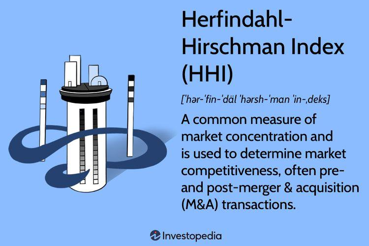

Algorithmic trading, commonly referred to as algo trading, is a sophisticated method of executing trades that relies on automated, pre-programmed instructions. These algorithms consider multiple factors such as time, price, and volume to optimize trading decisions. This automated trading method is utilized extensively in financial markets, enhancing the speed and efficiency of trade executions while minimizing human intervention.

In recent years, the Herfindahl-Hirschman Index (HHI) has gained significance in algorithmic trading. HHI is a measure originally developed to evaluate market concentration, indicating the level of competition among firms within an industry. In the context of trading, HHI helps traders understand market concentration and competitive dynamics by providing a quantitative assessment of how concentrated a particular market or sector is.



The relevance of HHI in algorithmic trading is growing as traders seek advanced metrics to inform their trading strategies. By analyzing market concentration through HHI, algorithmic traders can make informed decisions about portfolio diversification and entry strategies. Additionally, HHI can be an insightful tool for understanding market risks, particularly in the fast-evolving landscape of digital assets and cryptocurrencies. As we explore further, the application of HHI in trading provides critical insights into market behavior, its calculation methods, and its strategic use cases.

## Table of Contents

## Understanding the Herfindahl-Hirschman Index (HHI)

The Herfindahl-Hirschman Index (HHI) is a widely recognized measure utilized in assessing market concentration, providing insights into market competitiveness. It plays a critical role across various industries by quantifying the market share distribution among competing firms. The calculation of HHI involves summing the squares of individual market shares of all companies within an industry, expressed as percentages. Mathematically, the formula can be represented as:

$$
\text{HHI} = \sum_{i=1}^{N} (s_i^2)
$$

where $s_i$ is the market share of firm $i$, and $N$ is the total number of firms in the industry.

The resultant HHI score ranges from 0 to 10,000, reflecting the level of market concentration. The classification of these scores helps in understanding the competitive landscape:

- **Competitive markets** have an HHI below 1,500. This indicates a high number of firms with relatively equal market shares, suggesting robust competition.
- **Moderately concentrated markets** exhibit HHI values between 1,500 and 2,500. Here, the market is dominated by a few firms, although still maintaining a moderate degree of competitiveness.
- **Highly concentrated markets** show HHI scores exceeding 2,500, where one or few companies hold substantial market power, potentially reducing competitive pressures.

Understanding the HHI is crucial for evaluating market dynamics as it assists regulators and businesses in identifying the level of competition within an industry. This information can inform decisions related to mergers, acquisitions, and antitrust investigations. By illustrating the degree of market concentration, HHI serves as a tool for gauging economic health and ensuring competitive fairness in various sectors.

## Role of HHI in Algorithmic Trading

Algorithmic trading leverages the Herfindahl-Hirschman Index (HHI) to evaluate the concentration of assets within portfolios and the trading [volume](/wiki/volume-trading-strategy) on exchanges. This metric is crucial for traders seeking to understand market concentration, which aids in making informed decisions regarding portfolio diversification and market entry strategies. 

The HHI provides a quantitative measure of market concentration by summing the squares of market shares, thus enabling traders to assess how heavily weighted a portfolio is towards specific assets. A high HHI score suggests that the portfolio is dominated by a few assets, indicating a lack of diversification and potentially increased risk. Conversely, a lower HHI implies a more equally distributed portfolio, suggesting better diversification and mitigated risk.

In addition to assessing asset concentration, HHI plays a significant role in evaluating the decentralization level of cryptocurrencies. Cryptocurrencies, by nature, are subject to significant fluctuations in ownership concentration, which can affect their risk profiles and market stability. By calculating the HHI for cryptocurrencies, traders can gain insights into the degree of decentralization, helping them ascertain the risk associated with specific crypto assets. Higher HHI values indicate a less decentralized and potentially riskier [cryptocurrency](/wiki/cryptocurrency) market, as a few holders might control a significant portion of the total supply. In contrast, a lower HHI suggests a more decentralized and stable market structure.

Therefore, incorporating HHI analysis in [algorithmic trading](/wiki/algorithmic-trading) is vital for optimizing portfolio composition and navigating the unique risks within cryptocurrency markets. This analytical approach allows traders to craft strategies that are not only aligned with their risk tolerance but also adaptive to market concentration changes.

## Calculating HHI in Crypto Markets

To calculate the Herfindahl-Hirschman Index (HHI) in cryptocurrency markets, the primary focus is on determining the market share of each wallet or address within the total circulation of a particular cryptocurrency. The process involves a series of steps to accurately measure market concentration and assess the competitive landscape within the cryptocurrency ecosystem.

First, it is essential to determine the market share of each wallet or address. This is achieved by calculating the proportion of total coins held by the wallet relative to the total number of coins in circulation. The formula for market share ($MS_i$) for a specific wallet $i$ is:

$$
MS_i = \frac{\text{Coins held by wallet } i}{\text{Total coins in circulation}}
$$

Once the market shares are obtained for all wallets or addresses holding the cryptocurrency, the next step is to compute the HHI. This is performed by summing the squares of the market shares of all wallets. The formula to calculate HHI is:

$$
\text{HHI} = \sum_{i=1}^{N} (MS_i)^2 \times 10,000
$$

where $N$ is the total number of wallets or addresses considered.

The resulting HHI score reflects the concentration of coin ownership, where a higher score signifies greater concentration among a few wallets, indicating potential centralization. Conversely, a lower HHI indicates a more decentralized ownership distribution.

In practice, calculating HHI in cryptocurrency markets can provide valuable insights into the decentralization of token distribution and the competitive environment across different cryptocurrencies. Assessing high HHI values might suggest a concentrated market with increased risk, while lower values may imply a more evenly distributed and potentially more robust market structure.

Moreover, implementing this calculation requires access to blockchain data to analyze the distribution of coins, leveraging blockchain explorers or APIs to extract relevant data while ensuring accurate computation of market shares. For those with programming expertise, Python can be used to automate these calculations. For example:

```python
def calculate_hhi(wallet_balances):
    total_coins = sum(wallet_balances.values())
    hhi = 0
    for balance in wallet_balances.values():
        market_share = balance / total_coins
        hhi += (market_share ** 2)
    return hhi * 10000

# Example usage
wallet_balances = {
    'wallet1': 150,
    'wallet2': 300,
    'wallet3': 50
}

hhi_score = calculate_hhi(wallet_balances)
print("HHI Score:", hhi_score)
```

The above code provides a method for calculating HHI, leveraging wallet balances as inputs. This allows traders and analysts to obtain a quantitative measure of market concentration, forming an essential component of market assessment and strategic planning in the dynamic and evolving cryptocurrency domain.

## Using HHI for Risk Assessment and Strategy Development

Algorithmic traders can leverage the Herfindahl-Hirschman Index (HHI) to enhance their risk assessment and strategy development processes. HHI scores enable traders to identify assets with high concentration levels, often signaling increased risk. When a market or a specific asset exhibits a high HHI score, it implies that a few players dominate the market, potentially increasing [volatility](/wiki/volatility-trading-strategies) and risk. This information can guide traders in constructing more balanced portfolios by diversifying their asset holdings to mitigate concentrated exposure.

In the context of mergers and acquisitions, the HHI serves as an invaluable tool for traders. By analyzing HHI scores before and after anticipated mergers or acquisitions, traders can predict changes in market concentration. For instance, a significant increase in the HHI score following a merger might suggest reduced competition and a higher concentration of market power. Understanding these shifts allows traders to adjust their strategies, either by reallocating assets or by hedging potential risks associated with increased market dominance.

Integrating HHI into trading algorithms automates the assessment process, enabling dynamic adaptation to market conditions based on concentration scores. Traders can create algorithms that monitor live market data, calculate HHI in real-time, and trigger trading actions when predefined concentration thresholds are breached. For example, a Python script could periodically fetch market share data, compute the HHI, and execute trades if the HHI indicates excessive concentration. This automation streamlines decision-making, allowing traders to proactively manage risk and capitalize on emerging opportunities.

## Limitations of HHI in Algorithmic Trading

While the Herfindahl-Hirschman Index (HHI) is a valuable tool for assessing market concentration in algorithmic trading, it has limitations that traders should consider. One of the primary concerns is that HHI may not effectively capture rapid changes in market dynamics, which are characteristic of the volatile trading environments often encountered in algorithmic trading. Since the HHI is a lagging indicator, it relies on historical data to provide insights into market structure at a specific point in time. This reliance on past data means that HHI may not accurately predict future market conditions, especially in fast-paced and ever-changing markets.

Algorithmic traders must recognize that relying solely on HHI can lead to incomplete or outdated assessments. To overcome this, traders should use HHI alongside other technical indicators and metrics to develop a more comprehensive understanding of market dynamics. By integrating real-time data analytics and predictive modeling techniques, traders can enhance the responsiveness and accuracy of their trading algorithms.

Additionally, the static nature of HHI calculations may overlook intricacies such as the influence of emerging market participants or sudden shifts in trading volumes. To address these limitations, traders can incorporate adaptive algorithms that adjust to new information and dynamically recalibrate concentration measures. This approach ensures that the potential risks and opportunities presented by market concentration are better accounted for in strategy formulation and risk management.

In summary, while HHI provides insights into market concentration, its effectiveness is constrained by its reliance on historical data and inability to adapt to rapid market changes. Traders should utilize a multi-faceted approach, complementing HHI with other quantitative tools, to optimize their strategies and navigate the complexities of algorithmic trading.

## Conclusion

The Herfindahl-Hirschman Index (HHI) stands as a valuable tool for algorithmic traders seeking to understand market concentration and make well-informed decisions. By providing a quantitative measure of market dominance or [dispersion](/wiki/dispersion-trading), HHI helps traders identify areas of risk and potential opportunity. It captures the concentration of assets within markets or portfolios, allowing traders to strategize effectively.

While the insights derived from HHI are indispensable, traders should not solely rely on this index. Successful algorithmic trading requires a multifaceted approach that integrates HHI with technical analysis and real-time market data. This combination ensures a comprehensive understanding of market conditions, enhancing decision-making processes.

As algorithmic trading becomes increasingly sophisticated and widespread, incorporating tools like HHI into trading strategies will remain crucial. Through its continued use, traders can optimize strategies, manage risk more effectively, and adapt to changing market landscapes, maintaining a competitive edge.

## References & Further Reading

[1]: Klemperer, P. (1998). ["Markets with Consumer Switching Costs."](https://www.jstor.org/stable/1885068) The Review of Economic Studies, 62(2), 205-230.

[2]: Neftci, S. N. (2000). ["Principles of Financial Engineering."](https://books.google.com/books/about/Principles_of_Financial_Engineering.html?id=IOEyEY3TM9AC) Elsevier Academic Press.

[3]: Reeves, D. R., Wellman, M. P. (2004). ["Using Market-Based Methods to Manage Portfolio Risk in Algorithmic Trading."](https://www.science.org/doi/10.1126/science.aaa8403) Proceedings of the Fifth ACM Conference on Electronic Commerce.

[4]: Gajardo, G., Kristjanpoller, W., & Minutolo, M. (2018). ["Does Bitcoin follow the hypothesis of efficient market? Evidence from unit root tests."](https://www.academia.edu/124584634/Impact_of_the_COVID_19_Pandemic_on_Cryptocurrency_Markets_A_DCCA_Analysis) Chaos, Solitons & Fractals, 118, 1-12.

[5]: Hirshleifer, J., & Riley, J. G. (1992). ["The Analytics of Uncertainty and Information."](https://www.jstor.org/stable/2723720) Cambridge University Press.