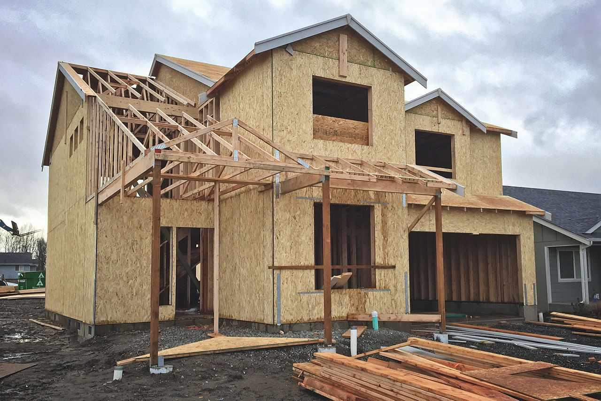

Buying a new home represents a significant milestone and one of the largest financial commitments most individuals will undertake. This exciting step is often filled with dreams of modern amenities and the ideal living space. However, many homebuyers find themselves surprised by the hidden costs that can accompany this acquisition. While the allure of a new home lies in its modern design and the perceived reliability of everything being brand new, additional expenses such as unexpected upgrades, missing essential features, and complex future community developments can present unanticipated financial burdens. Recognizing these potential pitfalls is crucial for anyone looking to maneuver through the intricacies of home purchasing.

Moreover, the landscape of the housing market is undergoing a transformation influenced by technological advancements, particularly in the domain of algorithmic trading. This sophisticated and automated process is altering the dynamics of real estate transactions by increasing market liquidity and expediting the buying and selling of properties. However, such advancements bring about challenges, such as market volatility, which investors need to navigate carefully. With algorithmic trading playing an ever-larger role, understanding its impact on property pricing and investment strategies is essential for both potential homeowners and investors.

By examining the hidden costs associated with purchasing a new home and analyzing the influence of algorithmic trading on the housing market, this article aims to provide comprehensive insights. This knowledge can empower homebuyers and investors to make more informed decisions and avoid potential financial setbacks. With the ever-evolving nature of technology, keeping abreast of these changes is not just beneficial but necessary to achieve success in the real estate market.

## Table of Contents

## Hidden Costs of New Homes

Many buyers are drawn to new homes, attracted by the promise of modern conveniences, energy efficiency, and often comprehensive warranties that suggest long-term peace of mind. However, beneath the allure of these benefits, new homebuyers often encounter unexpected costs that can lead to financial strain.

One significant hidden cost arises from upgrades. While model homes display top-of-the-line finishes and features, these are often not included in the base price. Buyers may need to pay extra for high-quality countertops, appliances, or flooring. For example, a builder might offer granite countertops as an upgrade rather than a standard feature, leading buyers to face significant additional charges if they opt for these luxury finishes.

Missing necessities also represent a potential financial pitfall. New homes are sometimes delivered without essential features such as landscaping, fencing, or ceiling fixtures. These omissions can lead to substantial out-of-pocket expenses soon after purchase. Buyers should thoroughly assess what is and isn't included in their purchase agreements to avoid unexpected costs upon moving in.

Uncertain future community developments pose another challenge. The appeal of a new community often includes planned amenities such as parks, pools, or schools that enhance living experiences. However, these developments may be delayed or altered, which can impact property values and quality of life. Buyers should research the developer's reputation and confirm the likelihood of future developments to ensure they fully comprehend potential changes and their financial implications.

Finally, new developments often come with homeowners associations (HOAs) that [carry](/wiki/carry-trading) monthly or annual fees. While these fees support community amenities and maintenance, they can increase significantly over time. Understanding the HOA's financial health and track record is crucial for anticipating future cost increases.

In conclusion, while new homes offer numerous advantages, they also carry potential hidden expenses. Homebuyers should undertake comprehensive budgeting that accounts for upgrades, missing essentials, and variable HOA fees, alongside an understanding of future community developments, to avoid unexpected financial burdens.

## Impact of Algorithmic Trading on the Housing Market

Algorithmic trading, the use of computer algorithms to automate trading decisions, is altering the dynamics of the housing market significantly. This method of trading leverages advanced mathematical models and high-speed data analysis to execute transactions at speeds and frequencies that are challenging for human traders to accomplish. As a result, [algorithmic trading](/wiki/algorithmic-trading) is becoming a force in real estate, particularly by facilitating the automated buying and selling of property assets.

One of the primary impacts of algorithmic trading on the housing market is increased [liquidity](/wiki/liquidity-risk-premium). By automating transactions, these algorithms can quickly assess market conditions and execute trades that might otherwise take considerable time. This speed can attract more investors to the market, theoretically easing the process of buying and selling properties. However, alongside increased liquidity, concerns regarding market [volatility](/wiki/volatility-trading-strategies) emerge. Automated systems can react to market signals in milliseconds, leading to rapid price fluctuations that may not be reflective of actual market conditions. This volatility poses a risk not only to traders but also to real estate investors who may experience significant changes in property values in short periods.

Algorithmic trading also affects property prices. As these trading systems integrate more data, they can predict and influence market trends. For instance, algorithms may incorporate social media sentiment analysis, economic indicators, or even weather patterns into their trading strategies, impacting decision-making processes for investing in specific areas. Consequently, investors need to evolve their investment strategies, considering factors such as geographic location, property type, and market trends influenced by algorithmic outputs.

Furthermore, [machine learning](/wiki/machine-learning) and [artificial intelligence](/wiki/ai-artificial-intelligence), increasingly integral to algorithmic trading, allow these systems to learn from historical data. This learning capability enables algorithms to identify patterns and make more informed predictions about future market movements. Investors who understand these trends and adapt their investments accordingly may gain a competitive edge, while those who do not may find themselves at a disadvantage.

In summary, while algorithmic trading brings several advancements to the real estate market, including greater liquidity, it also introduces challenges such as increased volatility and complex price dynamics. It is imperative for investors to stay informed about how these technologies influence market behavior to tailor their strategies effectively. Understanding the nuances of algorithmic trading is essential for successfully navigating the evolving landscape of the housing market.

## Navigating the Challenges

Homebuyers face numerous challenges when purchasing a new home, many of which stem from unforeseen costs. Conducting comprehensive research and thorough inspections prior to purchase is essential to mitigate such surprises. One effective strategy is engaging independent inspectors who provide unbiased assessments of a property's condition. These professionals can identify potential issues that might not be apparent during a casual walk-through or showcased in promotional materials. Regular inspections are vital because they present an opportunity to uncover hidden defects or structural problems that could lead to significant, unexpected expenses.

Moreover, diligently reviewing warranties associated with a new home can prevent costly repairs long term. Warranties typically cover specific components of a home, such as roofing, plumbing, or major appliances, and understanding their scope and limitations is crucial. A detailed examination of warranty terms ensures that homeowners are aware of what repairs are covered by the builder or manufacturer, thus avoiding unexpected financial burdens.

For real estate investors, staying abreast of market trends is critical. The rapid advancement of technology in the real estate sector, especially with the advent of big data and artificial intelligence, has made market analysis more sophisticated and data-driven. Utilizing these technological tools can provide investors with valuable insights into property trends, pricing forecasts, and demographic shifts. For example, algorithms can analyze vast datasets to recognize patterns, project future real estate values, and even predict potential market volatility.

Investors should also remain adaptable to changes in market dynamics influenced by technologies like algorithmic trading. These technologies enhance liquidity in real estate markets but can also increase volatility, affecting property prices and investment returns. Understanding how these technological advancements impact market conditions can guide strategic decision-making and investment planning.

In conclusion, both homebuyers and investors can avoid substantial financial setbacks by conducting thorough research, leveraging independent inspections, reviewing warranties carefully, and employing advanced technologies to stay informed about market conditions. Proactively addressing these challenges can ensure a smoother and more financially sound homebuying or investment experience.

## Conclusion

In the ever-evolving landscape of real estate, both homebuyers and investors must remain vigilant to navigate the complex interplay of costs and market dynamics. Understanding the full scope of financial obligations, including hidden costs and the implications of algorithmic trading, is crucial for making informed decisions. Awareness is key, as unexpected expenses can quickly turn a promising investment into a financial burden.

Proactive measures are essential to avoid potential pitfalls. For homebuyers, this means meticulously budgeting for not only the initial purchase price but also additional costs such as upgrades and unforeseen community developments. Investors, on the other hand, must stay abreast of technological advancements in algorithmic trading and their impact on the housing market's liquidity and volatility. By doing so, they can adjust their strategies to mitigate risks and maximize returns.

As technology continues to evolve, staying informed becomes an investor’s most valuable asset. The integration of data-driven tools and market analytics empowers both buyers and investors to make better decisions. Moreover, engaging with the latest resources and expert analyses can enhance one's ability to anticipate market shifts and respond accordingly.

In conclusion, the real estate market demands a proactive approach, where both vigilance in understanding total costs and adaptability to technological changes are imperative. Equipped with awareness and a strategic mindset, individuals can successfully navigate the complexities of the housing market and optimize their investments.

## References & Further Reading

[1]: ["Home Buying: The Hidden Expenses You Should Know"](https://www.homelight.com/blog/buyer-hidden-costs-of-buying-a-home/) - Forbes

[2]: Jenson, R., & Mueller, S. (2021). ["The Hidden Costs of Homeownership."](https://www.jstor.org/stable/resrep63503) Journal of Real Estate Finance and Economics.

[3]: Byrne, P. (2019). ["Algorithmic Trading in Real Estate Markets"](https://www.tvguide.com/celebrities/pj-byrne/credits/3030898312/) Journal of Property Investment & Finance.

[4]: ["The Impact of Algorithms on the Real Estate Market"](https://www.mckinsey.com/industries/real-estate/our-insights/generative-ai-can-change-real-estate-but-the-industry-must-change-to-reap-the-benefits) - Investopedia

[5]: ["Algorithmic and High-Frequency Trading"](https://www.cambridge.org/us/universitypress/subjects/mathematics/mathematical-finance/algorithmic-and-high-frequency-trading) by Álvaro Cartea, Sebastian Jaimungal, and José Penalva.