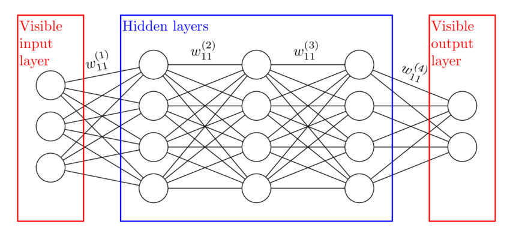

## Table of Contents

## What is a hidden layer in the context of machine learning?

In machine learning, a hidden layer is a layer in a neural network that is not directly connected to the input or output of the network. It's called "hidden" because its values are not observed in the training data, but instead, they are computed during the learning process. Hidden layers are important because they allow the neural network to learn and represent complex patterns and relationships within the data.

Think of a hidden layer as a middle step in the process of going from input to output. For example, if you're trying to predict whether it will rain based on weather data, the input might be things like temperature and humidity, and the output would be a prediction of rain or no rain. The hidden layer would take the input data, process it through its neurons, and then pass that processed information on to the next layer or the output layer. This processing helps the network to find and learn from the underlying patterns in the data that might not be obvious from just looking at the inputs and outputs alone.

## Why are hidden layers important in neural networks?

Hidden layers are important in neural networks because they help the network learn and understand complex patterns in the data. Imagine you're trying to solve a puzzle. The pieces you see are the inputs, and the final picture is the output. Hidden layers are like the steps you take to figure out where each piece goes. They process the input data in ways that aren't immediately obvious, allowing the network to find connections and relationships that would be hard to see otherwise.

For example, if you're using a neural network to recognize pictures of cats and dogs, the hidden layers might learn to identify features like ears, eyes, and fur patterns. These features are not directly given in the input data but are crucial for distinguishing between cats and dogs. Without hidden layers, the network would struggle to make sense of the raw input data and produce accurate outputs. By adding hidden layers, the neural network can break down the problem into smaller, manageable parts, making it much better at learning and making predictions.

## How does the number of hidden layers affect the performance of a neural network?

The number of hidden layers in a neural network can greatly impact its performance. When you have more hidden layers, the network becomes deeper and can learn more complex patterns in the data. This is because each layer can learn different features, building on what the previous layers have learned. For example, in image recognition, the first hidden layer might learn to detect edges, the next might learn to recognize shapes, and deeper layers might identify more specific features like eyes or ears. This ability to learn and combine features at different levels of abstraction can lead to better performance on complex tasks.

However, adding too many hidden layers can also cause problems. If a network has too many layers, it might start to memorize the training data instead of learning general patterns. This is called overfitting, and it can make the network perform poorly on new, unseen data. Finding the right number of hidden layers is a balancing act. You want enough layers to capture the important patterns in your data, but not so many that the network becomes too specialized to the training data. This balance often requires experimentation and tuning to find what works best for a specific problem.

## What is the role of activation functions in hidden layers?

Activation functions are important in hidden layers because they help the neural network learn and make decisions. Imagine you're trying to decide if you should go outside based on the weather. The weather data comes in, but you need to process it to make a choice. That's what activation functions do. They take the input from the previous layer, process it, and then decide how much of that input should be passed on to the next layer. This helps the network understand which information is important and which isn't.

Different activation functions work in different ways. For example, the sigmoid function, which looks like $$ \sigma(x) = \frac{1}{1 + e^{-x}} $$, squashes the input into a range between 0 and 1. This can be useful for making yes or no decisions. On the other hand, the ReLU (Rectified Linear Unit) function, which is $$ \text{ReLU}(x) = \max(0, x) $$, lets the input pass through if it's positive but stops it if it's negative. This can help the network learn faster and handle complex data better. Choosing the right activation function depends on the problem you're trying to solve and can make a big difference in how well your neural network performs.

## Can you explain the concept of a deep neural network in relation to hidden layers?

A deep neural network is a type of neural network that has many hidden layers. The more hidden layers a network has, the "deeper" it is. These extra layers help the network learn and understand really complex patterns in the data. Think of it like trying to solve a big puzzle. With more layers, the network can break the puzzle into smaller pieces, figure out where each piece goes, and then put it all together to see the full picture. This makes deep neural networks really good at tasks like recognizing images or understanding speech, where the patterns can be very complicated.

The hidden layers in a deep neural network work together to process the information step by step. Each layer learns different features from the data. For example, if you're trying to recognize a cat in a picture, the first layer might learn to spot edges, the next might learn to recognize shapes like ears or eyes, and deeper layers might learn to identify the whole cat. This process of learning and combining features at different levels is called "hierarchical learning." By using many hidden layers, a deep neural network can learn to see patterns that would be hard for a simpler network to understand, making it more powerful and accurate.

## How do hidden layers contribute to feature extraction in machine learning models?

Hidden layers play a big role in feature extraction in machine learning models. They help the model find and understand important parts of the data. Imagine you're looking at a picture of a cat. The hidden layers can learn to spot edges, shapes, and patterns that make up the cat. Each layer builds on what the layer before it learned, so the first layer might see simple lines, the next might see shapes like ears, and deeper layers might recognize the whole cat. This process helps the model break down the data into smaller, useful pieces, making it easier to understand and work with.

This feature extraction is important because it lets the model focus on what really matters in the data. Instead of looking at the whole picture at once, the model can pay attention to the parts that help it tell a cat from a dog, for example. By using hidden layers to extract features, the model can learn to recognize patterns that are too complex for simpler methods. This makes the model better at tasks like recognizing images, understanding speech, and making predictions based on data.

## What are some common architectures that utilize multiple hidden layers?

One common architecture that uses multiple hidden layers is the Convolutional Neural Network (CNN). CNNs are often used for image recognition tasks. They have layers that look at small parts of an image and learn to recognize patterns like edges or shapes. These layers are called convolutional layers, and they help the network understand the important features in an image. After the convolutional layers, there are usually some fully connected layers, which are like the hidden layers in a regular neural network. These layers take the features learned from the image and use them to make a final decision, like whether the image shows a cat or a dog.

Another popular architecture is the Recurrent Neural Network (RNN). RNNs are good for tasks where the order of the data matters, like understanding sentences or predicting stock prices. They have hidden layers that can remember information from previous steps, which helps them learn from sequences of data. A special type of RNN called Long Short-Term Memory (LSTM) networks are even better at remembering long sequences. They use hidden layers to keep track of what's important in the data over time, making them very useful for tasks like language translation or speech recognition.

A third architecture is the Deep Belief Network (DBN). DBNs are made of several layers of what are called Restricted Boltzmann Machines (RBMs). Each RBM is like a hidden layer that learns to find patterns in the data. By stacking these RBMs, a DBN can learn really complex features from the data. This makes DBNs good for tasks like classifying data or reducing the amount of data you need to work with, which can make other tasks easier.

## How can one determine the optimal number of hidden layers for a specific problem?

Finding the right number of hidden layers for a specific problem can be tricky. You usually start with a simple network with just a few layers and see how well it does. If it doesn't work well, you might add more layers to see if that helps. This process is called experimentation, and it involves trying different numbers of layers and seeing which one gives the best results. You might also use something called cross-validation, where you split your data into different parts and test your network on each part to make sure it works well on all of them.

One helpful way to decide on the number of layers is to use a method called grid search. With grid search, you try different combinations of layers and other settings, like the number of neurons in each layer, to see which combination works best. For example, you might try a network with 2 hidden layers and then another with 3 hidden layers, and compare their performance. This can take a lot of time and computing power, but it can help you find the best setup for your problem. Remember, the goal is to find a balance where your network can learn the important patterns in your data without overfitting, which means it doesn't just memorize the training data but can work well on new data too.

## What are the challenges associated with training models with many hidden layers?

Training models with many hidden layers can be challenging because they can take a long time to train. Each layer needs to learn from the data, and with more layers, the process can become very slow. This is because the data has to pass through many layers, and each layer needs to adjust its weights to improve the model's performance. The more layers there are, the more adjustments need to be made, which can make the training process much longer. Also, these deep models need a lot of computing power, which means you might need special hardware like GPUs to train them quickly.

Another challenge is the risk of overfitting. When a model has many hidden layers, it can become very good at remembering the training data but not so good at working with new data. This happens because the model might start to learn the specific details of the training data instead of the general patterns. To avoid overfitting, you might need to use techniques like regularization, which helps keep the model from getting too complex. Regularization can be done by adding a penalty to the model's weights, like in the formula $$ \text{Loss} + \lambda \sum_{i} w_i^2 $$, where $$ \lambda $$ is a parameter that controls how much the weights are penalized. This can help the model generalize better to new data.

## How do hidden layers impact the model's ability to generalize to new data?

Hidden layers help a model learn complex patterns in the data, which can make it better at understanding and working with new data. When a model has the right number of hidden layers, it can break down the data into smaller, useful pieces. This process, called feature extraction, helps the model focus on what's important in the data. For example, if the model is trying to recognize pictures of cats, the hidden layers might learn to spot edges, shapes like ears, and other features that help tell a cat from a dog. By learning these features, the model can better understand new pictures it hasn't seen before.

However, too many hidden layers can make it hard for the model to generalize well. If a model has too many layers, it might start to memorize the training data instead of learning general patterns. This is called overfitting, and it can make the model perform poorly on new data. To avoid this, you can use techniques like regularization, which adds a penalty to the model's weights to keep it from getting too complex. For example, you might use a formula like $$ \text{Loss} + \lambda \sum_{i} w_i^2 $$ to penalize large weights, where $$ \lambda $$ is a parameter that controls how much the weights are penalized. By finding the right balance of hidden layers and using techniques like regularization, you can help the model generalize better to new data.

## What techniques can be used to prevent overfitting in models with deep hidden layers?

One way to stop overfitting in models with many hidden layers is to use something called regularization. Regularization helps keep the model from getting too complicated by adding a penalty to the weights of the model. For example, you might use a formula like $$ \text{Loss} + \lambda \sum_{i} w_i^2 $$ to penalize large weights. Here, $$ \lambda $$ is a number that controls how much the weights are penalized. By doing this, the model can focus on the most important patterns in the data instead of memorizing every little detail of the training data.

Another technique is called dropout. Dropout randomly turns off some of the neurons in the hidden layers during training. This means the model can't rely on any single neuron too much, which helps it learn more general patterns. Dropout is like making the model practice with different parts missing, so it gets better at working with new data. By using dropout, you can help the model generalize better and avoid overfitting.

A third way to prevent overfitting is to use early stopping. Early stopping means you keep an eye on how well the model is doing on a separate set of data, called the validation set, while it's training. If the model starts to do worse on the validation set, you stop the training early. This prevents the model from overfitting to the training data. By using early stopping, you can make sure the model is good at working with new data, not just the data it was trained on.

## Can you discuss advanced methods for initializing weights in hidden layers to improve training efficiency?

One advanced method for initializing weights in hidden layers is called Xavier initialization. This method sets the initial weights so that the variance of the outputs of each layer is the same as the variance of its inputs. This helps keep the signals flowing through the network balanced, making it easier for the model to learn. The formula for Xavier initialization is $$ W \sim \text{Uniform}(-\sqrt{\frac{6}{n_{in} + n_{out}}}, \sqrt{\frac{6}{n_{in} + n_{out}}}) $$, where $$ n_{in} $$ is the number of inputs to the layer, and $$ n_{out} $$ is the number of outputs. By using this method, you can help the model start training with weights that are neither too big nor too small, which can speed up the learning process.

Another method is called He initialization, which is similar to Xavier initialization but works better for layers that use the ReLU activation function. ReLU can make some of the outputs zero, which can affect how the signals flow through the network. He initialization takes this into account by setting the initial weights so that the variance of the outputs is twice the variance of the inputs. The formula for He initialization is $$ W \sim \text{Uniform}(-\sqrt{\frac{6}{n_{in}}}, \sqrt{\frac{6}{n_{in}}}) $$. This method helps the model learn faster and avoid getting stuck when using ReLU, making it a good choice for many modern neural networks.