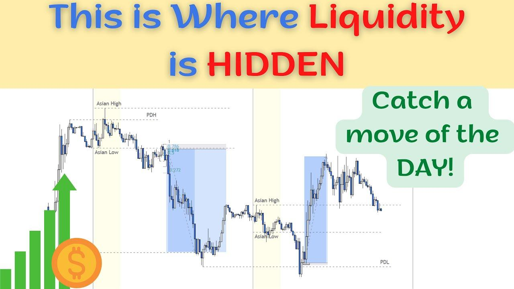

## Table of Contents

## What is hidden liquidity in financial markets?

Hidden liquidity in financial markets refers to the amount of buy or sell orders that are not visible on the public order book. These orders are placed by traders who want to buy or sell large amounts of a security without immediately affecting its price. By keeping their orders hidden, these traders can avoid causing sudden price movements that might happen if everyone knew about their big trades.

This type of liquidity is important because it can help keep markets stable. If a big order was suddenly visible to everyone, it might scare other traders and cause them to sell quickly, leading to a sharp drop in price. Hidden liquidity allows big trades to be done more smoothly, without causing panic or big price swings. However, it can also make it harder for other traders to know the true supply and demand for a security, which can add some uncertainty to the market.

## Why is detecting hidden liquidity important for traders?

Detecting hidden liquidity is important for traders because it helps them understand the real supply and demand for a security. When traders know about hidden orders, they can make better guesses about where the price might go next. If there are a lot of hidden buy orders, it might mean the price could go up. If there are a lot of hidden sell orders, it might mean the price could go down. Knowing this can help traders decide when to buy or sell.

Also, knowing about hidden [liquidity](/wiki/liquidity-risk-premium) can help traders avoid being tricked by the market. Sometimes, big traders use hidden orders to move the market in a certain way. If other traders can spot these hidden orders, they can protect themselves from these tricks. This can help them make smarter trades and maybe even make more money.

## What are the common sources of hidden liquidity?

Hidden liquidity often comes from big investors like banks, hedge funds, and other institutions. These groups usually want to buy or sell a lot of a security at once. If everyone knew about their big orders, it might scare other traders and make the price move a lot. So, these big investors use hidden orders to keep their plans secret. They place these orders with their brokers, who then keep them hidden from the public [order book](/wiki/order-book-trading-strategies).

Another source of hidden liquidity is from trading platforms that let traders use special order types. Some platforms offer "iceberg orders," where only a small part of the order shows up on the order book, and the rest stays hidden. There are also "dark pools," which are private exchanges where traders can buy and sell without showing their orders to the public. These platforms help traders keep their big orders secret and add to the hidden liquidity in the market.

## How does hidden liquidity affect market dynamics?

Hidden liquidity can make the market more stable. When big investors want to buy or sell a lot of a security, they use hidden orders to keep their plans secret. This helps stop the price from moving too much all at once. If everyone knew about these big orders, it might scare other traders and make the price jump up or down a lot. By keeping these orders hidden, the market can stay calmer and prices can move more smoothly.

But hidden liquidity can also make things more confusing for other traders. When orders are hidden, it's harder to know the real supply and demand for a security. This can make it tougher for traders to guess where the price might go next. Some big investors might even use hidden orders to trick the market, making it even harder for other traders to make good decisions. So, while hidden liquidity can help keep the market stable, it also adds some uncertainty and can make trading more challenging.

## What are the basic techniques used to detect hidden liquidity?

One way to spot hidden liquidity is by watching the market closely. Traders look for signs that big orders might be hidden. For example, if the price of a security keeps bouncing off a certain level, it might mean there's a big hidden order there. Traders also watch the [volume](/wiki/volume-trading-strategy) of trades. If a lot of shares are being traded but the price isn't moving much, it could mean there are hidden orders soaking up the trades.

Another technique is using special tools and software. Some trading platforms have tools that can help guess where hidden orders might be. These tools look at past trades and try to find patterns that show where big investors might be hiding their orders. Traders can also use data from dark pools, which are private exchanges where hidden orders are common. By studying this data, traders can get a better idea of where hidden liquidity might be hiding in the market.

## Can you explain the role of order book analysis in detecting hidden liquidity?

Order book analysis is a key way traders try to spot hidden liquidity. The order book shows all the buy and sell orders that people have placed for a security. By looking at the order book, traders can see where the visible orders are. But, if they notice that the price keeps bouncing off a certain level, it might mean there's a big hidden order there. This is because the hidden order is soaking up trades without showing up on the order book.

Traders also watch the order book to see if there are any strange patterns. For example, if a lot of shares are being traded but the price isn't moving much, it could mean there are hidden orders in the market. These hidden orders are helping to keep the price stable by buying or selling shares without showing up on the order book. By carefully studying the order book, traders can get clues about where hidden liquidity might be hiding.

## What advanced tools or algorithms are used for hidden liquidity detection?

Advanced tools and algorithms for detecting hidden liquidity often use complex math and computer programs to find patterns in the market. These tools look at a lot of data from the order book and past trades to guess where hidden orders might be. They use things like [machine learning](/wiki/machine-learning), which is when computers learn from data to make better guesses. For example, these algorithms might notice that the price keeps bouncing off a certain level, which could mean there's a big hidden order there. They can also look at how the volume of trades changes over time to spot hidden liquidity.

Some of these tools also use data from dark pools, which are private exchanges where hidden orders are common. By studying this data, the algorithms can get a better idea of where hidden liquidity might be hiding in the market. These advanced tools help traders make better guesses about where the price might go next and can help them avoid being tricked by big investors who use hidden orders to move the market. By using these tools, traders can make smarter trades and maybe even make more money.

## How do high-frequency trading strategies utilize hidden liquidity detection?

High-frequency trading ([HFT](/wiki/high-frequency-trading-strategies)) strategies use hidden liquidity detection to make quick trades and earn small profits many times a day. These strategies rely on fast computers and complex algorithms to spot hidden orders in the market. When HFT traders detect hidden liquidity, they can buy or sell a security just before a big hidden order gets filled. This helps them make a small profit because they can predict where the price might move next. By using hidden liquidity detection, HFT traders can take advantage of the market's hidden orders and make many small trades very quickly.

HFT strategies also use hidden liquidity detection to avoid being tricked by other big traders. Sometimes, big investors use hidden orders to move the market in a certain way. HFT traders use their fast computers and algorithms to spot these hidden orders and protect themselves from these tricks. By knowing where the hidden liquidity is, HFT traders can make smarter trades and avoid losing money. This helps them stay ahead in the fast-paced world of high-frequency trading.

## What are the regulatory considerations when dealing with hidden liquidity?

Regulators are worried about hidden liquidity because it can make markets less fair and harder to understand. They want to make sure everyone has the same chance to see what's going on in the market. If some traders can see hidden orders and others can't, it might not be fair. So, regulators make rules to keep things open and honest. They might limit how much hidden liquidity can be used or make trading platforms show more information about hidden orders.

These rules help protect smaller traders and keep the market stable. Regulators also keep an eye on dark pools and other places where hidden orders are common. They want to make sure these places are not being used to trick the market. By watching and controlling hidden liquidity, regulators try to make sure the market works well for everyone.

## How does hidden liquidity detection vary across different asset classes?

Hidden liquidity detection can be different for stocks, bonds, and other types of investments. For stocks, traders often look at the order book and use special tools to spot hidden orders. They watch for signs like the price bouncing off a certain level or a lot of shares being traded without the price moving much. These signs can mean there's a big hidden order. In the stock market, there are also dark pools where hidden orders are common, so traders use data from these places to help find hidden liquidity.

For bonds, detecting hidden liquidity can be trickier because the bond market is less open than the stock market. There's not always a clear order book to look at, so traders have to use other ways to find hidden orders. They might look at how prices and volumes change over time or use data from big bond traders to guess where hidden liquidity might be. In the bond market, hidden liquidity can be even more important because big trades can move prices a lot, so finding these hidden orders helps traders make better guesses about where the market is going.

## What are the challenges and limitations of hidden liquidity detection methods?

Detecting hidden liquidity is hard because the orders are not shown on the order book. Traders have to guess where these orders might be by looking at how the price and volume of trades change. They use special tools and algorithms to help, but these tools are not perfect. Sometimes, the tools might think there's a hidden order when there isn't one, or they might miss a real hidden order. This can make it tough for traders to make the right guesses about where the market is going.

Another challenge is that different markets have different rules and ways of working. What works to find hidden liquidity in the stock market might not work in the bond market. The bond market is less open, so it's harder to see what's going on. Also, big investors might use tricks to hide their orders even better, making it even harder to spot them. All these things make detecting hidden liquidity a tricky job, and traders have to be smart and careful to do it well.

## What future developments can we expect in the field of hidden liquidity detection?

In the future, hidden liquidity detection will likely get better thanks to new technology. Computers and algorithms will become even smarter at finding hidden orders. They will use more data and learn from it to make better guesses about where these orders might be. This will help traders make smarter decisions and maybe even make more money. As more people use these tools, the market might become more fair because everyone will have a better chance to see what's going on.

However, there will still be challenges. Big investors will keep finding new ways to hide their orders, making it harder for these tools to spot them. Also, different markets like stocks and bonds will need different tools because they work in different ways. Regulators will have to keep making rules to make sure the market stays fair and open. But overall, with new technology and smarter tools, detecting hidden liquidity should get easier and help make the market work better for everyone.

## References & Further Reading

[1]: Butz, Dominik, et al. (2016). ["Detection of hidden liquidity using intraday data."](https://onlinelibrary.wiley.com/doi/full/10.1111/tops.12522) Journal of Forecasting, 35(5), 441-454.

[2]: Nuti, G., Mirghaemi, M., Treleaven, P., & Yingsaeree, C. (2011). ["Algorithmic trading."](https://www.semanticscholar.org/paper/Algorithmic-Trading-Nuti-Mirghaemi/dec841dd0f1fce55ba930b26f3fb945e330dfcbb) WIREs Comput Stat, 3: 327- 333.

[3]: Harris, Larry (2002). ["Trading & Exchanges: Market Microstructure for Practitioners."](https://www.amazon.com/Trading-Exchanges-Market-Microstructure-Practitioners/dp/0195144708) Oxford University Press.

[4]: Aldridge, Irene (2013). ["High-Frequency Trading: A Practical Guide to Algorithmic Strategies and Trading Systems."](https://www.amazon.com/High-Frequency-Trading-Practical-Algorithmic-Strategies/dp/1118343506) Wiley.

[5]: Kissell, Robert L. (2013). ["The Science of Algorithmic Trading and Portfolio Management."](https://www.sciencedirect.com/book/9780124016897/the-science-of-algorithmic-trading-and-portfolio-management) Academic Press.

[6]: Cartea, Á., Rodríguez, J., & Sornette, D. (2014). ["Detecting and profiting from order flow anomalies in high frequency trading."](https://arxiv.org/abs/1409.0492) arXiv preprint arXiv:1409.0492.