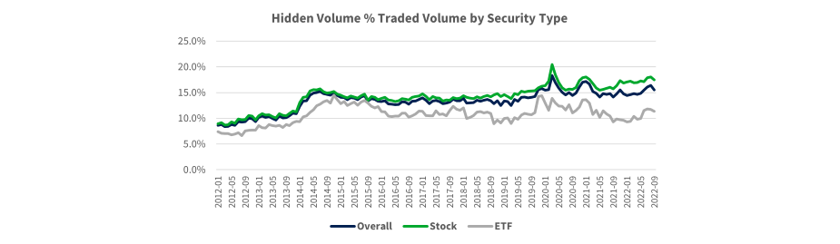

The modern financial markets often conceal the full extent of trading activities, particularly through hidden liquidity. This phenomenon involves buy or sell orders that are not fully visible in the public order book, thus masking the real intentions of traders. Institutional players, such as hedge funds and large asset managers, favor strategies like iceberg orders to trade large volumes while maintaining anonymity. An iceberg order partially reveals its total size, typically displaying only a fraction to the public. The remainder stays hidden, surfacing only when the displayed portion is executed.

The utilization of hidden liquidity is essential in algorithmic trading, where execution speed and efficiency play pivotal roles. Algorithmic trading systems are designed to detect and act upon the smallest signs of market imbalance, and hidden liquidity can significantly influence these systems. This article explores the nuances of hidden liquidity within the scope of such trading strategies, offering insights into recognizing and exploiting these concealed opportunities.



To successfully navigate markets influenced by hidden liquidity, traders must be equipped with specialized tools and strategies. Order flow analysis, a fundamental tool in this context, helps traders discern the true intentions behind market movements by analyzing the flow of buy and sell orders at specific price levels. Additionally, there are indicators designed to highlight significant areas of hidden liquidity and institutional activity, enhancing the trader’s ability to make informed decisions.

By developing an understanding of these concepts, traders can refine their approach to maximize potential market gains. A comprehensive grasp of hidden liquidity and its mechanisms provides a significant trading advantage, allowing for more strategic entry and exit points. As algorithmic trading continues to evolve, so do the methods to uncover these latent features of financial markets, opening new avenues for adept traders.

## Table of Contents

## Understanding Hidden Liquidity

Hidden liquidity refers to buy or sell orders not fully visible in the public order book. This concept is frequently associated with trading large-cap stocks, where substantial volumes are transacted. Among the most prevalent forms of hidden liquidity is the iceberg order, where only a small portion of a large order is openly displayed, with the remainder concealed. The visible part of the order is often referred to as the "tip of the iceberg," while the larger, hidden portion lies beneath the surface. 

These hidden strategies are predominantly favored in large-cap stocks, which are characterized by high trading volumes and liquidity. The anonymity provided by iceberg orders is particularly beneficial for institutional traders who wish to minimize their market impact. By maintaining only partial order visibility, these traders can execute large transactions without significantly influencing the stock's price. This technique helps to maintain favorable liquidity levels and diminish the likelihood of adverse price movements caused by large trades. 

In practice, the use of hidden [liquidity](/wiki/liquidity-risk-premium) allows institutional investors to strategically navigate the complexities of financial markets. By opting for partial disclosure through iceberg orders, they can effectively distribute their buying or selling pressure over time. This tactic minimizes the potential for alarming other market participants, thereby protecting the trader's strategic interests and preserving the order's overall efficacy.

## Impact of Hidden Liquidity on Trading Dynamics

Hidden liquidity exerts a significant influence on trading dynamics by affecting market behavior, price movements, and trading strategies. When orders are concealed from the public [order book](/wiki/order-book-trading-strategies), they can cause short-term price distortions and sudden spikes. These variations present both risks and opportunities for traders, depending on their strategies and market positions.

Concealed orders often lead to short-term price distortions as large buy or sell orders, hidden through techniques like iceberg orders, are executed. This can result in abrupt price movements that appear to be anomalous or disconnected from visible market activity. Such scenarios can provide skilled traders with opportunities to capitalize on unforeseen price shifts. However, they also pose risks, as these sudden changes can lead to unexpected losses for those unprepared to adapt quickly to new market conditions.

Retail traders face particular challenges as they often rely on visible order [books](/wiki/algo-trading-books), potentially missing critical liquidity levels hidden beneath the surface. The lack of visibility into substantial buy or sell interests hinders their ability to gauge the true supply and demand dynamics in the market, potentially leading to ill-informed trading decisions. This opacity can put retail traders at a disadvantage compared to institutional investors who might have access to more sophisticated tools for detecting hidden liquidity.

Recognizing and understanding the dynamics of hidden liquidity is essential for developing effective trading strategies. By acknowledging the potential for concealed orders to influence price movements, traders can devise strategies that consider not just visible market data but also the implications of unobservable transactions. This comprehensive approach enables traders to better anticipate market movements, optimize entry and [exit](/wiki/exit-strategy) points, and mitigate the risks associated with hidden liquidity.

Overall, grasping the impact of hidden liquidity on trading dynamics is crucial for traders aiming to navigate modern financial markets effectively. By leveraging these insights, they can enhance their trading strategies and potentially gain a competitive edge over those who rely solely on publicly visible data.

## Detecting Iceberg Orders in Large-Cap Stocks

Identifying hidden liquidity in large-cap stocks necessitates the use of specialized tools and advanced techniques. One of the key methodologies for detecting these concealed elements is order flow analysis. This technique helps unveil hidden orders by highlighting discrepancies in buying and selling pressure at specific price levels. For instance, large buy orders that are not visible in the traditional order book can create a buying pressure that may not be immediately apparent to the casual observer. 

Moreover, tools like Bookmap offer sophisticated features such as the absorption indicator and heatmaps, which are instrumental in pinpointing significant hidden liquidity and institutional activity. The absorption indicator, in particular, identifies levels where substantial volumes are absorbed without resulting in corresponding price movements, indicating the presence of iceberg orders. Heatmaps visualize the depth of market liquidity and can reveal hidden orders by highlighting areas with persistent liquidity that does not shift in line with visible orders.

The effective detection of these hidden elements significantly enhances decision-making in volatile trading environments. By understanding where these orders exist, traders can anticipate potential price movements and adapt their strategies accordingly. For example, recognizing an iceberg order at a specific support level may indicate strong buying interest, suggesting a potential price rebound. Consequently, traders can better position their entry and exit points, reduce the risk of adverse market moves, and exploit the hidden liquidity for profit maximization.

## Strategies for Trading Around Hidden Liquidity

To trade effectively around hidden liquidity, traders must integrate advanced tools, analytical techniques, and disciplined execution into their trading approach. One key strategy is [scalping](/wiki/gamma-scalping), which involves capitalizing on high-activity zones resultant from hidden orders to secure short-term profits. Scalpers aim to take advantage of small price movements by entering and exiting the market swiftly, often utilizing hidden liquidity to identify zones of intense trading activity where price fluctuations are more pronounced.

Swing trading represents another approach, where traders use hidden liquidity as a means to confirm critical support and resistance levels. By analyzing these hidden orders, swing traders can ascertain points at which the market is likely to reverse or consolidate, thus providing a more stable foundation for long-term trades. This method allows for capturing more significant price movements over days or weeks, aligning trades with broader market trends.

Effective risk management remains essential when trading around hidden liquidity, given the potential for rapid market reversals. Traders should implement tight stop-loss orders to mitigate exposure to sudden price shifts. A proactive risk management strategy might involve calculating optimal stop-loss levels based on market [volatility](/wiki/volatility-trading-strategies) and the liquidity profile of the traded asset. 

To further enhance the accuracy of these strategies, traders can employ algorithmic tools to automate the detection of hidden liquidity and adjust their trading decisions dynamically. With Python, for instance, one can develop scripts leveraging libraries such as NumPy and pandas to analyze market order flows and identify potential hidden liquidity zones:

```python
import numpy as np
import pandas as pd

# Example function to identify high-activity zones based on volume and price data
def detect_hidden_liquidity(volume_series, price_series, threshold=0.05):
    # Calculate rolling average for price and volume
    avg_volume = volume_series.rolling(window=100).mean()
    avg_price = price_series.rolling(window=100).mean()

    # Identify zones where volume deviates significantly from average
    potential_zones = (volume_series > avg_volume * (1 + threshold)) & (volume_series < avg_volume * (1 - threshold))

    return potential_zones

# Example data
volume_data = pd.Series(np.random.randint(100, 1000, size=1000))
price_data = pd.Series(np.random.uniform(50, 150, size=1000))

# Detect high-activity zones
zones = detect_hidden_liquidity(volume_data, price_data)
print(zones)
```

By employing such techniques alongside disciplined execution and risk management, traders can navigate the complexities surrounding hidden liquidity more effectively, optimizing their entry and exit points to enhance profitability.

## Risks of Trading Around Hidden Liquidity

Trading around hidden liquidity, while potentially rewarding, poses significant risks that traders must navigate. One primary risk arises from sudden market reversals that occur when hidden liquidity either gets canceled or becomes overwhelmed by market forces. Such reversals can lead to rapid and unexpected price movements, causing substantial losses if not managed properly.

Another risk involves the over-reliance on detection tools. While these tools are valuable for uncovering hidden orders, they should not be used in isolation. Solely depending on these tools might lead to inaccurate assessments, as they can fail to capture broader market influences and dynamics. It's essential to incorporate other market indicators and tools for a holistic view. This includes monitoring economic events, news releases, and technical indicators to complement hidden liquidity detection.

To mitigate these risks, traders should adopt a comprehensive analysis strategy. This involves integrating hidden liquidity insights with broader market data to make informed trading decisions. By doing so, traders can evaluate the market context more effectively and anticipate possible price movements.

Additionally, regularly monitoring changes in liquidity patterns is crucial. Market conditions are fluid, and liquidity levels can shift rapidly. By keeping a close watch on these changes, traders can adjust their strategies accordingly. For instance, a sudden increase in visible liquidity might signal the dissolution of previous hidden orders, prompting a reassessment of trading positions.

Implementing robust risk management techniques can further protect traders. Techniques such as setting tight stop-loss orders can limit exposure to adverse price movements, ensuring that any potential losses remain manageable. Diversification of trading strategies and maintaining flexibility to adapt to market changes are also important strategies in managing the inherent risks of trading around hidden liquidity.

## Conclusion

Understanding and detecting hidden liquidity provides a distinct trading advantage. Traders equipped with the right tools and strategies, such as order flow analysis and Bookmap indicators, can more accurately anticipate market movements. These tools allow traders to identify disparities in buy and sell pressures at specific price levels, enhancing their ability to detect hidden liquidity. Leveraging these insights permits traders to optimize their entry and exit points, thus maximizing potential gains while effectively managing risks associated with hidden liquidity.

Incorporating order flow analysis, traders can identify areas of significant hidden liquidity where institutional activity is prevalent. This information helps in refining trading strategies, ensuring that informed decisions are made in volatile market conditions. Bookmap indicators, for instance, provide visual representation and heatmaps of order book activity, highlighting zones of potential buying or selling interest.

The evolving landscape of [algorithmic trading](/wiki/algorithmic-trading) continually offers new opportunities for those adept at uncovering concealed market elements. As algorithmic trading systems become more sophisticated, traders must stay abreast of technological advancements to maintain a competitive edge. This involves regular monitoring of changes in liquidity patterns and adapting strategies accordingly to align with evolving market dynamics.

In conclusion, the ability to detect and exploit hidden liquidity can yield significant advantages for traders. By employing advanced tools and maintaining a comprehensive analysis strategy, traders can navigate the complexities of modern financial markets with increased confidence and efficacy.

## References & Further Reading

[1]: Butz, Dominik, et al. (2016). ["Detection of hidden liquidity using intraday data."](https://onlinelibrary.wiley.com/doi/full/10.1111/tops.12522) Journal of Forecasting, 35(5), 441-454.

[2]: Nuti, G., Mirghaemi, M., Treleaven, P., & Yingsaeree, C. (2011). ["Algorithmic trading."](https://www.semanticscholar.org/paper/Algorithmic-Trading-Nuti-Mirghaemi/dec841dd0f1fce55ba930b26f3fb945e330dfcbb) WIREs Comput Stat, 3: 327- 333.

[3]: Harris, Larry (2002). ["Trading & Exchanges: Market Microstructure for Practitioners."](https://www.amazon.com/Trading-Exchanges-Market-Microstructure-Practitioners/dp/0195144708) Oxford University Press.

[4]: Aldridge, Irene (2013). ["High-Frequency Trading: A Practical Guide to Algorithmic Strategies and Trading Systems."](https://www.amazon.com/High-Frequency-Trading-Practical-Algorithmic-Strategies/dp/1118343506) Wiley.

[5]: Kissell, Robert L. (2013). ["The Science of Algorithmic Trading and Portfolio Management."](https://www.sciencedirect.com/book/9780124016897/the-science-of-algorithmic-trading-and-portfolio-management) Academic Press.

[6]: Cartea, Á., Rodríguez, J., & Sornette, D. (2014). ["Detecting and profiting from order flow anomalies in high frequency trading."](https://arxiv.org/abs/1409.0492) arXiv preprint arXiv:1409.0492.