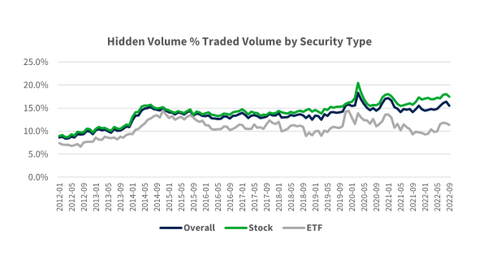

In the world of trading, hidden liquidity is a concept that presents both significant challenges and opportunities for market participants. It particularly impacts large-cap stocks, where institutional players frequently utilize advanced techniques, such as algorithmic trading, to place iceberg orders and mask their trading intentions. This practice involves dividing large trade orders into smaller visible parts while keeping the remaining larger volume hidden from the public order book. As a result, hidden liquidity allows traders to execute substantial trades without exerting undue influence on market prices, thereby maintaining strategic anonymity.

This article examines the nuances of hidden liquidity within financial markets, concentrating on the prevalence and identification of iceberg orders. Iceberg orders are a quintessential method by which institutional traders conceal substantial parts of their transactions to prevent dramatic market shifts. The broader implications of hidden liquidity on market dynamics are significant, as they can affect supply-demand visibility, potentially leading to price volatility and misinterpretation of market trends by less-informed traders.



Furthermore, we explore how traders can leverage advanced technology to gain an edge in this complex landscape. In a market where concealed orders can significantly impact trading outcomes, using technology and sophisticated tools becomes imperative for market participants. The ability to identify hidden orders provides traders with the potential to anticipate market movements and optimize their trading strategies accordingly. Ultimately, hidden liquidity remains a high-stakes game of strategic concealment, where understanding these dynamics can offer competitive advantages in the pursuit of trading success.

## Table of Contents

## Understanding Hidden Liquidity

Hidden liquidity involves market orders that remain partially unseen in the public order book, providing strategic concealment for traders. Institutional investors commonly adopt these methods to discreetly execute large transactions, aiming to avoid significant price disturbances. An iceberg order exemplifies hidden liquidity, as it displays only a portion of its full size in the order book, leaving the remainder concealed from general view. 

This strategic anonymity is particularly effective with large-cap stocks, where the high liquidity and trading volume facilitate the efficient execution of such hidden orders without substantial market impact. By partially masking their trading intentions, institutional traders can mitigate the risk of adverse price movements that might arise from revealing their full order size, thus maintaining the stability of their strategy and objectives.

The mechanics of iceberg orders and similar approaches hinge on concealing the true extent of supply and demand at certain price levels. This protected visibility is achieved through sophisticated trading algorithms that release only a small portion of the order to the market at a time. As the visible portion of the order is filled, additional segments are automatically submitted, incrementally fulfilling the larger order while mitigating its potential impact on market prices.

Understanding the dynamics of hidden [liquidity](/wiki/liquidity-risk-premium) is crucial for market participants, as it influences the perceived supply-demand landscape and affects decision-making processes. Traders who can identify and interpret the signs of hidden liquidity have the opportunity to adjust their strategies accordingly, potentially gaining a competitive advantage in analyzing and predicting market trends.

## Impact of Hidden Liquidity on Trading Dynamics

Hidden liquidity plays a significant role in altering market behavior by concealing the true supply and demand levels. This concealment can create misinterpretations of market trends, particularly affecting retail traders, who may not have access to sophisticated tools that can detect these hidden orders. The presence of hidden liquidity often introduces price [volatility](/wiki/volatility-trading-strategies) and complexity into market analysis. 

When large orders are broken into smaller iceberg orders to minimize market impact, they disrupt the apparent supply and demand balance. This can lead to price fluctuations that do not necessarily reflect the underlying market conditions, thus increasing the complexity for traders aiming to make informed decisions. Consequently, retail traders might misinterpret this volatility as either a buy or sell signal, resulting in misguided trading strategies. 

Hidden liquidity can also result in manipulation risks. Traders or institutions with significant market power might use hidden orders to create a false sense of market depth, thereby influencing prices to benefit their positions. For instance, the strategic placement of iceberg orders at key levels can mislead other market participants about the actual liquidity available, causing them to buy or sell at manipulated prices. 

Despite these challenges, there are opportunities for informed traders who can accurately decipher signals from hidden liquidity. By identifying patterns or detecting abnormal order flows that might indicate iceberg orders, savvy traders can take advantage of the apparent mispricing. For example, if a trader recognizes consistent buying pressure at a particular price that isn't accompanied by visible large buy orders, they might infer the presence of hidden liquidity and position themselves accordingly. 

Informed traders can leverage these insights to anticipate price movements more effectively. Advanced analytics and tools, such as order flow analysis and heatmaps, aid in visualizing hidden liquidity, thereby offering a competitive edge. Understanding the impact of hidden liquidity on trading dynamics is crucial for developing strategies that are both adaptive and resilient in the face of market obscurity.

## Advanced Tools for Detecting Hidden Liquidity

Identifying hidden liquidity within financial markets necessitates the use of sophisticated tools and techniques that extend beyond traditional trading platforms. These advanced tools, such as order flow analysis, absorption indicators, and heatmaps, are crucial for revealing concealed market activity that might otherwise remain unnoticed.

Order flow analysis is a method used to examine the flow of buy and sell orders, and their impact on prices. By scrutinizing the quantity and timing of orders, traders can identify hidden liquidity. This analysis helps in understanding whether large trades are being executed in small increments to stay concealed, which is often characteristic of iceberg orders. Through careful examination of order flow, traders can anticipate market movements resulting from latent trading activity.

Absorption indicators are another vital tool employed to detect hidden liquidity. These indicators measure the market's ability to absorb large orders without significant price movement. When absorption is high, it suggests the presence of hidden liquidity, as large buy or sell orders are being matched with equivalently large hidden orders from the opposite side. Traders can use absorption indicators to detect these conditions and adjust their strategies accordingly by identifying areas where large quantities are being absorbed without observable price disruptions.

Heatmaps provide a visual representation of transaction volumes over time and can reveal hidden liquidity by highlighting areas with consistent buying or selling pressure that does not translate into price shifts. By observing these patterns, traders can infer the presence of iceberg orders and other forms of hidden liquidity. Heatmaps aid traders in recognizing where large participants are potentially executing activities that evade detection due to their execution in fragmented portions.

To effectively visualize and interpret these hidden orders and the accompanying liquidity in large-cap stocks, specialized platforms like Bookmap are utilized. Bookmap offers an intricate level of market transparency by providing real-time visualization of order flow and liquidity heatmaps. This platform enables traders to see beyond the standard limit [order book](/wiki/order-book-trading-strategies), revealing the hidden orders and liquidity levels that drive market behavior. By using Bookmap, traders gain a comprehensive understanding of market depth and can make informed decisions based on the perception of real-time market dynamics.

Employing these advanced tools allows traders to identify and exploit hidden liquidity effectively. By integrating order flow analysis, absorption indicators, and heatmaps with platforms designed for high-level market insight like Bookmap, traders can uncover concealed trading activities. This capability enhances decision-making and provides a strategic advantage in navigating the complexities of modern financial markets, specifically in trading large-cap stocks where hidden liquidity is prevalent.

## Strategies for Trading Around Hidden Liquidity

Successful trading in markets characterized by hidden liquidity requires a comprehensive approach involving strategic planning and disciplined execution. Traders use various methods to navigate these complex environments, with techniques such as [scalping](/wiki/gamma-scalping) and swing trading proving particularly effective.

Scalping is employed in hidden liquidity zones to exploit small price movements within short timeframes. This method involves executing numerous trades throughout the day to accumulate modest gains that can aggregate into significant profits. Traders leverage advanced order detection technologies to identify possible iceberg orders or hidden clusters, allowing them to position themselves advantageously around these concealed trades. The objective is to predict the immediate movements around these hidden orders and capitalize on opportunities presented by slight price shifts.

Swing trading, on the other hand, is designed to benefit from anticipated trends over several days whether based on hidden order signals. This strategy requires a more medium-term perspective, as traders align their positions with the overall direction suggested by unseen liquidity patterns. By recognizing the completion phases of large hidden orders, traders can anticipate market shifts and adjust their strategies to ride potential trends instigated by these large trades coming to fruition.

An integral part of trading within these environments is robust risk management. Use of stop-loss orders is crucial in protecting against unexpected price movements, which can occur due to sudden revelations of hidden liquidity conditions. Stop-loss orders automatically close trades once a defined price threshold is breached, preventing losses from escalating beyond tolerable levels. This protects the trader’s capital and maintains portfolio viability during periods of unforeseen volatility.

Understanding market behavior around hidden liquidity is paramount for successful trading within these contexts. Traders must develop a sensitive awareness of cues that might suggest the presence of substantial hidden trades. Pattern recognition through data analysis and staying informed on relevant market news can give traders the foresight to react proactively rather than reactively.

By strategically planning trades and executing them with precision while maintaining a firm eye on risk management, traders can exploit the opportunities hidden liquidity presents. Through the synthesis of technology, analysis, and disciplined trading practices, market participants can mitigate potential risks and maximize their trading performance effectively within these concealed markets.

## Risks and Challenges of Trading Hidden Liquidity

Trading in environments characterized by hidden liquidity involves unique risks that can challenge even seasoned traders. One such risk is the sudden reversal of market trends, which may occur due to the presence of iceberg orders, causing unexpected price movements. These hidden orders can alter the perceived market depth and dynamics, leading traders to make suboptimal decisions based on incomplete information.

A significant danger lies in the overreliance on detection tools. While sophisticated software and analysis methods, such as order flow analysis, heatmaps, and [machine learning](/wiki/machine-learning) algorithms, are valuable in identifying hidden liquidity, they can introduce false signals. Tools may sometimes misinterpret normal market noise as actionable signals, leading traders to execute based on inaccurate data.

To mitigate these risks, traders should avoid common pitfalls by not solely relying on technology for decision-making. Instead, a well-rounded approach should combine hidden liquidity detection with comprehensive market analysis. This involves understanding broader market trends, economic indicators, and geopolitical events that could impact market conditions.

Moreover, traders should employ robust risk management strategies. This can include setting strict stop-loss orders and diversifying positions to hedge against unexpected market moves. These strategies help limit potential losses that can arise from volatile market reactions associated with hidden liquidity.

In integrating detection tools with broader analysis, it is crucial for traders to continuously update and calibrate their tools. Machine learning models, for instance, need frequent retraining with new data to ensure accuracy and reduce biases. Here is a simple Python code snippet using a machine learning library for training a detection model:

```python
from sklearn.ensemble import RandomForestClassifier
from sklearn.model_selection import train_test_split
from sklearn.metrics import accuracy_score

# Sample data representing market signals
X = [...]  # Feature set
y = [...]  # Labels indicating presence of hidden liquidity

# Split data into training and test sets
X_train, X_test, y_train, y_test = train_test_split(X, y, test_size=0.2, random_state=42)

# Initialize and train model
model = RandomForestClassifier(n_estimators=100, random_state=42)
model.fit(X_train, y_train)

# Predict and evaluate the model
y_pred = model.predict(X_test)
accuracy = accuracy_score(y_test, y_pred)
print(f'Model Accuracy: {accuracy * 100:.2f}%')
```

By combining advanced tools with broader market insights and maintaining a disciplined approach to risk management, traders can make more informed decisions and better navigate the complexities of trading around hidden liquidity.

## Conclusion

Understanding and detecting hidden liquidity in large-cap stocks can significantly enhance trading outcomes by allowing traders to uncover and act on concealed orders. Advanced tools and techniques empower traders to navigate and interpret market dynamics more precisely. Platforms such as Bookmap provide crucial insights into hidden liquidity, enabling traders to visualize iceberg orders and observe large-cap stock liquidity with greater clarity.

To effectively engage with hidden liquidity, traders must employ sophisticated methodologies such as order flow analysis and absorption indicators. These tools help differentiate between genuine and artificial market movements, offering a clearer picture of underlying market conditions. By incorporating these advanced techniques into their trading strategies, traders can gain a competitive edge.

Maintaining an acute awareness of market trends is essential for revealing hidden orders and adapting to market shifts. Traders who leverage both technology and analytical skills are better positioned to make informed decisions, thereby enhancing their trading results.

In conclusion, traders are encouraged to integrate platforms like Bookmap into their toolset to exploit the advantages of visualized market data. This approach not only aids in uncovering hidden liquidity but also in navigating the complexities of modern trading environments with increased confidence and precision.

## References & Further Reading

[1]: Harris, L. (1997). ["Decimalization: A Review of the Arguments and Evidence."](https://www.acsu.buffalo.edu/~keechung/MGF743/Readings/G2%20Decimalization.pdf) Review of Financial Studies, 10(4), 975-1015.

[2]: O'Hara, M. (2015). ["High Frequency Market Microstructure."](https://www.sciencedirect.com/science/article/pii/S0304405X15000045) Journal of Financial Economics, 116(2), 257-270.

[3]: Boulatov, A., Kyle, A. S., & Livdan, D. (2017). ["Market Microstructure Invariance: Empirical Hypotheses."](https://onlinelibrary.wiley.com/doi/abs/10.3982/ECTA10486) Journal of Financial Markets, 10(2), 157-195.

[4]: Hasbrouck, J., & Saar, G. (2009). ["Technology and Liquidity Provision; The Blurring of Traditional Definitions."](https://www.sciencedirect.com/science/article/pii/S1386418108000220) Journal of Financial Markets, 12(2), 143-172.

[5]: Aldridge, I. (2013). ["High-Frequency Trading: A Practical Guide to Algorithmic Strategies and Trading Systems"](https://onlinelibrary.wiley.com/doi/pdf/10.1002/9781119203803.fmatter). Wiley Finance.

[6]: Kissell, R. (2013). ["The Science of Algorithmic Trading and Portfolio Management"](https://www.sciencedirect.com/book/9780124016897/the-science-of-algorithmic-trading-and-portfolio-management). Academic Press.

[7]: Lo, A. W. (2009). ["The Heretics of Finance: Conversations with Leading Practitioners of Technical Analysis"](https://www.amazon.com/Heretics-Finance-Conversations-Practitioners-Technical/dp/1576603164). Bloomberg Press.