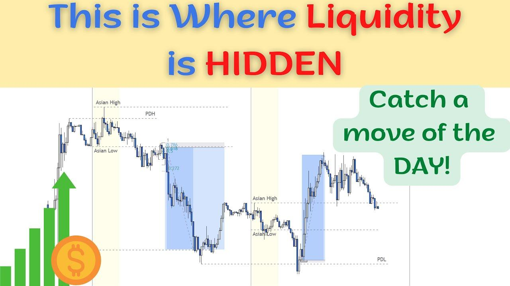

## Table of Contents

## What is liquidity in financial markets?

Liquidity in financial markets refers to how easily you can buy or sell an asset without causing a big change in its price. If a market is liquid, it means there are a lot of buyers and sellers, so you can quickly trade your assets at a fair price. For example, stocks of big companies like Apple or Microsoft are usually very liquid because many people want to buy and sell them.

On the other hand, if a market is not liquid, it can be hard to find someone to buy or sell your asset. This can lead to bigger price changes when you do manage to make a trade. For instance, some small company stocks or rare collectibles might not be very liquid because fewer people are interested in trading them. Understanding liquidity is important because it affects how easily you can turn your investments into cash and how much control you have over the price you get.

## How is liquidity typically measured in markets?

Liquidity in markets is usually measured by looking at how much trading is happening and how quickly trades can be made. One common way to measure this is by using the bid-ask spread, which is the difference between the highest price someone is willing to pay for an asset (the bid) and the lowest price someone is willing to sell it for (the ask). A smaller bid-ask spread means the market is more liquid because it's easier to buy and sell at prices that are close to each other.

Another way to measure [liquidity](/wiki/liquidity-risk-premium) is by looking at the trading [volume](/wiki/volume-trading-strategy), which is the total number of shares or contracts traded in a certain time period. High trading volume means there are a lot of people buying and selling, which usually makes it easier to trade without affecting the price too much. Market depth is also important; it shows how many buy and sell orders are waiting at different price levels. A market with good depth has many orders at different prices, making it easier to trade large amounts without big price changes.

## What is hidden liquidity and how does it differ from visible liquidity?

Hidden liquidity is when there are orders to buy or sell that you can't see on the usual market screens. These orders are kept secret by traders who don't want others to know about them until they are ready to trade. This can happen because traders want to buy or sell big amounts without affecting the market price too much. For example, if a big investor wants to buy a lot of shares, they might use hidden orders so other traders don't see this and start raising the price before the big investor can finish buying.

Visible liquidity, on the other hand, is what you can see on the market screens. These are the orders that show up when you look at the bid and ask prices and the number of shares people are willing to trade at those prices. Visible liquidity helps everyone know how easy it is to buy or sell something right now. The difference between hidden and visible liquidity is that hidden liquidity can make the market seem less liquid than it really is, because you don't see all the orders that are actually there. This can sometimes surprise the market when big hidden orders suddenly show up and affect prices.

## Why is hidden liquidity important for traders and investors?

Hidden liquidity is important for traders and investors because it helps them make big trades without moving the market price too much. Imagine you want to buy a lot of shares in a company. If everyone can see your big order, they might start buying the shares too, which would push the price up before you can finish your purchase. By using hidden orders, you can keep your plan secret and buy the shares at a better price.

Hidden liquidity also affects how people see the market. If there's a lot of hidden liquidity, the market might look less active than it really is. This can be good for some traders who want to find hidden opportunities. But it can also be tricky because big hidden orders can suddenly change prices when they show up. So, understanding hidden liquidity can help traders and investors make smarter decisions and manage their risks better.

## What are the common sources of hidden liquidity in the market?

Hidden liquidity in the market comes from different places. One big source is from big investors like pension funds or mutual funds. They often use hidden orders because they want to buy or sell a lot of shares without making the price go up or down too much. If everyone knew about their big orders, it could change the market price before they finish trading. So, they keep their orders secret until the right time.

Another source of hidden liquidity is from high-frequency trading firms. These firms use computers to trade very quickly and they often use hidden orders to get better prices. They might hide their orders to catch other traders off guard and make quick profits. Also, some stock exchanges have special order types that let traders keep their orders hidden. These special orders help traders keep their plans secret and add to the hidden liquidity in the market.

## How can hidden liquidity impact market prices and volatility?

Hidden liquidity can make market prices and [volatility](/wiki/volatility-trading-strategies) go up and down in unexpected ways. When big hidden orders suddenly show up, they can surprise the market. If a big investor has been hiding a large buy order and it suddenly gets filled, it can push the price up quickly. On the other hand, if a big sell order gets filled, it can make the price drop fast. Because these orders are hidden, other traders can't see them coming, so the price changes can be sudden and big.

This can also make the market more volatile. Volatility means how much and how quickly prices change. When hidden orders cause sudden price jumps or drops, it can make other traders nervous. They might start trading more, trying to guess what will happen next, which can make the market even more unpredictable. So, hidden liquidity can lead to bigger swings in prices and more ups and downs in the market.

## What strategies can traders use to detect hidden liquidity?

Traders can try to spot hidden liquidity by watching the market closely. They might look at the bid-ask spread and see if it changes a lot without clear reasons. If the spread suddenly gets smaller or bigger, it could mean someone is using hidden orders. Traders can also pay attention to how prices move. If the price jumps or drops a lot without much trading happening, it might be because of a big hidden order being filled.

Another way traders can try to find hidden liquidity is by using special tools and data. Some trading platforms have tools that can show patterns that might suggest hidden orders are around. For example, if a lot of small trades happen at the same price level, it might mean there's a hidden order there. Traders can also use data from past trades to see if there are times when hidden liquidity often shows up. By looking at this information, traders can make better guesses about where hidden liquidity might be hiding.

## What are the regulatory considerations surrounding hidden liquidity?

Regulators worry about hidden liquidity because it can make the market less fair. If some traders can see or use hidden orders and others can't, it might not be a level playing field. So, rules are made to make sure everyone has a fair chance. For example, some rules say that hidden orders can only be used in certain ways or at certain times. This helps keep the market open and honest for everyone.

Regulators also watch to make sure hidden liquidity doesn't cause too much trouble. They check if hidden orders are making prices move too much or making the market too unpredictable. If they see problems, they might change the rules to fix them. The goal is to balance letting traders use hidden orders to do big trades without scaring the market, while also making sure the market stays stable and fair for everyone.

## How do dark pools and other alternative trading systems contribute to hidden liquidity?

Dark pools and other alternative trading systems are big sources of hidden liquidity. Dark pools are special places where big investors can trade without everyone seeing their orders. They use these places to buy or sell a lot of shares without making the price go up or down too much. If everyone knew about their big orders, it could change the market price before they finish trading. So, dark pools help keep their orders secret until the right time.

Other alternative trading systems also add to hidden liquidity. These systems might let traders use special orders that are not shown to everyone. This helps traders keep their plans secret and add to the hidden liquidity in the market. Both dark pools and alternative trading systems make it possible for big trades to happen without moving the market too much, but they can also make the market seem less liquid than it really is because you can't see all the orders that are actually there.

## What are the advantages and disadvantages of using hidden liquidity for trading?

Using hidden liquidity can be really helpful for traders, especially if they want to trade a lot of shares without making the price go up or down too much. Big investors like pension funds or mutual funds often use hidden orders because they don't want everyone to see their big trades. If everyone knew about their plans, it could change the market price before they finish trading. So, hidden liquidity helps them buy or sell big amounts at better prices. It also lets traders keep their plans secret, which can be good for making smart trading choices.

But hidden liquidity can also cause some problems. When big hidden orders suddenly show up, they can surprise the market and make prices jump or drop quickly. This can make the market more unpredictable and cause other traders to get nervous. If the market seems less liquid than it really is because of hidden orders, it can be hard for other traders to make good guesses about what will happen next. Regulators worry that hidden liquidity might make the market less fair, so they make rules to try and keep things balanced and honest for everyone.

## How does hidden liquidity affect market efficiency and fairness?

Hidden liquidity can make the market less efficient because it's hard for everyone to see what's really going on. When big orders are hidden, the market might look less active than it really is. This can make it tough for traders to guess what prices will do next. If a big hidden order suddenly shows up and changes the price a lot, it can surprise everyone and make the market more unpredictable. So, hidden liquidity can make it harder for the market to work smoothly and for prices to show the true value of things.

Hidden liquidity can also make the market less fair. If some traders can see or use hidden orders and others can't, it's not a level playing field. Big investors might use hidden orders to buy or sell a lot without moving the price too much, but this can leave smaller traders at a disadvantage. They might not know about these big orders and could end up trading at worse prices. Regulators try to make rules to keep things fair, but hidden liquidity can still cause problems and make some traders feel like the market isn't treating everyone the same.

## What advanced technologies and algorithms are used to manage and exploit hidden liquidity?

Traders use special computer programs and tools to find and use hidden liquidity. These programs look at lots of data from the market to spot patterns that might show where hidden orders are. For example, they might see that the price of a stock changes a lot without much trading happening, which could mean a big hidden order is being filled. These programs can also watch the bid-ask spread and see if it changes in ways that don't make sense, which might be a sign of hidden orders. By using these tools, traders can make better guesses about where hidden liquidity might be and trade more smartly.

High-frequency trading firms use very fast computers to take advantage of hidden liquidity. Their algorithms can quickly spot when a hidden order might be around and trade before anyone else can. They might use special orders that let them keep their own plans secret while trying to find out about others' hidden orders. These firms can make quick profits by trading in and out of the market very fast, often before the hidden liquidity affects prices too much. But this can also make the market more unpredictable and harder for other traders to keep up with.

## References & Further Reading

[1]: Harris, L. (1997). ["Decimalization: A Review of the Arguments and Evidence."](https://www.acsu.buffalo.edu/~keechung/MGF743/Readings/G2%20Decimalization.pdf) Review of Financial Studies, 10(4), 975-1015.

[2]: O'Hara, M. (2015). ["High Frequency Market Microstructure."](https://www.sciencedirect.com/science/article/pii/S0304405X15000045) Journal of Financial Economics, 116(2), 257-270.

[3]: Boulatov, A., Kyle, A. S., & Livdan, D. (2017). ["Market Microstructure Invariance: Empirical Hypotheses."](https://onlinelibrary.wiley.com/doi/abs/10.3982/ECTA10486) Journal of Financial Markets, 10(2), 157-195.

[4]: Hasbrouck, J., & Saar, G. (2009). ["Technology and Liquidity Provision; The Blurring of Traditional Definitions."](https://www.sciencedirect.com/science/article/pii/S1386418108000220) Journal of Financial Markets, 12(2), 143-172.

[5]: Aldridge, I. (2013). ["High-Frequency Trading: A Practical Guide to Algorithmic Strategies and Trading Systems"](https://onlinelibrary.wiley.com/doi/pdf/10.1002/9781119203803.fmatter). Wiley Finance.

[6]: Kissell, R. (2013). ["The Science of Algorithmic Trading and Portfolio Management"](https://www.sciencedirect.com/book/9780124016897/the-science-of-algorithmic-trading-and-portfolio-management). Academic Press.

[7]: Lo, A. W. (2009). ["The Heretics of Finance: Conversations with Leading Practitioners of Technical Analysis"](https://www.amazon.com/Heretics-Finance-Conversations-Practitioners-Technical/dp/1576603164). Bloomberg Press.