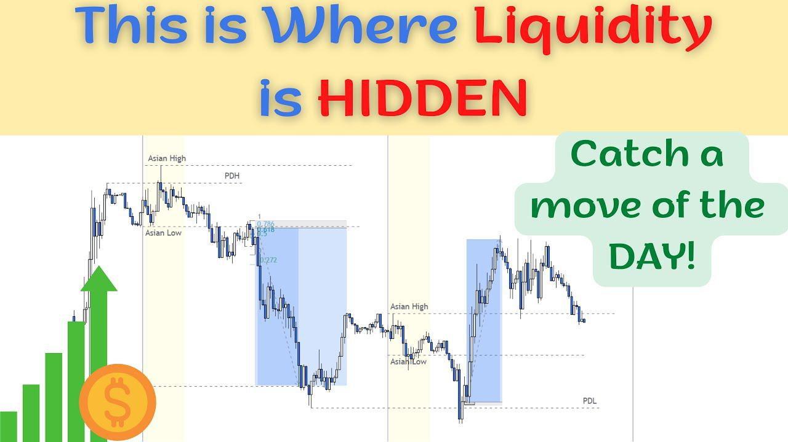

In the domain of financial markets, liquidity is a fundamental factor that determines the efficiency and effectiveness of trading strategies. Beneath the visible market, hidden liquidity presents an intriguing aspect that offers substantial benefits to institutional investors and traders. By executing large orders without exposing their intentions, these market participants can avoid triggering adverse market movements that might occur if their trading activities were visible on public order books.

As algorithmic trading technologies evolve, the need to understand hidden liquidity becomes increasingly pertinent for traders, investors, and policymakers. This necessity is driven by the desire to enhance trade execution efficiency and maintain a competitive edge in the market. Hidden liquidity is not just a tool but a critical element of modern trading that enables the execution of sizable trades discreetly. This approach minimizes market disruption and provides a shield against market volatility.

The following article will explore the concept of hidden liquidity, outlining the mechanisms through which traders access it, its significance in financial markets, the challenges and controversies it poses, and future trends in this evolving landscape. Understanding these dynamics is essential to grasp the complex machinations of contemporary financial markets and to leverage hidden liquidity effectively in trading strategies.

## Table of Contents

## Understanding Hidden Liquidity

Hidden liquidity represents buying and selling activities that remain hidden from public order books, which are essential tools for traders who wish to execute substantial transactions without drawing attention in the market. Such transactions can be crucial for minimizing the price slippage that can occur when large orders affect market price adversely by creating sudden supply or demand shocks.

To gain access to hidden liquidity, traders employ several mechanisms, each serving unique purposes and offering varying degrees of anonymity:

1. **Dark Pools**: Dark pools are private financial forums or exchanges for securities trading that provide institutional traders with the opportunity to execute sizable trades without the price impact that might occur on public exchanges. These platforms operate without displaying buy and sell orders to the wider market, thus allowing trades to be executed without significant pre-trade price signaling. Transactions in dark pools are completed anonymously, with the details revealed only after execution. This anonymity helps in preserving the market's stability, as large orders can be transacted without causing sudden fluctuations in prices.

2. **Hidden Orders**: A hidden order is another valuable tool traders use to mask their trading intentions. These orders are placed on public order books but are not visible to other market participants. Hidden orders can interact with visible limit orders while remaining unexposed, thereby enabling large trades to materialize without signaling intent to the market.

3. **Indications of Interest (IOIs)**: IOIs are alerts sent by brokers to potentially interested parties to explore interest in trading a particular security. Unlike firm orders, IOIs deliver a potential interest signal without committing to a trade. They are particularly useful in gauging market appetite and guiding the strategy for accessing hidden liquidity.

4. **Broker-Dealer Networks**: These are networks where brokers and dealers collaborate to match buy and sell orders internally before they reach public exchanges. Broker-dealers leverage proprietary pools of liquidity, which can offer clients improved execution quality, reduced market impact, and lower transaction costs due to the discretion with which trades are handled.

Overall, these mechanisms facilitate the execution of large trades with minimal market disruption, maintaining efficiency in transactions while ensuring confidentiality and minimizing the risk of disruptive market moves. Understanding these components is essential for navigating modern financial markets, particularly as [algorithmic trading](/wiki/algorithmic-trading) and regulatory frameworks evolve.

## Importance and Benefits of Hidden Liquidity

Hidden [liquidity](/wiki/liquidity-risk-premium) plays a critical role in modern financial markets by allowing for the execution of large trades without considerably affecting market prices. This is primarily achieved through mechanisms that operate outside traditional visible order [books](/wiki/algo-trading-books), such as dark pools and hidden orders. By concealing sizable buy or sell orders, hidden liquidity mitigates the market impact typically associated with large transactions. When a substantial trade order is executed visibly, it can lead to significant price movements as market participants react to perceived shifts in supply and demand. Hidden liquidity minimizes this risk, enabling trades to occur more efficiently.

Participants utilizing hidden liquidity frequently benefit from price improvements. The discrete nature of trading within hidden liquidity venues often means trades can occur at more favorable prices compared to those available on public exchanges. This occurs because participants in these venues are able to access liquidity that is not visible to the broader market, sometimes securing prices that better align with their strategic objectives.

Moreover, hidden liquidity ensures confidentiality of traders' intentions, significantly reducing the risk of front-running—a practice where other traders would capitalize on insider knowledge of an impending large order to benefit at its expense. By keeping large order intentions anonymous, hidden liquidity prevents competitors from exploiting knowledge of these potential market movements. This confidentiality is a significant advantage, particularly for institutional investors and asset managers who must routinely handle extensive transactions.

Hence, hidden liquidity not only facilitates the reduction of market impact but also provides participants with opportunities for price improvement and protects against exploitative trading practices. These factors contribute to its vital role in enhancing the efficiency and effectiveness of financial markets.

## Challenges and Controversies

Despite the numerous advantages offered by hidden liquidity mechanisms, they bring forth significant transparency issues in financial markets. One of the primary concerns associated with hidden liquidity is the opacity intrinsic to dark pools and hidden orders. This lack of visibility can obscure real market conditions from general market participants, potentially leading to situations where all market players do not operate on a level playing field. Consequently, some traders may gain unfair trading advantages, which undermines the integrity and fairness of the market.

Dark pools, for instance, are private exchanges where not all order details are visible to those outside the pool. This characteristic can lead to price formation issues, as the full depth and demand of the market are not immediately apparent. The issue is particularly prominent in situations where significant volumes are traded away from traditional exchanges, potentially skewing public market data. As the market participants cannot see these hidden orders, the potential arises for price discrepancies, making the real demand or supply in the market difficult to gauge accurately.

Moreover, hidden liquidity mechanisms are subject to stringent regulatory scrutiny aimed at maintaining a balance between the privacy they offer to large traders and the transparency needed for fair market practices. Regulators worldwide continue to contend with how best to oversee these practices without stifling the legitimate need for anonymity in executing large trades. The challenge lies in ensuring that these venues do not become avenues for manipulative practices that could exploit market efficiencies.

As such, regulatory bodies have instituted rules intended to increase transparency wherever possible without exposing large trades to undue market impact. For instance, measures like reporting requirements post-trade are employed to provide the public with insights into transactions that occur under the veil of hidden liquidity. Continuous refinement of these regulations is essential, as technology evolves and new methods for accessing hidden liquidity emerge. Balancing the inherent secrecy of these trading venues with the broader market's need for transparency remains a contentious and ongoing endeavor.

## Real-World Examples of Hidden Liquidity

High-frequency trading ([HFT](/wiki/high-frequency-trading-strategies)) firms are prominent users of hidden liquidity, capitalizing on the ability to execute trades without affecting market prices significantly. These firms utilize complex algorithms and technological infrastructure to interact with hidden liquidity sources, such as dark pools and hidden orders. This enables them to conduct rapid trades, taking advantage of narrow market windows and price disparities. The minimal market impact ensures that their trading strategies remain discreet, protecting them from potential adverse price movements.

Large asset managers also harness the benefits of hidden liquidity when undertaking portfolio reallocation. By accessing liquidity pools that are not visible on public order books, these managers can adjust their investment holdings in substantial quantities without signaling their intentions to the broader market. This prevents market participants from anticipating their moves, which could otherwise lead to detrimental price shifts and increased costs. Consequently, hidden liquidity aids in maintaining the integrity of the asset manager's trading strategy while facilitating efficient capital allocation.

Brokerage firms play a crucial role in providing access to hidden liquidity for their clients. By offering entry into dark pools and facilitating hidden orders, these firms can enhance trade execution quality and lower transaction costs. Clients, ranging from institutional investors to sophisticated retail traders, benefit from improved pricing conditions and reduced slippage. Brokerage firms often employ advanced technologies to optimize order routing, ensuring that client trades maximize potential gains from available hidden liquidity pools. This not only strengthens the competitive edge of brokerage services but also contributes to more efficient overall market functioning.

## Future Trends and Developments

Technological advancements, particularly in [artificial intelligence](/wiki/ai-artificial-intelligence) (AI) and [machine learning](/wiki/machine-learning), are transforming the landscape of hidden liquidity in financial markets. These technologies are crucial in creating advanced trading algorithms capable of identifying and interacting with sources of hidden liquidity more effectively. Enhanced algorithmic precision allows traders to optimize trade execution by predicting order flow, adapting to market conditions in real-time, and minimizing the market impact of large transactions. Machine learning models, trained on vast datasets, improve the detection of patterns associated with undisclosed orders, thereby increasing the efficiency of accessing hidden liquidity.

Meanwhile, regulatory developments continue to reshape the landscape of hidden liquidity. With a focus on improving transparency and fairness, regulatory bodies worldwide are revisiting and updating their guidelines on dark pools and hidden orders. This regulatory scrutiny aims to balance market integrity with the benefits offered by hidden liquidity. However, increased regulation poses challenges for maintaining the privacy essential to hidden liquidity operations. Striking a balance between confidentiality and transparency remains a pivotal issue for regulators and market participants.

As globalization deepens, financial markets are becoming more interconnected, contributing to the evolving sophistication in accessing hidden liquidity. This interconnectedness enables cross-border trades to be executed more efficiently and cost-effectively. The emergence of global trading platforms and networks allows for seamless integration of hidden liquidity sources across various markets, enhancing market efficiency. Consequently, traders are able to access hidden liquidity with greater precision, leveraging global data analysis and predictive modeling to align their strategies with evolving market dynamics. This trend is expected to continue, driven by technological and regulatory advancements aimed at fostering a more inclusive and transparent financial ecosystem.

## Conclusion

Hidden liquidity plays a critical role in modern financial markets by allowing large trades to be executed discreetly. This component of trading is integral to maintaining the efficiency and functionality of markets, especially for institutional investors looking to minimize the market impact when handling substantial orders. Through mechanisms like dark pools and hidden orders, traders can protect their strategies and intentions from becoming public, thereby avoiding significant price swings that could arise from revealing large trading volumes.

The ongoing challenge, however, lies in balancing the benefits provided by hidden liquidity against the necessity for market transparency and fairness. The opacity associated with hidden liquidity venues, while beneficial for secrecy, raises concerns about market integrity and equitable access. Regulators continuously seek to ensure that these venues do not undermine the market's transparency obligations while still allowing the strategic concealment of trades that enhances liquidity.

Comprehending the dynamics of hidden liquidity is crucial for navigating the modern financial landscape. It requires an understanding of not just the mechanisms themselves, but also how they fit within the wider market structure. As trading technologies advance and global markets become increasingly interconnected, the methods for accessing hidden liquidity are expected to further evolve, offering increased efficiency and sophistication. Thus, staying abreast of these developments is vital for traders, investors, and policymakers aiming to make informed decisions in an ever-complex financial environment.

## References & Further Reading

[1]: Madhavan, A. (2012). ["Exchange-Traded Funds, Market Structure, and the Flash Crash."](https://rpc.cfainstitute.org/research/financial-analysts-journal/2012/exchange-traded-funds-market-structure-and-the-flash-crash) The Review of Financial Studies, 25(1), 187–206.

[2]: O'Hara, M., & Ye, M. (2011). ["Is Market Fragmentation Harming Market Quality?"](https://www.sciencedirect.com/science/article/pii/S0304405X11000390) The Review of Financial Studies, 24(3), 705–728.

[3]: Harris, L. (2003). ["Trading and Exchanges: Market Microstructure for Practitioners."](https://academic.oup.com/book/52292) Oxford University Press.

[4]: Degryse, H., de Jong, F., & van Kervel, V. (2015). ["The Impact of Dark Trading and Visible Fragmentation on Market Quality."](https://econpapers.repec.org/RePEc:oup:revfin:v:19:y:2015:i:4:p:1587-1622.) The Review of Financial Studies, 28(3), 842–879.

[5]: Aït-Sahalia, Y., & Saglam, M. (2014). ["High Frequency Traders: Taking Advantage of Speed."](https://www.eief.it/files/2014/10/saglam.pdf) The Review of Financial Studies, 27(8), 2237–2276.

[6]: Buti, S., Rindi, B., & Werner, I. (2011). ["Diving into Dark Pools."](https://papers.ssrn.com/sol3/papers.cfm?abstract_id=1630499) Empirical Finance, 18(2), 250–279.

[7]: Degryse, H. (2009). ["The Impact of Investor Protection on Competitive Equity Markets."](https://sites.google.com/site/degrysehans/home/publications) The Journal of Finance, 64(6), 2183–2210.

[8]: Hasbrouck, J. (2007). ["Empirical Market Microstructure: The Institutions, Economics, and Econometrics of Securities Trading."](https://academic.oup.com/book/52241) Oxford University Press.