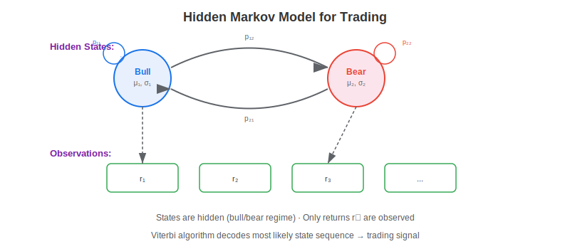
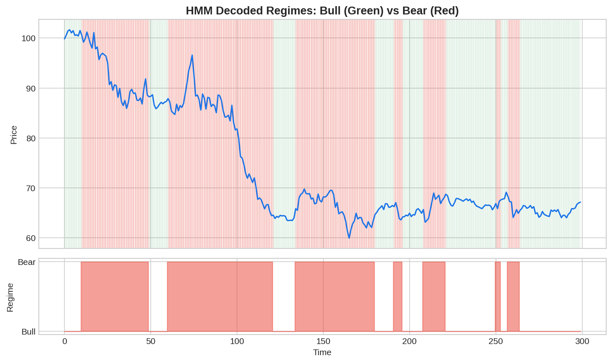

A **Hidden Markov Model (HMM)** is a probabilistic model where the system transitions between unobserved (hidden) states according to a Markov chain, and each state generates observable outputs from a probability distribution. In trading, the hidden states represent market regimes (bull, bear, crisis) and the observations are asset returns. The HMM learns the regime dynamics — how likely the market is to stay in or switch from each state — and uses this to generate trading signals.

## The HMM Framework for Markets

An HMM for trading is defined by:

- **Hidden states** $S = \{s_1, s_2, \ldots, s_K\}$: market regimes (e.g., bull, bear)
- **Transition matrix** $A$: $a_{ij} = P(s_{t+1} = j \mid s_t = i)$ — probability of switching regimes
- **Emission distributions** $B$: each state generates returns from $\mathcal{N}(\mu_k, \sigma_k^2)$
- **Initial probabilities** $\pi$: starting state distribution

$$P(r_t \mid s_t = k) = \frac{1}{\sqrt{2\pi\sigma_k^2}} \exp\left(-\frac{(r_t - \mu_k)^2}{2\sigma_k^2}\right)$$



## Training and Decoding

The HMM is trained using the **Baum-Welch algorithm** (Expectation-Maximization), which estimates the parameters $A$, $B$, and $\pi$ from observed returns. Once trained, the **Viterbi algorithm** decodes the most likely sequence of hidden states, and the **forward algorithm** computes the probability of being in each regime at any given time.

## Python Implementation

```python
import numpy as np
from hmmlearn.hmm import GaussianHMM

def hmm_regime_strategy(returns, n_states=2):
    """
    Fit a Gaussian HMM and generate regime-based trading signals.
    """
    model = GaussianHMM(
        n_components=n_states,
        covariance_type="full",
        n_iter=300,
        random_state=42
    )
    X = returns.reshape(-1, 1)
    model.fit(X)
    
    # Decode states
    states = model.predict(X)
    state_probs = model.predict_proba(X)
    
    # Identify bull state (higher mean)
    means = [model.means_[i][0] for i in range(n_states)]
    bull_state = np.argmax(means)
    
    # Trading signal: probability of being in bull state
    signal = state_probs[:, bull_state]
    
    # Print regime parameters
    for i in range(n_states):
        label = "Bull" if i == bull_state else "Bear"
        mu = model.means_[i][0]
        vol = np.sqrt(model.covars_[i][0][0])
        print(f"{label} (State {i}): mu={mu:.5f}, vol={vol:.5f}")
    
    print(f"\nTransition matrix:\n{model.transmat_.round(3)}")
    return signal, states

# Generate sample data with regime changes
np.random.seed(42)
bull_returns = np.random.normal(0.0008, 0.008, 200)
bear_returns = np.random.normal(-0.0005, 0.02, 80)
recovery = np.random.normal(0.001, 0.01, 220)
returns = np.concatenate([bull_returns, bear_returns, recovery])

signal, states = hmm_regime_strategy(returns)
position = np.where(signal > 0.5, 1.0, 0.0)
strat_returns = position[:-1] * returns[1:]
total = (1 + strat_returns).prod() - 1
print(f"\nStrategy return: {total:.2%}")
print(f"Buy-hold return: {((1 + returns).prod() - 1):.2%}")
```



## Trading Applications

**Regime-conditional strategy selection**: Use HMM states to switch between [momentum](https://paperswithbacktest.com/wiki/trend-following-strategy) in bull regimes and mean-reversion in bear regimes. **Dynamic risk sizing**: Scale position sizes by the inverse of the current regime's volatility. **Pairs trading**: Apply HMMs to spread series to detect when pairs are in mean-reverting vs trending regimes. **Cross-asset signals**: Fit HMMs to macro variables (yield curve, credit spreads) to detect macro regime transitions that affect multiple asset classes.

## Limitations and Risks

HMMs assume a fixed number of states, which must be chosen beforehand. Real markets may have more nuanced regime structures. The model can be slow to detect transitions due to the probabilistic smoothing. Parameters estimated on historical data may not be stable forward-looking. Use HMMs as one component of a broader [regime detection](https://paperswithbacktest.com/wiki/regime-detection-financial-markets) framework rather than a standalone signal.

## Conclusion

Hidden Markov Models provide a principled, probabilistic framework for detecting latent market regimes and adapting trading strategies accordingly. Their ability to estimate both the regime dynamics (transition probabilities) and the return characteristics within each regime makes them uniquely suited to the core challenge of systematic trading: operating in a non-stationary environment.

---

**Explore further on PapersWithBacktest:**
- Browse [backtested regime-aware strategies](https://paperswithbacktest.com/strategies) with Python code and performance metrics
- Access [clean historical market data](https://paperswithbacktest.com/datasets) for equities, crypto, and futures
- Take the [algo trading course](https://paperswithbacktest.com/course) — 60+ video lessons and notebooks
- Related wiki pages: [Trend Following Strategy](https://paperswithbacktest.com/wiki/trend-following-strategy) · [Mean Reversion Trading Strategy](https://paperswithbacktest.com/wiki/mean-reversion-trading-strategy) · [VIX Trading Strategy](https://paperswithbacktest.com/wiki/vix-trading-strategy)
