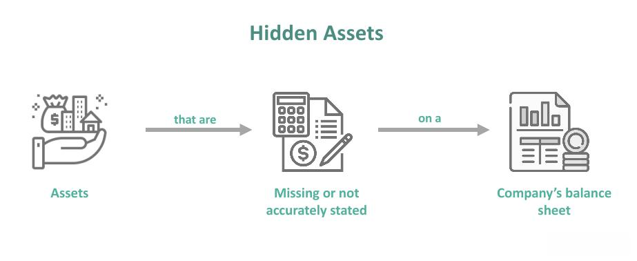

## Table of Contents

## What is the basic definition of hidden value?

Hidden value refers to the worth or potential that is not immediately obvious or recognized in something or someone. It can be found in various contexts, like in businesses, investments, or even in personal talents and skills. For example, a company might have a hidden value in its undervalued assets or innovative ideas that are not yet recognized by the market.

Recognizing hidden value can be beneficial. In business, it can lead to better investment decisions or improvements in operations. On a personal level, understanding and developing hidden talents can lead to greater success and fulfillment. However, uncovering hidden value often requires careful analysis and a willingness to look beyond the surface.

## How does hidden value differ from apparent value?

Hidden value is the worth that you can't see right away. It's like a treasure that's buried or a skill someone has but doesn't show off. In a business, hidden value might be in a new idea that hasn't been tried yet or in a piece of equipment that's worth more than people think. You have to look closely and think carefully to find hidden value because it's not obvious.

Apparent value, on the other hand, is the worth that you can see easily. It's like the price tag on a toy or how good someone is at a sport that everyone knows about. In a company, apparent value could be in how much money it makes or how well-known its products are. You don't need to dig deep to see apparent value because it's right there in front of you.

The big difference between hidden value and apparent value is how easy they are to spot. Hidden value needs more effort to find, but it can be very rewarding. Apparent value is simple to see, but it might not tell the whole story about something's true worth.

## What are some common sources of hidden value in a business?

Hidden value in a business can come from things that people don't see right away. One common source is the skills and knowledge of the employees. Sometimes, workers have talents or ideas that they don't use much at work. If a business can find these hidden skills and use them better, it can become more successful. Another source is in the company's assets, like old machines or buildings that might be worth more than people think. If a business looks closely at what it owns, it might find that some things are more valuable than they thought.

Another place to find hidden value is in the company's processes and systems. Sometimes, a business might have ways of doing things that are more efficient or better than others, but it doesn't realize it. By looking at how things are done and making changes, a business can save money and work better. Also, hidden value can be in the company's customer base. A business might have loyal customers who could buy more products or services if the business offered them. By paying attention to what customers want and need, a business can find new ways to make money.

## How can hidden value be identified in financial statements?

Hidden value in financial statements can be found by looking closely at the numbers and thinking about what they mean. One way to find hidden value is to look at the balance sheet. The balance sheet shows what a company owns and what it owes. Sometimes, the value of things like buildings or equipment might be listed at a lower price than they are really worth. If you think these things could be sold for more money than what's written down, that's hidden value. Also, if a company has a lot of money saved up or investments that aren't being used, that could be hidden value too.

Another way to spot hidden value is by looking at the income statement. This statement shows how much money the company makes and spends. Sometimes, a company might have costs that are going down or ways to make more money that it hasn't tried yet. For example, if a company can find a cheaper way to make its products, that could save money and add hidden value. Also, if a company has a new product or service that it hasn't sold yet, that could be a big source of hidden value. By carefully looking at these financial statements, you can find hidden value that others might miss.

## What role does hidden value play in investment decisions?

Hidden value plays a big part in investment decisions because it helps investors find opportunities that others might not see. When someone is thinking about investing in a company, they look at all the information they can find. If they can spot hidden value, like a company's secret talent or an asset that's worth more than people think, they might decide to invest. This is because hidden value means the company could be worth more in the future than it is now. Investors who find hidden value early can make a lot of money when the rest of the market finally sees it too.

But finding hidden value isn't always easy. It takes a lot of work to look through financial statements and understand all the details about a company. Sometimes, hidden value is in things that aren't easy to see, like how well a company treats its workers or how loyal its customers are. Investors need to be smart and patient to find these hidden gems. When they do, it can make their investment decisions much better and help them earn more money over time.

## Can hidden value impact the valuation of a company, and if so, how?

Hidden value can definitely impact the valuation of a company. When someone is trying to figure out how much a company is worth, they look at all kinds of information. If they find hidden value, like a special talent among the employees or an asset that's worth more than people think, it can make the company seem more valuable. For example, if a company has a building that's listed at a low price on the [books](/wiki/algo-trading-books) but could be sold for a lot more, that adds to the company's value. Investors and buyers who see this hidden value might be willing to pay more for the company because they believe it has more potential than what's shown on the surface.

However, finding and proving hidden value isn't always easy. It takes a lot of digging through financial statements and understanding the company's operations deeply. Sometimes, hidden value might be in things that are hard to measure, like the loyalty of customers or the efficiency of a new process that hasn't been fully used yet. When hidden value is recognized and included in the valuation, it can lead to a higher price for the company. But if it's overlooked, the company might be undervalued, missing out on the true worth that could be unlocked with the right strategies and investments.

## What are the methods used to unlock hidden value in a company?

One way to unlock hidden value in a company is by looking closely at the skills and ideas of the employees. Sometimes, workers have talents or new ways of doing things that the company isn't using. By talking to employees and encouraging them to share their ideas, a company can find new ways to save money or make more money. For example, an employee might know a cheaper way to make a product or have an idea for a new product that customers would love. When a company starts using these hidden talents and ideas, it can grow and become more valuable.

Another method is by looking at the company's assets and processes. Sometimes, things like old machines or buildings might be worth more than what's written down in the books. If a company sells these assets for more money, it can use that money to grow or pay off debts. Also, by looking at how the company does things, it might find ways to work more efficiently. For example, changing a process to make it faster or cheaper can save a lot of money. When a company finds and uses these hidden values, it can become more successful and worth more to investors.

## How do different industries approach the concept of hidden value?

Different industries have their own ways of looking for hidden value, but the basic idea is the same: finding something valuable that isn't obvious. In the tech industry, hidden value might be in a new piece of software or a clever way of using data that nobody has thought of yet. Tech companies often look for hidden value by encouraging their employees to innovate and come up with new ideas. They also might look at their data to see if there are patterns or opportunities that they can use to make new products or services. By finding and using these hidden values, tech companies can stay ahead of their competition and grow faster.

In the manufacturing industry, hidden value could be in the way things are made or in the machines that are used. Manufacturers might find hidden value by looking at their processes and seeing if they can make them more efficient. For example, they might find a way to use less material or make things faster, which saves money. They also might look at their old machines and see if they can sell them for more than what they're worth on the books. By unlocking these hidden values, manufacturing companies can lower their costs and make more profit, which makes them more valuable to investors.

In the service industry, like restaurants or hotels, hidden value might be in the way they treat their customers or in the loyalty of their staff. Service companies often look for hidden value by listening to their customers and employees to find out what they need or want. They might find that by making small changes, like offering a new service or improving how they train their staff, they can make their customers happier and more loyal. This can lead to more repeat business and better word-of-mouth, which adds hidden value to the company. By finding and using these hidden values, service companies can improve their reputation and grow their business.

## What are the risks associated with pursuing hidden value?

Pursuing hidden value can be risky because it's not always easy to find or prove. Sometimes, what looks like hidden value might not be real. For example, a company might think it can save a lot of money by changing how it makes its products, but if the new way doesn't work, it could end up costing more money instead. Also, it takes time and effort to look for hidden value, and if a company spends too much time on it, it might miss out on other important things it needs to do. If the hidden value doesn't turn out to be real, the company could lose money and time, which can hurt its business.

Another risk is that other people might not see the hidden value the same way. Investors and buyers might not agree that something is valuable if it's not easy to see or measure. If a company tries to use hidden value to get a higher price when it's selling, it might not work if others don't believe in it. This can make it hard for the company to get the money it needs to grow or even stay in business. So, while finding hidden value can be good, it's important for a company to be careful and make sure it's real before it counts on it too much.

## How can technology and data analytics help in uncovering hidden value?

Technology and data analytics can help uncover hidden value by looking at a lot of information quickly and finding patterns that people might miss. For example, a company can use special software to go through its sales data and see if there are any products that are selling well in certain places but not others. This can show hidden value in the form of new markets or ways to sell more. Also, technology can help by keeping track of how well machines are working or how much time employees spend on different tasks. By looking at this data, a company can find ways to save money or work more efficiently, which adds hidden value.

Data analytics can also help by predicting what might happen in the future. For instance, by using data to guess what customers will want next, a company can start making new products or services before anyone else. This can give the company a big advantage and make it more valuable. Plus, technology can help by making it easier for employees to share their ideas and work together. When a company uses technology to listen to its workers and find new ways of doing things, it can unlock hidden value that makes the business stronger and more successful.

## What case studies illustrate successful identification and exploitation of hidden value?

One good example of finding hidden value is the story of Apple. Back in the late 1990s, Apple was struggling and almost went out of business. But when Steve Jobs came back, he saw hidden value in the company's design skills and loyal customers. He used these hidden strengths to make new products like the iPod and iPhone. These products were big hits and made Apple a lot of money. By seeing the hidden value in what Apple already had, Steve Jobs turned the company around and made it one of the most valuable companies in the world.

Another example is how Netflix used data to find hidden value. At first, Netflix was just a company that sent DVDs to people's homes. But they started using data to see what movies and shows people liked. They found hidden value in this data by making their own shows and movies that people wanted to watch. This made Netflix grow a lot and become a leader in streaming. By using data to find hidden value, Netflix changed from a small DVD company to a big streaming service that people all over the world use.

## How does hidden value relate to long-term strategic planning and sustainability?

Hidden value plays a big part in long-term strategic planning because it helps companies think about their future in new ways. When a company looks for hidden value, it's trying to find things that can make it stronger and more successful over time. For example, a company might find hidden value in its employees' skills or in new ways to save money. By using these hidden values, a company can make plans that help it grow and stay ahead of its competition. This kind of planning is important for the company's long-term success because it helps it be ready for changes and challenges in the future.

Hidden value also matters for sustainability because it can help a company be more responsible and last longer. When a company finds hidden value, it might see ways to use less energy or make less waste. This can help the company be kinder to the environment and save money at the same time. Also, by finding hidden value in things like customer loyalty or new products, a company can keep making money and stay strong even when times are tough. This makes the company more sustainable because it can keep going and doing well for a long time.

## What is the hidden value in investments and how can it be understood?

Hidden value in investments is a concept that revolves around identifying assets or opportunities within a business that are not immediately evident or valued by the market. These hidden values often arise from a variety of sources, including intangible assets, underutilized resources, or potential for future growth. Recognizing and exploiting these hidden values requires a keen understanding of both the company's intrinsic value and the factors that might lead to a disparity between this intrinsic value and the company's market valuation.

Intangible assets, such as intellectual property, brand reputation, and proprietary technologies, are significant contributors to hidden value. These assets contribute to a company's competitive edge, often acting as barriers to entry for competitors, and can substantially impact a company's long-term profitability and growth potential. For example, a strong brand can command premium pricing and foster customer loyalty, while proprietary technology might lead to cost advantages or differentiated product offerings.

Underutilized resources, such as real estate or excess production capacity, present another layer of hidden value. Companies that own significant real estate holdings, particularly in burgeoning markets, might have substantial unrecognized asset value that could be unlocked through strategic divestiture or redevelopment. Similarly, businesses operating below optimal production capacity may have the potential to increase output significantly without incurring proportionate increases in cost, thus improving margins.

Value investors use [fundamental analysis](/wiki/fundamental-analysis) to uncover these hidden values. This analytical process involves assessing the financial statements, understanding the business model, evaluating management's effectiveness, and considering broader economic factors. Investors seek to identify companies where the market has not fully appreciated these hidden assets or opportunities, allowing them to invest at a discount to intrinsic value.

Calculating intrinsic value involves analyzing a company's financial health, growth prospects, and industry position. Discounted Cash Flow (DCF) analysis is one common method, where future projected cash flows are estimated and discounted back to their present value using the formula:

$$

PV = \frac{CF_1}{(1+r)^1} + \frac{CF_2}{(1+r)^2} + \ldots + \frac{CF_n}{(1+r)^n} 
$$

where $PV$ is the present value of the cash flows, $CF$ represents the cash flows in different periods, $r$ is the discount rate, and $n$ is the number of periods.

By comparing intrinsic value with market valuation, investors can identify discrepancies where the market may have overlooked potential growth or underestimated the value of certain assets. These insights allow investors not only to capitalize on undervalued stocks but also to provide a deeper comprehension of a company's long-term viability and strategic positioning.

In conclusion, understanding and exploiting hidden value involves recognizing the strategic advantages and intangible assets that a company possesses, which may not be fully appreciated by the broader market. Through diligent analysis, investors can uncover these opportunities, potentially leading to significant financial returns as the market adjusts to reflect the true value of the company.

## References & Further Reading

[1]: Bergstra, J., Bardenet, R., Bengio, Y., & Kégl, B. (2011). ["Algorithms for Hyper-Parameter Optimization."](https://dl.acm.org/doi/10.5555/2986459.2986743) Advances in Neural Information Processing Systems 24.

[2]: ["Advances in Financial Machine Learning"](https://www.amazon.com/Advances-Financial-Machine-Learning-Marcos/dp/1119482089) by Marcos Lopez de Prado

[3]: ["Evidence-Based Technical Analysis: Applying the Scientific Method and Statistical Inference to Trading Signals"](https://www.amazon.com/Evidence-Based-Technical-Analysis-Scientific-Statistical/dp/0470008741) by David Aronson

[4]: ["Machine Learning for Algorithmic Trading"](https://github.com/stefan-jansen/machine-learning-for-trading) by Stefan Jansen

[5]: ["Quantitative Trading: How to Build Your Own Algorithmic Trading Business"](https://www.amazon.com/Quantitative-Trading-Build-Algorithmic-Business/dp/1119800064) by Ernest P. Chan