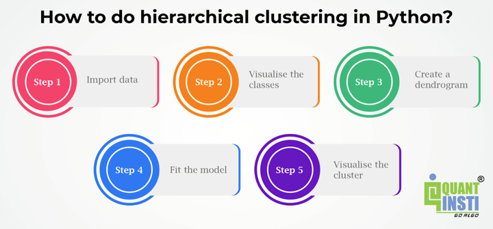

## Table of Contents

## What is hierarchical clustering and why is it used?

Hierarchical clustering is a way to group similar things together by organizing them into a tree-like structure called a dendrogram. Imagine you have a bunch of different fruits, and you want to sort them based on how similar they are. You start by comparing each fruit to every other fruit, and then you group the ones that are most alike. You keep doing this, forming bigger and bigger groups, until all the fruits are organized into a tree. This tree shows how the fruits are related to each other, with the most similar fruits grouped closer together.

People use hierarchical clustering because it helps them understand and see patterns in their data. It's especially useful when you don't know ahead of time how many groups you should have. For example, a scientist studying different species of birds might use hierarchical clustering to see how the birds are related to each other without deciding beforehand how many different groups there should be. This method can help in many fields, like biology, marketing, and even organizing your music library, by showing how things are connected and grouped naturally.

## How does hierarchical clustering differ from other clustering methods like K-means?

Hierarchical clustering and K-means clustering are two different ways to group things together, but they work in different ways. Hierarchical clustering starts by looking at each item as its own group and then slowly combines similar groups until everything is in one big group. It's like building a family tree, where you can see how things are related at different levels. You don't need to decide how many groups you want at the start; the tree shows you all the possible groupings. On the other hand, K-means clustering requires you to decide upfront how many groups you want. It then tries to put each item into one of these groups by figuring out which group's center, or average, the item is closest to. It keeps moving things around until it finds the best fit.

The main difference between the two is how they handle the number of groups and the process of grouping. Hierarchical clustering is flexible because it doesn't need you to know the number of groups beforehand, and it shows you a complete picture of how things can be grouped at different levels. This can be really helpful if you're exploring data and want to understand the relationships between items. K-means, however, is more straightforward and faster when you already know how many groups you want. It's like sorting items into a fixed number of boxes, and it's good for when you need quick results and already have a clear idea of what you're looking for.

## What are the main types of hierarchical clustering?

Hierarchical clustering comes in two main types: agglomerative and divisive. Agglomerative clustering, also called bottom-up clustering, starts with each item as its own group. It then combines the most similar groups step by step until all items are in one big group. Think of it like building a pyramid, starting from the bottom and working your way up. This method is popular because it's easy to understand and works well with different kinds of data.

Divisive clustering, also known as top-down clustering, does the opposite. It begins with all items in one big group and then splits this group into smaller and smaller groups based on how different the items are. Imagine you're splitting a big cake into smaller pieces. Divisive clustering can be more complex and time-consuming than agglomerative clustering because it needs to consider all possible ways to split the groups. Both methods end up creating a tree-like structure called a dendrogram, which shows how the items are related at different levels.

## How do you implement agglomerative hierarchical clustering in Python?

To implement agglomerative hierarchical clustering in Python, you can use the `scikit-learn` library. First, you need to import the necessary modules, including `AgglomerativeClustering` from `sklearn.cluster`. After importing, you prepare your data, which should be in a format like a NumPy array or a pandas DataFrame. You then create an instance of the `AgglomerativeClustering` class, specifying parameters like the number of clusters (`n_clusters`) you want, the linkage criterion (`linkage`), and the distance metric (`affinity`). For example, you might set `n_clusters` to 3, `linkage` to 'ward', and `affinity` to 'euclidean'. After setting up the clustering object, you call its `fit_predict` method on your data to perform the clustering and get the cluster labels for each data point.

Once you have the cluster labels, you can visualize the results using a dendrogram, which helps to see the hierarchical structure of the clusters. For creating a dendrogram, you can use the `dendrogram` function from the `scipy.cluster.hierarchy` module. To do this, you first need to calculate the linkage matrix using `scipy.cluster.hierarchy.linkage` on your data. After computing the linkage, you can plot the dendrogram by calling `dendrogram` with this linkage matrix. This visual representation will show how the clusters are formed at different levels, making it easier to understand the relationships between your data points.

## What is the role of dendrograms in hierarchical clustering?

Dendrograms are special diagrams used in hierarchical clustering to show how data points are grouped together. They look like trees, with branches that represent the different levels of similarity between the data points. Each branch splits into smaller branches, showing how the data is divided into smaller and smaller groups. The height of these splits tells us how different the groups are from each other. The closer the split, the more similar the groups are.

Dendrograms are really helpful because they let us see the whole clustering process at once. We can look at the dendrogram and decide how many groups we want by cutting the tree at different heights. If we cut it low, we get more groups. If we cut it high, we get fewer groups. This flexibility makes dendrograms useful for understanding the relationships between data points and choosing the best way to group them.

## How can you determine the optimal number of clusters in hierarchical clustering?

To find the best number of clusters in hierarchical clustering, you can look at the dendrogram. A dendrogram is a tree-like diagram that shows how the data points are grouped together. You want to find a spot where cutting the tree makes the most sense. This spot is usually where there's a big jump in the height of the branches. This jump means that the groups are very different from each other, so it's a good place to split them into separate clusters.

Another way to decide on the number of clusters is by using a method called the elbow method. With this method, you look at a plot that shows how much the within-cluster variance changes as you change the number of clusters. The within-cluster variance is a measure of how spread out the points are within each cluster. You want to find the "elbow" point on the plot, where the variance starts to level off. This point is where adding more clusters doesn't help much, so it's a good guess for the number of clusters to use.

## What are linkage criteria in hierarchical clustering and how do they affect the results?

Linkage criteria in hierarchical clustering are ways to decide how to combine groups or clusters. There are different types of linkage criteria, like single linkage, complete linkage, average linkage, and Ward's method. Each type looks at the distances between data points in a different way. For example, single linkage looks at the shortest distance between any two points in different groups, while complete linkage looks at the longest distance. Average linkage takes the average distance between all pairs of points in different groups, and Ward's method tries to minimize the increase in the total within-cluster variance when combining groups.

The choice of linkage criterion can really change the results of your clustering. Single linkage tends to create long, stringy clusters because it focuses on the closest points. This can be good if your data has a chain-like structure, but it can also make it hard to see clear groups. Complete linkage, on the other hand, creates more compact clusters because it focuses on the farthest points, which can be better if you want to see tight, well-separated groups. Average linkage and Ward's method often give a middle ground, balancing between the extremes of single and complete linkage. By choosing the right linkage criterion, you can make sure your clustering fits the patterns in your data better.

## How do you handle large datasets with hierarchical clustering in Python?

When you have a big dataset and want to use hierarchical clustering in Python, it can be tough because it takes a lot of time and computer power. Hierarchical clustering looks at every pair of data points to figure out how to group them, which means it has to do a lot of calculations. If your dataset is very large, this can make your computer slow down or even run out of memory. To help with this, you can use a method called "sampling," where you take a smaller part of your big dataset and do the clustering on that. This can give you a good idea of how the whole dataset might cluster without taking too long.

Another way to handle large datasets is to use something called "approximate hierarchical clustering." This method uses shortcuts to speed up the clustering process. Instead of looking at every single pair of points, it might use a simpler way to figure out how to group things. This can make the clustering faster but might not be as exact as the regular way. In Python, you can use libraries like `scikit-learn` for regular hierarchical clustering and look into other libraries or tools that support approximate methods for bigger datasets. By choosing the right approach, you can still get useful results from your clustering even when your dataset is huge.

## What are some common distance metrics used in hierarchical clustering, and how do they impact the clustering?

In hierarchical clustering, distance metrics are ways to measure how far apart data points are from each other. Some common distance metrics are Euclidean distance, Manhattan distance, and cosine similarity. Euclidean distance is like measuring the straight line between two points, which is good for when your data is spread out in a normal way. Manhattan distance, on the other hand, measures the distance by moving along the grid lines, like walking along city streets. This can be better if your data moves in straight lines or if you want to see how things change in one direction at a time. Cosine similarity looks at the angle between two points, which is useful if you care more about the direction of your data than how far apart the points are.

The choice of distance metric can really change how your clustering turns out. If you use Euclidean distance, your clusters might be round and tight because it focuses on the shortest straight-line distance. This can work well if your data naturally forms round groups. But if you use Manhattan distance, your clusters might look more like squares or rectangles because it measures distances in a different way. Cosine similarity can group points that point in similar directions, even if they're far apart, which can be good for things like text data where the exact distance isn't as important as the overall direction or theme. By [picking](/wiki/asset-class-picking) the right distance metric, you can make sure your clustering fits the patterns in your data better.

## How can you evaluate the performance of hierarchical clustering models?

To evaluate how well a hierarchical clustering model is working, you can use something called the silhouette score. This score looks at how similar each point is to the other points in its own cluster compared to points in other clusters. If the silhouette score is high, it means the points are well grouped together and far from other groups, which is good. Another way to check the model is by using the dendrogram. By looking at the dendrogram, you can see if the clusters make sense and if cutting the tree at different heights gives you groups that match what you know about your data.

You can also use a method called the cophenetic correlation coefficient to see how well the clustering matches the original distances between the points. A high cophenetic correlation means the clustering did a good job of keeping the original distances in mind. If you know the true groups that your data should be in, you can compare these to the groups the model made using something called the adjusted Rand index. This index tells you how similar the model's groups are to the real groups. By using these different ways to check your model, you can get a good idea of how well it's working and if you need to make any changes.

## What are the challenges and limitations of using hierarchical clustering in real-world scenarios?

Hierarchical clustering can be tricky to use in real life because it can take a long time to run, especially if you have a lot of data. Every time it groups things together, it has to look at every pair of points, which means a lot of calculations. If your dataset is big, this can make your computer slow down or even run out of memory. Another challenge is deciding how many groups you should have. With hierarchical clustering, you don't decide this at the start, but you have to look at the dendrogram to figure it out. This can be hard because different people might see different numbers of groups in the same dendrogram, and it's not always clear where to cut the tree.

Another limitation is that hierarchical clustering can be sensitive to how you measure distances and how you decide to combine groups. Different ways of measuring distances, like Euclidean or Manhattan, can give you very different clusters. Also, the way you choose to link groups together, like using single or complete linkage, can change the results a lot. This means you have to be careful to pick the right methods for your data, and sometimes it's hard to know which ones are best. If you don't pick well, your clusters might not make sense or might not match what you know about your data.

## How can you integrate hierarchical clustering with other machine learning techniques for enhanced analysis?

You can make hierarchical clustering work better by mixing it with other [machine learning](/wiki/machine-learning) methods. For example, you can use something called dimensionality reduction, like Principal Component Analysis (PCA), before you start clustering. This helps to make your data simpler and easier to group by getting rid of less important parts. After you use PCA, you can then do hierarchical clustering on this simpler data. This can make the clustering faster and sometimes even better because it's easier to see the main patterns in your data. Another way to mix things is by using hierarchical clustering to make groups, and then using those groups as starting points for another kind of clustering, like K-means. This can help if you're not sure how many groups you should have at the start, because hierarchical clustering can give you a good guess, and then K-means can fine-tune the groups.

You can also use hierarchical clustering to help with other kinds of machine learning, like classification. For example, after you've grouped your data with hierarchical clustering, you can use the groups to help train a classifier. This can make the classifier work better because the groups can show important patterns in the data. Another way to use it is for feature selection. You can look at how the data points are grouped and see which features are most important for making those groups. This can help you pick the best features to use in other machine learning models, making them more accurate and easier to understand. By combining hierarchical clustering with other techniques, you can get a better understanding of your data and make your analysis stronger.

## What is the importance of K-Means in Hierarchical Clustering?

K-Means clustering plays a pivotal role in the preliminary stages of hierarchical clustering, particularly in scenarios where the number of natural clusters within a dataset is unknown. This is because hierarchical clustering requires a method to estimate the optimal number of clusters, and K-Means clustering can provide a valuable starting point for this estimation process.

K-Means clustering operates by partitioning data into a predefined number of clusters, denoted as $k$, which is specified before the algorithm is executed. The process involves assigning each data point to the cluster with the closest mean, and repeatedly adjusting the cluster centroids until convergence is achieved. The mathematical formulation of K-Means can be expressed by minimizing the within-cluster sum of squares (WCSS):

$$
\text{WCSS} = \sum_{i=1}^{k} \sum_{x \in C_i} \| x - \mu_i \|^2
$$

where $C_i$ is the ith cluster and $\mu_i$ is the mean of the data points in $C_i$.

The necessity for K-Means becomes apparent due to its simplicity and computational efficiency, which makes it an excellent tool for an initial rough clustering of the data. However, the primary limitation of K-Means is its requirement for a predefined number of clusters (i.e., $k$), which may not be readily apparent in financial datasets where patterns can be intricate and not explicitly known beforehand.

Hierarchical clustering addresses this limitation by employing a dendrogram, a tree-like diagram that displays the arrangement of the clusters produced by merging or dividing steps. This structure allows for a visual representation of how clusters merge (or split) as a function of the distance between them, thus enabling the determination of a suitable number of clusters by inspecting the dendrogram. This approach renders hierarchical clustering more adaptable and insightful for financial data analysis, where underlying patterns such as stock movements or asset correlations may only be visible through multi-level observation.

In practice, K-Means can pre-process the data to reduce noise or identify approximate clusters, thereby providing a foundation upon which hierarchical clustering can be applied more effectively. Implementing K-Means before hierarchical clustering allows analysts to compare different analytical perspectives and choose the number of clusters based on clearer insights gained from the dendrogram.

In summary, while K-Means primarily aims at providing a starting number of clusters through a computationally efficient method, hierarchical clustering capitalizes on this information to refine and adapt cluster analysis, offering a more detailed exploration of financial datasets. This synergy enhances the robustness and adaptability of clustering analysis in finance, benefiting processes like automated trading and portfolio optimization.

## What are the key concepts of hierarchical clustering?

Hierarchical clustering is a methodical technique in unsupervised machine learning that facilitates the grouping of data points based on their similarities. A fundamental concept in hierarchical clustering is the measurement of similarity or distance between these data points. One of the most prevalent metrics used is the Euclidean distance, which is calculated as:

$$
d(\mathbf{x}, \mathbf{y}) = \sqrt{\sum_{i=1}^{n} (x_i - y_i)^2}
$$

where $\mathbf{x}$ and $\mathbf{y}$ are two points in $n$-dimensional space. This distance metric helps determine how "close" data points are, influencing the formation of clusters.

Another pivotal concept is the linkage criterion, which determines how clusters are merged based on the distances between them. Various linkage criteria can be adopted depending on the clustering goals:

1. **Single Linkage**: This method computes the minimum distance between elements of two clusters. It's suitable for identifying elongated or chain-like clusters.
2. **Complete Linkage**: It considers the maximum distance between elements of two clusters, resulting in more compact clusters compared to single linkage.
3. **Average Linkage**: This balances single and complete linkage by considering the average distance between all members of two clusters.
4. **Centroid Linkage**: Utilizes the centroid of clusters and merges those whose centroids have the smallest distance.
5. **Ward’s Linkage**: Aims to minimize the total variance within each cluster, providing a more generalized approach to maintaining compact clusters.

Dendrograms are instrumental in visualizing the hierarchical relationships among data points in clustering. A dendrogram is a tree-like diagram that records the sequences of merges or splits. It provides an intuitive overview of the clustering structure and aids in determining the number of clusters by observing where significant jumps in linkage distances occur or by applying a horizontal cut at a desired level.

In Python, using libraries such as SciPy and Matplotlib, one can easily generate a dendrogram to visualize hierarchical clustering:

```python
from scipy.cluster.hierarchy import dendrogram, linkage
import matplotlib.pyplot as plt
import numpy as np

# Sample data points
data = np.random.rand(10, 2)

# Perform hierarchical clustering using the linkage method
linked = linkage(data, 'single')  # 'single', 'complete', 'average', 'ward', etc.

# Plot dendrogram
plt.figure(figsize=(10, 7))
dendrogram(linked,
           orientation='top',
           distance_sort='ascending',
           show_leaf_counts=True)
plt.show()
```

The dendrogram highlights the hierarchical relationships, allowing for informed decisions on cluster divisions. Understanding these key concepts is vital for implementing hierarchical clustering effectively, especially in domains like trading, where precise and meaningful data organization enhances decision-making.

## What are the types of hierarchical clustering?

Hierarchical clustering is a method of cluster analysis which aims to build a hierarchy of clusters. This approach is primarily categorized into two types: Agglomerative and Divisive clustering. 

Agglomerative clustering, also known as bottom-up clustering, begins with each data point as an individual cluster. It essentially works by iteratively merging the pairs of clusters based on a predefined criterion, such as minimal distance, until all data points are encompassed in a single cluster or stopping criteria are met. Typically, the distance between clusters can be calculated using metrics like Euclidean distance, where the distance $d$ between two points $x$ and $y$ in an n-dimensional space is given by:

$$
d(x, y) = \sqrt{\sum_{i=1}^{n} (x_i - y_i)^2}
$$

One of the key tasks in agglomerative clustering is deciding which clusters to merge. This decision is based on linkage criteria such as single linkage (minimum distance), complete linkage (maximum distance), average linkage (average distance), or Ward’s method, which minimizes the variance within each cluster.

In contrast, Divisive clustering, or top-down clustering, begins with all data points within a single large cluster and then successively divides it into smaller clusters. Unlike its counterpart, this method is less commonly used due to its computational complexity since it involves iteratively partitioning the dataset until only individual data points remain in clusters. The divisive approach can be effective when the overarching groupings in data are known and require more precise subdivisions.

In the context of [algorithmic trading](/wiki/algorithmic-trading), both hierarchical clustering techniques can be used to manage investment portfolios. Agglomerative methods can identify clusters of stocks with similar performance metrics, such as [volatility](/wiki/volatility-trading-strategies) or correlation, facilitating balanced diversification and optimized allocation strategies. On the other hand, divisive clustering could be practical for dissecting large market sectors into more manageable investment niches, particularly useful in assessing sector-specific risk exposure or identifying unique trading opportunities within broader categories.

## References & Further Reading

[1]: Murtagh, F., & Contreras, P. (2012). ["Algorithms for hierarchical clustering: an overview."](https://wires.onlinelibrary.wiley.com/doi/10.1002/widm.53) Wiley Interdisciplinary Reviews: Data Mining and Knowledge Discovery.

[2]: Mullainathan, S., & Spiess, J. (2017). ["Machine Learning: An Applied Econometric Approach."](https://www.aeaweb.org/articles?id=10.1257/jep.31.2.87) Journal of Economic Perspectives.

[3]: Hastie, T., Tibshirani, R., & Friedman, J. (2009). ["The Elements of Statistical Learning: Data Mining, Inference, and Prediction."](https://link.springer.com/book/10.1007/978-0-387-84858-7) Springer.

[4]: ["Python for Data Analysis"](https://wesmckinney.com/book/) by Wes McKinney

[5]: Hierarchical Clustering in R: Practical Guide with Applications in R. (n.d.). STHDA. Retrieved from [STHDA Website](https://xsliulab.github.io/Workshop/2021/week10/r-cluster-book.pdf)

[6]: Avenburg, M., Mason, J., & Taga, T. (2016). ["Hierarchical Clustering Methods to Evaluate Complex Datasets."](https://www.ncbi.nlm.nih.gov/pmc/articles/PMC9411746/) Procedia Computer Science. 