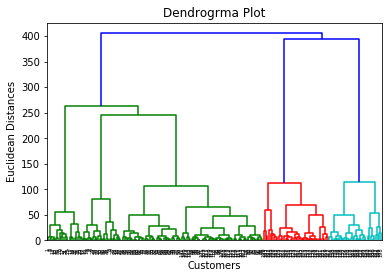

## Table of Contents

## What is Hierarchical Clustering in machine learning?

Hierarchical clustering is a method used in machine learning to group similar data points into clusters. It works by building a hierarchy of clusters either by merging smaller clusters into larger ones (called agglomerative) or by splitting larger clusters into smaller ones (called divisive). The process starts with each data point as its own cluster and then repeatedly merges or splits clusters based on their similarity until a single cluster containing all data points is formed or until a stopping criterion is met.

The similarity between clusters is often measured using a distance metric, such as Euclidean distance. A common way to visualize the results of hierarchical clustering is through a dendrogram, which is a tree-like diagram that shows the sequence of merges or splits. The height of the branches in the dendrogram represents the distance between clusters, helping to decide where to cut the tree to form the final clusters. This method is useful because it does not require the user to specify the number of clusters beforehand, making it flexible for various types of data and applications.

## How does Hierarchical Clustering differ from other clustering methods?

Hierarchical clustering differs from other clustering methods like K-means and DBSCAN in how it builds clusters and what it can show about the data. In hierarchical clustering, you start with each data point as its own cluster. Then, you keep joining the closest clusters together until you have one big cluster with all the points. This creates a tree-like structure called a dendrogram, which shows how clusters are related at different levels. This is useful because you can see the data at many levels of detail, and you don't need to decide how many clusters you want before you start. Other methods, like K-means, need you to pick the number of clusters first and then move points around to fit those clusters.

K-means clustering works differently. It starts by guessing where the centers of the clusters might be, then it moves those centers around to make the clusters better. Each point is put into the cluster with the closest center. K-means keeps doing this until the centers don't move much anymore. Unlike hierarchical clustering, K-means doesn't show how clusters are related at different levels; it just gives you the final clusters. DBSCAN is another method that groups points based on how close they are to each other, but it can find clusters of different shapes and sizes. It also doesn't need you to pick the number of clusters first, but it doesn't create a hierarchy like hierarchical clustering does.

In summary, hierarchical clustering is unique because it builds a hierarchy of clusters and can show the relationships between data points at different levels of detail. This is different from K-means, which needs a set number of clusters and focuses on the final grouping, and DBSCAN, which finds clusters based on density but doesn't create a hierarchy. Each method has its own strengths and is useful for different kinds of data and problems.

## What are the main types of Hierarchical Clustering?

Hierarchical clustering comes in two main types: agglomerative and divisive. Agglomerative clustering starts with each data point as its own cluster. It then keeps joining the closest clusters together until all points are in one big cluster. This process is like building a tree from the bottom up. You can see how the clusters grow by looking at a diagram called a dendrogram, which shows the steps of joining clusters. Agglomerative clustering is the most common type because it's easier to understand and use.

Divisive clustering works the opposite way. It starts with all the data points in one big cluster and then keeps splitting it into smaller clusters. This is like breaking a big tree into smaller branches. Divisive clustering can be harder to use because there are many ways to split a cluster, and choosing the best way can be tricky. But it can still be useful for some kinds of data where you want to see how the big group breaks down into smaller groups.

Both types of hierarchical clustering help you understand the relationships between data points at different levels. They don't need you to decide how many clusters you want before you start, which makes them flexible. You can use a dendrogram to pick the right number of clusters by cutting the tree at different heights.

## Can you explain the process of Agglomerative Hierarchical Clustering?

Agglomerative hierarchical clustering starts by treating each data point as its own cluster. Imagine you have a bunch of dots on a piece of paper, and each dot is a cluster by itself. The process then looks at how close these dots are to each other. It uses a distance measure, like the straight-line distance between two dots, to figure out which dots are closest. The two closest dots are then joined together to form a new cluster. This step is repeated over and over again, always joining the closest clusters together until all the dots are in one big cluster. This is like building a tree from the bottom up, where each branch represents a new cluster formed by joining two smaller clusters.

As the clusters are joined, a tree-like diagram called a dendrogram is created. The dendrogram shows how the clusters are related at different levels. Each time two clusters are joined, a new branch is added to the tree, and the height of this branch shows how far apart the clusters were when they were joined. You can use the dendrogram to decide how many clusters you want by cutting the tree at different heights. For example, if you cut the tree low, you will get more clusters with fewer dots in each, and if you cut it high, you will get fewer clusters with more dots in each. This way, you don't need to decide how many clusters you want before you start; you can choose the best number based on what the dendrogram shows.

## What is Divisive Hierarchical Clustering and how does it work?

Divisive hierarchical clustering is the opposite of agglomerative clustering. It starts with all the data points in one big group, like having all your dots on a piece of paper in one big circle. Then, it keeps splitting this big group into smaller groups, like breaking the big circle into smaller circles. This process is like breaking a big tree into smaller branches, starting from the top and working your way down.

The way divisive clustering works is by looking at how to split the big group in the best way. It uses a measure of how different the groups are after splitting to decide where to make the cut. Imagine you have a big group of dots, and you want to split them into two smaller groups. You would try different ways to split the dots and see which split makes the two groups as different as possible. This process is repeated, splitting the groups into smaller and smaller pieces until each dot is in its own group. Like agglomerative clustering, you can use a tree-like diagram called a dendrogram to see how the groups were split and decide how many groups you want by cutting the tree at different heights.

## How do you choose the right distance metric for Hierarchical Clustering?

Choosing the right distance metric for hierarchical clustering depends on the type of data you have and what you want to find out. If your data has numbers, like people's heights or weights, you might use the Euclidean distance. This is just the straight-line distance between two points. It works well when the differences between numbers are important. But if your data is more about how things are related, like if you're clustering animals based on their features, you might use a different metric, like the Jaccard distance, which looks at how similar sets of features are.

Sometimes, you might have data that's not just numbers, like words or categories. For this kind of data, you might use the Hamming distance, which counts how many positions are different between two strings of the same length. The choice of distance metric can change how your clusters look, so it's a good idea to try different metrics and see which one makes the most sense for your data. You can use a dendrogram to help you decide, because it shows how the clusters are formed at different levels.

## What are dendrograms and how are they used in Hierarchical Clustering?

A dendrogram is like a tree that shows how clusters are formed in hierarchical clustering. Imagine you're looking at a family tree, where you can see how people are related. In a dendrogram, you see how data points are grouped together. The bottom of the tree has all the individual data points, and as you move up, you see them being joined into bigger and bigger groups. The height of the branches in the dendrogram tells you how far apart the clusters were when they were joined together. If two branches join at a low height, it means those clusters were very similar, and if they join at a high height, it means they were less similar.

You can use a dendrogram to decide how many clusters you want. Imagine you have a big tree, and you can cut it at different heights. If you cut it low, you'll get more small branches, which means more clusters with fewer data points in each. If you cut it high, you'll get fewer big branches, which means fewer clusters with more data points in each. This way, you don't have to decide how many clusters you want before you start; you can look at the dendrogram and choose the best number based on how the tree looks.

## How do you determine the optimal number of clusters in Hierarchical Clustering?

To determine the optimal number of clusters in hierarchical clustering, you can use a dendrogram. A dendrogram is like a tree that shows how data points are grouped together. You start at the bottom of the tree, where each data point is its own cluster. As you move up the tree, you see clusters being joined together. The height of the branches in the dendrogram tells you how similar the clusters are when they are joined. If you see a big jump in the height of the branches, it means the clusters being joined are not very similar. You can cut the tree at this point to get the optimal number of clusters. For example, if you see a big jump after the third level, you might choose to have three clusters.

Another way to find the optimal number of clusters is by using a method called the elbow method. This method looks at how the within-cluster sum of squares changes as you increase the number of clusters. The within-cluster sum of squares is a measure of how spread out the data points are within each cluster. You plot this measure against the number of clusters and look for a point where the rate of decrease slows down sharply, forming an "elbow" in the plot. This point is where adding more clusters doesn't help much in reducing the spread within clusters, so it's a good place to stop. For example, if the elbow appears at four clusters, that might be your optimal number.

## What are some common linkage criteria used in Hierarchical Clustering?

In hierarchical clustering, linkage criteria are used to decide how to measure the distance between clusters when joining them together. The most common types of linkage criteria are single linkage, complete linkage, and average linkage. Single linkage measures the distance between the closest points in two clusters. This means it looks at the shortest distance between any two points, one from each cluster. Complete linkage does the opposite; it measures the distance between the farthest points in two clusters, looking at the longest distance between any two points. Average linkage takes the average distance between all pairs of points in the two clusters. Each type of linkage can change how the clusters are formed and what the final groups look like.

Single linkage can sometimes lead to long, stretched-out clusters because it focuses on the closest points. Imagine you have two groups of dots on a piece of paper, and you want to join them. If you use single linkage, you'll join them as soon as the closest dots in each group touch, even if the groups are far apart in other places. Complete linkage, on the other hand, can make more compact clusters because it waits until the farthest points in each group are close enough. This can be useful if you want to make sure all parts of the clusters are similar. Average linkage tries to balance these two by looking at the average distance, which can help avoid the problems of both single and complete linkage, but it might not work well if the clusters have different sizes or shapes.

## Can you discuss the advantages and disadvantages of Hierarchical Clustering?

Hierarchical clustering has some nice benefits. One big plus is that you don't have to decide how many groups you want before you start. You can use a tree-like picture called a dendrogram to see how the groups are made at different levels. This lets you pick the best number of groups by looking at where the tree branches out a lot. Another good thing is that it can show how things are related at different levels, which can be really helpful for understanding your data better. For example, if you're grouping animals, you can see not just the final groups but also how different animals are related to each other.

But hierarchical clustering also has some downsides. It can be slow, especially if you have a lot of data points. This is because it has to look at all the distances between points and groups many times. Also, once you join two groups together, you can't take it back, which can lead to mistakes if you join the wrong groups early on. This is different from other methods like K-means, where you can move points around to fix mistakes. Lastly, the way you measure distances and join groups can change your results a lot, so you need to be careful about choosing the right method for your data.

## How can Hierarchical Clustering be applied in real-world scenarios?

Hierarchical clustering is really useful in many real-world situations. For example, in biology, scientists use it to group similar species or genes together. Imagine you have a bunch of animals and you want to see how they are related. You can use hierarchical clustering to make a tree that shows which animals are most similar and how they are connected. This helps scientists understand how different species evolved and how they might be related. Another example is in marketing, where companies use it to group customers based on what they buy or how they behave. This helps them make better ads or products that fit different groups of people.

Another area where hierarchical clustering is helpful is in document analysis. If you have a lot of text documents, like news articles or emails, you can use hierarchical clustering to group them by topic. This makes it easier to find and organize information. For example, if you're looking at news articles, you can see which ones are about sports, which ones are about politics, and how these topics are connected. This can help journalists or researchers quickly understand what's being talked about in a big set of documents. So, whether it's grouping animals, customers, or documents, hierarchical clustering helps make sense of complex data in a way that's easy to understand.

## What are some advanced techniques or variations of Hierarchical Clustering used in research?

In research, one advanced technique of hierarchical clustering is called "Ward's method." This method is a bit different from the usual ways of joining clusters because it looks at how the total variance within clusters changes when two clusters are joined. The goal is to join clusters in a way that keeps the increase in variance as small as possible. This can help make clusters that are more compact and similar inside. Another advanced technique is "BIRCH," which stands for Balanced Iterative Reducing and Clustering using Hierarchies. BIRCH is good for handling big sets of data because it uses a special way to group points into small groups called "micro-clusters" first, and then it uses these to build the final clusters. This makes it faster to work with a lot of data.

Another interesting variation is "fuzzy hierarchical clustering," which lets data points belong to more than one cluster at the same time. This is useful when things can fit into different groups, like people who like both sports and music. The idea is to give each data point a score that shows how much it belongs to each cluster. This can be shown with a special kind of dendrogram that looks more like a web than a tree. Researchers also use "constrained hierarchical clustering," where they add rules or limits on how clusters can be formed. For example, you might want to make sure that certain points stay in the same cluster or that some points are never in the same cluster. This can help make the clustering fit better with what you know about the data.

## References & Further Reading

[1]: Murtagh, F., & Contreras, P. (2012). ["Algorithms for hierarchical clustering: an overview"](https://wires.onlinelibrary.wiley.com/doi/10.1002/widm.53). Wiley Interdisciplinary Reviews: Data Mining and Knowledge Discovery, 2(1), 86-97.

[2]: Jain, A. K., & Dubes, R. C. (1988). ["Algorithms for Clustering Data."](https://dl.acm.org/doi/10.5555/42779) Prentice Hall.

[3]: Rokach, L., & Maimon, O. (2005). ["Clustering Methods."](https://link.springer.com/chapter/10.1007/0-387-25465-X_15) In: The Data Mining and Knowledge Discovery Handbook. Springer.

[4]: Xu, R., & Wunsch, D. (2005). ["Survey of clustering algorithms"](https://www.researchgate.net/publication/3303538_Survey_of_Clustering_Algorithms). IEEE Transactions on Neural Networks, 16(3), 645-678.

[5]: Kaufman, L., & Rousseeuw, P. J. (2009). ["Finding Groups in Data: An Introduction to Cluster Analysis."](https://onlinelibrary.wiley.com/doi/book/10.1002/9780470316801) John Wiley & Sons.