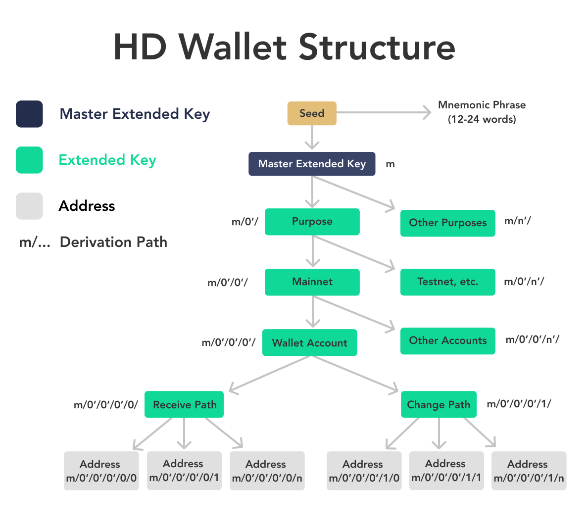

## Table of Contents

## What is a Hierarchical Deterministic (HD) wallet in cryptocurrency?

A Hierarchical Deterministic (HD) wallet is a type of cryptocurrency wallet that uses a single master seed to generate a tree-like structure of keys. This means you can create many different addresses and private keys from just one starting point. It's like having a family tree where the master seed is the grandparent, and all the other keys are the children and grandchildren. This makes managing your cryptocurrencies easier because you only need to remember one seed to access all your funds.

HD wallets are useful because they help keep your cryptocurrencies safe and organized. Since all keys come from one master seed, you can back up your wallet just by saving that one seed. If you lose your device or need to use a different one, you can restore your wallet and access all your funds with the master seed. This system also allows you to create new addresses for each transaction, which adds an extra layer of privacy and security.

## How does an HD wallet differ from a non-deterministic wallet?

An HD wallet and a non-deterministic wallet are different in how they create and manage keys. An HD wallet starts with a single master seed, which is like a special code. From this seed, the wallet can make lots of different keys and addresses. It's like a tree growing from one seed, with branches and leaves representing different keys. This makes it easy to keep everything organized because you only need to remember the master seed to access all your funds.

On the other hand, a non-deterministic wallet doesn't use a master seed. Instead, it creates each key and address separately, one at a time. It's like planting a new seed for each key you need. This can make it harder to keep track of everything because you have to save and protect each key individually. If you lose one key, you might lose access to the funds associated with that key.

In summary, HD wallets are easier to back up and manage because of the master seed, while non-deterministic wallets require more effort to keep everything safe and organized. HD wallets also offer better privacy because you can use a new address for each transaction, whereas non-deterministic wallets might reuse addresses, making your transactions easier to trace.

## What are the key benefits of using an HD wallet?

Using an HD wallet makes managing your cryptocurrencies much simpler. You only need to remember one master seed to access all your funds. This master seed is like a special code that can create many different keys and addresses. So, if you lose your device or want to use a different one, you can easily restore your wallet with this one seed. It's like having a magic key that opens all your doors.

HD wallets also help keep your transactions private and secure. You can create a new address for each transaction, which makes it harder for others to track your activities. This is better than using the same address over and over, which can make your transactions easier to trace. Plus, since all your keys come from one master seed, it's easier to back up your wallet and keep it safe.

## How does the structure of an HD wallet work?

An HD wallet is like a family tree for your [cryptocurrency](/wiki/cryptocurrency) keys. It starts with a single master seed, which is like the grandparent of the family. From this master seed, the wallet can create a main key, which is like the parent. Then, from this main key, the wallet can create many child keys, which are like the children in the family. Each of these child keys can also create their own set of grandchild keys. This way, you can have a whole tree of keys and addresses, all coming from that one master seed.

The structure of an HD wallet makes it easy to manage your cryptocurrencies. Because all the keys come from one master seed, you only need to remember this one seed to access all your funds. If you need to move your wallet to a new device, you just use the master seed to restore it. Plus, you can create a new address for each transaction, which helps keep your activities private and secure. It's like having a big family where everyone is connected but can still do their own thing.

## What is a seed phrase and how is it used in HD wallets?

A seed phrase, also known as a mnemonic seed, is a list of words that acts like a special code for your HD wallet. It's usually made up of 12, 18, or 24 words that you get when you first set up your wallet. This seed phrase is very important because it's the master key to all your cryptocurrency. If you lose your device or want to use a different one, you can use this seed phrase to get back all your funds. It's like a secret password that opens the door to your digital money.

When you use an HD wallet, the seed phrase helps create all the keys and addresses you need. From this one set of words, the wallet can make a tree-like structure of keys, with the seed phrase as the starting point. This means you can have many different addresses for your transactions, but you only need to remember the seed phrase to access them all. It's a simple way to keep your cryptocurrencies safe and organized, as long as you keep the seed phrase secure and don't share it with anyone.

## How can you generate multiple addresses from a single seed in an HD wallet?

An HD wallet uses a special code called a seed phrase to create many different addresses for your cryptocurrency. When you first set up your wallet, it gives you this seed phrase, which is usually a list of 12, 18, or 24 words. From this seed phrase, the wallet can make a main key, and then from this main key, it can create many child keys. Each child key can also make its own set of grandchild keys. It's like a family tree where the seed phrase is the grandparent, and all the keys and addresses are the children and grandchildren.

This structure makes it easy to manage your cryptocurrencies because you only need to remember the seed phrase to access all your funds. If you need to use a new device, you can restore your wallet with the seed phrase and get back all your keys and addresses. Plus, you can create a new address for each transaction, which helps keep your activities private and secure. It's like having a big family where everyone is connected but can still do their own thing, all from that one special seed phrase.

## What is the BIP32 standard and how does it relate to HD wallets?

The BIP32 standard, which stands for Bitcoin Improvement Proposal 32, is a set of rules that help create and manage keys in HD wallets. It's like a guidebook that tells the wallet how to make a tree-like structure of keys from one starting point, called the master seed. This standard makes it easier for different types of wallets to work together and for users to manage their cryptocurrencies because they only need to remember one master seed to access all their funds.

BIP32 is important for HD wallets because it helps keep your cryptocurrencies safe and organized. By following the BIP32 standard, an HD wallet can create many different keys and addresses from the master seed. This means you can use a new address for each transaction, which adds an extra layer of privacy and security. If you lose your device or want to use a different one, you can restore your wallet with the master seed and get back all your funds.

## What are the security considerations when using an HD wallet?

When using an HD wallet, it's very important to keep your seed phrase safe. The seed phrase is like a special code that lets you access all your cryptocurrency. If someone else finds out your seed phrase, they could take all your money. So, you should write it down and keep it in a safe place, like a locked drawer or a safe. Don't take a picture of it or save it on your computer because hackers could find it. It's also a good idea to make a few copies and keep them in different safe places, just in case something happens to one of them.

Another thing to think about is protecting your wallet from malware and phishing attacks. Malware is bad software that can steal your information, and phishing attacks are when someone tries to trick you into giving them your private information. To stay safe, always download your wallet from a trusted source and keep your computer's security software up to date. Be careful when clicking on links or opening emails, especially if they ask for your seed phrase or private keys. By taking these steps, you can help keep your HD wallet and your cryptocurrency safe.

## How does key derivation work in HD wallets?

Key derivation in HD wallets is like growing a tree from a single seed. It all starts with a master seed, which is a special code that you get when you first set up your wallet. From this master seed, the wallet creates a main key, which is like the trunk of the tree. Then, from this main key, the wallet can create many child keys, like branches growing from the trunk. Each of these child keys can also make their own set of grandchild keys, like smaller branches or leaves. This way, you can have a whole tree of keys and addresses, all coming from that one master seed.

The process of creating these keys follows a set of rules called the BIP32 standard. This standard tells the wallet exactly how to turn the master seed into all those different keys and addresses. It's like a recipe that the wallet follows to make sure everything is done correctly. By using this method, you can create a new address for each transaction, which helps keep your activities private and secure. Plus, if you ever need to move your wallet to a new device, you can use the master seed to restore it and get back all your keys and addresses.

## What is the role of hardened derivation in HD wallets?

Hardened derivation is like an extra layer of security in HD wallets. It helps keep your master seed safe by making sure that if someone gets one of your child keys, they can't figure out the master seed. When you use hardened derivation, the wallet creates child keys in a special way that doesn't share as much information about the master seed. It's like putting a lock on the path from the child keys back to the master seed, making it much harder for someone to break in.

This is really important because if someone could work backwards from a child key to the master seed, they could take all your cryptocurrency. By using hardened derivation, you add an extra step that makes it much harder for anyone to steal your funds. It's like having a secret code that only you know, and even if someone finds one part of it, they can't use it to unlock everything. So, hardened derivation helps keep your HD wallet and your money safe and secure.

## How can HD wallets be integrated with other blockchain technologies?

HD wallets can be integrated with other blockchain technologies to make managing different types of cryptocurrencies easier. Since HD wallets use a single master seed to create many keys and addresses, you can use the same wallet to handle different blockchains. For example, if you have cryptocurrencies on the Bitcoin and Ethereum blockchains, an HD wallet can generate addresses for both, all from the same seed phrase. This makes it simpler to keep track of your funds across different blockchains without needing multiple wallets.

Integration also helps with interoperability between different blockchain systems. By using the same HD wallet, you can easily move assets between blockchains that support HD wallet standards like BIP32. This is useful for decentralized applications (dApps) that might need to interact with multiple blockchains. For example, a dApp could use an HD wallet to manage tokens on one blockchain and then use the same wallet to interact with smart contracts on another blockchain. This seamless integration makes the user experience smoother and more efficient.

## What are some advanced features and future developments expected in HD wallet technology?

HD wallets are getting more advanced with new features that make them even better at keeping your cryptocurrencies safe and easy to use. One cool feature is multi-signature support, which means you can set up your wallet so that it needs more than one person to agree before moving any money. This is like having a safe that needs multiple keys to open, making it much harder for someone to steal your funds. Another feature is the ability to work with different blockchains at the same time. This means you can use one HD wallet to manage all your cryptocurrencies, no matter which blockchain they're on. It's like having one key that works for all your different doors.

In the future, HD wallets might get even more advanced with things like better privacy features. For example, they could use special techniques to hide your transactions even more, making it really hard for anyone to track what you're doing with your money. Another exciting development could be integration with smart contracts, which are like digital agreements that can automatically do things when certain conditions are met. This could make it easier to use your HD wallet for all sorts of new and interesting things, like automatically paying bills or investing in new projects. As technology keeps growing, HD wallets will keep getting better and more useful for everyone.

## What is a Hierarchical Deterministic (HD) Wallet?

A Hierarchical Deterministic (HD) Wallet is designed to enhance cryptocurrency security and simplify management. At its core, an HD wallet leverages a single master seed to generate an entire tree of key pairs. This is achieved through a deterministic process, allowing users to produce and manage multiple cryptographic keys from the start point provided by the seed.

The primary advantage of HD wallets lies in their ability to enhance security while maintaining ease of use. By using a single seed, which acts as a root, HD wallets structurally create branches of keys. This feature is particularly beneficial as it allows users to manage multiple transaction keys without the need to store each one individually. For example, when a new public key is required for a transaction, the wallet can quickly derive it from the master seed using a consistent and secure algorithm.

The backup process for HD wallets is notably simplified, as the entire set of keys originating from the wallet can be regenerated using the single master seed phrase. This phrase, often represented by a series of mnemonic words (usually 12 to 24 words), is crucial for recovery. In the event of a device loss or failure, the wallet's contents can be completely restored by re-entering the seed phrase into a compatible application.

Mathematically, the generation of keys in HD wallets typically relies on elliptic curve operations. Using the standard BIP32 (Bitcoin Improvement Proposal 32) protocol, an HD wallet derives child keys from a parent key using the formula:

$$
\text{ChildKey} = \text{HMAC-SHA512}(\text{ParentKey} + \text{Index})
$$

This ensures each resulting key is unique and securely tied to its parent key. Python libraries such as “ethereum” and “bitcoinlib” often provide functionality to handle such operations, offering developers the ability to implement hierarchical deterministic structures into their wallet applications.

Overall, HD wallets provide a robust framework that balances security and convenience, making them a preferred choice in the cryptocurrency ecosystem.

## References & Further Reading

[1]: Antonopoulos, A. M. (2017). ["Mastering Bitcoin: Unlocking Digital Cryptocurrencies"](https://books.google.com/books/about/Mastering_Bitcoin.html?id=IXmrBQAAQBAJ) (2nd Edition). O'Reilly Media.

[2]: Bitcoin Improvement Proposals. ["BIP 32 - Hierarchical Deterministic Wallets."](https://bips.dev/32/) GitHub. 

[3]: Narayanan, A., Bonneau, J., Felten, E., Miller, A., & Goldfeder, S. (2016). ["Bitcoin and Cryptocurrency Technologies: A Comprehensive Introduction."](https://press.princeton.edu/books/hardcover/9780691171692/bitcoin-and-cryptocurrency-technologies) Princeton University Press.

[4]: Bonneau, J., Miller, A., Clark, J., Narayanan, A., Kroll, J., & Felten, E. (2015). ["SoK: Research Perspectives and Challenges for Bitcoin and Cryptocurrencies."](https://ieeexplore.ieee.org/document/7163021) IEEE Symposium on Security and Privacy.

[5]: Bitcoin Wiki. ["Deterministic Wallet."](https://bitcoinwiki.org/wiki/deterministic-wallet) 

[6]: O'Reilly Media. ["Mastering Ethereum: Building Smart Contracts and DApps"](https://www.amazon.com/Mastering-Ethereum-Building-Smart-Contracts/dp/1491971940) by Andreas M. Antonopoulos and Gavin Wood.

[7]: Binance Academy. ["What Is a Cryptocurrency Wallet?"](https://academy.binance.com/en/articles/crypto-wallet-types-explained)

[8]: Campanelli, M., & Reyna, A. (2019). ["Bitcoin and Blockchain Security."](https://arxiv.org/abs/1904.11435) Springer.

[9]: Mougayar, W. (2016). ["The Business Blockchain: Promise, Practice, and Application of the Next Internet Technology."](https://books.google.com/books/about/The_Business_Blockchain.html?id=CEsPDAAAQBAJ) Wiley.