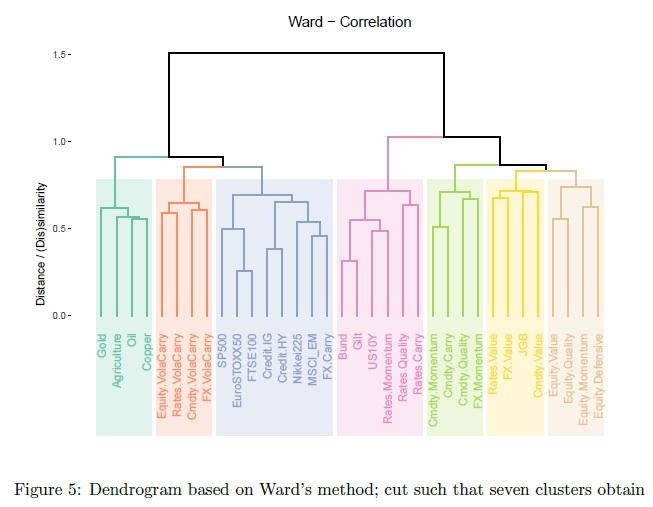

## Table of Contents

## What is the Hierarchical Risk Parity (HRP) approach?

The Hierarchical Risk Parity (HRP) approach is a way to build investment portfolios that aims to balance risk across different assets. Instead of using traditional methods that might rely heavily on predictions about how assets will perform, HRP focuses on the relationships between assets. It does this by grouping assets into a tree-like structure based on how similar their returns are. This helps to spread out risk more evenly, so no single asset or group of assets dominates the portfolio's risk.

HRP is useful because it doesn't need a lot of guesses about the future. Traditional methods often use complex models to predict how assets will move, but these can be wrong and lead to big mistakes. HRP, on the other hand, looks at past data to understand how assets have moved together. By organizing assets in a hierarchy, HRP can create a portfolio that is more stable and less likely to be thrown off by unexpected events. This makes it a popular choice for investors who want to manage risk without relying too much on predictions.

## How does HRP differ from traditional risk parity methods?

HRP and traditional risk parity methods both aim to balance risk across a portfolio, but they do it in different ways. Traditional risk parity methods often use complex models to predict how assets will perform in the future. They try to figure out the best way to spread risk by looking at things like expected returns and how assets move together. This can work well if the predictions are right, but if they're wrong, it can lead to big problems.

HRP, on the other hand, doesn't rely on these predictions. Instead, it looks at how assets have moved together in the past. HRP groups assets into a tree-like structure based on how similar their returns are. This helps to spread out risk more evenly without needing to guess about the future. By focusing on the relationships between assets, HRP can create a more stable portfolio that is less likely to be affected by unexpected events.

## What are the main steps involved in implementing the HRP approach?

To implement the Hierarchical Risk Parity (HRP) approach, you start by gathering data on the returns of the assets you want to include in your portfolio. You then calculate how similar the returns of these assets are to each other. This is done using a measure called correlation. Once you have the correlations, you use a method called clustering to group the assets into a tree-like structure. This structure shows which assets are most similar and which are least similar.

After you have the tree, you start at the bottom and work your way up. You pair the assets or groups of assets that are most similar and calculate the risk for each pair. You then move up the tree, combining pairs into larger groups and recalculating the risk at each step. This process continues until you reach the top of the tree, where you have one big group that represents your whole portfolio. The final step is to allocate your money across the assets in a way that balances the risk evenly across the portfolio. This means that no single asset or group of assets will have too much influence on the overall risk of the portfolio.

## What is the role of clustering in the HRP method?

Clustering plays a big role in the HRP method. It helps to group assets based on how similar their returns are. Imagine you have a bunch of different investments, like stocks and bonds. Clustering looks at how these investments move together over time. It then puts the ones that move in similar ways into groups. This helps to create a picture of how all the investments relate to each other, kind of like a family tree.

Once the assets are grouped, the HRP method uses this tree to figure out how to spread risk evenly across the portfolio. It starts at the bottom of the tree with the smallest groups and works its way up. At each step, it combines groups and calculates the risk. By the time it reaches the top of the tree, it has a clear plan for how to allocate money to each asset. This way, the risk is balanced and no single asset or group can cause big problems for the whole portfolio.

## How does HRP use a hierarchical tree structure to allocate assets?

The HRP method uses a hierarchical tree structure to organize assets based on how similar their returns are. It starts by looking at the past performance of each asset and figuring out which ones move together. Then, it groups these assets into a tree, where the most similar assets are at the bottom and the least similar are at the top. This tree helps to show the relationships between all the assets in the portfolio.

Once the tree is built, HRP works from the bottom up to figure out how to spread risk evenly. It begins with the smallest groups at the bottom of the tree and combines them step by step, calculating the risk at each level. As it moves up the tree, it keeps balancing the risk until it reaches the top, where it has a plan for how to allocate money to each asset. This way, the portfolio's risk is spread out, and no single asset or group can cause big problems.

## What are the advantages of using HRP over other portfolio optimization techniques?

One big advantage of using HRP over other portfolio optimization techniques is that it doesn't rely on predictions about the future. Many other methods use complex models to guess how assets will perform, but these guesses can be wrong and lead to big mistakes. HRP, on the other hand, looks at how assets have moved together in the past. By focusing on past data and relationships between assets, HRP can create a more stable portfolio that is less likely to be thrown off by unexpected events.

Another advantage is that HRP can handle a lot of different assets without getting too complicated. Traditional methods can become hard to manage when you add more assets because they need more predictions and calculations. HRP, however, uses a tree-like structure to organize assets, making it easier to balance risk even with a large number of assets. This makes HRP a good choice for investors who want to manage risk without a lot of guesswork and complexity.

## Can you explain the mathematical foundation behind the HRP approach?

The HRP approach is built on the idea of using past data to understand how assets move together, rather than making predictions about the future. To start, HRP looks at the returns of different assets and calculates how similar these returns are. This is done using a measure called correlation. Once the correlations are known, HRP uses a method called clustering to group the assets into a tree-like structure. This tree shows which assets are most similar at the bottom and least similar at the top. By organizing assets this way, HRP can see the relationships between them clearly.

After the tree is built, HRP starts at the bottom and works its way up. It pairs the most similar assets or groups and calculates the risk for each pair. As it moves up the tree, it keeps combining pairs into larger groups and recalculates the risk at each step. This process continues until it reaches the top of the tree, where it has one big group that represents the whole portfolio. The final step is to allocate money across the assets in a way that balances the risk evenly. This means no single asset or group will have too much influence on the overall risk of the portfolio. By focusing on past data and relationships, HRP creates a more stable and less risky portfolio.

## How does HRP handle the problem of estimation error in portfolio optimization?

HRP handles the problem of estimation error in portfolio optimization by not relying on predictions about the future. Many traditional methods use complex models to guess how assets will perform, but these guesses can be wrong. If the guesses are off, it can lead to big mistakes in the portfolio. HRP, on the other hand, looks at how assets have moved together in the past. By focusing on past data and the relationships between assets, HRP avoids the need for these risky predictions.

HRP uses a method called clustering to group assets based on how similar their returns are. It builds a tree-like structure where the most similar assets are at the bottom and the least similar are at the top. This structure helps HRP to see how all the assets relate to each other. By starting at the bottom of the tree and working its way up, HRP can balance risk evenly across the portfolio. This way, even if there are small errors in the past data, they won't cause big problems because the risk is spread out.

## What types of assets are best suited for the HRP approach?

The HRP approach works well with many different types of assets, like stocks, bonds, and commodities. It is especially good for portfolios that have a lot of different kinds of assets because it can handle complexity well. HRP doesn't need to guess about the future, so it is great for assets that are hard to predict, like stocks in new industries or emerging markets.

Another type of asset that HRP works well with is those that have a lot of historical data. Since HRP looks at how assets have moved together in the past, having good data helps it make better decisions. This means HRP can be used for well-established assets like major stock indexes or government bonds, where there is a lot of past information available.

## How can HRP be applied in different market conditions?

The HRP approach is really good at handling different market conditions because it doesn't try to guess what will happen in the future. Instead, it looks at how assets have moved together in the past. This means that whether the market is going up, down, or staying the same, HRP can still work well. It focuses on spreading risk evenly across all the assets in the portfolio, so no matter what the market does, the portfolio stays balanced and stable.

In a bull market, where prices are going up, HRP can help make sure that the portfolio doesn't get too focused on just a few assets that are doing really well. This helps to keep the risk spread out. In a bear market, where prices are falling, HRP can protect the portfolio by making sure that no single asset or group of assets causes big losses. Even in sideways markets, where prices are not moving much, HRP keeps the portfolio steady by balancing risk. This makes HRP a good choice for investors who want to manage their portfolios well no matter what the market is doing.

## What are some practical considerations and challenges when implementing HRP in real-world scenarios?

When you want to use HRP in the real world, one big thing to think about is getting good data. HRP needs a lot of past information about how assets have moved to work well. If the data is not good or not enough, it can make the portfolio less balanced. Also, you have to keep updating the data because the way assets move together can change over time. This means you need to keep an eye on the portfolio and make changes when needed.

Another challenge is that HRP can be a bit tricky to explain to people who are not experts. It uses a special way of grouping assets that might be hard for some investors to understand. This can make it harder to convince others to use HRP. Also, while HRP is good at spreading risk evenly, it might not always give the best returns. Some investors might want to take more risk for the chance of bigger gains, so you need to think about what the investors want and balance that with the benefits of HRP.

## How can the performance of an HRP portfolio be evaluated and compared to other strategies?

To evaluate the performance of an HRP portfolio, you can look at things like how much money it makes, how much risk it takes, and how steady its returns are over time. One way to do this is by using measures like the Sharpe Ratio, which compares the return of the portfolio to the risk it takes. A higher Sharpe Ratio means the portfolio is doing a good job of making money for the amount of risk it's taking. You can also look at the portfolio's [volatility](/wiki/volatility-trading-strategies), which shows how much the returns go up and down. If the HRP portfolio has lower volatility compared to other portfolios, it means it's more stable.

To compare an HRP portfolio to other strategies, you can look at the same measures for both. For example, you might compare the HRP portfolio to a traditional risk parity portfolio or a simple equal-weight portfolio. You can see how each one does in terms of returns, risk, and stability. It's also a good idea to look at how each portfolio does in different market conditions, like when the market is going up or down. By doing this, you can see if the HRP portfolio is better at handling different situations than the other strategies.

## References & Further Reading

[1]: López de Prado, M. (2018). ["Advances in Financial Machine Learning."](https://books.google.com/books/about/Advances_in_Financial_Machine_Learning.html?id=oU9KDwAAQBAJ) Wiley.

[2]: Roncalli, T. (2013). ["Introduction to Risk Parity and Budgeting."](https://papers.ssrn.com/sol3/papers.cfm?abstract_id=2272973) CRC Press.

[3]: Jansen, S. (2020). ["Machine Learning for Algorithmic Trading."](https://github.com/stefan-jansen/machine-learning-for-trading) Packt Publishing.

[4]: Chan, E. P. (2009). ["Quantitative Trading: How to Build Your Own Algorithmic Trading Business."](https://github.com/ftvision/quant_trading_echan_book) Wiley.

[5]: Simon, D. (2015). ["Too Big to Ignore: The Business Case for Big Data (Wiley and SAS Business Series)."](https://www.philsimon.com/books/too-big-to-ignore/) Wiley.