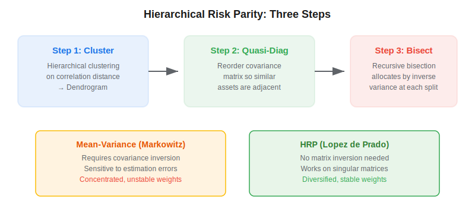
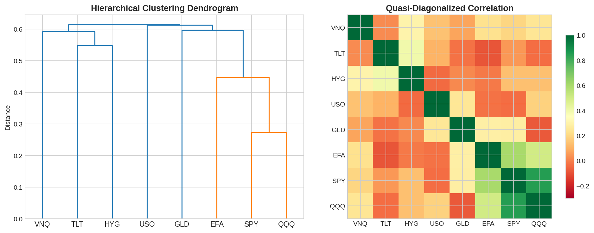

Hierarchical Risk Parity (HRP) is a portfolio optimization technique developed by Marcos Lopez de Prado (2016) that uses machine learning — specifically hierarchical clustering — to allocate capital across assets. Unlike traditional mean-variance optimization (Markowitz, 1952), HRP does not require inverting the covariance matrix, making it robust to estimation errors and applicable even to singular or ill-conditioned matrices. Monte Carlo experiments show that HRP delivers lower out-of-sample variance than the [Critical Line Algorithm](https://paperswithbacktest.com/wiki/critical-line-algorithm-cla), despite the fact that minimizing variance is CLA's explicit optimization objective.

## What Is Hierarchical Risk Parity?

Mean-variance optimization (MVO) has a well-known problem: it is extremely sensitive to small changes in input estimates. A tiny perturbation in the covariance matrix can flip portfolio weights entirely, producing concentrated, unstable allocations. This happens because MVO requires inverting the covariance matrix — and when assets are highly correlated, that matrix is nearly singular and the inversion amplifies noise.

HRP sidesteps this problem by exploiting the hierarchical structure of correlations. Instead of treating all pairwise relationships as equally important, HRP groups similar assets into clusters and allocates risk within and across clusters using a recursive bisection procedure. The result is a more diversified portfolio where errors in one part of the tree do not propagate to unrelated branches.



## How HRP Works: Three Steps

### Step 1 — Tree Clustering

Compute a distance matrix from the correlation matrix:

$$d_{i,j} = \sqrt{\frac{1}{2}(1 - \rho_{i,j})}$$

where $\rho_{i,j}$ is the Pearson correlation between assets $i$ and $j$. Apply hierarchical agglomerative clustering (single-linkage or Ward's method) to produce a dendrogram — a tree structure that encodes how assets relate to each other.

### Step 2 — Quasi-Diagonalization

Reorder the rows and columns of the covariance matrix according to the dendrogram's leaf ordering. This places highly correlated assets adjacent to each other, making the matrix approximately block-diagonal. The reordering is critical — it ensures that the recursive bisection in Step 3 splits assets into groups that are internally correlated but externally diversified.



### Step 3 — Recursive Bisection

Starting with all assets as one group, recursively split the ordered list in half. At each split, allocate weight between the two sub-groups based on their inverse variance:

$$\alpha = 1 - \frac{V_1}{V_1 + V_2}$$

where $V_1$ and $V_2$ are the cluster variances of each sub-group. The group with lower variance receives more weight. This continues recursively until each "cluster" is a single asset.

## Python Implementation

```python
import numpy as np
import pandas as pd
from scipy.cluster.hierarchy import linkage, leaves_list
from scipy.spatial.distance import squareform

def hrp_portfolio(returns):
    """
    Compute HRP portfolio weights from a returns DataFrame.

    Parameters
    ----------
    returns : pd.DataFrame
        T x N matrix of asset returns (columns = assets).

    Returns
    -------
    pd.Series
        Portfolio weights indexed by asset names.
    """
    cov = returns.cov()
    corr = returns.corr()

    # Step 1: Tree clustering
    dist = np.sqrt(0.5 * (1 - corr))
    np.fill_diagonal(dist.values, 0)
    condensed = squareform(dist.values)
    link = linkage(condensed, method="single")

    # Step 2: Quasi-diagonalization
    sort_idx = list(leaves_list(link))
    sorted_tickers = [corr.columns[i] for i in sort_idx]

    # Step 3: Recursive bisection
    weights = pd.Series(1.0, index=sorted_tickers)
    cluster_items = [sorted_tickers]

    while len(cluster_items) > 0:
        cluster_items = [
            c[j:k]
            for c in cluster_items
            for j, k in ((0, len(c) // 2), (len(c) // 2, len(c)))
            if len(c) > 1
        ]
        for i in range(0, len(cluster_items), 2):
            left = cluster_items[i]
            right = cluster_items[i + 1]
            left_var = get_cluster_var(cov, left)
            right_var = get_cluster_var(cov, right)
            alpha = 1 - left_var / (left_var + right_var)
            weights[left] *= alpha
            weights[right] *= (1 - alpha)

    return weights / weights.sum()


def get_cluster_var(cov, tickers):
    """Compute variance of the inverse-variance portfolio within a cluster."""
    sub_cov = cov.loc[tickers, tickers].values
    ivp = 1.0 / np.diag(sub_cov)
    ivp /= ivp.sum()
    return float(ivp @ sub_cov @ ivp)


# Example: 8 ETFs
np.random.seed(42)
tickers = ["SPY", "QQQ", "EFA", "TLT", "GLD", "VNQ", "HYG", "USO"]
n_days, n_assets = 504, len(tickers)
returns = pd.DataFrame(
    np.random.normal(0.0004, 0.012, (n_days, n_assets)),
    columns=tickers,
)
# Add correlation structure
returns["QQQ"] += 0.6 * returns["SPY"]
returns["EFA"] += 0.3 * returns["SPY"]

weights = hrp_portfolio(returns)
print("HRP Weights:")
print(weights.round(4))
```

## HRP vs. Mean-Variance vs. Inverse Variance

| Property | Mean-Variance (CLA) | Inverse Variance (IVP) | HRP |
|---|---|---|---|
| Requires covariance inversion | Yes | No (diagonal only) | No |
| Uses correlation structure | Yes | No | Yes |
| Works on singular matrices | No | Yes | Yes |
| Out-of-sample variance | Highest | Medium | Lowest |
| Weight stability over time | Low | High | High |
| Diversification | Poor (concentrated) | Moderate | Best |

Lopez de Prado's Monte Carlo experiments show that HRP improves the out-of-sample Sharpe ratio of a CLA strategy by approximately 31% while also reducing variance by over 70% relative to CLA. Even compared to inverse-variance portfolios, which assume a diagonal covariance, HRP's variance was about 38% lower.

## Key Parameters and Extensions

| Parameter | Options | Effect |
|---|---|---|
| Linkage method | single, ward, complete, average | Ward tends to produce more balanced dendrograms; single is more sensitive to chaining |
| Distance metric | $\sqrt{0.5(1-\rho)}$ or custom | Alternative distances (e.g., mutual information) can capture non-linear dependencies |
| Risk measure | Variance, CVaR, CDaR | Riskfolio-Lib supports 22 risk measures for HRP allocation |
| Rebalancing frequency | Daily, weekly, monthly | More frequent = better alignment but higher transaction costs |

Libraries like **PyPortfolioOpt** (`HRPOpt`) and **Riskfolio-Lib** provide production-ready HRP implementations with additional features like custom risk measures and sector constraints.

## Limitations and Risks

HRP is not without drawbacks. It ignores expected returns entirely — it is a risk-only allocation method, which means it cannot tilt toward high-conviction opportunities. The single-linkage clustering step can produce long chains that group unrelated assets (the "chaining" effect), though Ward's method mitigates this. Transaction costs from frequent rebalancing can erode the out-of-sample advantage, especially in large portfolios. Finally, HRP still depends on the correlation estimate, which itself is noisy in small samples.

## Conclusion

Hierarchical Risk Parity is one of the most widely adopted innovations from Lopez de Prado's research. By replacing matrix inversion with tree-based clustering, HRP produces diversified portfolios that are more stable and perform better out-of-sample than classical Markowitz optimization. For algo traders building [portfolio allocation strategies](https://paperswithbacktest.com/wiki/all-weather-portfolio), HRP offers a principled, ML-driven alternative that is easy to implement and scales well.

---

**Explore further on PapersWithBacktest:**
- Browse [backtested portfolio allocation strategies](https://paperswithbacktest.com/strategies) with Python code and performance metrics
- Access [clean historical market data](https://paperswithbacktest.com/datasets) for equities, crypto, and futures
- Take the [algo trading course](https://paperswithbacktest.com/course) — 60+ video lessons and notebooks
- Related wiki pages: [Critical Line Algorithm (CLA)](https://paperswithbacktest.com/wiki/critical-line-algorithm-cla) · [All-Weather Portfolio](https://paperswithbacktest.com/wiki/all-weather-portfolio) · [Probabilistic Sharpe Ratio](https://paperswithbacktest.com/wiki/probabilistic-sharpe-ratio-psr)
