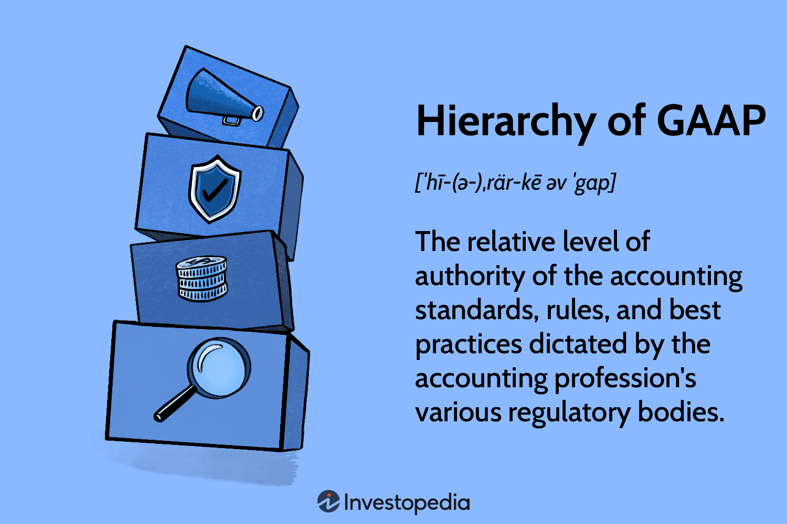

The intersection of accounting standards and financial reporting with algorithmic trading represents a formidable evolution in the financial industry. This evolution highlights the need for integrating regulatory frameworks with advanced trading technologies to ensure reliable financial processes. Understanding accounting frameworks such as Generally Accepted Accounting Principles (GAAP) is crucial, as these standards ensure transparency and consistency in financial documentation. They provide a systematic methodology for creating standardized financial reports, thereby bolstering investor confidence and enabling informed decision-making.

Algorithmic trading, on the other hand, is reshaping the way trades are executed by drastically enhancing speed and precision through computational prowess. This trading methodology utilizes complex algorithms to automate trading processes, which significantly reduces human error and operational costs while increasing execution efficiency. The algorithms used can analyze vast datasets in real-time, making rapid decisions based on pre-defined criteria without human intervention.

This article will explore how these seemingly disparate elements synergize to influence modern financial markets. Key aspects to be examined include the roles of accounting standards in ensuring financial transparency and how these standards impact algorithmic trading strategies. An essential focus will be on understanding how standardized accounting frameworks can be integrated with the real-time demands of algorithmic trading, subsequently influencing market dynamics and trading performance.

Consequently, the exploration of these interactions aims to shed light on how harmonizing accounting principles with technological innovations not only improves the integrity of financial reporting but also enhances the operational efficiency of trading systems. This alignment is essential for maintaining regulatory compliance and fostering innovation within global financial markets. As such, the synergy between accounting standards and algorithmic trading represents a pivotal area of focus for modern financial management and strategic decision-making.

## Table of Contents

## Understanding GAAP and Accounting Standards

Generally Accepted Accounting Principles (GAAP) serve as the cornerstone for financial accounting and reporting standards in the United States, providing a crucial framework that ensures uniformity and reliability in financial statements. These principles are essential for businesses, accountants, and investors, as they establish best practices and guidelines that facilitate clear communication of financial information. The consistency and comparability fostered by GAAP make it possible for stakeholders to make informed decisions based on financial statements that accurately reflect a company's economic activities and performance.

The structural hierarchy of GAAP is key to understanding its application and effectiveness. At the top of this hierarchy is the Financial Accounting Standards Board (FASB), a private entity tasked with establishing and updating financial accounting and reporting standards. The guidelines issued by FASB are designed to ensure that financial reporting remains both relevant and reliable in an ever-evolving economic landscape. Mastering the hierarchy and application of these standards is crucial for professionals tasked with accurate financial reporting.

Adopting GAAP standards is critical not only for maintaining investor confidence but also for ensuring compliance with regulatory requirements. Investors rely heavily on standardized financial statements to assess risk and make investment decisions. Transparency facilitated by GAAP mitigates the risk of manipulation or misinterpretation of financial data, fostering trust in the markets. Furthermore, adherence to GAAP is typically mandated by regulatory bodies, cementing its role as a non-negotiable aspect of financial reporting for publicly traded companies.

However, the integration of GAAP standards with dynamic trading environments, such as [algorithmic trading](/wiki/algorithmic-trading), introduces unique challenges. Algorithmic trading, characterized by the high-speed execution of trades based on pre-defined strategies, often demands near-instantaneous financial data processing. Traditional financial reporting processes governed by GAAP, which are typically periodic and retrospective, may struggle to keep pace with these rapid transactional environments.

Moreover, reconciling the historical cost basis often used in GAAP with the real-time valuations required in algorithmic trading requires significant adjustments and innovations in financial reporting processes. As such, financial professionals must continuously adapt and evolve their practices to address the gaps between established accounting standards and the fast-paced world of algorithmic trading. This includes employing new technologies and methodologies that provide the speed and accuracy required to maintain both compliance and competitive advantage.

## The Role of Accounting Standards in Financial Reporting

Accounting standards such as Generally Accepted Accounting Principles (GAAP) are fundamental in ensuring that financial statements provide a true and fair representation of a company's financial status. These standards are essential for maintaining consistency in financial reporting, enabling stakeholders to confidently assess and compare the financial health of different companies.

One of the main functions of accounting standards is to provide consistent methodologies for inventory valuation—a crucial component in financial comparability. Inventory valuation methods under GAAP, such as First In, First Out (FIFO) and Last In, First Out (LIFO), determine the cost of goods sold and ending inventory values, directly impacting a company's financial results. By employing standardized valuation methods, companies ensure that inventory measurement is comparable across periods and organizations, providing clarity and reliability in financial reporting.

In a global context, GAAP and International Financial Reporting Standards (IFRS) each bring unique advantages and challenges to financial reporting. GAAP is predominantly used in the United States and emphasizes detailed rules, providing a comprehensive and structured framework that aids in compliance and precision. However, IFRS, commonly adopted outside the U.S., offers principles-based guidelines that allow for greater flexibility and adaptability in varied financial environments. This dichotomy presents both challenges and opportunities for multinational corporations that operate under multiple regulatory regimes. For instance, a company listed in both the U.S. and Europe must navigate the reconciliation of GAAP’s detailed standards with IFRS’s broader principles.

In algorithmic trading, the accuracy and reliability of financial reporting are critical. Traders and algorithms depend heavily on precise financial data to develop and validate trading strategies. Inaccurate or inconsistent financial reports could lead to misguided strategies and potentially substantial financial loss. Therefore, rigorous adherence to accounting standards ensures that the data used in trading algorithms is both accurate and reliable, ultimately influencing decision-making processes.

Effective financial reporting standards bolster financial analysis and investor relations by providing clear, comparable, and reliable financial information. This transparency builds investor confidence and facilitates informed investment decisions, further enhancing market efficiency. When investors have access to trustworthy financial data, they are better equipped to conduct thorough analysis, making strategic comparisons and assessments, thereby enhancing the overall investment climate.

By standardizing the methodologies and principles underlying financial reporting, accounting standards like GAAP play an indispensable role in fostering a transparent and equitable financial ecosystem. Their application in areas such as inventory valuation and global reporting standards underscores their significance in financial markets, where accuracy, comparability, and consistency are paramount.

## Algorithmic Trading: An Overview

Algorithmic trading refers to the use of complex algorithms to execute financial transactions at speeds and frequencies that human traders cannot achieve. By leveraging computational power and mathematical models, algorithmic trading processes are designed to manage large volumes of transactions with minimal human intervention. These algorithms are programmed to follow a set of defined instructions for placing trades to generate profits at speeds and efficiencies exceeding traditional trading methods.

High-frequency trading ([HFT](/wiki/high-frequency-trading-strategies)), a subset of algorithmic trading, has significantly increased the demand for real-time accuracy in financial data, as accounting standards require precise and timely financial information. HFT strategies exploit minute price discrepancies and market inefficiencies by executing thousands of trades in fractions of a second. The importance of real-time data cannot be overstated, as even the slightest latency can result in substantial monetary loss.

The robustness of datasets and financial records is critical for algorithmic traders who rely on these data to craft and refine their trading strategies. The effectiveness of algorithmic trading is largely contingent on the quality and accuracy of the underlying financial data. Algorithms analyze historical data sets, market conditions, and various other parameters to make trading decisions that align with pre-defined objectives.

Integrating algorithmic trading with standardized accounting practices ensures that trading systems operate efficiently and accurately. This integration is essential to maintain systematic checks that safeguard against erroneous trades and ensure compliance with financial regulations. Accurate accounting thereby underpins the credibility of the trading models and reinforces investor trust in financial markets. 

Ultimately, the seamless operation of algorithmic trading strategies hinges on the synchronicity between cutting-edge technology and stringent accounting standards, which collectively drive enhanced performance and market efficiency.

## Impact of Algorithmic Trading on Financial Reporting

Algorithmic trading, characterized by its ability to execute transactions at rapid speeds, places significant demands on the accuracy and timeliness of financial data. Traditional accounting methods, which often operate on slower reporting cycles, may struggle to keep pace with the instantaneous nature of algorithmic trading. The conventional processes that rely on periodic financial reports may not meet the requirements for real-time data accuracy needed by algorithmic systems.

The pressure for rapid data processing and reporting necessitates the integration of advanced technologies into financial reporting. Conventional accounting systems must evolve to incorporate technologies like real-time data analytics, [machine learning](/wiki/machine-learning) algorithms, and automated reporting tools. These technologies enhance the ability to process and report financial data with the speed required by algorithmic trading activities.

Moreover, the integration of algorithmic trading into financial operations requires companies to reassess and adapt their inventory valuation methods. Common valuation methods such as First-In, First-Out (FIFO) and Last-In, First-Out (LIFO) must be flexible enough to accommodate the high-frequency nature of algorithmic transactions. This adaptation ensures that valuation remains accurate and reflects the actual trading and inventory turnover rates.

For financial professionals, aligning trading and accounting frameworks is crucial. This alignment involves understanding the dynamics of algorithmic trading systems and integrating them with established accounting practices. Financial professionals must be proficient in both domains to ensure that trading activities are effectively mirrored in financial reports, thereby maintaining accuracy and compliance with accounting standards.

In summary, the impact of algorithmic trading on financial reporting is profound, driving the need for advancements in technology and methodological adaptations in accounting practices to support real-time data demands. Financial professionals must equip themselves with the necessary tools and knowledge to manage the intersection of these rapidly evolving fields.

## Integration Challenges and Solutions

Standardizing accounting practices with algorithmic trading platforms presents a complex set of integration challenges. One primary issue lies in the disparities between Generally Accepted Accounting Principles (GAAP) and International Financial Reporting Standards (IFRS), which can result in inconsistencies in financial reporting. These inconsistencies are critical since accurate and reliable financial data is essential for developing robust algorithmic trading strategies.

Real-time reporting and data consistency are vital for effective algorithmic trading systems. Algorithmic trading requires instantaneous access to high-quality financial data, which can be at odds with the periodic reporting frameworks traditionally used in accounting. The need for rapid processing and dissemination of financial information necessitates a re-evaluation of conventional accounting practices to meet the demands of high-frequency trading environments.

Technological solutions have emerged as a means to bridge the gap between these disparate requirements. In-memory databases, for example, offer a considerable advantage by enabling the real-time processing and analysis of vast amounts of financial data. These systems store data in RAM, allowing for faster data retrieval and processing times compared to traditional disk-based databases. Moreover, the integration of Artificial Intelligence (AI) into data management systems can further enhance data processing capabilities, offering predictive analytics and anomaly detection that can pre-emptively address potential reporting discrepancies.

Adopting a unified inventory valuation approach may facilitate smoother integration between accounting practices and algorithmic trading environments. Using consistent methods like First-In, First-Out (FIFO) or Last-In, First-Out (LIFO) across trading and financial reporting systems can aid in reducing discrepancies. However, it's important to note that the choice of inventory valuation method can have significant tax and financial implications, influencing a company's reported earnings and financial position.

Overall, successful integration of accounting practices with algorithmic trading systems relies on both technological advancements and strategic adjustments in financial reporting methodologies. As financial markets continue to evolve, adapting accounting practices to seamlessly integrate with advanced trading technologies will be crucial for maintaining accuracy, compliance, and competitive advantage.

## Future Trends and Convergence Efforts

The future of financial reporting is increasingly focused on aligning Generally Accepted Accounting Principles (GAAP) with International Financial Reporting Standards (IFRS). One key aspect of this convergence is the anticipated harmonization of Net Realizable Value (NRV) definitions, which are currently a point of divergence between the two frameworks. NRV, primarily used in assessing inventory valuation, represents the estimated selling price in the ordinary [course](/wiki/best-algorithmic-trading-courses) of business, less any costs of completion, disposal, and transportation. Harmonization efforts aim to streamline these definitions, reducing discrepancies and fostering uniformity across international markets.

Additionally, the ongoing discussions around phasing out the Last-In, First-Out (LIFO) inventory valuation method under GAAP are gaining traction. LIFO, which assumes that the most recent inventory purchases are the first ones to be used or sold, is increasingly seen as obsolete, particularly as it contrasts with the IFRS's prohibition of the method. Phasing out LIFO could lead to more consistent financial reporting globally and simplify comparisons between companies operating under different accounting standards.

Technological advancements are also poised to significantly influence financial reporting processes. Automation and real-time analytics are becoming integral, particularly in trading environments where speed and accuracy are paramount. These technologies enable faster data processing and enhance the precision of financial reports, which is crucial for making informed strategic decisions.

For financial professionals, adapting to these technological innovations is essential to remain competitive and compliant with evolving standards. This includes integrating advanced data analytics tools and leveraging automation to streamline reporting processes. By embracing these technologies, organizations can improve efficiency and ensure greater accuracy in their financial documentation.

Overall, the convergence of GAAP and IFRS, combined with technological innovation, is set to transform the landscape of global financial markets. These changes necessitate a proactive approach from financial industry stakeholders to adopt new methodologies and tools, ensuring that they can effectively navigate the intricacies of modern financial reporting and trading environments.

## Conclusion

Recognizing the interplay between accounting standards like Generally Accepted Accounting Principles (GAAP) and algorithmic trading is vital for effective strategic financial management. The integration of these standards within trading operations ensures robust financial reporting, which in turn enhances overall trading performance. As trading systems continue to evolve, the synchronization of financial reporting methodologies with technological advancements becomes imperative. This alignment is crucial for maintaining the accuracy and reliability of financial data, thereby supporting informed decision-making processes.

Continued research and adaptability are essential in navigating the changing landscape of financial markets. Embracing new technologies and methodologies will drive better compliance, improve efficiency, and support more strategic decision-making. Financial markets are inherently dynamic, and staying abreast of these changes is critical for success.

Moreover, investing in education and training is paramount for finance professionals who must navigate these complexities. Developing a deep understanding of both accounting standards and algorithmic trading will equip professionals with the necessary skills to thrive in this rapidly evolving field. Equipping finance professionals with the right tools and knowledge will not only enhance their individual capabilities but also contribute to the broader stability and efficiency of financial markets.

Thus, as we move forward, the integration of accounting standards with the technological prowess of algorithmic trading stands as a cornerstone for strategic financial management—one that requires continuous learning, adaptation, and collaboration across the financial sector.

## References & Further Reading

[1]: ["Generally Accepted Accounting Principles (GAAP)"](https://en.wikipedia.org/wiki/Generally_Accepted_Accounting_Principles_(United_States)) by Financial Accounting Standards Board.

[2]: ["Advances in Financial Machine Learning"](https://www.amazon.com/Advances-Financial-Machine-Learning-Marcos/dp/1119482089) by Marcos Lopez de Prado.

[3]: ["Quantitative Trading: How to Build Your Own Algorithmic Trading Business"](https://www.amazon.com/Quantitative-Trading-Build-Algorithmic-Business/dp/1119800064) by Ernest P. Chan.

[4]: ["Algorithmic Trading and DMA: An Introduction to Direct Access Trading Strategies"](https://www.amazon.com/Algorithmic-Trading-DMA-introduction-strategies/dp/0956399207) by Barry Johnson.

[5]: ["Handbook of High-Frequency Trading"](https://www.sciencedirect.com/book/9780128022054/handbook-of-high-frequency-trading) edited by Greg N. Gregoriou.

[6]: ["International Financial Reporting Standards (IFRS)"](https://en.wikipedia.org/wiki/International_Financial_Reporting_Standards) by IFRS Foundation.