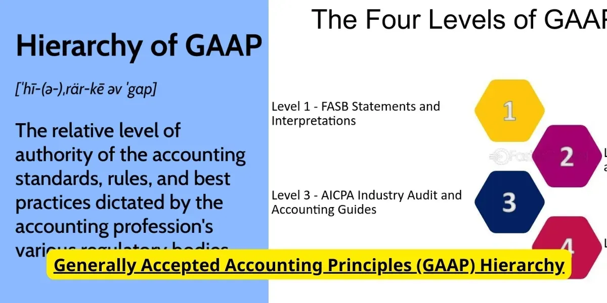

## Table of Contents

## What does GAAP stand for?

GAAP stands for Generally Accepted Accounting Principles. It is a set of rules and guidelines that companies in the United States must follow when they prepare their financial statements. These rules help make sure that the financial information is clear, consistent, and easy to understand for everyone who looks at it.

GAAP is important because it helps investors, creditors, and other people make good decisions about a company. If all companies follow the same rules, it's easier to compare their financial health. The Financial Accounting Standards Board (FASB) is the group that makes and updates these rules to keep up with changes in the business world.

## Why is GAAP important in accounting?

GAAP is important in accounting because it makes sure that all companies report their financial information in the same way. This helps everyone, like investors and banks, understand a company's financial health easily. If every company used different rules, it would be hard to compare them and make good decisions. GAAP sets clear rules so that financial statements are reliable and trustworthy.

Another reason GAAP is important is that it helps keep the financial world fair and honest. By having a standard set of rules, companies can't hide or change their financial numbers to make themselves look better. This protects people who might want to invest in or lend money to a company. The rules are made and updated by a group called the Financial Accounting Standards Board (FASB), which makes sure they stay relevant and useful.

## What is the hierarchy of GAAP?

The hierarchy of GAAP is like a set of steps that tell accountants which rules to follow first when they make financial statements. At the top of the hierarchy are the rules made by the Financial Accounting Standards Board (FASB). These are called FASB Statements and Interpretations, and they are the most important rules. Next come the rules from the FASB's Emerging Issues Task Force and the Accounting Standards Executive Committee of the American Institute of Certified Public Accountants (AICPA).

After those, there are industry-specific rules from the AICPA that companies in certain fields need to follow. At the bottom of the hierarchy are other accounting literature and practices that are widely accepted. If there's a disagreement between rules at different levels, accountants should always use the rule from the higher level. This helps make sure that everyone is using the most important and up-to-date rules.

This hierarchy is important because it keeps financial reporting clear and consistent. By following the steps in order, accountants make sure they are using the best and most relevant rules for their situation. This helps everyone who looks at financial statements trust that the information is accurate and fair.

## How does the hierarchy of GAAP affect financial reporting?

The hierarchy of GAAP helps keep financial reporting clear and the same for everyone. It's like a list that tells accountants which rules to use first. At the top are the most important rules from the Financial Accounting Standards Board (FASB). These rules are the first ones accountants should follow. If those rules don't answer a question, accountants look at the next level, which includes rules from the FASB's Emerging Issues Task Force and the American Institute of Certified Public Accountants (AICPA). If those still don't help, they can use industry-specific rules and other widely accepted practices. By following this order, accountants make sure they're using the best rules for their situation.

This system makes financial statements more reliable and easier to trust. When everyone follows the same steps, it's easier for people like investors and banks to understand a company's financial health. They know that the numbers they see are based on the most important and up-to-date rules. This also helps keep things fair, because companies can't just pick the rules that make them look better. By using the hierarchy, accountants help make sure that financial reporting is honest and clear for everyone.

## What are the primary sources of GAAP?

The primary sources of GAAP are the rules set by the Financial Accounting Standards Board (FASB). These are called FASB Statements and Interpretations, and they are the most important rules that accountants should follow. These rules help make sure that everyone reports financial information in the same way. The FASB is in charge of making and updating these rules to keep up with changes in the business world.

Another important source of GAAP comes from the FASB's Emerging Issues Task Force and the Accounting Standards Executive Committee of the American Institute of Certified Public Accountants (AICPA). These groups help answer new questions and issues that come up in accounting. They provide guidance that helps fill in the gaps where the main FASB rules might not give clear answers. Together, these sources make sure that financial reporting is clear, consistent, and easy to understand for everyone who looks at it.

## How do accounting standards fit into the GAAP hierarchy?

Accounting standards are the main rules that make up GAAP. They come from the Financial Accounting Standards Board (FASB), which is the top group in charge of setting these rules. These standards are called FASB Statements and Interpretations. They are the most important part of GAAP because they give clear instructions on how companies should report their financial information. When accountants prepare financial statements, they need to follow these standards first because they are the highest level in the GAAP hierarchy.

Besides the main FASB rules, there are other important sources of GAAP. These include rules from the FASB's Emerging Issues Task Force and the Accounting Standards Executive Committee of the American Institute of Certified Public Accountants (AICPA). These groups help answer new questions and issues that the main FASB rules might not cover. They provide more detailed guidance that helps accountants when the top-level rules aren't enough. All these standards together make sure that financial reporting is clear and consistent for everyone who looks at it.

## Can you explain the difference between Level A and Level B GAAP?

Level A and Level B are parts of the GAAP hierarchy that help accountants know which rules to follow first. Level A is the most important level and includes the main rules from the Financial Accounting Standards Board (FASB). These are called FASB Statements and Interpretations. They are the top rules that accountants should use first because they give clear instructions on how to report financial information. If a company is preparing its financial statements, it should start by following these Level A rules.

Level B comes next in the GAAP hierarchy and includes rules from the FASB's Emerging Issues Task Force and the Accounting Standards Executive Committee of the American Institute of Certified Public Accountants (AICPA). These rules help answer new questions or issues that the Level A rules might not cover. They provide more detailed guidance for accountants when the main FASB rules aren't enough. So, if the Level A rules don't answer a specific question, accountants can then look at the Level B rules to find the right guidance.

## What role do industry practices play in the GAAP hierarchy?

Industry practices are a part of the GAAP hierarchy, but they are not as important as the rules from the Financial Accounting Standards Board (FASB). They come lower in the hierarchy, which means accountants should only use them if the higher-level rules don't answer their questions. Industry practices are like common ways of doing things that many companies in a specific field follow. These practices help make sure that financial reporting is consistent within that industry.

Even though industry practices are lower in the hierarchy, they still play an important role. They fill in the gaps where the main GAAP rules might not give clear guidance. For example, if a company in the tech industry has a special kind of expense that the FASB rules don't cover, they can look at what other tech companies do. This helps make sure that financial statements are still clear and useful, even when the main rules don't cover everything.

## How are changes to GAAP standards communicated and implemented?

Changes to GAAP standards are made by the Financial Accounting Standards Board (FASB). When the FASB decides to change a rule, they first talk about it a lot and get feedback from people who use GAAP, like accountants and companies. They might write a new rule or change an old one. Once they agree on the change, they put it in a document called a "Statement" or an "Interpretation." They then share this document with everyone who needs to know about the new rule. This can be done through their website, newsletters, or other ways to make sure everyone gets the information.

After the new rule is shared, companies and accountants need to start using it. The FASB usually gives a date when the new rule has to be used. This gives everyone time to learn about the change and get ready to use it in their financial reports. Sometimes, the FASB might also offer training or more information to help people understand the new rule better. This way, everyone can make sure their financial statements follow the updated GAAP standards.

## What happens when there is a conflict between different levels of GAAP?

When there is a conflict between different levels of GAAP, accountants have to follow the rules from the higher level. The GAAP hierarchy is like a list that tells accountants which rules to use first. At the top are the most important rules from the Financial Accounting Standards Board (FASB). If a rule from a lower level, like industry practices, disagrees with a rule from the FASB, accountants should always use the FASB rule. This makes sure that everyone is using the best and most important rules for their financial statements.

This system helps keep financial reporting clear and the same for everyone. If accountants always follow the rules from the highest level first, it makes sure that financial statements are reliable and easy to understand. This is important for people like investors and banks who need to trust the financial information they see. By using the GAAP hierarchy, accountants can solve conflicts and make sure that the financial reports are honest and clear.

## How do international accounting standards align with the GAAP hierarchy?

International accounting standards, known as IFRS (International Financial Reporting Standards), are used by many countries around the world. They are set by the International Accounting Standards Board (IASB). GAAP, on the other hand, is mainly used in the United States and is set by the Financial Accounting Standards Board (FASB). Even though GAAP and IFRS are different, the FASB and IASB work together to make sure their rules are as similar as possible. This helps companies that do business in different countries follow the rules more easily.

The GAAP hierarchy tells accountants in the U.S. which rules to use first when they prepare financial statements. At the top are the most important FASB rules. IFRS doesn't have the same kind of hierarchy, but it also has a set of rules that companies must follow. When a U.S. company wants to report its financials using IFRS, it has to switch from following the GAAP hierarchy to following the IFRS rules. This can be tricky, but it helps make sure that financial reports are clear and easy to compare, no matter where in the world they are used.

## What are some criticisms or limitations of the current GAAP hierarchy structure?

Some people say that the GAAP hierarchy can be too hard to follow. It has different levels of rules, and sometimes it's not clear which rule to use first. This can make it tough for accountants to know what to do, especially if the rules from different levels seem to disagree. Also, the rules at the top of the hierarchy, from the FASB, might not always cover every situation. This means accountants have to look at lower-level rules, like industry practices, which can be confusing and might not be the same for everyone.

Another problem is that the GAAP hierarchy might not keep up with changes in the business world quickly enough. It can take a long time for the FASB to make new rules or change old ones. This can leave companies and accountants waiting for clear guidance on new issues. Plus, because GAAP is mainly used in the U.S., it can be hard for companies that do business in other countries. They might have to follow both GAAP and international rules, which can be a lot of work and might lead to different financial reports depending on which set of rules they use.

## References & Further Reading

[1]: ["Generally Accepted Accounting Principles (GAAP)"](https://en.wikipedia.org/wiki/Generally_Accepted_Accounting_Principles_(United_States)) by Financial Accounting Standards Board.

[2]: ["Advances in Financial Machine Learning"](https://www.amazon.com/Advances-Financial-Machine-Learning-Marcos/dp/1119482089) by Marcos Lopez de Prado.

[3]: ["Quantitative Trading: How to Build Your Own Algorithmic Trading Business"](https://www.amazon.com/Quantitative-Trading-Build-Algorithmic-Business/dp/1119800064) by Ernest P. Chan.

[4]: ["Algorithmic Trading and DMA: An Introduction to Direct Access Trading Strategies"](https://www.amazon.com/Algorithmic-Trading-DMA-introduction-strategies/dp/0956399207) by Barry Johnson.

[5]: ["Handbook of High-Frequency Trading"](https://www.sciencedirect.com/book/9780128022054/handbook-of-high-frequency-trading) edited by Greg N. Gregoriou.

[6]: ["International Financial Reporting Standards (IFRS)"](https://en.wikipedia.org/wiki/International_Financial_Reporting_Standards) by IFRS Foundation.