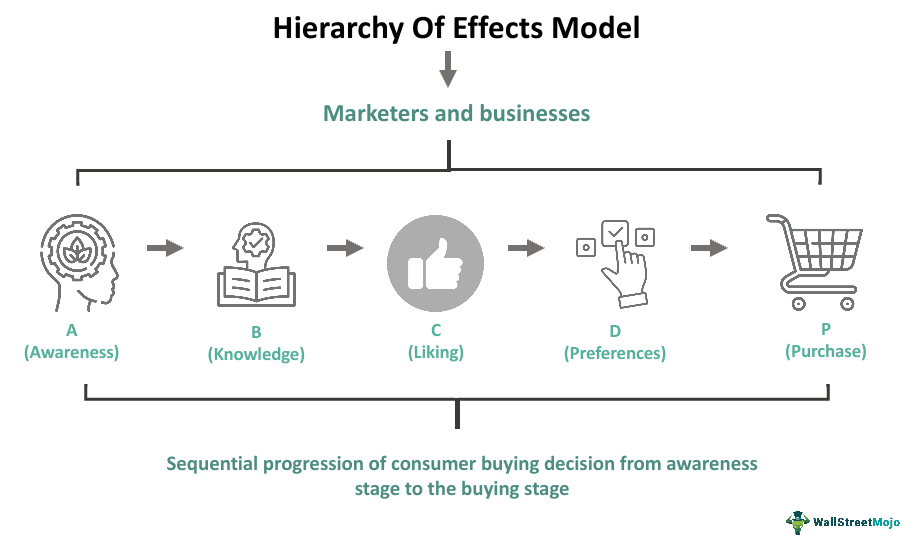

Understanding consumer behavior and advertising strategies has become increasingly crucial in today's digital marketplace. As businesses and consumers continue to navigate this fast-evolving landscape, the need for robust frameworks to comprehend consumer decision-making processes has never been more pertinent. One such framework is the Hierarchy of Effects theory, which outlines a series of stages that consumers transition through from the initial awareness of a product to the ultimate decision to purchase it. This model offers valuable insights into how consumers process information and how their perceptions and attitudes evolve over time. By comprehending these stages, marketers can strategically tailor their advertising efforts to effectively guide potential customers through their decision-making journey.

Concurrently, the advent of algorithmic trading—a sophisticated facet of automated investing—has significantly influenced market dynamics and consumer behaviors. Algorithmic trading employs computer algorithms to execute trades at speeds and frequencies that far exceed human capabilities, thereby affecting market volatility and shaping consumer sentiment. As consumers are deeply intertwined with market fluctuations, these algorithm-driven changes can also impact how they respond to advertising and marketing campaigns.



This article explores the interplay between advertising theory, consumer behavior, the Hierarchy of Effects, and algorithmic trading. By examining these interconnected elements, we aim to shed light on how modern marketing strategies can leverage insights from consumer behavior theories and advanced trading technologies to foster more effective advertising approaches. Understanding these relationships provides a holistic view of the complex mechanisms at play in the digital marketplace, paving the way for more integrated and adaptive marketing practices.

## Table of Contents

## Understanding the Hierarchy of Effects Model

The Hierarchy of Effects model is a significant theory in advertising and consumer behavior, illustrating the sequential stages a consumer passes through from initial awareness to final purchase decision. Proposed by Robert J. Lavidge and Gary A. Steiner in 1961, this model suggests that consumers travel through a series of mindset changes before concluding their decision to purchase a product.

The model is divided into six distinct stages:

1. **Awareness**: At this initial stage, the target audience becomes aware of the existence of a product or brand. The primary objective of marketing strategies implemented at this stage is to capture attention and introduce the brand to consumers. Techniques often involve high-reach mediums such as television, radio, and digital advertisements aimed at building brand visibility.

2. **Knowledge**: Once awareness is established, consumers seek information to enhance their understanding of the product's attributes and benefits. Marketing efforts at this stage focus on providing detailed and relevant information, often through informative content such as articles, blogs, and product descriptions, to facilitate an educated customer base.

3. **Liking**: At this point, consumers form favorable or unfavorable feelings toward the product. Emotional appeal and persuasive communication play vital roles here, as companies aim to build a positive image and emotional connection through eye-catching visuals, brand stories, and engaging content that resonates with the audience.

4. **Preference**: Having developed a favorable perception, consumers begin to compare products and develop a preference. This stage involves highlighting competitive advantages and unique selling propositions through targeted advertising and personal selling strategies that emphasize the distinct benefits of the product over alternatives.

5. **Conviction**: During this phase, consumers develop a commitment to purchase but have not yet acted. Marketers aim to reinforce this decision through techniques that emphasize trust, such as customer testimonials, endorsements, and guarantees. The objective is to prepare the consumer psychologically for the transaction decision.

6. **Purchase**: This final stage signifies the consummation of the process, where the consumer takes action and completes the purchase. Marketing strategies focus on simplifying the purchase process through promotions, point-of-sale displays, and streamlined checkout processes to convert intent into action.

Each stage of the Hierarchy of Effects model delineates a shift in consumer cognition, emotion, and behavior, necessitating distinct marketing strategies tailored to the consumer's evolving mindset. By thoroughly understanding and leveraging these stages, businesses can create more effective marketing campaigns that guide consumers smoothly from awareness to purchase, optimizing conversion rates and building lasting brand relationships.

## Advertising Theory and Consumer Behavior

Advertising theory focuses on influencing consumer awareness and attitudes towards products by understanding and leveraging consumer behavior. One foundational aspect of advertising theory is the recognition that consumer decisions are typically not instantaneous; instead, they progress through various stages that require targeted marketing strategies. This aligns with the Hierarchy of Effects model, which can be influential in shaping effective advertising campaigns.

Consumer behavior analysis is key to crafting messages that address the different stages of the Hierarchy of Effects: Awareness, Knowledge, Liking, Preference, Conviction, and Purchase. Each stage represents a distinct psychological shift in consumer attitude and requires specific advertising techniques to move consumers to the next stage. For instance, during the Awareness stage, advertising efforts focus on capturing attention through broad-reaching media campaigns. As consumers move to the Knowledge stage, more detailed information about the product is provided to build understanding.

Cognitive, affective, and behavioral responses play pivotal roles in guiding consumer actions. Cognitive responses involve mental processes where consumers gather and assess information. These responses influence the Knowledge stage and can involve evaluating product features and comparing alternatives. Affective responses relate to emotional reactions and are crucial during the Liking and Preference stages. Advertisers often use emotional appeals or brand narratives to create positive emotional associations with their products.

Behavioral responses, where consumers take concrete actions, are most relevant in the Conviction and Purchase stages. These actions can range from seeking further information to actual buying decisions. Advertisers encourage these responses by offering promotions or easy purchasing options. For example, an advertisement might end with a call-to-action or limited-time offer to spur immediate purchasing behavior.

Integrating these insights allows advertisers to not just influence consumer actions at each stage but also to build long-term brand loyalty. By aligning advertising strategies with consumer behavior insights, businesses can enhance their effectiveness in converting potential buyers into repeat customers. This approach acknowledges that consumer decision-making is a progressive journey, and by understanding this pathway through detailed consumer behavior analysis, advertising efforts can be precisely tailored to meet consumer needs at every stage.

## Algorithmic Trading and Its Impact on Advertising

Algorithmic trading utilizes sophisticated algorithms and automated programs to execute trade orders at speeds and frequencies far beyond human capability. This technological advancement has fundamentally reshaped the landscape of financial markets, influencing both market [volatility](/wiki/volatility-trading-strategies) and consumer sentiments.

One of the primary effects of [algorithmic trading](/wiki/algorithmic-trading) on markets is increased [liquidity](/wiki/liquidity-risk-premium), as the rapid execution of trades ensures that buy and sell orders are swiftly matched. However, this can also lead to heightened market volatility. Algorithms can react to market events in milliseconds, leading to rapid swings in asset prices if numerous systems respond simultaneously. Such volatility can create uncertainty in markets, impacting investor confidence and consumer sentiment alike.

From an advertising perspective, algorithmic trading presents both challenges and opportunities. The data generated by these trading activities can offer deep insights into market trends, investor behaviors, and sentiment shifts. By analyzing these data patterns, advertisers can craft highly targeted campaigns, aligning their messages with prevailing market conditions and consumer attitudes. For instance, if algorithmic trading patterns indicate a rise in consumer confidence due to market upswings, advertisers might emphasize positive messaging and calls to action to capitalize on this sentiment.

Moreover, algorithmic trading data can enhance predictive analytics in advertising. By integrating real-time trading data with consumer behavior models, companies can improve the accuracy of their marketing forecasts. This integration can be achieved using advanced analytics techniques such as [machine learning](/wiki/machine-learning). For example, a Python script using a machine learning library like scikit-learn could be employed to correlate trading data with consumer purchase behaviors, improving prediction models:

```python
import pandas as pd
from sklearn.model_selection import train_test_split
from sklearn.linear_model import LinearRegression

# Example dataset loading
trading_data = pd.read_csv('trading_data.csv')
advertising_data = pd.read_csv('advertising_data.csv')

# Merge datasets on a common key
merged_data = pd.merge(trading_data, advertising_data, on='date')

# Define features and target variable
X = merged_data[['market_volatility', 'trading_volume']]
y = merged_data['ad_conversion_rate']

# Split into training and testing data
X_train, X_test, y_train, y_test = train_test_split(X, y, test_size=0.2, random_state=42)

# Create and train the model
model = LinearRegression()
model.fit(X_train, y_train)

# Evaluate the model
score = model.score(X_test, y_test)
print(f'Model accuracy: {score:.2f}')
```

This script exemplifies the potential to leverage algorithmic trading data to enhance advertising strategies.

Furthermore, algorithmic trading's influence extends to the digital platforms that facilitate rapid shifts in consumer behavior. As consumers increasingly interact with digital financial services, there is a growing potential for these platforms to integrate tailored advertising based on immediate market data.

In conclusion, understanding the implications of algorithmic trading on advertising requires a multidisciplinary approach, tying together market dynamics and consumer analytics. By doing so, businesses can optimize their marketing strategies, making them more responsive to the complexities of today's rapidly evolving marketplace.

## Intersections of Advertising, Consumer Behavior, and Algorithmic Trading

The integration of market data from algorithmic trading with advertising strategies represents a novel frontier in the digital marketing landscape. Algorithmic trading leverages advanced statistical models and machine learning algorithms to analyze vast datasets, executing trades with precision at speeds unattainable by human traders. This wealth of market data can provide invaluable insights for crafting effective advertising campaigns tailored to current market conditions and consumer sentiments.

Market data obtained from algorithmic trading offers real-time insights into consumer behavior patterns and economic trends. By analyzing these trends, advertisers can identify shifts in consumer preferences and purchase intentions more accurately. For instance, fluctuations in asset prices detected through trading algorithms could signal changes in consumer confidence, which advertisers can correlate with the demand for certain goods and services.

Digital platforms are crucial in facilitating these rapid shifts in consumer behavior. Social media sites, e-commerce platforms, and search engines collect extensive consumer interaction data, from purchasing histories to engagement metrics. When combined with real-time market data from algorithmic trading, these platforms provide a comprehensive view of current consumer attitudes and behavior dynamics. Advertisers can utilize this information to implement more responsive and personalized advertising strategies, enhancing consumer engagement and conversion rates.

Looking ahead, the potential for integrating consumer data from trading and advertising is vast. As data analytics technologies continue to advance, the ability to cross-reference consumer behavior with algorithmic trading data will become increasingly sophisticated. Predictive analytics and machine learning models could offer new capabilities to anticipate consumer needs and tailor marketing efforts accordingly. Such models might include algorithms that assess the probability of consumer action based on historical viewing patterns and market trends.

Python code, for example, could be employed to streamline this process by analyzing datasets for predicting consumer behavior trends:

```python
import pandas as pd
from sklearn.linear_model import LinearRegression

# Sample dataset combining advertising and trading data
data = pd.read_csv('consumer_trading_data.csv')

# Independent variables: advertising impressions, market index changes
X = data[['ad_impressions', 'market_index_change']]

# Dependent variable: consumer purchase intent
y = data['purchase_intent']

# Linear regression model
model = LinearRegression()
model.fit(X, y)

# Predicting purchase intent
prediction = model.predict(X)
```

This Python example uses a linear regression model to correlate advertising impressions and market index changes with consumer purchase intent, illustrating the practical application of combined data analytics.

As businesses strive to maintain a competitive edge, the synergistic use of algorithmic trading data with advertising strategies will likely play a pivotal role in future marketing innovations. Embracing these advanced technological intersections allows companies to harness real-time data-driven insights, paving the way for a more integrated marketing approach.

## Conclusion

In the interconnected world of consumer behavior theories and modern trading technologies, businesses must navigate an increasingly complex landscape. The Hierarchy of Effects model provides a framework to understand consumer decision-making processes, mapping out the psychological journey from awareness to purchase. Meanwhile, algorithmic trading introduces new variables into market dynamics, influencing not just stock prices but consumer sentiment and behavior as well.

As automated systems continue to evolve, marketing strategies must also progress, embracing the precision and speed that technology offers. Algorithmic trading, with its data-driven insights, can inform advertising efforts by offering a real-time understanding of market trends and consumer preferences. This synergy underscores the need for businesses to adopt a more integrated approach, one that leverages the insights garnered from both advertising theories and algorithmic trading.

By harnessing data from these automated systems, businesses can craft more effective and personalized marketing campaigns. This not only enhances consumer engagement but also optimizes resource allocation, leading to better returns on investment. The future of marketing lies in the seamless integration of these disciplines, encouraging businesses to remain agile, data-savvy, and consumer-focused. This holistic view will enable them to navigate the rapidly changing digital marketplace and maintain a competitive edge.

## References

To provide comprehensive insights into the interactions between consumer behavior theories and algorithmic trading, this section compiles a series of academic and industry references.

1. **Lavidge, R.J., & Steiner, G.A. (1961).** "A Model for Predictive Measurements of Advertising Effectiveness." *Journal of Marketing*, 25(6), 59-62. This classic study introduces the Hierarchy of Effects model, detailing the stages through which consumers progress from awareness to purchase.

2. **Kotler, P., & Keller, K.L. (2016).** *Marketing Management* (15th ed.). This textbook offers an extensive overview of advertising principles and consumer behavior, providing foundational knowledge that supports the Hierarchy of Effects framework.

3. **Engel, J.F., Blackwell, R.D., & Miniard, P.W. (1995).** *Consumer Behavior* (8th ed.). This work focuses on consumer decision-making processes, providing context for interpreting various stages of the Hierarchy of Effects model.

4. **Hendershott, T., Jones, C.M., & Menkveld, A.J. (2011).** "Does Algorithmic Trading Improve Liquidity?" *The Journal of Finance*, 66(1), 1-33. The study explores the impact of algorithmic trading on financial markets, highlighting its effects on liquidity and market volatility.

5. **Hasbrouck, J., & Saar, G. (2013).** "Low-Latency Trading." *Journal of Financial Markets*, 16, 646-679. This paper provides insights into how the acceleration of trading tools affects market conditions, potentially influencing consumer sentiments indirectly.

6. **Chen, H., De, P., Hu, Y.J., & Hwang, B.H. (2014).** "Wisdom of Crowds: The Value of Stock Opinions in a Social Network." *Review of Financial Studies*, 27(5), 1367-1403. This research discusses the implications of digital platforms on stock trading and consumer behavior, emphasizing the significance of social media.

7. **Tversky, A., & Kahneman, D. (1974).** "Judgment under Uncertainty: Heuristics and Biases." *Science*, 185(4157), 1124-1131. This foundational study on cognitive psychology underpins consumer behavior theory, clarifying how biases affect decision-making.

8. **Pearson, R. (2022).** "Exploring the Role of Big Data in Algorithmic Trading and Market Strategy Development." *Journal of Financial Data Science*. This article highlights recent advancements in data-driven trading strategies, linking market dynamics with advertising techniques.

By synthesizing these sources, one gains a richer understanding of how modern marketing and automated trading strategies coexist and impact consumer decision-making processes. These references serve as a basis for further exploration into the synergy between market analysis and consumer behavior insights.

## References & Further Reading

[1]: Lavidge, R. J., & Steiner, G. A. (1961). ["A Model for Predictive Measurements of Advertising Effectiveness."](https://www.jstor.org/stable/1248516) Journal of Marketing, 25(6), 59-62.

[2]: Kotler, P., & Keller, K. L. (2016). ["Marketing Management"](https://books.google.com/books/about/Marketing_Management.html?id=UbfwtwEACAAJ) (15th ed.).

[3]: Engel, J. F., Blackwell, R. D., & Miniard, P. W. (1995). *Consumer Behavior* (8th ed.).

[4]: Hendershott, T., Jones, C. M., & Menkveld, A. J. (2011). ["Does Algorithmic Trading Improve Liquidity?"](https://onlinelibrary.wiley.com/doi/full/10.1111/j.1540-6261.2010.01624.x) The Journal of Finance, 66(1), 1-33.

[5]: Hasbrouck, J., & Saar, G. (2013). ["Low-Latency Trading."](https://www.sciencedirect.com/science/article/abs/pii/S1386418113000165) Journal of Financial Markets, 16, 646-679.

[6]: Tversky, A., & Kahneman, D. (1974). ["Judgment under Uncertainty: Heuristics and Biases."](https://www2.psych.ubc.ca/~schaller/Psyc590Readings/TverskyKahneman1974.pdf) Science, 185(4157), 1124-1131.

[7]: Chen, H., De, P., Hu, Y. J., & Hwang, B. H. (2014). ["Wisdom of Crowds: The Value of Stock Opinions in a Social Network."](https://papers.ssrn.com/sol3/papers.cfm?abstract_id=1807265) Review of Financial Studies, 27(5), 1367-1403.

[8]: Pearson, R. (2022). "Exploring the Role of Big Data in Algorithmic Trading and Market Strategy Development." Journal of Financial Data Science. 

[9]: ["Evidence-Based Technical Analysis: Applying the Scientific Method and Statistical Inference to Trading Signals"](https://www.amazon.com/Evidence-Based-Technical-Analysis-Scientific-Statistical/dp/0470008741) by David Aronson.

[10]: ["Machine Learning for Algorithmic Trading"](https://github.com/stefan-jansen/machine-learning-for-trading) by Stefan Jansen.

[11]: ["Quantitative Trading: How to Build Your Own Algorithmic Trading Business"](https://www.amazon.com/Quantitative-Trading-Build-Algorithmic-Business/dp/1119800064) by Ernest P. Chan.