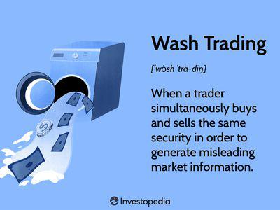

The stock market represents a dynamic and multifaceted ecosystem where myriad trading strategies and cutting-edge technologies intersect. Successfully navigating this landscape demands a firm grasp of stock market terminology and the underlying mechanisms driving market activities. Among the diverse strategies employed by traders, understanding terms like "high close" becomes particularly significant. Not only are such terms pivotal for assessing market trends, but they also play a role in shaping trading outcomes and perceptions.

Algorithmic trading, a field that has revolutionized modern market operations, leverages sophisticated computer algorithms to execute trades at speeds and with efficiencies human traders cannot match. This article is dedicated to elucidating key stock market terminology, explicitly focusing on "high close" strategies, and examining the expansive universe of algorithmic trading. By unpacking these concepts, we aim to shed light on their significance and ramifications in contemporary financial markets.



Throughout this discussion, we will provide a detailed overview, combining technical explanations and real-world examples, to offer readers a nuanced understanding of how these strategies and technologies influence market dynamics. Through this comprehensive approach, the article aims to equip readers with the knowledge necessary to engage with today's rapidly evolving financial markets effectively.

## Table of Contents

## Understanding Trading Terminology

Trading terminology can initially seem overwhelming, but understanding the key terms is crucial for anyone looking to participate effectively in the stock market. One of these important terms is "high close," which is often associated with specific strategies employed at the end of a trading session. High close strategies are designed to influence the closing prices of stocks by executing trades that elevate the price at the day's end, creating an impression of a strong close. 

A high close strategy typically involves making small trades at a higher price than the current market rate, just before the market closes. This tactic can lead to the illusion of increased demand or positive sentiment around a stock, potentially misleading other investors. The manipulation of closing prices through these strategies can distort the perceived value of a stock, influencing not only investor perception but also affecting market indices that rely on closing prices for their calculations.

High close strategies can be particularly effective in markets characterized by low liquidity. In such markets, even a few targeted trades can have a significant impact on the closing price of a stock. However, this potential for manipulation also raises ethical and legal questions, as it can be used to artificially inflate stock prices without a corresponding intrinsic value increase.

By understanding high close and other trading terminology, investors and traders can better navigate the intricacies of stock market trading, avoiding potential traps and recognizing strategies that might be used by others to influence market outcomes. Awareness of these tactics is essential for maintaining a fair and transparent market environment, where prices genuinely reflect underlying market conditions.

## What Is a High Close?

A 'high close' is a trading tactic employed to influence the closing price of a stock by executing small trades at elevated prices during the final moments of the trading day. This strategy can create the appearance of a robust closing price, potentially misleading investors and other market participants regarding the stock's performance. The objective is to depict a false image of strength, which can impact investor perception and subsequent trading decisions.

The high close tactic can be particularly impactful in markets characterized by low [liquidity](/wiki/liquidity-risk-premium). In such environments, a limited number of transactions can have a disproportionate effect on the stock’s closing price. This is because fewer market participants means each trade carries more weight in setting the final price. As a result, even small-[volume](/wiki/volume-trading-strategy) trades executed at higher prices can elevate the stock’s closing price, exaggerating the day's market activity.

This manipulation of closing prices isn't just an academic concern; it can alter the perception of a stock's performance for both individual and institutional investors. For instance, mutual funds and other institutional investors that report performance based on closing prices might be affected, prompting buying or selling activities that are not reflective of genuine market sentiment or fundamentals.

The ethical implications of utilizing high close strategies are significant. While it might be seen as a clever tactic to gain short-term advantages, such practices can distort market efficiency and transparency, leading to potential regulatory scrutiny and penalties. Traders and firms that engage in high close practices should be aware of these risks, as regulatory bodies like the U.S. Securities and Exchange Commission have been known to take action against entities that manipulate closing prices.

## Example and Misuse of High Close

To comprehend the misuse of 'high close', imagine a scenario where a trader artificially inflates a stock's price during the final minutes of the trading day. This deceitful tactic creates an illusion of a robust closing price, potentially misleading both current and prospective investors about the stock's performance. This manipulation can generate a false impression of a successful trading session, adding unwarranted buying pressure and optimism surrounding the stock.

A prominent example of such malpractice is the case involving Athena Capital Research. The U.S. Securities and Exchange Commission (SEC) took decisive action against the firm for executing a strategy that manipulated stock closing prices. Athena Capital Research's approach involved the use of sophisticated [algorithmic trading](/wiki/algorithmic-trading) programs designed to deploy a series of small, high-volume trades that would systematically push the closing price of a stock higher.

The mechanics of this manipulation are rooted in algorithmic trading. Consider a basic algorithm that places a series of incremental buy orders for a selected stock nearing the market close. For example, a Python script might resemble the following pseudo-code:

```python
import datetime
import random

def place_buy_orders(stock, target_increase, market_close):
    current_time = datetime.datetime.now()
    while current_time < market_close:
        # Randomly pick an amount to buy within a set range
        amount_to_buy = random.randint(1, 10)
        # Execute buy order
        buy_stock(stock, amount_to_buy)
        # Artificially adjust the price upwards
        stock.price += target_increase / amount_to_buy
        current_time = datetime.datetime.now()

def buy_stock(stock, amount):
    # Placeholder for trading platform API call
    pass
```

This simplified algorithm reflects the essence of Athena's strategy, where minute buy orders were used to notch up the stock's price incrementally as the market neared its close. The ethical and legal challenges associated with such 'high close' strategies stem from their potential to manipulate market perceptions and trading data integrity.

The SEC’s actions against Athena underscore the regulatory risks associated with leveraging algorithms to effectuate high close manipulations. These tactics not only distort market efficiency but also breach ethical standards and legal regulations designed to protect investors and ensure market fairness.

 to Algorithmic Trading

Algorithmic trading, commonly referred to as algo trading, involves the use of computer programs to execute trades on the stock market based on a predetermined set of rules. This method first gained popularity in the late 20th century and has revolutionized financial markets by enabling faster and more efficient trading operations. At its core, algorithmic trading leverages advanced mathematics and computational technologies to automate tasks that were traditionally performed manually by traders.

The primary advantage of algorithmic trading is its capacity to diminish the impact of human error and emotional biases on trading decisions. Algorithms are designed to make rational, data-driven decisions, thus maintaining consistency and accuracy in trades. This consistency is crucial as markets become increasingly complex and data-driven insights determine trading success.

For instance, a basic algorithm might be programmed to execute a trade when a stock's moving average crosses a certain threshold, thereby eliminating the delay and inconsistency of human intervention. Here is a simple Python example of such a strategy:

```python
def moving_average_strategy(data, short_window=40, long_window=100):
    signals = pd.DataFrame(index=data.index)
    signals['signal'] = 0.0

    # Short moving average
    signals['short_mavg'] = data['Close'].rolling(window=short_window, min_periods=1, center=False).mean()

    # Long moving average
    signals['long_mavg'] = data['Close'].rolling(window=long_window, min_periods=1, center=False).mean()

    # Generate signals
    signals['signal'][short_window:] = np.where(signals['short_mavg'][short_window:] > signals['long_mavg'][short_window:], 1.0, 0.0)   

    # Generate trading orders
    signals['positions'] = signals['signal'].diff()

    return signals
```

In this example, a short-term moving average and a long-term moving average are calculated, and a buy signal is generated when the short-term moving average exceeds the long-term moving average. This kind of systematic, rule-based trading allows for swift actions that capitalize on fleeting market opportunities.

Despite its advantages, algorithmic trading also presents certain challenges and risks. One significant drawback is the potential for market disruption caused by faulty algorithms or unexpected market conditions, as exemplified by notable incidents such as the 2010 "Flash Crash." These events underscore the importance of rigorous testing and robust risk management protocols in algorithmic trading systems.

Moreover, the regulatory environment surrounding algorithmic trading continues to evolve, prompting traders and firms to comply with strict guidelines to prevent manipulative practices and maintain market integrity. Ensuring algorithms are transparent and aligned with regulatory standards is as crucial as their technical efficiency.

In summary, algorithmic trading represents a paradigm shift in financial markets, enabling unprecedented speed and precision. However, it requires a deep understanding of both technological tools and regulatory landscapes to harness its full potential while mitigating associated risks.

## Common Algorithmic Trading Strategies

Algorithmic trading strategies leverage computational power and mathematical models to execute trades efficiently and effectively. These strategies are designed to capitalize on various market conditions by analyzing historical data and real-time market information to identify profitable trading opportunities. Three commonly utilized strategies in algorithmic trading are trend-following, [arbitrage](/wiki/arbitrage), and mean reversion.

Trend-following strategies capitalize on the [momentum](/wiki/momentum) of market trends. The core principle is that assets that have been moving in a particular direction will continue to do so. This approach involves the examination of historical price data to identify prevalent market trends and then executing trades that align with those trends. For example, if a stock's price is consistently rising, a trend-following strategy might trigger a buy order to capitalize on the expected continued increase. This type of strategy often employs moving averages, channel breakouts, and other technical indicators to ascertain trend directions and strength. The simplicity of the trend-following approach lies in its directive to 'ride the trend,’ minimizing subjective decision-making.

Arbitrage strategies exploit price discrepancies for virtually risk-free profits. These discrepancies can occur between different markets or the same market with different financial instruments. Arbitrage traders simultaneously buy and sell an asset in different markets to profit from price differences. For instance, if the price of a stock is lower on one exchange than on another, an arbitrage strategy would involve buying the stock on the cheaper exchange and selling it on the more expensive one. Advanced algorithmic programs can execute these trades in fractions of a second, faster than a human could, securing the profit potential before market corrections close the gap.

Mean reversion strategies are based on the hypothesis that asset prices will eventually return to their historical average or mean. This strategy assumes that prices deviate temporarily due to various factors, but over time, they revert back. Traders employing mean reversion models will look to buy assets when their prices drop below their historical average and sell them when prices exceed the average. The core of this strategy relies on statistical analysis to determine the 'typical' price range of an asset and its deviations. By identifying these anomalies, algorithmic traders can exploit the expected price reversion.

These algorithmic strategies, while diverse in approach, all focus on exploiting inefficiencies or patterns in the market. Advances in computational technology have made it possible to process vast amounts of data and execute trades with incredible speed and precision, enhancing the effectiveness of these strategies. However, their success also depends on robust data analysis and an understanding of complex market dynamics.

## Advantages and Challenges of Algo Trading

Algorithmic trading offers several significant advantages that make it a preferred choice for many market participants. Firstly, precision is a key benefit. Algorithms can execute trades with high accuracy based on predetermined criteria, minimizing human error associated with manual trading. This precision extends to the timing of trades, ensuring that buy and sell orders are executed at the exact desired moments, often within milliseconds. 

Speed is another critical advantage. By leveraging high-frequency trading systems, algorithms can process vast amounts of data rapidly, executing trades faster than a human could respond. This speed advantage can be pivotal in volatile markets where the difference between success and failure can be a matter of seconds.

Furthermore, the ability to manage and analyze high volumes of data allows algorithmic trading to identify trends and opportunities that might be missed by human traders. Algorithms can monitor multiple markets and instruments simultaneously, capitalizing on subtle inefficiencies and trends in a manner that would be impossible without automation.

However, despite these benefits, algorithmic trading also presents a series of challenges. One significant concern is its market impact. Large volumes of trades executed in a short time span can influence market prices, potentially leading to increased [volatility](/wiki/volatility-trading-strategies). This impact raises questions about the fairness and stability of financial markets.

Regulatory scrutiny is another challenge. Regulatory bodies, such as the U.S. Securities and Exchange Commission (SEC), increasingly monitor algorithmic trading practices to prevent manipulative strategies and ensure market integrity. Compliance with evolving regulations can be complex and costly, necessitating robust monitoring and reporting systems.

Technical challenges also exist. Maintaining reliable algorithmic systems demands substantial resources. Infrastructure issues such as latency, system failures, and software bugs can have severe repercussions on trading outcomes. Additionally, the initial development and continuous improvement of algorithms require specialized expertise, often involving complex quantitative models and significant financial investment.

Understanding these pros and cons is essential for market participants. While algorithmic trading can enhance trading efficiency and market opportunities, it requires awareness of its potential risks and the infrastructure necessary to support it. Balancing these factors will determine the successful implementation of algorithmic trading systems and their compliance with regulatory frameworks.

## Impact of High Close in Algo Trading

Algorithmic trading has revolutionized the stock market, introducing new strategies and efficiencies. However, it has also magnified certain tactics like "high close" trades, which involve executing trades at high prices just before the market closes. The automation provided by algorithms can enhance such practices, exerting greater influence on closing prices. This amplification of "high close" tactics can be effective for traders seeking to present a stock as performing better than it may actually be.

While algorithms underpin the strategic execution of these trades with precision and speed, they also introduce ethical concerns and regulatory challenges. Automated systems are capable of making conducting large numbers of trades in fractions of a second, making the potential market impact of these high close strategies substantial. They can distort the market's view of a stock's performance, misleading investors and impacting the decisions and valuations based on these artificial closing prices. The widespread use of such strategies might result in a less transparent and reliable market, undermining investor trust.

Furthermore, while the intent behind developing algorithmic trading systems might be to enhance trading efficiency, the misuse of these algorithms to exploit or manipulate market prices invites regulatory scrutiny. Regulatory bodies such as the U.S. Securities and Exchange Commission (SEC) have already taken actions against firms employing manipulative strategies, as demonstrated in cases involving high closing trades. These interventions highlight the ongoing need for regulatory oversight to ensure fair and transparent market operations.

To navigate these issues, algorithmic trading systems should incorporate safeguards that prevent manipulation. This might include implementing more sophisticated algorithms that monitor and restrict trading behavior near market close, or developing compliance frameworks that ensure trading strategies align with ethical standards. Additionally, continuous dialogue between technologists, traders, and regulators is crucial to balancing the benefits of algorithmic trading with market integrity and fairness. This balance would help maintain a healthy market environment that fosters trust and growth for all participants.

## Conclusion

Navigating the stock market requires a comprehensive understanding of several important concepts and strategies, including 'high close' practices and algorithmic trading. Mastery of these topics enables traders to effectively interpret market signals and make informed decisions. Understanding terms like 'high close' helps traders recognize potential manipulations in closing prices, which can impact market perception and influence trading decisions.

Algorithmic trading has transformed the market landscape by employing computer programs that execute trades based on predefined parameters. This innovation has brought about significant enhancements in trading speed and accuracy, as well as in the capability to process vast amounts of data. As a result, traders equipped with a sound knowledge of algorithmic trading can optimize their strategies to maximize returns while minimizing risk.

However, as technology progresses, the regulatory landscape surrounding these practices is also evolving. Market participants must remain vigilant, ensuring compliance with regulatory standards to maintain market integrity and avoid legal repercussions. This vigilance extends to understanding both the benefits and potential ethical dilemmas associated with these advanced trading strategies.

As traders incorporate these tools and strategies into their practice, staying informed about technological advancements and regulatory expectations is crucial. This knowledge empowers them to leverage opportunities effectively while upholding their responsibilities as participants in the financial markets. Consequently, continuous learning and adaptation remain vital components of successful trading in today's dynamic financial environment.

## References & Further Reading

[1]: U.S. Securities and Exchange Commission. (2014). ["SEC Charges Athena Capital Research With Fraudulent Trading to Manipulate Closing Prices."](https://www.documentcloud.org/documents/1370169-dc-1-2014cv01963-complaint-attachment-3/)

[2]: Lopez de Prado, M. (2018). ["Advances in Financial Machine Learning."](https://www.amazon.com/Advances-Financial-Machine-Learning-Marcos/dp/1119482089) Wiley.

[3]: Chan, E. P. (2008). ["Quantitative Trading: How to Build Your Own Algorithmic Trading Business."](https://github.com/ftvision/quant_trading_echan_book) Wiley.

[4]: Aronson, D. (2007). ["Evidence-Based Technical Analysis: Applying the Scientific Method and Statistical Inference to Trading Signals."](https://www.amazon.com/Evidence-Based-Technical-Analysis-Scientific-Statistical/dp/0470008741) Wiley.

[5]: Jansen, S. (2020). ["Machine Learning for Algorithmic Trading."](https://github.com/stefan-jansen/machine-learning-for-trading) Packt Publishing.