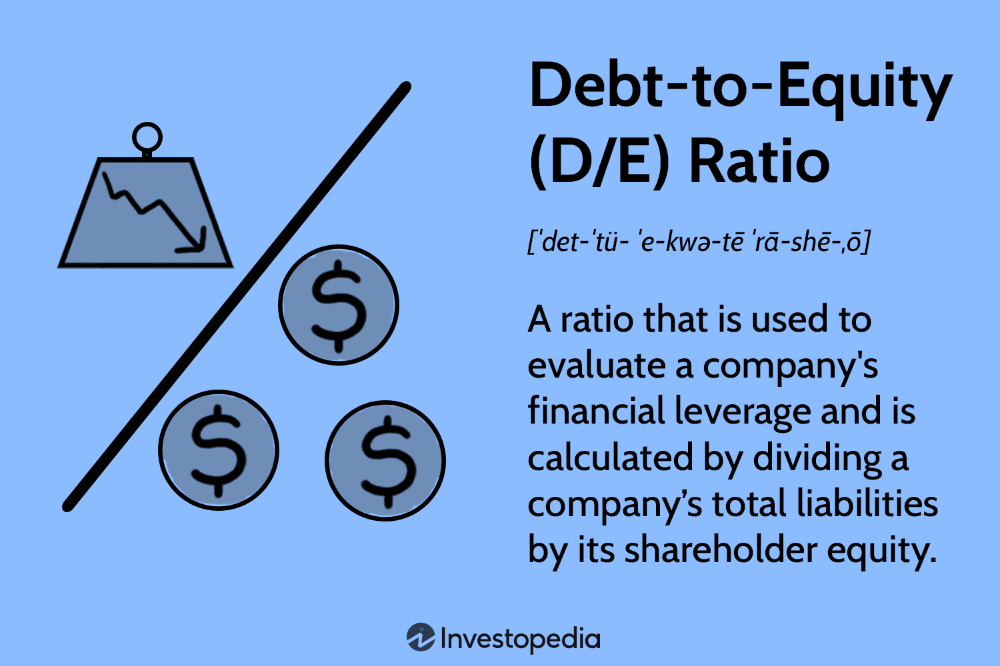

## Table of Contents

## What is a debt-to-equity ratio?

The debt-to-equity ratio is a way to measure how a company is using debt to finance its operations compared to using money from its owners or shareholders. It is calculated by dividing the company's total liabilities (the money it owes) by its total equity (the money invested by shareholders). This ratio helps investors understand the financial health of a company and how it manages its debts.

A high debt-to-equity ratio might mean that a company is taking on a lot of debt, which can be risky if the company can't pay it back. On the other hand, a low ratio might show that a company is more conservative and relies more on its own money. Different industries have different norms for this ratio, so it's important to compare a company's ratio to others in the same industry to get a better idea of its financial position.

## How is the debt-to-equity ratio calculated?

The debt-to-equity ratio is figured out by dividing a company's total liabilities by its total equity. Liabilities are all the money the company owes, like loans or bills. Equity is the money that shareholders have put into the company, including any profits that have been kept in the business.

To find the total liabilities, you add up everything the company owes. To find the total equity, you add up the money from shareholders and any profits that haven't been paid out. Once you have these two numbers, you divide the total liabilities by the total equity to get the debt-to-equity ratio. This number helps show how much the company relies on borrowed money compared to its own money.

## What does a high debt-to-equity ratio indicate about a company?

A high debt-to-equity ratio means that a company is using a lot of borrowed money to run its business. This can be risky because if the company can't pay back the money it owes, it might get into big trouble. Imagine if you borrowed a lot of money from a friend and couldn't pay it back; your friend might be upset, and you might have to deal with the consequences. It's the same for a company with a high debt-to-equity ratio.

On the other hand, a high debt-to-equity ratio isn't always bad. Sometimes, a company might borrow a lot of money to grow faster or to take advantage of new opportunities. If the company can make more money from these opportunities than it costs to borrow the money, it could be a smart move. But it's a bit like walking a tightrope; it can be good if everything goes well, but it can be dangerous if something goes wrong.

## What industries typically have higher debt-to-equity ratios?

Some industries, like utilities and telecom companies, often have higher debt-to-equity ratios. These businesses need a lot of money to build things like power plants or cell towers, which cost a lot. Because they need so much money upfront, they often borrow more than other types of companies. It's a bit like needing a big loan to buy a house; you need the money to get started, and then you pay it back over time.

Another industry with higher debt-to-equity ratios is real estate. Companies that build or own big buildings, like apartments or shopping centers, often use a lot of borrowed money. Real estate projects can take a long time to finish and start making money, so these companies might need to borrow to cover costs until they can start earning from their properties. It's kind of like taking out a loan to start a big project, hoping that once it's done, you'll make enough money to pay back the loan and then some.

## What are the potential risks of a high debt-to-equity ratio for a company?

A high debt-to-equity ratio can be risky for a company because it means the company is borrowing a lot of money. If the company can't pay back what it owes, it might have to sell things to get the money, which could hurt its business. Imagine if you borrowed a lot from a friend and couldn't pay it back; you might have to sell your bike or other things you own to cover the debt. For a company, this could mean selling off parts of the business or even going bankrupt, which is really bad.

Also, having a high debt-to-equity ratio can make it harder for a company to borrow more money in the future. Lenders might see the company as too risky and either charge higher interest rates or refuse to lend more money. It's like if you already owe a lot of money, and you ask for another loan; the bank might say no or ask for more interest because they're worried you won't be able to pay it all back. This can slow down the company's growth and make it harder to take advantage of new opportunities.

## How does a high debt-to-equity ratio affect a company's borrowing costs?

When a company has a high debt-to-equity ratio, it means they are using a lot of borrowed money. This can make lenders worried because the company might have a harder time paying back what it owes. Because of this worry, lenders might charge the company higher interest rates on new loans. It's like if you borrowed a lot from a friend and they saw you were struggling to pay back; they might ask for more interest next time because they're not sure you can pay them back.

Higher interest rates mean the company has to pay more money just to borrow. This can make it more expensive for the company to do things like grow or start new projects. If the company can't find a way to make enough money to cover these higher costs, it could get into big trouble. It's a bit like if you had to pay more to borrow money; you'd have to be careful about how you use it because it costs more to pay back.

## Can a high debt-to-equity ratio impact a company's stock price?

Yes, a high debt-to-equity ratio can impact a company's stock price. When investors see that a company is using a lot of borrowed money, they might worry that the company could have trouble paying it back. This worry can make them less likely to buy the company's stock or even sell the stock they already own, which can cause the stock price to go down. It's like if you heard a friend was borrowing a lot of money and might not be able to pay it back; you might not want to lend them more money or might want to get your money back quickly.

However, the impact on the stock price isn't always the same. Sometimes, investors might see that the company is using the borrowed money to grow quickly or to take advantage of new opportunities. If they believe the company can make more money from these opportunities than it costs to borrow, they might be okay with the high debt-to-equity ratio. In this case, the stock price might not go down, or it might even go up if investors think the company's future looks bright. It's like if your friend borrowed money to start a business that could make a lot of money; you might be okay with it if you think the business will succeed.

## What are some strategies a company might use to reduce a high debt-to-equity ratio?

One way a company can reduce a high debt-to-equity ratio is by paying off its debts. This can be done by using profits to pay down loans or by selling off assets to get the money needed to reduce what they owe. It's like if you had a lot of debt and you decided to use your savings or sell something you own to pay it off. By doing this, the company lowers its total liabilities, which makes the debt-to-equity ratio smaller.

Another strategy is to increase the company's equity. This can be done by issuing more stock to bring in new money from investors or by keeping more of the profits in the business instead of paying them out as dividends. It's kind of like if you wanted to start a business and you asked more friends to invest or decided to save more of your earnings. When the company's equity goes up, it helps balance out the debt, making the debt-to-equity ratio lower.

Sometimes, a company might do both of these things at the same time. They could pay off some debt and also raise more equity. This double approach can help them reduce their debt-to-equity ratio more quickly. It's like if you decided to both pay off your debts and find new people to invest in your business; you'd be tackling the problem from two sides at once.

## How does the debt-to-equity ratio relate to other financial ratios like the interest coverage ratio?

The debt-to-equity ratio and the interest coverage ratio are both important numbers that help us understand a company's financial health, but they look at different things. The debt-to-equity ratio tells us how much a company is using borrowed money compared to money from its owners. It's like checking if someone is using a lot of loans to buy things or if they're using their own money. On the other hand, the interest coverage ratio tells us if a company can pay the interest on its debts with the money it makes. It's like seeing if someone can pay the interest on their credit card with their monthly earnings.

These two ratios work together to give us a fuller picture of a company's financial situation. A high debt-to-equity ratio might make us worry that a company is too dependent on borrowed money, which can be risky. But if the same company also has a high interest coverage ratio, it means they're making enough money to cover their interest payments, which can make the high debt seem less scary. It's like if someone has a big loan but also a good job that pays enough to cover the interest; you might feel better about their financial situation.

## What are the differences in interpreting debt-to-equity ratios between different countries or regions?

The way people look at debt-to-equity ratios can be different in different countries or regions. This is because what's normal or okay in one place might not be the same in another place. For example, in some countries, it's common for companies to use a lot of borrowed money to grow, and so a higher debt-to-equity ratio might be seen as normal. But in other countries, people might be more careful about borrowing, and so a lower debt-to-equity ratio might be preferred.

These differences can come from things like the rules about borrowing money, how easy it is to get loans, and the way businesses usually work in that country. For instance, in countries with strong banking systems and easy access to loans, companies might have higher debt-to-equity ratios because borrowing is easier and more accepted. On the other hand, in places where borrowing is harder or seen as riskier, companies might keep their debt-to-equity ratios lower to stay safe. So, when looking at a company's debt-to-equity ratio, it's important to think about where the company is and what's normal there.

## How do investors use the debt-to-equity ratio in their analysis and decision-making process?

Investors use the debt-to-equity ratio to understand how a company is using borrowed money compared to its own money. This helps them see if the company is taking on too much risk by borrowing a lot. If the ratio is high, it might make investors worry that the company could have trouble paying back its debts, especially if things go wrong. On the other hand, a low debt-to-equity ratio might make investors feel safer because the company isn't relying too much on borrowed money. Investors look at this ratio to decide if they want to buy, hold, or sell the company's stock.

When making decisions, investors don't just look at the debt-to-equity ratio by itself. They compare it to other companies in the same industry because what's considered a high or low ratio can be different from one industry to another. For example, a high ratio might be normal for a utility company but risky for a tech company. Investors also look at other financial numbers like the interest coverage ratio and the company's overall financial health. By putting all this information together, investors can make smarter choices about where to put their money.

## What advanced financial models incorporate the debt-to-equity ratio to predict company performance?

Advanced financial models like the Altman Z-Score and the Merton Model use the debt-to-equity ratio to predict how well a company might do in the future. The Altman Z-Score is a formula that helps figure out if a company might go bankrupt. It looks at different financial numbers, including the debt-to-equity ratio, to give a score that shows how safe or risky the company is. A high debt-to-equity ratio can make the score lower, which means the company might be in more danger of going bankrupt. The Merton Model is another way to predict if a company might have trouble paying its debts. It uses the debt-to-equity ratio to understand how much risk the company is taking on and how likely it is to face financial problems.

These models help investors and financial experts make better guesses about a company's future. By including the debt-to-equity ratio, these models can show how a company's use of borrowed money might affect its chances of success or failure. If a company has a high debt-to-equity ratio, these models might predict that the company could struggle if it can't pay back its loans. On the other hand, a lower ratio might suggest that the company is in a safer position. By using these models, people can make smarter choices about whether to invest in a company or not.

## What is the Debt-to-Equity Ratio and how can it be understood?

The debt-to-equity (D/E) ratio is a financial metric that measures a company's financial leverage by comparing its total liabilities to its shareholder equity. It is represented mathematically as:

$$

\text{D/E Ratio} = \frac{\text{Total Liabilities}}{\text{Shareholder Equity}} 
$$

This ratio serves as an indicator of the extent to which a company is utilizing debt to finance its assets versus using shareholder equity. A higher D/E ratio suggests that a significant portion of a company’s assets are financed through debt, which can imply heightened financial risk. Conversely, a lower D/E ratio indicates a larger proportion of equity financing, often viewed as a stronger financial position.

An important function of the D/E ratio is its ability to unveil a company's financial structure and risk profile. Companies with high D/E ratios may be seen as more aggressive in their growth strategies since they rely heavily on borrowed funds. This approach can potentially lead to higher returns on equity if the company grows successfully, but it also increases the company's obligation to meet debt payments, thereby elevating financial risk. 

When interpreting the D/E ratio, it's essential to consider industry benchmarks, as some sectors typically operate with higher levels of debt due to specific capital requirements or business models. Thus, while a high D/E ratio can be a signal of potential risk, it must be assessed relative to industry norms and the company's ability to manage its debt obligations. 

Overall, the D/E ratio is a useful tool for investors and analysts to gauge a company’s financial stability and its strategies regarding financing and risk management.

## What constitutes a high D/E ratio?

The concept of a 'high' debt-to-equity (D/E) ratio is inherently variable and context-dependent, largely influenced by the specific industry in which a company operates. This is primarily due to varying capital requirements and the distinct risk profiles associated with different sectors. Typically, the D/E ratio is calculated as follows:

$$
\text{D/E Ratio} = \frac{\text{Total Liabilities}}{\text{Shareholders' Equity}}
$$

A higher D/E ratio implies greater financial leverage, indicating that a company is primarily using debt to finance its assets. This can be risky because it often suggests potential difficulties in meeting debt obligations, especially if earnings are volatile or if interest rates rise, increasing the cost of borrowing.

In industries like banking and utilities, higher D/E ratios are more common and can be considered normal due to operational structures that inherently depend on significant amounts of debt. Banks, for instance, utilize deposits to fund their loans, naturally leading to higher levels of liabilities compared to equity. Similarly, utility companies often have considerable debt loads as they invest heavily in infrastructure, ensuring long-term service provision and reliability. 

Conversely, companies in industries such as technology may have relatively lower D/E ratios, reflecting a lower reliance on debt financing. This variance accentuates the importance of contextual analysis when evaluating a company's D/E ratio. What might be considered a prudent level of debt in one industry could be perceived as excessive in another.

Understanding these differences is crucial for investors assessing risk. A high D/E ratio in a traditionally low-debt industry might signal underlying financial distress or aggressive growth strategies that could be unsustainable. Therefore, investors typically compare D/E ratios within the same industry to gain accurate insights into a company's financial risk level. This approach aids in distinguishing between strategic leveraging and potential financial overextension, guiding more informed investment decisions.

## What are the risks and opportunities associated with high D/E ratios?

High debt-to-equity (D/E) ratios are often considered risky because they imply a company is heavily reliant on debt financing, which can present significant challenges if earnings do not meet expectations or if interest rates increase. In volatile economic conditions, such companies may struggle to meet their debt obligations, raising the potential for financial distress or even bankruptcy. Despite the increased risks, companies with high D/E ratios may also present significant growth opportunities, particularly if they effectively use the borrowed capital to generate higher returns.

Investors need to conduct a comprehensive analysis when evaluating companies with high D/E ratios. The decision-making process must weigh the potential for capital appreciation against the risk of financial instability. The key is understanding whether the company is leveraging its debt in a way that enhances shareholder value without jeopardizing its long-term viability.

Consider a hypothetical corporation with a high D/E ratio using the formula:

$$
D/E = \frac{\text{Total Debt}}{\text{Shareholders' Equity}}
$$

Suppose this company has a $100 million in total debt and $25 million in shareholders' equity. The D/E ratio would be:

$$
D/E = \frac{100}{25} = 4
$$

A D/E ratio of 4 indicates significant leverage. An investor should investigate whether the company is experiencing sustainable growth that compensates for the elevated financial risk. This investigation might include reviewing the company's interest coverage ratio or analyzing its cash flow projections to assess its ability to service its debt.

In stable economic environments, strategically leveraged companies can outperform their peers. By investing in growth initiatives with borrowed capital that yield returns exceeding the cost of debt, these companies can boost their earnings and ultimately increase shareholder wealth. However, if market conditions deteriorate or the company's performance declines, the high leverage could lead to significant losses.

Risk management is crucial for companies with high D/E ratios. Such companies often employ hedging strategies to manage [interest rate](/wiki/interest-rate-trading-strategies) risk, secure flexible financing arrangements, or adjust their capital structure to leverage market conditions. For investors, it is important to discern whether the company's management has effectively implemented risk mitigation strategies.

In conclusion, high D/E ratios can offer both risks and opportunities. Prudent investors must delve into a company's financial practices and growth strategy while maintaining a keen awareness of macroeconomic forces and industry trends. This balanced approach helps optimize investment decisions and mitigate the intrinsic risks associated with high financial leverage.

## References & Further Reading

[1]: De Prado, M. L. (2018). ["Advances in Financial Machine Learning."](https://www.amazon.com/Advances-Financial-Machine-Learning-Marcos/dp/1119482089) Wiley.

[2]: Aronson, D. R. (2006). ["Evidence-Based Technical Analysis: Applying the Scientific Method and Statistical Inference to Trading Signals."](https://www.amazon.com/Evidence-Based-Technical-Analysis-Scientific-Statistical/dp/0470008741) Wiley.

[3]: Jansen, S. (2020). ["Machine Learning for Algorithmic Trading."](https://github.com/stefan-jansen/machine-learning-for-trading) Packt Publishing.

[4]: Chan, E. P. (2008). ["Quantitative Trading: How to Build Your Own Algorithmic Trading Business."](https://github.com/egorpe/EPChan-QuantitativeTrading/blob/master/example7_6.m) Wiley.

[5]: Graham, B., & Dodd, D. L. (1934). ["Security Analysis."](https://books.google.com/books/about/Security_Analysis_The_Classic_1934_Editi.html?id=wXlrnZ1uqK0C) McGraw-Hill Education.