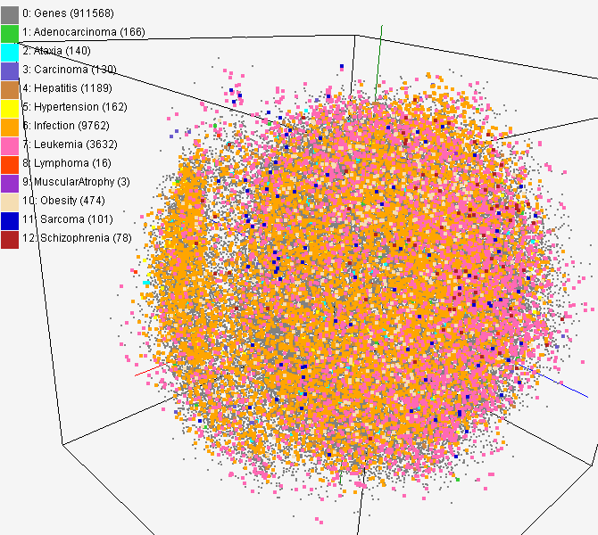

## Table of Contents

## What are high-dimensional statistical models and why are they important in trading?

High-dimensional statistical models are tools used to analyze data that has many variables or features. In trading, this could mean looking at lots of different things like stock prices, company news, economic reports, and more all at once. These models help traders make sense of all this information by finding patterns and relationships that might be hard to see otherwise. They use advanced math and computer power to handle all these variables, which is why they're called "high-dimensional."

These models are important in trading because they can help traders make better decisions. By looking at many different pieces of information together, traders can get a fuller picture of what's happening in the market. This can lead to spotting opportunities that others might miss or understanding risks better. For example, a high-dimensional model might show that certain news events, combined with specific economic indicators, tend to move stock prices in a certain way. This knowledge can help traders predict market movements more accurately and manage their investments more effectively.

## How do high-dimensional models differ from traditional statistical models?

High-dimensional models and traditional statistical models differ mainly in how they handle data. Traditional models work well with data that has a small number of variables. They look at things like the average, the spread of data, and how variables relate to each other in simple ways. These models are easier to understand and use because they focus on fewer pieces of information at a time. For example, a traditional model might look at just stock prices and trading volume to predict future prices.

On the other hand, high-dimensional models are designed to handle data with many more variables. They can look at hundreds or even thousands of pieces of information all at once. This is useful when you want to understand complex systems where many factors might be at play. For instance, in trading, a high-dimensional model might consider stock prices, economic reports, company news, social media sentiment, and more. These models use advanced math and computer power to find patterns and relationships that traditional models might miss. This makes them very powerful but also more complex to use and interpret.

## What are some common high-dimensional statistical techniques used in trading?

One common high-dimensional statistical technique used in trading is Principal Component Analysis (PCA). PCA helps traders by taking a lot of data and finding the most important parts of it. Imagine you have a bunch of different pieces of information like stock prices, interest rates, and news about companies. PCA can look at all this and figure out which pieces are most important for understanding what's happening in the market. This helps traders focus on what really matters and can make their predictions more accurate.

Another technique is Lasso Regression. This method is great for [picking](/wiki/asset-class-picking) out which of the many variables really affect the thing you're trying to predict, like future stock prices. Lasso can ignore the less important variables and focus on the key ones. This makes it easier for traders to understand which factors are driving the market and make better decisions based on that knowledge.

Lastly, there's Machine Learning, which includes techniques like Random Forests and Neural Networks. These methods can handle tons of data and find complex patterns that simpler models might miss. For example, a Random Forest can look at lots of different pieces of information and figure out how they all work together to affect stock prices. Neural Networks can learn from past data to predict future trends, making them very useful for traders trying to stay ahead in the market.

## How can high-dimensional models help in predicting market trends?

High-dimensional models can help in predicting market trends by looking at lots of different pieces of information all at once. Imagine you're trying to guess what will happen to stock prices. You might look at things like the news, what people are saying on social media, economic reports, and even the weather. A high-dimensional model can take all these pieces of information and find patterns that might be hard to see otherwise. For example, it might notice that when certain news comes out and the economy is doing well, stock prices tend to go up. This helps traders make better guesses about where the market is heading.

These models are really good at finding connections between lots of different things. They use fancy math and computers to handle all this data. By doing this, they can spot trends that simpler models might miss. For instance, a high-dimensional model might see that when interest rates go up and there's good news about a company, its stock price usually goes up too. Traders can use this information to make smarter decisions about buying and selling stocks. So, high-dimensional models give traders a clearer picture of what might happen next in the market.

## What are the challenges of implementing high-dimensional models in trading?

One big challenge of using high-dimensional models in trading is dealing with so much data. These models look at a lot of different things all at once, like stock prices, news, and even social media. It can be hard to make sure all this data is correct and up-to-date. If some of the data is wrong or missing, the model might make bad predictions. Also, it takes a lot of computer power to handle all this information, which can be expensive and slow.

Another challenge is understanding and explaining what the model is doing. High-dimensional models use complicated math to find patterns in the data. This can make it hard for traders to understand why the model is making certain predictions. If traders can't explain why the model thinks the market will go up or down, it can be tough to trust the model's advice. This is especially important when making big trading decisions that could affect a lot of money.

Lastly, there's the risk of overfitting. This happens when a model gets too focused on the data it's been trained on and doesn't work well with new data. In trading, markets can change quickly, so a model that works today might not work tomorrow. Traders need to keep checking and updating their models to make sure they're still useful. This can take a lot of time and effort.

## How does dimensionality reduction play a role in high-dimensional trading models?

Dimensionality reduction is like cleaning up a messy room full of toys. In trading, you have a lot of different pieces of information, like stock prices, news, and economic reports. It can be hard to see what's important when there's so much stuff around. Dimensionality reduction helps by picking out the most important pieces of information and putting them in a neat pile. This makes it easier for traders to understand what's going on and make better decisions.

By using techniques like Principal Component Analysis (PCA), traders can take all this information and find the key parts that really matter. Imagine you're trying to predict what will happen to stock prices. Instead of looking at every single piece of data, PCA can show you which pieces are most important for making good guesses. This helps traders focus on what really drives the market, making their predictions more accurate and their trading strategies more effective.

## What are some examples of successful applications of high-dimensional models in trading?

One successful application of high-dimensional models in trading is in the field of [algorithmic trading](/wiki/algorithmic-trading). Big banks and hedge funds use these models to look at tons of data all at once, like stock prices, news, and even social media. By finding patterns in all this information, they can make better guesses about where the market is heading. For example, a [hedge fund](/wiki/hedge-fund-trading-strategies) might use a high-dimensional model to spot when certain news events and economic reports line up in a way that usually makes stock prices go up. This helps them buy stocks at the right time and make more money.

Another example is in risk management. High-dimensional models help traders understand how different things, like interest rates and company news, can affect their investments. By looking at all these factors together, traders can see the bigger picture and make smarter choices about how to protect their money. For instance, a bank might use a high-dimensional model to figure out how changes in the economy could hurt their stock portfolio. This way, they can take steps to avoid big losses and keep their investments safe.

## How do you assess the performance of high-dimensional models in a trading environment?

To assess the performance of high-dimensional models in a trading environment, you need to look at how well they predict what will happen in the market. One way to do this is by using [backtesting](/wiki/backtesting). This means you take the model and see how it would have done if you used it in the past. You compare the model's guesses about stock prices with what actually happened. If the model's predictions are usually close to the real results, that's a good sign. Another important thing to check is how much money the model could have made or lost. You want to see if the model's trading suggestions would have led to profits over time.

Another way to assess these models is by looking at their accuracy and reliability. You can use measures like the Sharpe ratio, which tells you how much return you get for the risk you take. A higher Sharpe ratio means the model is doing a good job of making money while keeping risk low. It's also important to check if the model is overfitting. This happens when the model works great on old data but not so well on new data. To avoid this, you can split your data into training and testing sets. The model learns from the training set and then you test it on the new data to see if it still works well. This helps make sure the model will be useful for future trading decisions.

## What are the computational requirements for running high-dimensional models in real-time trading?

Running high-dimensional models in real-time trading needs a lot of computer power. These models look at tons of data all at once, like stock prices, news, and even social media. To handle all this information quickly, you need fast computers with a lot of memory. This can be expensive, but it's important because trading happens fast and you need the model's predictions right away to make good decisions.

Another thing to think about is the software you use. High-dimensional models use complicated math, so you need special programs that can do these calculations quickly. Sometimes, you might need to use more than one computer working together to get the job done fast enough. This is called parallel computing, and it helps make sure the model can keep up with the fast pace of trading.

## How can overfitting be managed in high-dimensional statistical models for trading?

Overfitting in high-dimensional statistical models for trading happens when the model gets too focused on the data it's been trained on and doesn't work well with new data. This can be a big problem because markets change all the time, and a model that works today might not work tomorrow. To manage overfitting, traders can use a technique called cross-validation. This means splitting the data into different parts, using some parts to train the model and other parts to test it. By doing this, you can see if the model is good at predicting new data, not just the data it was trained on.

Another way to manage overfitting is by using regularization techniques like Lasso or Ridge regression. These methods help the model focus on the most important pieces of information and ignore the less important ones. This makes the model simpler and less likely to overfit. Traders also need to keep updating their models with new data and checking how well they're doing. By staying on top of things and making changes when needed, traders can keep their high-dimensional models working well and avoid the problems caused by overfitting.

## What advanced techniques exist for feature selection in high-dimensional trading models?

One advanced technique for feature selection in high-dimensional trading models is called Lasso Regression. Lasso helps by looking at all the different pieces of information, like stock prices and news, and figuring out which ones are really important for making good guesses about the market. It does this by shrinking the less important pieces to zero, so the model only focuses on the key factors. This makes the model simpler and less likely to get confused by too much data, which is a big help in trading where things can change quickly.

Another technique is called Random Forests. This method works by creating lots of little decision trees, each looking at different pieces of the data. By putting all these trees together, Random Forests can figure out which pieces of information are the most useful for predicting things like stock prices. It's like having a team of experts, each looking at different parts of the puzzle, and then combining their insights to make the best decision. This helps traders understand which factors really drive the market and make smarter trading choices.

A third technique is Recursive Feature Elimination (RFE). RFE works by starting with all the pieces of information and then, one by one, removing the least important ones. It keeps testing the model to see how well it does after each piece is taken away. This way, RFE can find the smallest set of information that still helps the model make good predictions. For traders, this means they can focus on the most important data and make their trading strategies more effective without getting bogged down by too many details.

## How do regulatory considerations impact the use of high-dimensional models in trading?

Regulatory considerations can have a big impact on how traders use high-dimensional models. These models look at a lot of different pieces of information all at once, which can be very helpful for making good guesses about the market. But, regulators want to make sure that trading is fair and safe. They might set rules about what kind of data you can use and how you can use it. For example, some data might be private or sensitive, and using it could break the rules. Also, regulators might want to know how the model works and how it makes its predictions. If the model is too complicated to explain, it might be hard to use it in a way that follows the rules.

Another way regulatory considerations come into play is through transparency and accountability. Regulators want to make sure that traders are not using high-dimensional models to do things that could hurt the market or other traders. This means traders might need to keep good records of how their models work and what decisions they make based on the model's predictions. If something goes wrong, like a big loss or a market crash, regulators might want to look at these records to see if the model did anything wrong. So, while high-dimensional models can be very powerful tools for trading, traders need to be careful to use them in a way that follows the rules and keeps the market fair and safe for everyone.

## What is the key to understanding high-dimensional statistical models?

High-dimensional statistical models are integral in processing and analyzing datasets characterized by having more variables than observations. Such datasets frequently arise in fields like genomics, image processing, and notably, algorithmic trading. These models are essential for uncovering latent structures and making accurate predictions from intricate data configurations. A significant challenge in high-dimensional settings is the "curse of dimensionality," wherein traditional statistical techniques fall short due to the complexity introduced by numerous variables. 

One of the principal techniques employed is dimensionality reduction, which aims to simplify the model without losing critical information. Principal Component Analysis (PCA) is a widely-used method in this regard. PCA transforms the original set of variables into a new set of uncorrelated variables called principal components. These components are ordered such that the first few retain most of the variation present in the original data. Mathematically, PCA involves the eigendecomposition of the covariance matrix of the data, allowing for a reduced-dimensional representation that preserves essential trends:

$$
X = W \cdot Z
$$

Where $X$ is the original data matrix, $W$ is the matrix of eigenvectors, and $Z$ is the matrix of principal components.

Advanced [machine learning](/wiki/machine-learning) algorithms further complement these techniques by managing high-dimensional data optimally. Algorithms such as random forests, support vector machines (SVM), and neural networks are proficient in processing high-dimensional inputs to identify patterns and generate predictions that guide trading decisions. Machine learning models can discover non-linear and complex relationships that traditional statistical models might miss, thereby enhancing decision-making processes. 

By leveraging these high-dimensional models, traders can execute data-driven strategies that maximize profitability while minimizing associated risks. In trading, these models assess vast historical datasets to predict future price movements and identify optimal points for executing trades. This statistical acumen allows for an evidence-based approach to navigating the financial markets, balancing potential returns against risks, and effectively managing portfolios.

In conclusion, high-dimensional statistical models offer powerful tools for interpreting and predicting outcomes from complex datasets with numerous interrelated variables. Their application in trading underscores their capacity for transforming massive amounts of untapped data into actionable insights, thereby facilitating informed decision-making and strategic trading practices.

## What are some case studies and real-world examples?

High-dimensional statistical models have been increasingly utilized in trading to enhance predictive accuracy and optimize decision-making processes. These models play a crucial role in forecasting stock price movements and [volatility](/wiki/volatility-trading-strategies), allowing traders to conduct more informed and timely transactions.

One significant case study involves applying high-dimensional models to predict stock price movements. Researchers have employed techniques such as LASSO regression, which is particularly effective in selecting significant predictors from large datasets. LASSO (Least Absolute Shrinkage and Selection Operator) is suitable for high-dimensional data as it imposes a penalty on the absolute size of the coefficients, effectively shrinking some to zero and thus performing variable selection. The predictive formula used in LASSO is:

$$
\hat{\beta} = \arg \min_{\beta} \left( \sum_{i=1}^n (y_i - x_i^T \beta)^2 + \lambda \sum_{j=1}^p |\beta_j| \right)
$$

where $y_i$ is the response variable (e.g., stock price), $x_i$ is the predictor variable, $\beta$ is the coefficient vector, $\lambda$ is the tuning parameter, and $p$ is the number of predictors.

Empirical research has demonstrated that these models significantly enhance trading performance by accurately identifying patterns and relationships within the data that traditional models might overlook. High-dimensional models can capture market microstructure nuances, leading to better predictions of price trends.

In the context of volatility prediction, high-dimensional models have been applied to assess the impact of various market factors on price volatility. One real-world application involved the use of machine learning algorithms like Random Forests and Support Vector Machines (SVM) to analyze a vast array of financial indicators. These models, known for their high adaptability and precision, have proven effective in predicting periods of high volatility, allowing traders to adjust their strategies accordingly.

Additionally, [alternative data](/wiki/best-alternative-data) sources, such as social media sentiment and news feeds, have been incorporated into high-dimensional models to forecast stock returns and volatility. Sentiment analysis algorithms process unstructured data, transforming it into structured insights that can be used in conjunction with traditional financial metrics.

In summary, real-world applications of high-dimensional statistical models in trading illustrate their potential to enhance predictive accuracy and optimize trading strategies. By processing large and complex datasets, these models provide traders with a competitive edge, enabling them to make data-driven decisions in a dynamic and multifaceted market environment.

## References & Further Reading

[1]: ["Advances in Financial Machine Learning"](https://www.amazon.com/Advances-Financial-Machine-Learning-Marcos/dp/1119482089) by Marcos Lopez de Prado

[2]: James, G., Witten, D., Hastie, T., & Tibshirani, R. (2013). ["An Introduction to Statistical Learning with Applications in R."](https://link.springer.com/book/10.1007/978-1-0716-1418-1) Springer.

[3]: Hastie, T., Tibshirani, R., & Friedman, J. (2009). ["The Elements of Statistical Learning: Data Mining, Inference, and Prediction."](https://link.springer.com/book/10.1007/978-0-387-84858-7) Springer Series in Statistics.

[4]: Tsay, R. S. (2010). ["Analysis of Financial Time Series."](https://onlinelibrary.wiley.com/doi/book/10.1002/9780470644560) Wiley.

[5]: ["Machine Learning for Algorithmic Trading"](https://github.com/stefan-jansen/machine-learning-for-trading) by Stefan Jansen

[6]: Liu, J., Wang, K., & Xing, Y. (2014). ["Quantitative Trading Techniques and Critical Review in Modern Financial Markets."](https://www.cambridge.org/core/journals/journal-of-financial-and-quantitative-analysis/article/abs/using-stocks-or-portfolios-in-tests-of-factor-models/55F4B00F2EE2BDEBD5F0C3EEB9752C96) IEEE.

[7]: ["Quantitative Trading: How to Build Your Own Algorithmic Trading Business"](https://www.amazon.com/Quantitative-Trading-Build-Algorithmic-Business/dp/1119800064) by Ernest P. Chan

[8]: Hastie, T., Tibshirani, R., & Wainwright, M. (2015). ["Statistical Learning with Sparsity: The Lasso and Generalizations."](https://www.taylorfrancis.com/books/mono/10.1201/b18401/statistical-learning-sparsity-trevor-hastie-martin-wainwright-robert-tibshirani) CRC Press.

[9]: Bodie, Z., Kane, A., & Marcus, A. J. (2019). ["Investments"](https://www.mheducation.com/highered/product/Investments-Bodie.html) McGraw-Hill Education.