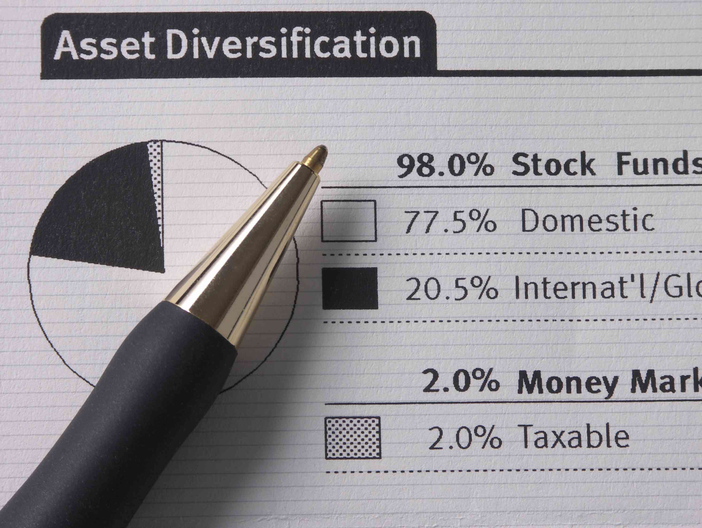

Investing provides a vast array of opportunities and strategies, each accompanied by its own set of costs and fees. Navigating these financial charges, particularly mutual fund fees and investment costs, is essential for maximizing returns. Comprehending these expenses allows investors to make informed decisions that align with their financial objectives.

Mutual funds, for instance, involve fees that can significantly impact net returns. These include management fees, often charged as a percentage of assets under management, and various other administrative fees. Each fee influences the ultimate profitability of the investment, requiring careful evaluation against expected returns.



The advent of Exchange-Traded Funds (ETFs) has introduced a cost-effective alternative, particularly favored for their generally lower expense ratios and absence of certain fees. This has prompted a significant shift towards ETFs among cost-conscious investors aiming to optimize their portfolio management strategies.

Additionally, algorithmic trading plays an increasingly prominent role in managing and executing investment strategies. Automating the trading process can reduce transaction costs and capture market inefficiencies, providing investors a competitive advantage in cost management.

By exploring fee structures and implementing cost-saving strategies, investors can strategically enhance their net returns. As such, understanding these financial dynamics is imperative for making judicious investment decisions and achieving long-term financial success.

## Table of Contents

## Understanding Mutual Fund Fees

Mutual funds are investment vehicles that pool funds from multiple investors to create a diversified portfolio of securities, including stocks, bonds, and other assets. The professional management of these funds necessitates various fees, impacting the overall returns for investors. Understanding these fees is essential for evaluating the true cost of investing in mutual funds.

**Management Fees:**
One of the primary expenses associated with mutual funds is the management fee. This fee compensates the fund managers for their expertise in making investment decisions and managing the portfolio. Typically expressed as a percentage of the total assets under management, management fees can vary significantly between funds. For actively managed funds, where managers actively select and trade investments to outperform the market, these fees tend to be higher compared to passively managed funds.

**12b-1 Fees:**
12b-1 fees are marketing and distribution fees that mutual funds may charge to cover the costs of selling the fund, such as advertising and compensating brokers. These fees can be up to 1% of a fund’s net assets per annum [1]. Although they aim to attract new investors and grow the fund’s assets, they also impose an additional cost burden on current investors.

**Account Fees:**
Account fees can be charged for maintaining an investor's account, which may include charges for activity or inactivity. These are less common but can add to the costs associated with holding mutual fund shares.

**Expense Ratio:**
The expense ratio is a critical metric that encompasses most of the ongoing costs of running a mutual fund, including management fees, 12b-1 fees, and other operational expenses. It is expressed as a percentage of the fund’s average net assets. A higher expense ratio indicates that a larger portion of the fund’s earnings is used to cover costs, thereby reducing the returns passed on to investors. For example, a fund with an annual return of 5% and an expense ratio of 1.5% would only provide a net return of 3.5% to investors.

Mathematically, the impact of the expense ratio can be calculated using:

$$
\text{Net Return} = \text{Gross Return} - \text{Expense Ratio}
$$

**Evaluating Fees:**
When considering mutual fund investments, investors must evaluate these fees against potential returns. High fees can erode gains, particularly in low-return environments. The key is to balance the cost with the fund's potential to achieve the investment objectives. Conducting a comprehensive assessment of fees within the context of a fund's historical performance, risk profile, and investment strategy is crucial for making informed investment decisions.

In conclusion, a clear understanding of mutual fund fees is indispensable for investors aiming to maximize their net returns. By scrutinizing management fees, 12b-1 fees, and the overall expense ratio, investors can better evaluate the financial implications of mutual fund investments and choose options that align with their financial goals.

**References:**
[1] Financial Industry Regulatory Authority. "Mutual Funds: Fees and Expenses."

## Breaking Down ETF Fees

Exchange-Traded Funds (ETFs) have gained popularity among investors due to their cost-effectiveness. Unlike mutual funds, which often involve active management and higher associated costs, ETFs typically benefit from passive management. This passive management leads to significantly lower expense ratios. The expense ratio is a crucial metric for investors, as it represents the annual fee that all shareholders pay for the fund's operating expenses, usually expressed as a percentage of the assets under management.

A significant advantage of ETFs is the absence of 12b-1 fees, which are marketing or distribution fees associated with traditional mutual funds. The absence of these fees further reduces the overall cost of investing in ETFs. Lower expense ratios and the lack of 12b-1 fees make ETFs an appealing choice for cost-conscious investors who aim to minimize investment costs while maintaining portfolio diversification.

To optimize investment strategies, understanding the [ETF](/wiki/etf-trading-strategies) fee structure is essential. The primary costs associated with ETFs include:

1. **Expense Ratio**: This is the most prominent fee in ETFs, reflecting the fund's operational costs divided by the average assets. Lower ratios are often preferred as they suggest minimal erosion of returns.

2. **Trading Commissions**: While ETFs trade like stocks, purchasing or selling ETF shares may incur trading fees or commissions. However, many brokerages now offer commission-free ETF trades, enhancing their cost-effectiveness.

3. **Bid-Ask Spreads**: The difference between the highest price a buyer is willing to pay and the lowest price a seller will accept. A narrower spread indicates lower costs for investors.

Investors must carefully evaluate these costs in light of their investment strategies and goals. For instance, frequent trading within an ETF could incur higher costs due to bid-ask spreads and potential commissions, despite the generally low expense ratio. Conversely, a buy-and-hold strategy would primarily benefit from the low expense ratio with minimal trading costs.

By understanding and managing these fees, investors can make informed, strategic decisions that enhance portfolio efficiency and profitability. This cost-conscious approach to selecting ETFs aligns with the broader goal of minimizing investment expenses while maximizing returns.

## Comparing Mutual Fund and ETF Fees

When evaluating investment options, understanding the cost structures of mutual funds and Exchange-Traded Funds (ETFs) is essential for developing an effective investment strategy. Both financial products aggregate investor capital to create diversified portfolios, but they differ notably in their fee structures, which can significantly impact net returns.

**Cost Advantage of ETFs**

ETFs are generally recognized for their cost efficiency, primarily owing to their passive management style and the absence of 12b-1 fees, which are marketing or distribution fees paid by mutual funds. The expense ratios of ETFs are typically lower because they often track an index and do not require the active management that mutual funds demand. These lower fees can be directly translated into better net returns for investors, especially over long investment horizons.

**Fees Associated with Mutual Funds**

In contrast, mutual funds often incur higher costs due to active management. Active management involves constant buy-and-sell decisions made by fund managers aiming to outperform market indices, which leads to higher management fees. In addition to these fees, mutual funds may also charge load fees, which are sales charges paid when buying or selling the fund. The cumulative effect of these fees can erode investor returns, making it critical to assess their impact when choosing mutual funds over ETFs.

**Investment Strategy Considerations**

Investors must weigh these differing cost structures against their investment goals and strategies. For instance, an investor seeking to minimize expenses may lean towards ETFs, capitalizing on their lower fees and potential for similar market returns through passive index tracking. Conversely, an investor who prioritizes potential market outperformance and is willing to bear higher fees might consider active mutual funds.

Given these considerations, choosing between mutual funds and ETFs requires a careful analysis of expense ratios, management style, and additional fees such as load and 12b-1 fees. By aligning these factors with individual financial objectives and risk tolerance, investors can achieve optimum returns and enhance their overall investment strategy.

Ultimately, understanding the nuances of these fee structures and their implications is fundamental to making informed decisions that align with one's investment goals.

## The Role of Algorithmic Trading in Investment

Algorithmic trading refers to the use of computer algorithms to automate the execution of trades in financial markets. This automation leads to significant cost savings for investors by optimizing the execution process and reducing transaction costs. Unlike traditional trading methods, [algorithmic trading](/wiki/algorithmic-trading) can process a vast amount of market data and execute orders at speeds and efficiencies impossible for human traders to achieve manually.

#### Cost Savings through Optimization

One of the primary benefits of algorithmic trading is its ability to minimize trading costs. This is achieved through optimized trade execution, which involves determining the best possible price and timing for a trade. Algorithms can analyze various market conditions, such as [liquidity](/wiki/liquidity-risk-premium) and [volatility](/wiki/volatility-trading-strategies), to execute trades that balance the trade-off between market impact and opportunity cost. This is especially beneficial in large [volume](/wiki/volume-trading-strategy) trades, where market impact can significantly affect the trade execution price. 

#### Capturing Market Inefficiencies

Algorithmic trading leverages complex mathematical models to identify and exploit market inefficiencies. These inefficiencies, often small and temporary, can be seized through rapid decision-making facilitated by algorithms. For instance, algorithms can be designed to execute high-frequency trading strategies that involve making numerous trades within fractions of a second to capture small price discrepancies. By doing so, algorithms can consistently generate profits in markets with high volatility and tight spreads.

Python code, for example, might employ libraries like NumPy and pandas to analyze and model market data for algorithmic trading purposes. Strategies can be backtested using historical data to refine algorithms before live trading. Below is a simple Python example demonstrating a moving average crossover strategy, a common technique used in algorithmic trading:

```python
import pandas as pd

# Sample market data
data = pd.read_csv('market_data.csv')  # Assume market_data.csv contains 'Date', 'Close' columns

# Calculate moving averages
data['Short_MA'] = data['Close'].rolling(window=40, min_periods=1).mean()
data['Long_MA'] = data['Close'].rolling(window=100, min_periods=1).mean()

# Determine buy/sell signals
data['Signal'] = 0
data['Signal'][40:] = np.where(data['Short_MA'][40:] > data['Long_MA'][40:], 1, 0)

# Generate trading orders
data['Position'] = data['Signal'].diff()

# Display first few rows with signals
print(data.head())
```

#### Competitive Edge

Investors who utilize algorithmic trading gain a competitive advantage in managing their investment costs. By automating the trading process, they can reduce human error, increase efficiency, and execute complex strategies that would be challenging and time-consuming to implement manually. These efficiencies not only lower transaction costs but also improve overall investment returns.

Algorithmic trading also allows for more disciplined and consistent trading strategies. The automation ensures that trades adhere to predefined rules and parameters, reducing emotional and impulsive decision-making that can negatively impact trading performance.

In conclusion, algorithmic trading plays an integral role in modern investment, offering a sophisticated approach to managing costs and improving profitability. By leveraging the power of automation and advanced algorithms, investors can enhance their trading effectiveness and achieve superior investment outcomes.

References:

1. Financial Industry Regulatory Authority. "Algorithmic Trading: Pros and Cons."
2. U.S. Securities and Exchange Commission. "Algorithmic Trading in Financial Markets."

## Strategies to Minimize Investment Costs

Minimizing investment costs is essential for maximizing net returns and achieving financial success. One effective approach is selecting low-cost brokerage services and investment funds. Many brokerage firms offer competitive pricing, with lower commission rates and reduced fees for trading and account maintenance. Opting for investment funds with lower expense ratios, such as index funds or certain exchange-traded funds (ETFs), can also significantly reduce costs over time.

Optimizing trading strategies is another way to minimize expenses. This involves planning trades to take advantage of lower transaction costs and minimizing unnecessary trading, which can incur additional fees. Additionally, utilizing tax-efficient methods, like tax-loss harvesting or investing in tax-advantaged accounts such as IRAs or 401(k)s, can help reduce taxable income and enhance returns.

Regularly reviewing and adjusting investment portfolios ensures alignment with financial goals. This involves evaluating performance, reassessing asset allocations, and making necessary adjustments to maintain an optimal balance. By keeping portfolios well-aligned with investment objectives, investors can ensure cost-efficiency and performance optimization.

Adopting these strategies contributes to enhanced net returns, providing a solid foundation for long-term financial success. Continuous vigilance in managing costs and strategic portfolio management enables investors to navigate financial markets more effectively and achieve their financial aspirations.

## Conclusion

Investment costs, including mutual fund fees and brokerage charges, are crucial elements influencing investment success. The impact of these expenses can be significant over the long term, affecting net returns and ultimately an investor's financial goals. A comprehensive understanding and strategic management of these costs can position investors for enhanced profitability and financial growth.

Algorithmic trading emerges as a formidable tool for optimizing costs in modern investment strategies. By automating the execution of trades, algorithmic trading not only accelerates decision-making but also capitalizes on market efficiencies to reduce transaction costs. This automation allows for precision in trade timings and enhances execution quality, delivering cost advantages to investors who incorporate these sophisticated strategies into their portfolios.

Successful investing requires continuous evaluation of fee structures and a proactive approach to adapt to technological and regulatory changes. The investment landscape is dynamic, with innovations in financial products and services reshaping cost paradigms. Staying informed about the latest developments in algorithmic trading systems and fee adjustments in mutual funds and ETFs is essential for maintaining a competitive edge.

In conclusion, effectively managing investment costs through strategic choices and the adoption of advanced trading technologies can significantly impact an investor’s long-term success. As the industry evolves, continuous adaptation and a vigilant approach to fee analysis will ensure that investors are well-positioned to optimize returns and achieve their financial objectives.

## References & Further Reading

Financial Industry Regulatory Authority. "Mutual Funds: Fees and Expenses." This resource provides an in-depth analysis of the various fees associated with mutual funds, including management fees, 12b-1 fees, and account fees. Understanding these expenses is essential for investors aiming to optimize their mutual fund investments.

U.S. Securities and Exchange Commission. "Mutual Funds and Exchange-Traded Funds (ETFs) – A Guide for Investors." This guide offers valuable insights into the differences between mutual funds and ETFs, focusing on their structures, costs, and potential benefits for investors. It is a crucial resource for anyone looking to make informed investment decisions.

Investment Company Institute. "Exchange-Traded Funds: A Guide to Understanding ETFs." This guide simplifies the complexities surrounding exchange-traded funds, emphasizing their cost-effectiveness and role in diversified investment strategies. It is beneficial for both novice and experienced investors.

FINRA. "Algorithmic Trading: Pros and Cons." This publication explores the advantages and challenges of algorithmic trading, highlighting its role in reducing transaction costs and enhancing trade execution. Understanding algorithmic trading is vital for investors seeking to leverage technology in managing their investments efficiently.

