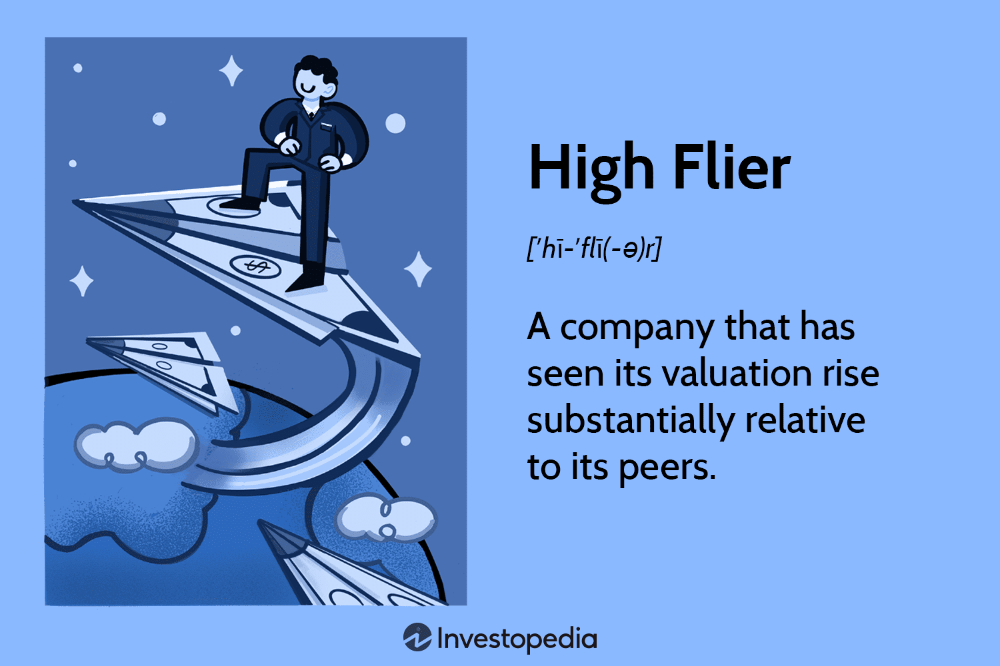

Algorithmic trading has transformed the landscape of the financial markets, pushing the boundaries of what is achievable through automation and technology. Utilizing sophisticated computer algorithms, traders can execute orders at speeds and frequencies that no human trader could match. This has opened up new horizons for individuals seeking to excel in the trading world, offering high-growth opportunities in a fast-paced environment that remains at the cutting edge of technological innovation.

For ambitious individuals looking to capitalize on these advancements, algo trading presents a unique opportunity to combine technological prowess with financial acumen. The field demands a blend of skills ranging from programming and quantitative analysis to a keen understanding of market dynamics. As a result, the potential for career advancement is significant, especially for those who can navigate the complexities and capitalize on the rapid developments within this domain.



The focus of this article is to explore how aspiring traders can effectively leverage algorithmic trading to achieve career success. Starting from understanding the fundamentals of algo trading to acquiring the necessary skills and knowledge, the path to building a successful career in this area can be both rewarding and challenging. With the ever-evolving landscape of financial markets, staying informed and adaptable remains crucial for achieving and sustaining success.

## Table of Contents

## Understanding Algorithmic Trading

Algorithmic trading, or algo trading, is a process that utilizes computer algorithms to automate the execution of trading activities in financial markets. These algorithms operate at high speeds and with precise accuracy, enabling traders to capitalize on fleeting market opportunities that are often inaccessible to human traders. The essence of algorithmic trading lies in its capability to execute orders at the most favorable conditions, circumventing human limitations such as reaction time and trading frequency.

At the core of algorithmic trading is the concept of speed and accuracy. High-frequency trading ([HFT](/wiki/high-frequency-trading-strategies)), a subset of algorithmic trading, exemplifies this by executing a large number of orders within fractions of a second. HFT firms use sophisticated algorithms to analyze multiple markets and execute orders based on market conditions, often benefiting from arbitrage opportunities. High-frequency trading has transformed financial markets by increasing [liquidity](/wiki/liquidity-risk-premium) and narrowing bid-ask spreads.

Despite its advantages, algorithmic trading presents several challenges. One significant challenge is ensuring data quality, as the success of trading algorithms heavily relies on accurate, timely, and comprehensive data. Poor quality data can lead to incorrect analyses and erroneous trading decisions. Traders must implement robust data management systems to retrieve and process data efficiently.

Another challenge in [algorithmic trading](/wiki/algorithmic-trading) is regulatory compliance. Financial markets are subject to stringent regulations to ensure market integrity and protect investors. Algorithmic trading strategies must comply with these regulations, which can vary significantly across different jurisdictions. Traders and firms need to keep abreast of regulatory developments and ensure that their algorithms incorporate necessary controls to prevent market abuse such as spoofing or placing fake orders to manipulate stock prices.

In summary, algorithmic trading combines speed and accuracy with advanced technologies to reshape the financial trading landscape. By navigating the challenges of data quality and regulatory compliance, ambitious individuals can leverage algorithmic trading to gain a competitive edge in the investment industry.

## The High Flier Phenomenon in Trading

The term 'high flier' in trading refers to stocks that experience rapid appreciation in their market valuation, often reaching significantly high price levels compared to their historical performance or fundamental value. These stocks belong to companies demonstrating strong growth potential, innovative products, or revolutionary market strategies which attract investor enthusiasm. High fliers are distinguished by their elevated price-to-earnings (P/E) ratios and are often traded at prices that reflect high expectations for future growth.

High fliers can have a profound impact on market dynamics. Due to their soaring valuations, they can influence market indices and investor sentiment, often setting the tone for bullish trends. These stocks frequently capture headlines and become focal points of discussions about market overvaluation and speculative bubbles. The potential for substantial gains attracts a variety of investors, from institutional to retail traders, hoping to capitalize on short-term price movements.

However, there is considerable debate regarding the sustainability of high fliers in the stock market. Critics argue that these stocks are driven by speculative investment rather than intrinsic value, leading to heightened [volatility](/wiki/volatility-trading-strategies) and increased risk of price corrections. The rapid ascent of high fliers can outpace underlying fundamentals, overshooting intrinsic value and creating bubbles that can eventually burst, resulting in sharp declines, commonly referred to as market corrections or crashes. Historical examples, such as the dot-com bubble of the late 1990s, highlight the risks of investing heavily in overvalued high-flying stocks.

Ambitious individuals in trading can learn critical lessons from both the ascent and descent of high fliers. Understanding the behavioral finance aspects, such as investor psychology and market sentiment, can offer insights into identifying potential high fliers before they surge in value. Moreover, analyzing the fall of high fliers underscores the importance of risk management and due diligence. Relying solely on [momentum](/wiki/momentum) can lead to significant losses, highlighting the need for a balanced investment strategy that considers both technical indicators and [fundamental analysis](/wiki/fundamental-analysis).

By studying past and present high fliers, individuals can refine their trading strategies, recognizing the potential for high returns while being mindful of the inherent risks. This balanced approach can bolster resilience, equipping traders with the necessary skills to thrive in rapidly changing markets.

## Skills Required for a Career in Algo Trading

Algorithmic trading, a field at the intersection of finance and technology, requires a unique set of skills to develop and maintain effective trading strategies. At the core of these skills is programming proficiency, which is critical for developing robust and efficient trading algorithms. Programming languages such as Python, C++, and Java are commonly used, with Python being particularly popular due to its extensive libraries and ease of use for data analysis and [machine learning](/wiki/machine-learning).

Quantitative analysis and financial modeling are also foundational. These skills enable traders to create models that can predict market movements and assess the potential profitability of trades. This involves using statistical methods to analyze data and identify trends, as well as developing mathematical models that simulate various trading scenarios. For instance, traders might use regression analysis to identify correlations between different financial instruments, or employ stochastic calculus for modeling price movements.

Data analysis and machine learning have become essential in modern trading strategies. Traders need to analyze large datasets to extract meaningful insights that can inform their trading decisions. Techniques such as natural language processing (NLP) can be used to analyze news articles or social media feeds for market sentiment, while machine learning algorithms can be employed to improve the accuracy of market predictions. Implementing machine learning models often requires knowledge of libraries such as TensorFlow or scikit-learn in Python.

Risk management and decision-making are critical for successful trading careers. Traders must understand the potential risks associated with their strategies and implement measures to mitigate them. This often involves using techniques such as Value at Risk (VaR) to quantify the potential loss in a portfolio, or employing Monte Carlo simulations to explore different market scenarios. Strong decision-making skills are necessary to assess market conditions and make informed trading decisions under uncertainty. Understanding these concepts allows traders to balance risk and return effectively, ensuring the sustainability of their trading strategies.

In summary, a career in algorithmic trading demands a combination of technical and analytical skills. Proficiency in programming, quantitative analysis, data analysis, machine learning, and risk management equips traders with the ability to develop and execute successful trading strategies in a technology-driven market.

## Educational Pathways and Opportunities

Entering the field of algorithmic trading typically requires a strong educational foundation that blends finance, computer science, and quantitative disciplines. These areas of study equip individuals with the skills necessary to understand complex financial markets, develop sophisticated trading strategies, and use technology optimally.

Degrees in finance offer essential insights into market behavior, financial instruments, and investment strategies. Students learn the fundamentals of economic theories, portfolio management, and risk assessment. Such programs often incorporate quantitative analysis to prepare students for data-driven decision-making processes crucial in algorithmic trading.

Computer science degrees are equally important as they provide expertise in programming, system architecture, and software development. Proficiency in languages such as Python, C++, and Java is particularly valued in algorithmic trading for designing and developing algorithmic models. Python, with its extensive libraries like Pandas and NumPy, is favored for data manipulation and analysis:

```python
import pandas as pd
import numpy as np

# Sample code to calculate moving averages
data = pd.Series([1, 2, 3, 4, 5, 6, 7, 8, 9, 10])
moving_average = data.rolling(window=3).mean()
print(moving_average)
```

Quantitative fields, including mathematics, [statistics](/wiki/bayesian-statistics), and engineering, contribute critical analytical skills. These disciplines help in understanding and applying mathematical models to predict market movements and optimize trading strategies. Often, algorithmic trading relies on statistical [arbitrage](/wiki/arbitrage), where models identify inefficiencies between price and profit.

Continuous learning is pivotal in this ever-evolving field. Specialized courses, workshops, and online platforms like Coursera, edX, and Udacity offer programs in machine learning, data science, and financial modeling to keep skills current. Many financial institutions also provide in-house training programs tailored to algorithmic trading needs.

Networking and mentorship play vital roles in career development. Building connections within the industry through conferences, seminars, and meetups can lead to new opportunities and insights into industry trends. Mentors offer guidance, share experiences, and can be instrumental in navigating career paths within algorithmic trading, providing invaluable advice on technical skills and career strategies.

In essence, a successful career in algorithmic trading requires a multidisciplinary educational background complemented by continuous learning and strategic networking. This combination equips individuals to thrive in the dynamic environment of algorithmic trading, offering career longevity and success.

## Leveraging Technology for Trading Success

Algorithmic trading has experienced a technological revolution over recent years, primarily driven by advancements in [artificial intelligence](/wiki/ai-artificial-intelligence) (AI) and machine learning (ML). These tools enable traders to automate decision-making processes, significantly enhancing the speed and efficiency of trading operations.

Algorithmic trading relies on sophisticated software to execute orders at speeds and frequencies beyond human capabality. Key technological tools in this domain include trading platforms such as MetaTrader, which support algorithm development and [backtesting](/wiki/backtesting). Additionally, application programming interfaces (APIs) like [Interactive Brokers](/wiki/interactive-brokers-api) and Alpaca allow traders to connect their algorithms directly to market data streams and execution services.

AI and ML, specifically, have introduced transformative changes in trading strategies by deploying models that learn from historical market data to predict future price movements. For example, [reinforcement learning](/wiki/reinforcement-learning) — a subset of ML — is used to optimize trading strategies by allowing algorithms to learn which actions yield the best outcomes over time. Python libraries such as TensorFlow and PyTorch facilitate the development and training of such models.

Real-world examples of successful implementations abound. Renaissance Technologies, a [hedge fund](/wiki/hedge-fund-trading-strategies) known for its Medallion Fund, famously utilizes algorithmic trading strategies heavily backed by statistical models and machine learning. Their success illustrates the potential returns from combining robust technology with sophisticated algorithms and data analysis.

Looking to the future, several technological trends are likely to impact ambitious traders. Quantum computing presents tantalizing possibilities, promising unprecedented processing powers that could revolutionize data analysis and algorithm training. Blockchain technology may also influence trading by enhancing transaction transparency and security. Furthermore, continuous improvements in AI, including enhanced natural language processing and real-time data analytics, are set to further transform trading environments.

Investing in these emerging technologies and understanding their potential applications ensures traders remain competitive in the rapidly evolving landscape of algorithmic trading.

## Building a Successful Career in Algo Trading

Building a successful career in algorithmic trading involves a series of strategic steps encompassing education, skill development, and professional networking. Here’s a comprehensive look at how to set the stage for a thriving career in this dynamic field.

### Steps to Begin a Career in Algorithmic Trading

**1. Educational Foundation:**
A solid educational background is essential. Individuals typically obtain degrees in finance, computer science, engineering, or quantitative disciplines. These programs provide foundational knowledge in mathematics, programming, and financial markets necessary for developing and understanding complex trading algorithms. Coursework in statistics, calculus, and data analysis is particularly beneficial.

**2. Building a Track Record:**
Developing and maintaining a track record is crucial for credibility and future opportunities. Aspiring algo traders can begin by creating a personal portfolio of trading algorithms. This process involves backtesting strategies on historical data to demonstrate potential profitability. Such a track record can be showcased to potential employers to highlight analytical and practical trading skills.

**3. Maintaining a Learning Mindset:**
The financial markets and technology landscapes evolve rapidly. Continuous learning is vital for staying relevant. Engaging with online courses, attending seminars, and pursuing certifications in financial modeling or data science can enhance skills and knowledge. Platforms like Coursera, edX, and Khan Academy offer relevant courses that can aid in skill development.

### Navigating Job Opportunities and Roles

Understanding the various roles within trading firms can help individuals tailor their career paths. Key roles include:

- **Quantitative Analyst (Quant):** Focuses on mathematical models to inform trading strategies.
- **Developer/Engineer:** Builds and maintains the technical infrastructure for trading platforms.
- **Trader:** Executes trades and manages portfolios, often working closely with quants to refine strategies.

Networking is essential for exploring job opportunities. Attending industry conferences, joining professional organizations, and participating in forums can provide valuable contacts and insights into the job market.

### Strategies for Continuous Growth

To remain competitive, traders must adopt strategies that ensure ongoing development:

- **Embrace Technological Advancements:** Staying abreast of technological trends such as artificial intelligence and machine learning techniques will provide a competitive edge. These technologies are increasingly integral to developing sophisticated trading algorithms.

- **Develop Risk Management Expertise:** Understanding and mitigating risk is central to a trading career. Cultivating skills in this area can help manage portfolios effectively and adapt to market volatility.

- **Cultivate Soft Skills:** While technical skills are paramount, soft skills like communication and teamwork are crucial. Traders often work in diverse teams, and effective collaboration can lead to innovative solutions and strategies.

Professional growth also involves leveraging feedback and mentorship. Seeking advice from experienced professionals can provide insights into improving strategies and advancing personal development.

By following these structured steps, ambitious individuals can build a rewarding career in algorithmic trading. The blend of technical prowess, continuous learning, and strategic networking forms the cornerstone of success in this fast-paced, technologically driven industry.

## Conclusion

Algorithmic trading presents a wealth of opportunities for ambitious individuals aiming for success in the trading industry. By integrating sophisticated algorithms with high-speed technologies, it offers a platform for high achievers to leverage both their analytical skills and technological acumen. The automation and precision of algorithmic trading can help mitigate human error, allowing traders to capture market opportunities more effectively.

The potential of algorithmic trading to fulfill career aspirations is immense. It requires a unique blend of skills, including quantitative analysis, programming, and risk management. Those who excel in these areas are well-positioned to capitalize on this high-growth field, where the speed and efficiency of machine-led operations meet the dynamic nature of financial markets. For ambitious individuals, the ability to navigate complex datasets, develop innovative algorithms, and adapt to changing market conditions is crucial.

Staying informed and adaptable is essential in the constantly evolving landscape of algorithmic trading. Continuous learning, whether through formal education or online courses, is vital to keeping up with the latest trends and technologies. As artificial intelligence and machine learning continue to advance, they provide new avenues for developing innovative trading strategies. Traders must remain vigilant to these technological changes to maintain a competitive edge.

Finally, leveraging ambition alongside technology is key to achieving trading excellence. Successful traders are those who not only understand the intricacies of algorithmic trading but also possess the drive to pursue new ideas and strategies. By fostering a mindset that embraces change and innovation, individuals can transform their ambitions into tangible career outcomes. In sum, for those willing to invest in their skills and stay abreast of technological advancements, algorithmic trading offers a promising pathway to achieve and potentially exceed career goals.

## References & Further Reading

[1]: Bergstra, J., Bardenet, R., Bengio, Y., & Kégl, B. (2011). ["Algorithms for Hyper-Parameter Optimization."](https://dl.acm.org/doi/10.5555/2986459.2986743) Advances in Neural Information Processing Systems 24.

[2]: ["Advances in Financial Machine Learning"](https://www.amazon.com/Advances-Financial-Machine-Learning-Marcos/dp/1119482089) by Marcos Lopez de Prado

[3]: ["Evidence-Based Technical Analysis: Applying the Scientific Method and Statistical Inference to Trading Signals"](https://www.amazon.com/Evidence-Based-Technical-Analysis-Scientific-Statistical/dp/0470008741) by David Aronson

[4]: ["Machine Learning for Algorithmic Trading"](https://github.com/stefan-jansen/machine-learning-for-trading) by Stefan Jansen

[5]: ["Quantitative Trading: How to Build Your Own Algorithmic Trading Business"](https://www.amazon.com/Quantitative-Trading-Build-Algorithmic-Business/dp/1119800064) by Ernest P. Chan