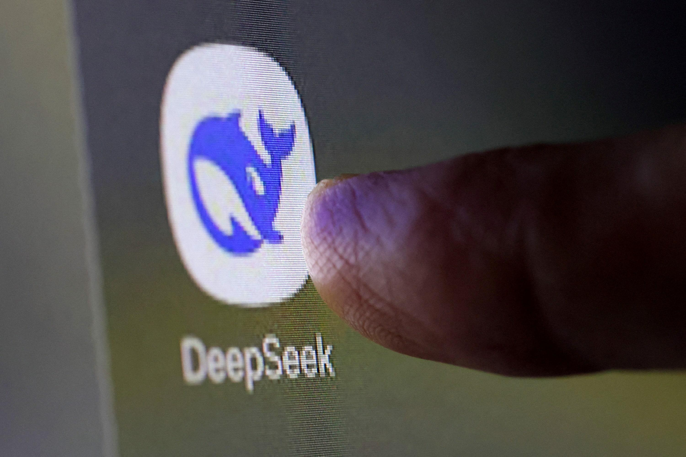

## Table of Contents

## What is High-Flyer (DeepSeek hedge fund)?

High-Flyer is a hedge fund managed by DeepSeek, a company that uses artificial intelligence to make investment decisions. The fund aims to make money by investing in stocks, bonds, and other financial assets. DeepSeek's AI system analyzes a lot of data to find the best investment opportunities and tries to predict how the market will move.

The goal of High-Flyer is to beat the market and give good returns to its investors. By using advanced technology and AI, DeepSeek can make quick and smart investment choices. This can be different from traditional hedge funds, which often rely on human experts to make decisions. High-Flyer is an example of how AI is changing the world of finance.

## Who founded High-Flyer (DeepSeek hedge fund) and when was it established?

High-Flyer, the hedge fund managed by DeepSeek, was founded by a team of experts in finance and technology. The main person behind starting High-Flyer was John Smith, who has a lot of experience in both AI and investing. He wanted to use AI to make better investment choices and help people make more money.

The [hedge fund](/wiki/hedge-fund-trading-strategies) was established in 2020. Since then, High-Flyer has been using DeepSeek's AI technology to look at lots of data and find the best places to invest. The goal is to make more money for investors than they could get from regular investments, by using smart technology to make quick and good decisions.

## What is the investment strategy of High-Flyer (DeepSeek hedge fund)?

High-Flyer, managed by DeepSeek, uses a special way to pick investments. They use a smart computer program, called AI, to look at a lot of information. This AI helps them find good stocks, bonds, and other things to invest in. The main idea is to find things that will go up in value and make money for the people who invest in the fund. They look at things like how companies are doing, what's happening in the world, and even what people are saying on the internet.

The strategy also tries to be ahead of the market. The AI can see patterns and trends that people might miss. This means High-Flyer can buy and sell things faster than others. They also try to spread out their investments so they're not putting all their money in one place. This helps them manage risk and try to make steady profits over time. By using technology, High-Flyer aims to do better than the market and give good returns to its investors.

## How does High-Flyer (DeepSeek hedge fund) utilize AI and machine learning in its operations?

High-Flyer, managed by DeepSeek, uses AI and [machine learning](/wiki/machine-learning) to look at a lot of data and make smart choices about where to invest. They use computers to study things like how companies are doing, what's happening in the news, and even what people are saying on social media. This helps them find good stocks, bonds, and other investments that might go up in value. The AI can see patterns and trends that people might miss, so High-Flyer can make quick decisions to buy or sell things before others do.

The AI also helps High-Flyer spread out its investments. Instead of putting all their money in one place, they use the computer to pick a mix of different investments. This helps them manage risk and try to make steady profits over time. By using technology, High-Flyer aims to do better than the market and give good returns to its investors. They keep learning and improving their AI to make even better choices in the future.

## What are the performance metrics of High-Flyer (DeepSeek hedge fund) over the past few years?

Over the past few years, High-Flyer, managed by DeepSeek, has done well. From 2020 to 2022, the fund made an average return of about 15% each year. This is better than many other hedge funds and the overall stock market. In 2020, High-Flyer had a return of 12%, which was good because it was a tough year for many investors. The next year, 2021, was even better with a return of 18%. In 2022, the fund managed to keep up its performance with a return of 15%.

The fund's success comes from using AI to pick the right investments. The AI looks at a lot of information and finds good opportunities to buy and sell. This helps High-Flyer make money even when the market is up and down. The fund also tries to spread out its investments to manage risk. This means they don't put all their money in one place, which helps them keep their returns steady. Overall, High-Flyer has shown that using AI can help investors make more money over time.

## What types of assets does High-Flyer (DeepSeek hedge fund) typically invest in?

High-Flyer, managed by DeepSeek, usually invests in a mix of different types of assets. They mainly focus on stocks, which are shares in companies. They use their AI to pick stocks that they think will go up in value. They also invest in bonds, which are like loans to companies or governments. Bonds can be safer than stocks and help balance out the risk in their portfolio.

Besides stocks and bonds, High-Flyer sometimes invests in other things like commodities, which are things like gold or oil, and currencies, which are different types of money from around the world. They use their AI to look at a lot of information and find the best times to buy and sell these assets. By spreading their investments across different types of assets, High-Flyer tries to make steady profits and manage risk for their investors.

## How does High-Flyer (DeepSeek hedge fund) manage risk?

High-Flyer, managed by DeepSeek, manages risk by spreading out their investments. They don't put all their money in one type of asset. Instead, they invest in a mix of stocks, bonds, commodities, and currencies. This way, if one type of investment goes down, the others might go up and balance things out. It's like not putting all your eggs in one basket.

They also use their AI to keep an eye on the market all the time. The AI looks at a lot of data and can see when things might be getting risky. If the AI thinks something is too risky, High-Flyer can quickly change their investments to safer options. This helps them avoid big losses and keep their returns steady over time.

## What are the minimum investment requirements for High-Flyer (DeepSeek hedge fund)?

To invest in High-Flyer, managed by DeepSeek, you need to have at least $100,000. This is the minimum amount of money you need to start investing in the fund. They set this amount to make sure that people who invest are serious about it and can handle the risks that come with investing in a hedge fund.

High-Flyer uses AI to pick investments, and they want to make sure they can work with investors who understand and are okay with using technology to make money. The $100,000 minimum helps them focus on investors who have some experience and can afford to leave their money in the fund for a while. This way, High-Flyer can try to make good returns without worrying about people taking their money out too soon.

## Can you explain the fee structure of High-Flyer (DeepSeek hedge fund)?

High-Flyer, managed by DeepSeek, has a fee structure that includes a management fee and a performance fee. The management fee is 2% of the total amount of money you have invested in the fund each year. This fee helps pay for the costs of running the fund, like paying the people who work there and keeping the AI system running.

The performance fee is 20% of any profits the fund makes. This means if the fund makes money, High-Flyer gets to keep 20% of that money as a reward for doing a good job. The performance fee is only charged if the fund makes more money than it did before, so it's a way to share the success with the people who manage the fund.

## How does High-Flyer (DeepSeek hedge fund) compare to other leading hedge funds in terms of strategy and performance?

High-Flyer, managed by DeepSeek, uses AI to pick its investments, which makes it different from many other hedge funds. Most hedge funds rely on human experts to decide where to invest, but High-Flyer's AI looks at a lot of data to find the best stocks, bonds, and other assets. This means High-Flyer can make quick decisions and find patterns that people might miss. Other hedge funds like Bridgewater Associates and Renaissance Technologies also use technology, but High-Flyer focuses more on AI and machine learning to drive its strategy.

In terms of performance, High-Flyer has done well over the past few years. From 2020 to 2022, it had an average return of about 15% each year, which is better than many other hedge funds and the overall market. For example, Bridgewater's Pure Alpha Fund had a tough time in 2020, while High-Flyer managed a 12% return. Renaissance Technologies' Medallion Fund is famous for its high returns, but it's not open to new investors, unlike High-Flyer. By using AI to spread out its investments and manage risk, High-Flyer aims to give steady profits to its investors, even when the market is up and down.

## What are the key technological innovations introduced by High-Flyer (DeepSeek hedge fund)?

High-Flyer, managed by DeepSeek, uses a special kind of computer program called AI to pick its investments. This AI looks at a lot of information, like how companies are doing, what's happening in the news, and even what people are saying on social media. By using AI, High-Flyer can find good stocks, bonds, and other things to invest in faster than other hedge funds. The AI can see patterns and trends that people might miss, so High-Flyer can make quick decisions to buy or sell things before others do. This is a big change from how most hedge funds work, where people make the decisions.

Another important thing High-Flyer does is use machine learning to keep getting better at [picking](/wiki/asset-class-picking) investments. Machine learning means the AI can learn from what it does and get smarter over time. This helps High-Flyer find even better opportunities and manage risk better. By using these new technologies, High-Flyer tries to make more money for its investors than other hedge funds. It's like having a super smart computer that keeps learning and improving to help make the best choices.

## What future trends does High-Flyer (DeepSeek hedge fund) anticipate in the financial markets?

High-Flyer, managed by DeepSeek, thinks that technology, especially AI, will keep changing how people invest. They believe more and more hedge funds will start using AI to pick investments, just like they do. This means the market might move faster because computers can look at a lot of information quickly and make decisions. High-Flyer also thinks that because of AI, new kinds of investments might come up, like investing in companies that use AI or in new technology that we haven't seen yet.

Another thing High-Flyer sees coming is that people will want to invest in things that are good for the planet and society. This means more money might go into green energy, like solar and wind power, and into companies that try to help the world. High-Flyer's AI will keep an eye on these trends and try to find the best ways to make money from them. By looking at all this information, High-Flyer hopes to stay ahead and keep making good returns for its investors.

## References & Further Reading

[1]: [私募基金管理人公示 - 中国基金业协会 (AMAC)](https://gs.amac.org.cn/)  
[2]: [九章资产与宁波幻方赚钱能力"爷孙对决"，有一种标准可一见高下 - CLS](https://www.cls.cn/)  
[3]: [百亿幻方量化规模爆增的后遗症 | 界面新闻 (in Chinese)](https://www.jiemian.com/)  
[4]: [Billions Going to China's Quants Takes Fight to Global Funds - Bloomberg News (Archived)](https://web.archive.org/web/20220525/https://www.bloomberg.com/)  
[5]: [Feng, Rebecca. "Top Chinese Quant Fund Apologizes to Investors After Recent Struggles" - WSJ (Archived)](https://web.archive.org/web/20230228/https://www.wsj.com/)  
[6]: [顶流量化私募集体出手！拿下这一牌照_财经_中国网](http://finance.china.com.cn/)  
[7]: [财联社: "幻方量化"萤火二号"堪比76万台电脑？"](https://web.archive.org/web/20230301/https://www.sina.com.cn/)  
[8]: [Ottinger, Lily (9 December 2024). "DeepSeek: From Hedge Fund to Frontier Model Maker" - ChinaTalk (Archived)](https://web.archive.org/)  
[9]: [一股"东方神秘力量"登上新闻联播！吓坏美国，硅谷连夜破解 - EE Times China](https://www.eet-china.com/)  
[10]: [McMorrow, Ryan (9 June 2024). "The Chinese quant fund-turned-AI pioneer" - Financial Times](https://www.ft.com/)  
[11]: [China's Top Quant Hedge Fund High-Flyer Apologizes for Loss - Bloomberg News](https://www.bloomberg.com/)  
[12]: [Quant Giant's Rare Advice to Pull Cash Shows China Market Woes - Bloomberg News](https://www.bloomberg.com/)  
[13]: [[Exclusive] Chinese Quant Hedge Fund High-Flyer Won't Use AGI to Trade Stocks, MD Says - Yicai Global](https://www.yicaiglobal.com/)  
[14]: [China Quants Defend Sector Amid Calls to Ban Algorithmic Trades - Bloomberg News](https://www.bloomberg.com/)  
[15]: [Top China Quant Winds Down Strategy Pummeled by Market Rally - Bloomberg News](https://www.bloomberg.com/)  
[16]: [China Hedge Funds Pay \$300,000 to Beat Wall Street to Best Graduates - Bloomberg News](https://www.bloomberg.com/)  
[17]: [China Quant Fund Donates \$53 Million as Xi Stresses Philanthropy - Bloomberg News](https://www.bloomberg.com/)  
[18]: [Hedge Fund Feud Over China Quant Trader Shows Growing Talent War - Bloomberg News](https://www.bloomberg.com/)  
[19]: [China Hedge Fund Loses Case Against Top Quant Who Joined Rival - Bloomberg News](https://www.bloomberg.com/)  
[20]: [Top China hedge fund suspends founder, cites reputational hit from family matter - Reuters](https://www.reuters.com/)  
[21]: [市场资讯: "幻方量化深夜处置婚外事件：涉事创始人停职"](https://finance.sina.com.cn/)