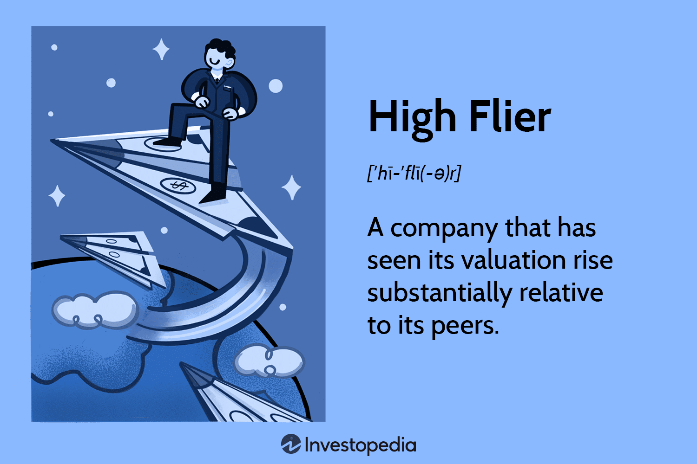

In the fast-evolving world of finance, algorithmic trading is reshaping the landscape through its precision and speed. A standout leader in this domain is High-Flyer, a China-based hedge fund merging artificial intelligence with quantitative trading to deliver exceptional results. Founded in 2015 by engineers from Zhejiang University, High-Flyer quickly established itself as a premier entity within China's financial sector. This article outlines the compelling journey of High-Flyer, examining its strategies, significant milestones, and the challenges it has encountered along the way. With its innovative approach, High-Flyer exemplifies how technology can redefine financial paradigms, setting a new benchmark in algorithmic trading.

## Table of Contents

## The Foundation of High-Flyer

High-Flyer's journey began in 2015, spearheaded by the innovative minds of Xu Jin, Zheng Dawei, and Liang Wenfeng. These three engineers, each hailing from the prestigious Zhejiang University, were deeply influenced by their academic experiences during the tumultuous 2007–2008 financial crisis. This period of economic instability underscored the volatile nature of traditional financial markets and highlighted an opportunity for transformation through the application of technology.

Drawing from the lessons of the financial crisis, the founders of High-Flyer envisioned a new era where algorithmic trading would lead the charge. Their approach was grounded in a belief that sophisticated algorithms and cutting-edge technology could outmaneuver the unpredictability of conventional market strategies. This vision not only set the foundation for High-Flyer's operations but also propelled the firm into the spotlight within China's financial sector.

Based in Hangzhou, Zhejiang—a city known for its tech innovation and entrepreneurial spirit—High-Flyer quickly established itself as a formidable force in quantitative trading. The firm's strategic location in a tech-savvy area provided access to a pool of skilled talent and facilitated collaborations with tech companies and academic institutions. This advantageous position enabled High-Flyer to scale its operations and capture significant market share, becoming one of China's largest quantitative funds in record time.

High-Flyer's foundational years were marked by a focus on blending academic rigor with practical application. This blend allowed them to develop proprietary trading algorithms that leveraged AI and [machine learning](/wiki/machine-learning) techniques, setting them apart from competitors. By harnessing the power of technology, High-Flyer not only optimized trading strategies but also mitigated risks, aligning with their founding vision of revolutionizing trading through innovation.

As High-Flyer gained recognition, it attracted significant investments and interest from industry stakeholders. This [momentum](/wiki/momentum) validated the founders' belief in the potential of [algorithmic trading](/wiki/algorithmic-trading), cementing High-Flyer's reputation as a pioneering entity in China's evolving financial landscape. The firm's rapid ascent underscored the effectiveness of their innovative strategies and commitment to leveraging technology to navigate and lead the future of trading.

## Innovative Strategies and Developments

Since its inception, High-Flyer has consistently demonstrated a commitment to pushing the boundaries of trading technology by integrating [artificial intelligence](/wiki/ai-artificial-intelligence) and quantitative strategies. By 2016, just a year after its establishment, the [hedge fund](/wiki/hedge-fund-trading-strategies) was already utilizing [deep learning](/wiki/deep-learning) models in its trading practices. This early adoption of AI laid a solid foundation for High-Flyer's innovative approach, enabling it to develop sophisticated algorithms that could process and analyze market data at unprecedented speeds.

The company's strategic expansion played a crucial role in its growth. High-Flyer established various subsidiaries, each specializing in distinct financial services, thereby enhancing its focus and expertise in regulatory compliance within China and Hong Kong. This move not only allowed High-Flyer to diversify its offerings but also ensured that it operated within the bounds of financial regulations in each market, providing a solid framework for sustainable growth.

High-Flyer's dedication to technological advancement is further demonstrated by the development and eventual retirement of its supercomputers, Fire-Flyer I and II. These supercomputers were pivotal in powering the firm's trading operations, providing the computational muscle needed to execute complex algorithms efficiently. By continually updating its technological infrastructure, High-Flyer affirmed its commitment to staying at the forefront of the [quantitative trading](/wiki/quantitative-trading) landscape.

Through these strategies and developments, High-Flyer has showcased its prowess in innovation, consistently leveraging cutting-edge technology to optimize its trading operations. This relentless pursuit of technological excellence has not only reinforced its market position but also set new standards in the algorithmic trading industry.

## Challenges and Controversies

High-Flyer, like many prominent financial institutions, has navigated its fair share of challenges and controversies. One of the most significant hurdles occurred in late 2021 when the firm faced notable trading losses. This difficult period necessitated a public apology, as the losses were substantial enough to impact stakeholder trust and client investments. These events underscored the importance of robust risk management strategies, particularly in the volatile landscape of algorithmic trading where market conditions can rapidly shift.

Another challenge High-Flyer encountered was the rapid expansion of its assets under management. This growth, while initially perceived as beneficial, outstripped the company's management strategies. The imbalance between asset growth and operational capacity led to several operational hurdles and performance declines in some of their investment products. This phenomenon highlights an essential lesson in the financial industry: sustainable growth requires a harmonious balance between asset scale and resource allocation.

Furthermore, High-Flyer dealt with legal challenges, epitomized by a 2023 lawsuit concerning intellectual property rights. Competitors alleged that High-Flyer had infringed upon proprietary technology, which could threaten the firm's reputation and competitive edge. However, High-Flyer successfully defended against these claims, maintaining their stance and securing a favorable outcome. This legal victory was crucial not only for the firm’s reputation but also for asserting its independence and proprietary innovation in quantitative trading technologies.

These challenges, from operational missteps to legal battles, underline the complexities faced by High-Flyer in its pursuit of industry leadership. Despite these setbacks, the firm demonstrated resilience and strategic foresight, securing its place as a formidable entity in the algorithmic trading sector.

## Commitment to Innovation and Social Responsibility

High-Flyer's trajectory in the finance sector is not solely defined by financial success but also by a notable commitment to social responsibility and innovation. A significant part of this commitment aligns with China's "common prosperity" initiative, where High-Flyer has made considerable contributions to charitable endeavors. This initiative, encouraged by the Chinese government, aims to reduce wealth inequality and improve the general welfare of society. High-Flyer’s activities in this area signify a corporate philosophy that believes in the ethical distribution of wealth and resource allocation beyond mere profitability.

In 2023, High-Flyer took a significant step forward by spearheading groundbreaking research in artificial intelligence. The establishment of a new unit dedicated to exploring [artificial general intelligence](/wiki/agi-artificial-general-intelligence) (AGI) indicates the firm’s forward-thinking vision. While most of their AI applications have direct commercial trading applications, this venture into AGI represents a broader intellectual pursuit. It's worth noting that this shift towards AGI is not intended for enhancing their trading operations but instead aims to expand the boundaries of AI research. This pivot shows a readiness to invest in long-term scientific endeavors, potentially contributing to technological advancements on a scale beyond immediate financial returns.

Moreover, High-Flyer's strategy to attract and retain top-tier talent is a cornerstone of its innovative culture. By offering competitive salaries and engaging work environments, the firm has successfully secured elite researchers and Olympiad medalists. This approach ensures that High-Flyer remains at the cutting edge of technological and financial innovation. By fostering a team composed of some of the brightest minds in their fields, High-Flyer not only fuels its innovative capacity but also strengthens its market position, exemplifying how investment in human capital is critical to sustaining leadership in algorithmic trading and AI research.

This balanced focus on social good and technical progress underpins High-Flyer's ethos and strategic direction, highlighting how the integration of ethical responsibilities with scientific ambitions can yield holistic growth and substantial contributions to society.

## Conclusion

High-Flyer's journey stands as an exemplar of pioneering spirit and resilience in algorithmic trading, showcasing the immense potential when artificial intelligence intersects with finance. The firm's strategic integration of AI with quantitative models has not only allowed it to navigate turbulent markets but also to continuously evolve and stay ahead of financial benchmarks.

Despite facing significant challenges, such as the operational hurdles and legal battles mentioned previously, High-Flyer has demonstrated remarkable adaptability and innovation. Its commitment to maintaining cutting-edge technology, as evidenced by the development and strategic retirement of its supercomputers Fire-Flyer I and II, emphasizes its dedication to staying at the forefront of trading technology.

The leadership's vision and strong strategic implementation have played a crucial role in High-Flyer's ascent in the quantitative trading sector. By fostering an environment that attracts top-tier talent and encourages continuous learning and innovation, the firm has fortified its position as a leader, setting industry standards in algorithmic trading.

Looking forward, High-Flyer's path seems poised for further breakthroughs in AI and trading. The establishment of a unit dedicated to exploring artificial general intelligence signifies a proactive approach to future technological developments, which could transcend current trading applications. This not only holds promise for advancing financial markets but also for contributing to global technological progress, potentially influencing various industries by demonstrating the capabilities of AI in practical, high-stakes environments.

In conclusion, High-Flyer's trajectory serves as a formidable example of how a forward-thinking approach integrating AI and finance can lead to significant success and influence, paving the way for future innovations at the intersection of technology and finance.

## References & Further Reading

[1]: Bergstra, J., Bardenet, R., Bengio, Y., & Kégl, B. (2011). ["Algorithms for Hyper-Parameter Optimization."](https://papers.nips.cc/paper/4443-algorithms-for-hyper-parameter-optimization) Advances in Neural Information Processing Systems 24.

[2]: ["Advances in Financial Machine Learning"](https://www.amazon.com/Advances-Financial-Machine-Learning-Marcos/dp/1119482089) by Marcos Lopez de Prado

[3]: ["Evidence-Based Technical Analysis: Applying the Scientific Method and Statistical Inference to Trading Signals"](https://www.amazon.com/Evidence-Based-Technical-Analysis-Scientific-Statistical/dp/0470008741) by David Aronson

[4]: ["Machine Learning for Algorithmic Trading"](https://github.com/stefan-jansen/machine-learning-for-trading) by Stefan Jansen

[5]: ["Quantitative Trading: How to Build Your Own Algorithmic Trading Business"](https://books.google.com/books/about/Quantitative_Trading.html?id=j70yEAAAQBAJ) by Ernest P. Chan