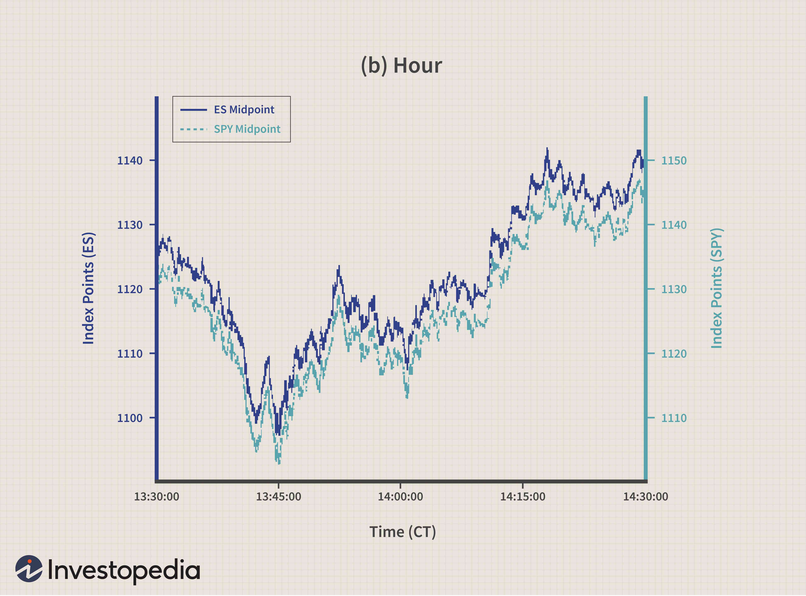

Algorithmic trading (AT) and high-frequency trading (HFT) have become essential components of modern financial markets, revolutionizing the way trades are executed and assets are managed. AT leverages sophisticated computer algorithms to automate trading decisions, thereby enabling traders to process a vast array of data at speeds unattainable by humans. These algorithms typically react to market data, such as price trends or trading volumes, in real-time, allowing firms to exploit market inefficiencies effectively.

In 2023, high-frequency trading further underscored its dominance by accounting for more than half of all trading activities in U.S. markets. This indicates a significant shift towards automation and technology-driven strategies that not only enhance trading efficiency but also increase liquidity and narrow bid-ask spreads. HFT specifically relies on executing a high volume of trades at unprecedented speeds, often in milliseconds or even microseconds. This rapid execution is facilitated by access to cutting-edge technology and infrastructure, such as co-location services and high-speed computers, ensuring that traders minimize latency and maximize performance.



This article examines the complexities of algorithmic and high-frequency trading strategies, offering an in-depth understanding of their structure, benefits, challenges, and overall impact on the financial markets. Readers will gain valuable insights into the current trends within AT and HFT, exploring how these technologies have become pivotal in shaping the trading landscape. Additionally, the discussion extends to evaluating the future trajectory of AT and HFT as market participants continue to innovate and adapt to evolving technological and regulatory environments. Understanding the role of these advanced trading strategies is crucial for navigating today's ever-changing financial markets.

## Table of Contents

## Understanding Algorithmic Trading

Algorithmic trading involves the use of sophisticated computer algorithms to automate trading decisions, thereby enhancing the speed and efficiency of financial transactions. These algorithms process vast quantities of market data in real time to identify and exploit inefficiencies, such as discrepancies in asset prices. Their primary objective is to make trades more efficient than a human trader can, both in terms of speed and processing capacity.

Different types of algorithmic trading strategies have emerged to serve various market purposes. Execution algorithms are designed to minimize the market impact of large trades by breaking them down into smaller orders. Popular execution algorithms include Volume Weighted Average Price (VWAP) and Time Weighted Average Price (TWAP), which aim to execute trades close to their respective average prices over a specific period. Profit-seeking algorithms, on the other hand, are engineered to identify and capitalize on short-term trading opportunities, such as arbitrage situations where immediate price differences can be exploited for profit. High-frequency trading (HFT) algorithms are another subset, specifically designed to execute a large number of orders at incredibly high speeds, often within milliseconds, capitalizing on the tiny price discords that occur within such timeframes.

The widespread adoption of algorithmic trading began gaining momentum in the post-1970s era, bolstered by the introduction of computerized trading systems. This technological shift enabled traders to handle larger volumes of data and execute trades with unprecedented speed, paving the way for the advanced algorithmic systems seen today. 

A notable account of the evolution and impact of [algorithmic trading](/wiki/algorithmic-trading) is presented in Michael Lewis's book, "Flash Boys". The book sheds light on how a select group of financial firms invested heavily to gain minuscule speed advantages in the markets, such as laying down fiber-optic cables to cut milliseconds off data transmission times. These speed advantages allowed firms to react to market changes faster than others could, thereby establishing a competitive edge in executing trades.

Algorithmic trading continues to be a crucial component of modern financial markets, leveraging technology to make trading faster, more efficient, and increasingly automated. This has transformed trading from a human-centric activity to one where machines predominantly make split-second decisions based on complex algorithms.

## High-Frequency Trading Explained

High-frequency trading ([HFT](/wiki/high-frequency-trading-strategies)) is a distinct category within the broader field of algorithmic trading, characterized by executing a vast number of trades at unprecedented speeds. These transactions are typically completed in milliseconds or even microseconds, facilitated by highly advanced algorithms capable of processing substantial amounts of financial data within these narrow timeframes.

The algorithms employed in HFT are designed to exploit minimal price discrepancies in the market. This involves detecting short-lived [arbitrage](/wiki/arbitrage) opportunities that arise due to price variations across different financial instruments or markets. For example, if a security is momentarily priced lower on one exchange compared to another, HFT algorithms can execute buy and sell orders almost instantaneously to profit from the spread.

Market making is another significant aspect of HFT. Market makers provide [liquidity](/wiki/liquidity-risk-premium) to the market by continuously quoting buy and sell prices of securities, [earning](/wiki/earning-announcement) profits from the bid-ask spread. HFT algorithms enhance this function by updating quotes rapidly in response to market movements, therefore maintaining tighter spreads, which contributes to overall market efficiency.

An increasingly specialized area within HFT is Ultra High-Frequency Trading. In this domain, firms seek marginal advantages by purchasing premium services, such as co-location, where trading systems are placed in close physical proximity to exchange servers. This minimizes data transmission latency, allowing for slightly earlier access to market data, potentially securing a competitive edge in executing trades before others in the market.

The relentless pursuit of speed and efficiency in HFT necessitates substantial investment in technology and infrastructure, including state-of-the-art computing resources and high-speed data feeds. This focus on technological superiority underscores the competitive nature of HFT, where every microsecond gained can translate into significant financial gain.

## Profit Potential from HFT

High-Frequency Trading (HFT) algorithms are designed to take advantage of arbitrage opportunities and profit from the bid-ask spreads present in financial markets. These algorithms are capable of executing trades at a speed and accuracy that cannot be matched by human traders, primarily due to their ability to capitalize on low-latency strategies.

One of the core profit-making strategies adopted by HFT is arbitrage. Arbitrage, in this context, refers to the simultaneous purchase and sale of an asset in different markets to exploit the price difference. The efficiency of HFT algorithms allows them to identify and act on arbitrage opportunities within milliseconds or microseconds, thereby generating profits before other market participants can react.

For instance, an HFT algorithm might monitor the price of a stock index future and its corresponding exchange-traded fund ([ETF](/wiki/etf-trading-strategies)). Suppose there is a discrepancy between the future's price and the ETF, which should theoretically be isolated only by transaction costs and efficiency. In that case, HFT algorithms quickly buy the undervalued asset and sell the overvalued one, profiting from the price convergence.

Python code could simulate a basic arbitrage opportunity detection. Here is a simplified example:

```python
def detect_arbitrage(future_price, etf_price, transaction_cost=0.01):
    """Detects arbitrage opportunity between future and ETF."""
    if etf_price > future_price + transaction_cost:
        return "Arbitrage Opportunity: Buy Future, Sell ETF"
    elif future_price > etf_price + transaction_cost:
        return "Arbitrage Opportunity: Sell Future, Buy ETF"
    else:
        return "No Arbitrage Opportunity"

# Example usage
future_price = 100.00
etf_price = 100.15
print(detect_arbitrage(future_price, etf_price))
```

This script calculates whether there is an arbitrage opportunity by checking if the price difference between the future and its corresponding ETF exceeds the transaction cost. Once identified, trades can be executed to take advantage of these discrepancies.

Beyond arbitrage, HFT algorithms improve market efficiency by narrowing bid-ask spreads. This narrowing is achieved as the algorithms swiftly execute trades to exploit even minor price differences within the market. Consequently, other traders benefit from tighter spreads and enhanced liquidity.

HFT's reliance on sophisticated algorithms and low latency allows it to exploit these profit-making mechanisms effectively. However, the competitive advantage of HFT firms lies in their continued investment in faster data processing and trading technology, ensuring they remain at the forefront of exploiting trading inefficiencies.

## HFT and Market Participants

High-Frequency Trading (HFT) involves several major market participants who utilize advanced algorithms to engage in rapid, high-[volume](/wiki/volume-trading-strategy) trading activities. The primary players in this sector include proprietary trading firms, multi-service broker-dealer desks, and hedge funds. Proprietary trading firms, often small and nimble, prioritize speed and efficiency to capitalize on minimal price movements in various financial instruments. These firms invest heavily in technology and infrastructure to maintain a competitive edge.

Multi-service broker-dealer desks also play a significant role in HFT by providing extensive resources and market access that enable multiple trading strategies. These entities offer a mix of trading and advisory services, which supports both institutional and retail clients.

Hedge funds use advanced quantitative models and trading algorithms to identify profitable opportunities derived from market trends and discrepancies. While some hedge funds develop in-house capabilities for HFT, others may partner with established trading entities to harness external expertise and technology.

HFT has found fertile ground in automated and integrated markets such as NASDAQ, NYSE, and BATS. These exchanges offer the requisite speed, liquidity, and transparency needed for executing high-frequency trades. The advent of modern electronic exchanges has facilitated the seamless execution of numerous trades per second, integral to the success of HFT strategies.

HFT is pervasive across various asset classes. These include equities, where it contributes to liquidity and tighter bid-ask spreads; derivatives, which involve complex trading strategies across futures and options markets; and currencies, where high-speed execution provides significant advantages in the foreign exchange market. Additionally, fixed-income instruments represent another area of HFT activity, where traders seek to profit from [interest rate](/wiki/interest-rate-trading-strategies) fluctuations and bond price movements.

In conclusion, the participation of diverse entities, coupled with the sophisticated infrastructure provided by modern exchanges, underscores the critical role HFT plays in today's financial markets. It spans a wide array of securities, highlighting the interconnectedness of global financial systems and the centrality of technological advancement in contemporary trading practices.

## HFT Infrastructure Needs

High-frequency trading (HFT) demands a sophisticated infrastructure to achieve the required speed and efficiency. At the core, high-speed computing systems are essential, and these need regular upgrades to match the increasing competitiveness of the field. This involves not only advanced processors but also optimized software capable of handling vast amounts of data with minimal delay. 

Co-location services are a critical aspect of HFT infrastructure. This service places trading systems in proximity to exchange servers, significantly reducing latency—the time taken for data to travel between points. Proximity minimizes transmission time, allowing HFT systems to execute trades faster than competitors who are located further away. This slight edge in time, often measured in microseconds, can be pivotal in high-stakes financial trading.

Access to real-time data feeds is another vital component. These feeds provide traders with current market conditions, enabling them to make informed trading decisions instantly. Delays, even as brief as microseconds, can result in missed opportunities or financial losses, making the accuracy and speed of data reception crucial.

The backbone of HFT and algorithmic trading lies in the computer algorithms that drive decision-making processes. These algorithms analyze market data, identify patterns, and execute trade strategies without human intervention. The complexity and efficiency of these algorithms directly impact the performance of HFT operations. They must be robust enough to navigate the ever-changing market variables and adapt to new trading contexts swiftly.

In summary, the infrastructure supporting HFT is characterized by rapid computing systems, strategic server co-location, and advanced real-time data processing capabilities, all underpinned by sophisticated trading algorithms. These elements collectively ensure that HFT remains a viable and competitive force in modern financial markets.

## Benefits and Challenges of HFT

High-frequency trading (HFT) offers several notable benefits to financial markets. Primarily, it enhances liquidity by facilitating a greater volume of transactions, making it easier for market participants to buy and sell securities. This increased liquidity often results in narrower bid-ask spreads, which reduces the cost of trading for investors and enhances overall market efficiency.

Despite these advantages, HFT is not without its criticisms and challenges. One of the more significant criticisms is its potential to cause market anomalies, such as those resulting from practices like spoofing. Spoofing involves placing large orders that are not intended to be executed to manipulate market prices, potentially leading to temporary imbalances and misleading other traders.

Another challenge associated with HFT is the high entry barrier due to the substantial costs involved in infrastructure and algorithm development. Operating within the ultra-fast environments where HFT thrives requires cutting-edge technology, including high-speed computers and advanced algorithms. The capital and expertise necessary to develop and maintain these systems can be prohibitive for smaller firms, concentrating HFT activities among well-resourced entities.

Moreover, the competitive nature of HFT necessitates constant improvement and innovation of both algorithms and infrastructure. In a domain where speed is paramount, even microsecond enhancements can provide a competitive edge. This urgency drives firms to continuously invest in upgrading their systems, which can be both costly and technically demanding. 

Overall, while HFT contributes positively to market liquidity and efficiency, its role in trading presents complexities that continue to provoke debate and necessitate regulatory oversight.

## The Current and Future State of HFT

High-frequency trading (HFT) continues to demonstrate significant potential for growth on a global scale despite facing multiple challenges and criticisms. As trading technologies evolve, HFT increasingly capitalizes on its speed and volume capabilities. This extends opportunities across various financial markets, although regulatory environments increasingly influence HFT's trajectory.

One of the prevailing challenges for HFT is the scrutiny from regulatory bodies worldwide. In some jurisdictions, authorities have imposed taxes on HFT transactions or have enacted regulatory measures aimed at curbing excessive trading practices. For instance, certain European markets have examined financial transaction taxes that could directly affect the economics of HFT operations. The intention behind such regulatory actions is often to enhance market stability and to discourage practices such as the excessive speculative trading that HFT can, at times, exacerbate.

Emerging markets present significant possibilities for HFT expansion due to the relatively lower saturation of automated trading technologies compared to more established markets like the United States or the European Union. However, the prospects for HFT in these markets largely depend on the local regulatory landscape and technological infrastructure. Regions where market regulations are less stringent and where technological investments enable lower latency trading present particularly ripe opportunities for HFT firms seeking growth.

The future of HFT is heavily tied to advancements in technology and the continuous evolution of market dynamics. Technological innovations such as [machine learning](/wiki/machine-learning), quantum computing, and enhanced algorithms can offer new methods for executing trades at even faster speeds and with greater precision. For instance, machine learning models can be employed to predict market movements with increased accuracy, which HFT algorithms can exploit for optimized trading strategies.

Here is a simple illustration of how a Python script might use machine learning to enhance an HFT strategy:

```python
import numpy as np
from sklearn.ensemble import RandomForestRegressor

# Simulated market data
market_data = np.random.rand(1000, 10)
market_prices = np.random.rand(1000)

# Train a Random Forest model to predict price movements
model = RandomForestRegressor()
model.fit(market_data, market_prices)

# Use the trained model to predict future price movements
predicted_prices = model.predict(market_data[-10:])

# Hypothetical trading algorithm using predicted prices
def trading_strategy(predicted_prices):
    for price in predicted_prices:
        if price > threshold:
            print("Buy")
        else:
            print("Sell")

# Define a price threshold for buying/selling decisions
threshold = 0.5
trading_strategy(predicted_prices)
```

The ongoing advancements in such algorithmic processes have the potential to redefine HFT operations, driving them to achieve superior speeds and efficiencies. Nonetheless, the future of HFT will likely be a balance between leveraging technological breakthroughs and addressing increasing regulatory demands.

In conclusion, HFT remains a crucial element of the global financial market landscape, marked by both opportunity and scrutiny. As regulations adapt and technologies advance, HFT firms will continue to navigate these waters to harness its full potential. Understanding and anticipating these changes is vital for stakeholders aiming to remain competitive in the ever-evolving trading environment.

## The Bottom Line

High-frequency trading (HFT) and algorithmic trading (AT) are at the cutting edge of financial trading technology. These methods automate and optimize the process of buying and selling financial instruments, enhancing trading speed and execution efficiency. Nevertheless, they come with inherent risks and complexities that must be carefully managed.

One of the key benefits of HFT and AT is their contribution to market liquidity. By executing a high volume of trades rapidly, these technologies help narrow bid-ask spreads, thereby facilitating easier and more cost-effective transactions for all market participants. However, the extent to which they bolster market stability remains a topic of ongoing debate. Critics argue that increased reliance on these strategies can amplify market [volatility](/wiki/volatility-trading-strategies) and lead to phenomena like flash crashes, where market indices abruptly plunge in value.

As technology advances, the potential for innovation in HFT and AT continues to expand. Enhanced computational power and sophisticated algorithms are expected to drive the next generation of trading strategies, enabling more refined analysis of market data and potentially reducing the risks associated with rapid trading. These technological improvements could also lead to the development of new trading paradigms that leverage big data and machine learning.

To successfully navigate today's complex financial markets, a thorough understanding of HFT and AT strategies is essential. As these technologies increasingly define the structure and function of modern financial markets, market participants need to comprehend their mechanisms and implications fully. Equipped with this knowledge, traders and investors can better prepare for the challenges and opportunities posed by these transformative technologies.

## References & Further Reading

[1]: Lewis, M. (2014). ["Flash Boys: A Wall Street Revolt."](https://en.wikipedia.org/wiki/Flash_Boys) W. W. Norton & Company.

[2]: Aldridge, I. (2013). ["High-Frequency Trading: A Practical Guide to Algorithmic Strategies and Trading Systems."](https://www.wiley.com/en-us/High+Frequency+Trading%3A+A+Practical+Guide+to+Algorithmic+Strategies+and+Trading+Systems%2C+2nd+Edition-p-9781118343500) Wiley.

[3]: López de Prado, M. (2018). ["Advances in Financial Machine Learning."](https://www.amazon.com/Advances-Financial-Machine-Learning-Marcos/dp/1119482089) Wiley.

[4]: Hendershott, T., Jones, C. M., & Menkveld, A. J. (2011). ["Does Algorithmic Trading Improve Liquidity?"](https://onlinelibrary.wiley.com/doi/full/10.1111/j.1540-6261.2010.01624.x) The Review of Financial Studies, 24(3), 1455–1485.

[5]: Harris, L. (2003). ["Trading and Exchanges: Market Microstructure for Practitioners."](https://www.amazon.com/Trading-Exchanges-Market-Microstructure-Practitioners/dp/0195144708) Oxford University Press.