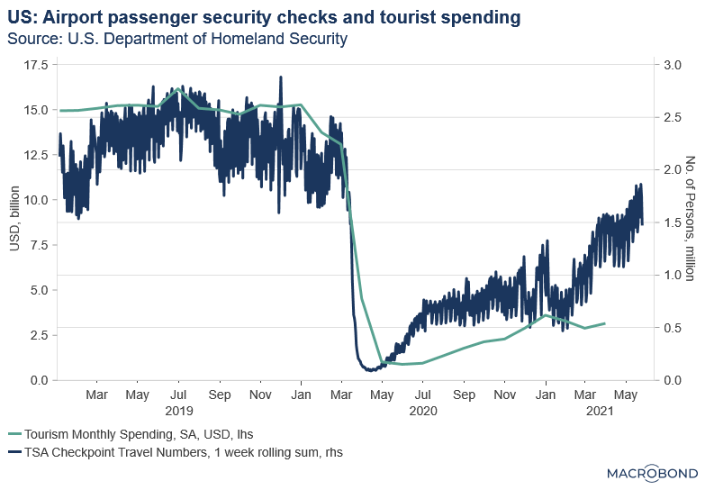

## Table of Contents

## What is high frequency data?

High frequency data refers to information that is collected and recorded at very short time intervals, often in real-time or near real-time. This type of data is commonly used in fields like finance, where stock prices and trading volumes are tracked every second or even millisecond. By capturing data so frequently, analysts and researchers can gain insights into rapid changes and patterns that might be missed with less frequent data collection.

In addition to finance, high frequency data is also used in other areas such as weather forecasting, where sensors might record temperature and humidity every few minutes. This allows meteorologists to track sudden changes in weather conditions more accurately. The main advantage of high frequency data is that it provides a detailed and up-to-date picture of what is happening, which can be crucial for making timely decisions and predictions.

## Why is high frequency data important in financial markets?

High frequency data is very important in financial markets because it helps traders and investors make quick decisions. In the stock market, prices can change very fast, sometimes in just a few seconds. By using high frequency data, people can see these changes right away and decide whether to buy or sell stocks at the best time. This kind of data is collected every second or even faster, so it gives a very clear picture of what is happening in the market at any moment.

Another reason [high frequency](/wiki/high-frequency-trading) data is important is that it helps in understanding market trends and patterns better. When you have data that is collected so often, you can see small changes that might not be noticeable if you only looked at data collected once a day or once a week. This can help in predicting future market movements more accurately. For example, if you see a pattern of prices going up and down quickly, you might be able to guess that this pattern will happen again and plan your trades around it.

## How is high frequency data collected?

High frequency data in financial markets is collected using special computer systems that are very fast. These systems are set up to watch the stock market all the time and record prices, trading volumes, and other information every second or even faster. The data comes from stock exchanges, where every trade is recorded as soon as it happens. These systems use special software to gather this information quickly and send it to traders and analysts who need it.

In other areas like weather forecasting, high frequency data is collected using sensors and devices that measure things like temperature and humidity. These sensors are placed in different locations and send data back to a central computer every few minutes or even more often. This helps meteorologists see how the weather is changing in real-time and make more accurate predictions. The data is collected automatically and stored in databases for analysis.

## What are the common sources of high frequency data?

High frequency data in financial markets comes from stock exchanges. These exchanges record every trade that happens, and this information is collected by fast computer systems. The systems watch the market all the time and gather data on prices, trading volumes, and other details every second or even faster. This data is then sent to traders and analysts who use it to make quick decisions.

In the field of weather forecasting, high frequency data is collected using sensors and devices. These sensors measure things like temperature, humidity, and wind speed. They are placed in different locations and send data back to a central computer every few minutes or even more often. This helps meteorologists see how the weather is changing in real-time and make more accurate predictions.

Other sources of high frequency data include traffic monitoring systems, which use sensors to track the flow of vehicles on roads every few seconds. This helps in managing traffic and planning road improvements. Also, in healthcare, devices like heart monitors collect data on a patient's heart rate and other vital signs every few seconds, helping doctors to monitor and respond to changes in a patient's condition quickly.

## What are the challenges in handling high frequency data?

Handling high frequency data can be hard because there is so much information coming in all the time. It can be like trying to drink from a fire hose! You need very fast computers and special software to keep up with all the data. If your systems are not fast enough, you might miss important information or make mistakes. Also, storing all this data takes up a lot of space, so you need big storage systems and good ways to organize the data so you can find what you need quickly.

Another challenge is making sense of all the data. When you have so much information, it can be hard to see what is really important. You need good tools and methods to analyze the data and find the patterns that matter. Sometimes, the data can be noisy, which means there are little mistakes or changes that don't really mean anything but can make it harder to understand the big picture. People working with high frequency data need to be careful and use smart ways to clean up the data and focus on what is really useful.

## How can high frequency data be used for trading strategies?

High frequency data is very helpful for trading strategies because it lets traders see what is happening in the market right away. By looking at prices and trading volumes every second or even faster, traders can spot trends and patterns quickly. For example, if they see that a stock's price is going up a lot in a short time, they might decide to buy it right away, hoping to sell it for a profit soon after. This kind of quick decision-making is important in trading because the market can change very fast.

Another way high frequency data helps with trading strategies is by letting traders use special computer programs called algorithms. These programs can look at a lot of data very quickly and make trades without people having to do it manually. For instance, an algorithm might be set up to buy a stock when its price goes down to a certain level and then sell it when the price goes up to another level. Using high frequency data, these algorithms can work very fast and make many trades in a short time, which can help traders make more money.

## What are the key technologies required to process high frequency data?

To process high frequency data, you need very fast computers. These computers have special processors that can handle a lot of information quickly. They also need a lot of memory to keep up with the data coming in all the time. Special software is also important. This software is made to work with high frequency data and can sort through it, clean it up, and find the important parts fast. Without these fast computers and special software, it would be hard to keep up with all the data and make sense of it.

Another key technology is big storage systems. High frequency data creates a lot of information, so you need a place to keep it all. These storage systems need to be fast and big enough to hold all the data without slowing down. Also, good networks are important. The data needs to move quickly from where it is collected to where it is stored and analyzed. If the network is slow, the data might not get to where it needs to go in time, which can cause problems.

## How does high frequency data impact market efficiency?

High frequency data makes markets more efficient by letting traders and investors see what is happening in the market right away. When people have up-to-date information, they can make better decisions about buying and selling stocks. This means that prices can change more quickly to match what is really happening in the market. For example, if a company announces good news, high frequency data can help the market react to this news faster, making the price of the stock go up more quickly.

However, high frequency data can also make the market more complicated. Because the data comes in so fast, it can be hard for everyone to keep up. Some traders use special computer programs to look at the data and make trades very quickly. This can sometimes make the market move in ways that are hard to predict. Even though high frequency data helps the market work better in some ways, it can also make things more confusing and lead to sudden changes in prices.

## What are the ethical considerations of using high frequency data?

Using high frequency data raises some important ethical questions. One big issue is fairness. Some people and companies have better technology and can use high frequency data to make trades faster than others. This can give them an advantage and might not be fair to everyone else in the market. It's like having a faster car in a race - it can make the competition uneven. People worry that this could make the market less fair and hurt smaller investors who don't have the same tools.

Another ethical concern is privacy. High frequency data can sometimes include personal information, especially in fields like healthcare where it's used to monitor patients. If this data is not kept safe, it could be used in ways that harm people or invade their privacy. It's important for companies and organizations to protect this data and use it responsibly. They need to make sure that they are not putting people at risk by collecting and using high frequency data without proper safeguards.

## How does high frequency data analysis differ from traditional data analysis?

High frequency data analysis is different from traditional data analysis because it deals with information that comes in very quickly. Traditional data analysis might look at data that is collected once a day or once a week, but high frequency data is collected every second or even faster. This means that people who work with high frequency data need very fast computers and special software to keep up with all the information. They have to be able to sort through the data, clean it up, and find what is important very quickly.

Another big difference is that high frequency data analysis often uses special computer programs called algorithms. These algorithms can look at a lot of data very fast and make decisions without people having to do it manually. In traditional data analysis, people might spend a lot of time looking at data and making decisions based on what they see. But with high frequency data, the algorithms can make many trades or decisions in a short time, which can be very helpful but also makes the process more complicated. This kind of analysis is common in areas like financial markets, where quick decisions can make a big difference.

## What are advanced statistical models used in analyzing high frequency data?

Advanced statistical models used in analyzing high frequency data help people understand the fast-changing information better. One common model is called the Autoregressive Conditional Heteroskedasticity (ARCH) model. This model looks at how the ups and downs in data change over time. It is very useful in financial markets where the price of stocks can go up and down a lot in a short time. Another model is the Generalized Autoregressive Conditional Heteroskedasticity (GARCH) model, which is an improved version of ARCH. It can handle more complex patterns in the data and is often used to predict how much the stock prices might change in the future.

Another important model is the Vector Autoregression (VAR) model. This model looks at how different pieces of data affect each other over time. For example, in the stock market, it can show how the price of one stock might affect the price of another stock. High frequency data can be very noisy, meaning it has little changes that don't really mean anything. To deal with this, people use models like Kalman filters. These filters help clean up the data and focus on the important patterns, making it easier to see what is really happening in the market.

## How can machine learning be integrated with high frequency data to improve predictions?

Machine learning can be used with high frequency data to make better predictions by helping computers learn from the data and find patterns that people might miss. When you have a lot of data coming in very quickly, like in the stock market, [machine learning](/wiki/machine-learning) algorithms can look at this data and find out what is likely to happen next. For example, they can learn from past stock prices and trading volumes to guess if a stock's price will go up or down in the next few seconds. This can help traders make better decisions and maybe make more money.

To make this work well, you need to use special machine learning models that are good at handling a lot of data quickly. These models can be trained on past high frequency data to understand how the market behaves. Once trained, they can look at new data coming in and make predictions in real-time. This means they can help traders react to changes in the market very fast. By using machine learning with high frequency data, people can make more accurate guesses about what will happen next, which is very important in fast-moving markets like finance.

## References & Further Reading

[1]: Bergstra, J., Bardenet, R., Bengio, Y., & Kégl, B. (2011). ["Algorithms for Hyper-Parameter Optimization."](https://papers.nips.cc/paper/4443-algorithms-for-hyper-parameter-optimization) Advances in Neural Information Processing Systems 24.

[2]: ["Advances in Financial Machine Learning"](https://www.amazon.com/Advances-Financial-Machine-Learning-Marcos/dp/1119482089) by Marcos Lopez de Prado

[3]: ["Evidence-Based Technical Analysis: Applying the Scientific Method and Statistical Inference to Trading Signals"](https://www.amazon.com/Evidence-Based-Technical-Analysis-Scientific-Statistical/dp/0470008741) by David Aronson

[4]: ["Machine Learning for Algorithmic Trading"](https://github.com/PacktPublishing/Machine-Learning-for-Algorithmic-Trading-Second-Edition) by Stefan Jansen

[5]: ["Quantitative Trading: How to Build Your Own Algorithmic Trading Business"](https://books.google.com/books/about/Quantitative_Trading.html?id=j70yEAAAQBAJ) by Ernest P. Chan