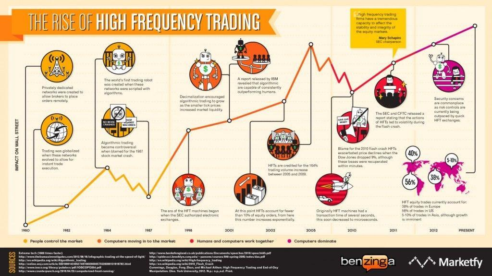

## Table of Contents

## What is high-frequency market making?

High-frequency market making is a type of trading where computers use special programs to buy and sell things like stocks or currencies very quickly. These programs look at lots of information and make decisions in just a few seconds. The goal is to make small profits from many trades throughout the day. People who do this are called market makers because they help keep the market active by always being ready to buy or sell.

These traders use very fast computers and special connections to be quicker than others. They might also use secret information or patterns they find in the market to decide when to trade. This can be good for the market because it makes it easier for people to buy and sell things. But, it can also be risky because the fast trading can sometimes cause big changes in prices very quickly.

## How does high-frequency market making differ from traditional market making?

High-frequency market making and traditional market making both involve buying and selling assets to provide liquidity to the market, but they do it in different ways. Traditional market making is slower and more manual. A person or a team of people watches the market and decides when to buy or sell based on their knowledge and experience. They might use computers to help, but the final decisions are often made by humans. They aim to make money by buying low and selling high, but they do this over longer periods of time.

On the other hand, high-frequency [market making](/wiki/market-making) uses very fast computers and special programs to make quick trades. These computers can look at lots of information and make decisions in just a few seconds or even less. The goal is to make small profits from many trades throughout the day. High-frequency market makers use their speed to be quicker than others and might use secret patterns they find in the market to decide when to trade. This can make the market more active and easier for people to buy and sell, but it can also cause quick and big changes in prices.

In summary, the main differences are the speed and automation of high-frequency market making compared to the slower, more manual approach of traditional market making. High-frequency market making relies heavily on technology and algorithms, while traditional market making relies more on human judgment and slower, more deliberate decision-making.

## What are the key components of a high-frequency market making system?

A high-frequency market making system has several key parts that work together to trade quickly and make money. The first part is the algorithms. These are like special math recipes that the computer uses to decide when to buy and sell. The algorithms look at lots of information, like prices and how much people are buying or selling, to make fast decisions. Another important part is the data feed. This is like a fast information pipeline that sends the latest market information to the computer. The system needs this data to be quick and correct so it can make the best choices.

The next part is the trading infrastructure. This includes the fast computers and special connections that let the system trade as quickly as possible. These computers need to be very close to the market's computers, sometimes even in the same building, to cut down on time. The system also uses risk management tools. These are like safety checks that help make sure the system doesn't lose too much money. They can stop trading if things start to go wrong. All these parts work together to help the system make small profits from many quick trades throughout the day.

## What technologies are essential for high-frequency market making?

High-frequency market making relies on fast computers and special software to trade quickly. These computers need to be very powerful so they can process a lot of information in just a few seconds. They use algorithms, which are like smart math recipes, to decide when to buy and sell. The software looks at things like current prices and how much people are trading to make these decisions. To make sure the computer gets the latest information as fast as possible, it uses a data feed. This is like a super-fast information pipeline that sends market data to the computer.

Another important technology is the trading infrastructure. This includes the special connections that let the computer trade as quickly as possible. These connections need to be very fast, so the computers are often placed close to the market's computers, sometimes even in the same building. This helps cut down on the time it takes for information to travel. The system also uses risk management tools, which are like safety checks. These tools help make sure the system doesn't lose too much money by stopping trading if things start to go wrong. All these technologies work together to help the system make small profits from many quick trades throughout the day.

## How do high-frequency market makers generate profits?

High-frequency market makers make money by buying and selling things like stocks or currencies very quickly. They use special computer programs that look at lots of information to decide when to trade. The goal is to make small profits from many trades throughout the day. They might buy something at a low price and then sell it at a slightly higher price just a few seconds later. By doing this many times, the small profits add up.

To make this work, high-frequency market makers need to be faster than other traders. They use very fast computers and special connections to get information and make trades quickly. This speed helps them get the best prices and make more trades. They also use secret patterns they find in the market to decide when to buy or sell. This can help them make more money, but it can also be risky if the market changes quickly.

## What are the risks associated with high-frequency market making?

High-frequency market making can be risky because it uses very fast computers to make quick trades. If the computer makes a mistake, it can cause big losses in just a few seconds. The market can also change quickly, and if the computer doesn't react fast enough, it might lose money. Another risk is that high-frequency trading can sometimes cause big changes in prices very quickly. This can make the market unstable and lead to big losses for everyone trading.

Another risk is that high-frequency market makers often use secret information or patterns to make their trades. If this information is wrong or if other traders find out about it, it can hurt their profits. Also, high-frequency trading relies a lot on technology. If there's a problem with the computers or the connections, the system might not work properly. This can stop the market maker from trading and cause them to lose money.

## How does latency affect high-frequency market making strategies?

Latency is how long it takes for information to travel from one place to another. In high-frequency market making, even a tiny bit of latency can make a big difference. High-frequency market makers need to be the fastest to get the best prices and make the most trades. If their computers are slower than others, they might miss out on good trading chances or end up buying and selling at worse prices. This can hurt their profits because they make money from small differences in prices.

To fight latency, high-frequency market makers use special technology. They put their computers very close to the market's computers, sometimes even in the same building, to cut down on the time it takes for information to travel. They also use very fast connections and special software to make sure they get the latest information as quickly as possible. By keeping latency as low as they can, high-frequency market makers can stay ahead of other traders and keep making small profits from many quick trades throughout the day.

## What regulatory challenges do high-frequency market makers face?

High-frequency market makers face many rules from governments and financial groups. These rules are there to make sure the market is fair and safe for everyone. One big challenge is that high-frequency trading can sometimes cause big and quick changes in prices. This can make the market unstable, so regulators want to make sure high-frequency market makers don't do things that hurt the market. They also want to stop high-frequency traders from using secret information or tricks to get an unfair advantage over other traders.

Another challenge is that high-frequency market makers use a lot of technology. Regulators need to make sure this technology is used in a fair way and doesn't cause problems. They might need to check the computers and software to make sure they follow the rules. Sometimes, new rules come out that high-frequency market makers need to follow. This can be hard because they have to change their systems and strategies quickly to stay in line with the new rules.

## Can you explain the role of algorithms in high-frequency market making?

Algorithms are like special math recipes that high-frequency market makers use to make quick trades. These recipes help the computer look at lots of information, like prices and how much people are buying or selling, to decide when to buy and sell. The goal is to make small profits from many trades throughout the day. The algorithms need to be very fast and smart because high-frequency market makers need to be quicker than other traders to get the best prices.

The algorithms also look for secret patterns in the market that can help high-frequency market makers make more money. They use these patterns to decide when to trade. But, using algorithms can be risky. If the algorithms make a mistake or if the market changes quickly, it can cause big losses. So, high-frequency market makers need to keep their algorithms up to date and working well to keep making money.

## How do high-frequency market makers manage their inventory and liquidity?

High-frequency market makers manage their inventory and [liquidity](/wiki/liquidity-risk-premium) by using special computer programs that trade very quickly. They always try to keep a balance between what they buy and what they sell. If they have too much of something, they will try to sell it quickly. If they don't have enough, they will buy more. They use their fast computers to check the market all the time and make trades to keep their inventory just right.

To manage liquidity, high-frequency market makers make sure they are always ready to buy or sell. This helps keep the market active and makes it easier for other people to trade. They use their algorithms to look at the market and decide when to trade to keep the market moving smoothly. By doing this, they help make sure there are always buyers and sellers in the market, which is good for everyone trading.

## What advanced strategies do high-frequency market makers use to optimize their operations?

High-frequency market makers use special tricks to make their trading better. One trick is called "order anticipation." This means they look at what other traders are doing and guess what they might do next. If they think someone is about to buy a lot of something, they might buy it first and then sell it to that person at a higher price. Another trick is "latency [arbitrage](/wiki/arbitrage)." This means they use their fast computers to trade a little bit quicker than others. They might see a price change in one place and buy or sell before everyone else knows about it. These tricks help them make more money from small price differences.

Another important strategy is "[statistical arbitrage](/wiki/statistical-arbitrage)." This is when they use math to find patterns in the market. They look at lots of data to see how prices move together and use this to decide when to trade. They might buy one thing and sell another at the same time, hoping to make a small profit from the difference. High-frequency market makers also use "market making" strategies to keep the market active. They always offer to buy and sell, which helps keep the market moving smoothly. By using these advanced strategies, high-frequency market makers can make small profits from many quick trades throughout the day.

## How might future technological advancements impact high-frequency market making?

Future technology could make high-frequency market making even faster and smarter. New computers and better connections might let high-frequency market makers trade even quicker than they do now. This could help them make more money from tiny price differences. Also, new kinds of software, like [artificial intelligence](/wiki/ai-artificial-intelligence), could help them find better patterns in the market. This would let them make smarter trades and maybe even predict what the market will do next.

But these new technologies could also bring new problems. If everyone starts using the same fast computers and smart software, it might be harder for high-frequency market makers to stay ahead. This could make the market more competitive and maybe even more unstable if everyone is trying to trade at the same time. Also, new rules might come out to make sure the market stays fair and safe. High-frequency market makers will need to keep up with these changes to keep making money.

## References & Further Reading

[1]: Aldridge, I. (2013). ["High-Frequency Trading: A Practical Guide to Algorithmic Strategies and Trading Systems."](https://www.ahmetbeyefendi.com/wp-content/uploads/2020/07/High-Frequency-Trading-Irene-Aldridge.pdf) Wiley.

[2]: Lewis, M. (2014). ["Flash Boys: A Wall Street Revolt."](https://en.wikipedia.org/wiki/Flash_Boys) W. W. Norton & Company.

[3]: Johnson, N., Jefferies, P., & Hui, P. (2013). ["Financial Black Swans Driven by Ultrafast Machine Ecology."](https://arxiv.org/abs/1202.1448) Scientific Reports 3, Article 2627.

[4]: Markose, S. (2012). ["Systemic Risk from Global Financial Derivatives: A Network Analysis of Contagion and Its Mitigation with Super-Spreader Tax."](https://www.imf.org/external/pubs/ft/wp/2012/wp12282.pdf) International Monetary Fund Working Paper.

[5]: Narang, R. K. (2009). ["Inside the Black Box: A Simple Guide to Quantitative and High Frequency Trading."](https://onlinelibrary.wiley.com/doi/book/10.1002/9781118267738) Wiley.