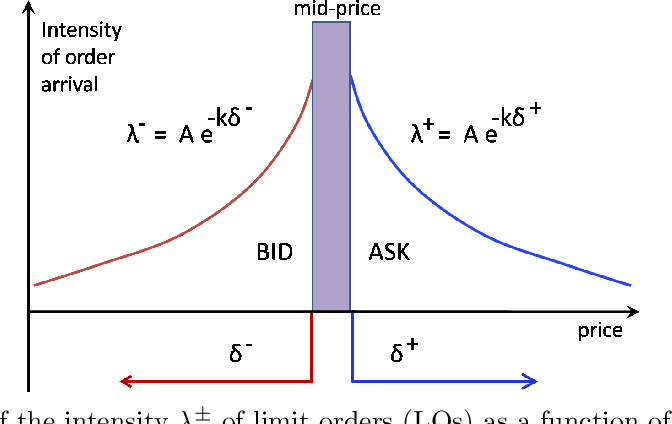

High-frequency market making, a subset of algorithmic trading, is a sophisticated strategy employed by financial firms to leverage slight variations in securities prices for profit. This intricate practice relies primarily on the ability to execute rapid and repetitive buying and selling activities, exploiting small price discrepancies—often mere fractions of a cent—to generate returns. 

Powerful computer systems and high-speed data networks serve as the backbone of this strategy, enabling traders to execute trades at incredible speeds and volumes that are impossible to achieve manually. Market makers operating within this framework provide vital liquidity to the financial markets. They achieve this by continuously quoting buy and sell prices for various securities, adjusting these prices perpetually based on the latest market conditions to reflect changes in demand and supply.



The utilization of technology plays an indispensable role in this context, allowing traders to capitalize on market inefficiencies and fluctuations that occur within milliseconds. Through the deployment of advanced algorithms, high-frequency trading (HFT) can enhance market efficiency by reducing the cost of trading and narrowing bid-ask spreads. However, HFT also presents certain risks, such as the potential for systemic instability and market disruptions from algorithmic errors.

This article will explore the mechanics, benefits, and challenges of high-frequency market making, providing a comprehensive understanding of how this trading strategy functions and its impacts on modern financial markets. From the underlying technology to the ethical considerations and regulatory landscape, we aim to elucidate the complex dynamics that define high-frequency market making today.

## Table of Contents

## How High-Frequency Market Making Works

High-frequency market making leverages advanced algorithms to automate trading decisions, a crucial aspect in contemporary financial markets. Traders utilize sophisticated statistical models and machine learning techniques to anticipate short-term price movements with high precision. These predictive models analyze vast amounts of market data to identify patterns and forecast price trends on a microsecond level.

In high-frequency trading (HFT), market makers perform dual roles: they not only provide liquidity by consistently quoting buy and sell prices but also capitalize on market inefficiencies to secure profits. This involves strategically offering high volumes of buy and sell orders at competitive prices to facilitate smoother transactions in the market. By ensuring the availability of both buyers and sellers, HFT firms contribute significantly to narrowing the bid-ask spread, which enhances market liquidity and price efficiency.

The process of high-frequency [market making](/wiki/market-making) requires the rapid execution of trading strategies. Traders deploy algorithms to constantly place and cancel a large number of orders, sometimes within milliseconds. This speed is necessary as traders aim to be the first to react to shifting market conditions, thereby securing advantageous positions before competitors.

The technology stack used in [HFT](/wiki/high-frequency-trading-strategies) is a critical component, providing the infrastructure needed for such rapid operations. Key technologies include:

1. **Low-latency Networking:** Achieving minimal delay in data transfer is essential. Traders use fiber optics and direct data links to exchanges for near-instantaneous order execution.

2. **High-performance Computing:** Handling large datasets and executing complex calculations requires powerful computing resources. HFT firms use specialized hardware, such as Field-Programmable Gate Arrays (FPGAs), and optimized software to ensure peak performance.

3. **Advanced Algorithms:** Trading strategies are encoded within algorithms that execute trades based on predefined conditions. These algorithms are continually refined using historical data analysis and real-time feedback.

4. **Data Analysis Platforms:** Support systems are in place to monitor and analyze market trends in real time. Machine learning models are often deployed to adapt strategies dynamically based on incoming information.

A simple example in Python of a high-frequency trading algorithm might involve predicting price changes using a basic moving average crossover strategy:

```python
import numpy as np
import pandas as pd

# Sample market data
data = pd.DataFrame({
    'price': np.random.normal(100, 1, 1000)  # Simulated price data
})

# Calculate moving averages
short_window = 10
long_window = 50

data['short_mavg'] = data['price'].rolling(window=short_window, min_periods=1, center=False).mean()
data['long_mavg'] = data['price'].rolling(window=long_window, min_periods=1, center=False).mean()

# Generate trading signals
data['signal'] = 0
data['signal'][short_window:] = np.where(
    data['short_mavg'][short_window:] > data['long_mavg'][short_window:], 1, -1
)

# Example of order execution logic
for index, row in data.iterrows():
    if row['signal'] == 1:
        print(f"Buying at price {row['price']} at index {index}")
    elif row['signal'] == -1:
        print(f"Selling at price {row['price']} at index {index}")
```

This code illustrates a simplified trading strategy where buy and sell signals are generated based on the crossover of short and long moving averages. While this example lacks the complexity of real HFT algorithms, which operate in milliseconds with vast data streams, it highlights the basic premise of automated decision-making based on market signals.

The sheer [volume](/wiki/volume-trading-strategy) and speed at which orders are processed in high-frequency market making demand technological precision and innovation, emphasizing the importance of a comprehensive technology stack to support trading activities.

## Benefits of High-Frequency Market Making

High-frequency market making (HFT) offers several significant benefits within financial markets. One of the most notable advantages is the enhancement of market [liquidity](/wiki/liquidity-risk-premium). By employing advanced algorithms and sophisticated trading platforms, HFT firms are able to process large volumes of transactions in milliseconds. This capability allows them to provide liquidity by continuously quoting both buy and sell prices for securities. The presence of HFT firms results in narrower bid-ask spreads, which refers to the difference between the prices quoted for an immediate sale and an immediate purchase. Narrower spreads facilitate smoother price transitions and more efficient trade executions, benefiting all market participants.

The increased competition among HFT firms further contributes to improved market efficiency. As these entities vie to execute trades more quickly and cost-effectively, they inadvertently enhance the overall functioning of the market. This competitive environment encourages HFTs to continuously refine their algorithms and technologies, which leads to incremental improvements in trade processing speeds and accuracy. Consequently, these efficiencies contribute to a more competitive and robust market structure, aligning closely with the principles of an efficient market hypothesis, where prices fully reflect all available information.

In addition to liquidity and efficiency, high-frequency market making also plays a crucial role in accurate price discovery. By executing numerous trades in rapid succession, HFT firms are able to reflect the latest market signals and information almost instantaneously in asset prices. This near-immediate integration of information supports precise pricing of securities, which is essential for investors and other market stakeholders in making informed decisions. The ability of HFTs to update prices promptly based on real-time data ensures that assets are fairly valued at any given moment, reducing the chances of mispricing.

Beyond direct trading benefits, HFT contributes positively to economic stability and the broader trading ecosystem. By ensuring that markets remain liquid and prices reflect current information, HFT aids in the reduction of [volatility](/wiki/volatility-trading-strategies) and uncertainty. This stable environment supports the confidence of long-term investors and enhances the attractiveness of financial markets as a platform for raising capital. Overall, the role of high-frequency market making in promoting liquidity, efficiency, and accurate price discovery underscores its integral function in the effective operation of contemporary financial markets.

## Challenges and Risks Involved

Despite the benefits of high-frequency market making, it also presents several challenges and risks that need careful consideration. A significant risk is the potential for market disruptions, exemplified by flash crashes caused by algorithmic errors. These sudden, dramatic price falls can occur when algorithms malfunction or behave unpredictably under certain market conditions, leading to large volumes of trades being executed in very short periods. This can result in significant losses for firms and undermine market confidence.

Another area of concern is the ongoing debate over the fairness and ethical implications of high-frequency trading. HFT firms often have access to faster data feeds and more sophisticated technology, allowing them to capitalize on small information advantages over traditional investors. This has raised questions about the market's level playing field, with critics arguing that it creates unfair advantages and exacerbates inequality among market participants.

Technological issues also pose substantial challenges. Latency, or the delay in transmitting data, is a critical [factor](/wiki/factor-investing) that can affect the performance of HFT systems. Even minute delays in data transmission can lead to significant differences in trading outcomes. Connectivity issues can further exacerbate these problems, causing discrepancies in order execution and potentially resulting in financial losses.

Additionally, regulatory scrutiny of high-frequency trading is intensifying. Financial authorities worldwide are increasingly calling for more oversight and regulation of HFT activities to mitigate associated risks and ensure market stability. HFT firms must navigate this regulatory landscape, complying with existing regulations while anticipating potential changes that may affect their operations.

HFT firms face the complex task of balancing speed and accuracy with regulatory compliance. Achieving the optimal trade-off between these elements is crucial for maintaining a competitive edge while adhering to legal and ethical standards. This necessitates continuous investment in technology and a thorough understanding of regulatory developments, ensuring that high-frequency market making contributes positively to the broader financial ecosystem.

## The Future of High-Frequency Market Making

High-frequency trading (HFT) is poised to play an increasingly important role as financial markets continue to move towards greater automation. With advancements in [artificial intelligence](/wiki/ai-artificial-intelligence) (AI) and [machine learning](/wiki/machine-learning), the capabilities of [algorithmic trading](/wiki/algorithmic-trading) are expected to reach new heights. These technologies can process vast amounts of data with unprecedented speed, enabling traders to refine their predictive models and enhance their decision-making processes. Machine learning algorithms, for instance, can be employed to identify complex patterns in market data, leading to more accurate short-term price predictions and improved trade executions.

As HFT becomes more sophisticated, there is also a growing need for regulatory frameworks that address the unique risks associated with high-speed trading. Traditional regulatory measures may not suffice in effectively managing the pace and complexity of HFT operations. Consequently, regulators are exploring innovative approaches to ensure market integrity and stability. Potential measures could include continuous monitoring systems that detect anomalies in trading activities, thus minimizing the risk of market disruptions and flash crashes caused by algorithmic errors.

Sustainability and ethical considerations will also shape the future of high-frequency trading. The environmental impact of operating energy-intensive data centers and the ethical implications of exploiting minor informational advantages are areas that require careful examination. Firms may need to invest in greener technologies and adopt more transparent practices to align with sustainability goals and ethical standards.

Looking forward, the market making landscape is likely to evolve with these technological and regulatory changes. HFT firms might increasingly rely on hybrid models that integrate human intelligence with artificial intelligence, striking a balance between automation and oversight. The development of quantum computing and its potential applications in HFT could further revolutionize the field, offering faster processing capabilities and novel algorithms.

The long-term outlook suggests a dynamic and rapidly evolving market making environment, where continuous innovation will be essential for firms to maintain a competitive edge. As technology progresses and regulatory measures adapt, high-frequency market making will remain a pivotal component in the financial markets, driving liquidity, efficiency, and stability. The focus will increasingly be on harmonizing technological advancements with ethical practices and regulatory compliance to ensure a sustainable future for high-frequency trading.

## Conclusion

High-frequency market making plays a crucial role in today's financial markets by enhancing both liquidity and market efficiency. The rapid and continuous quoting of buy and sell prices by high-frequency trading (HFT) firms leads to narrower bid-ask spreads, facilitating smoother transactions and more accurate price discovery. This, in turn, contributes to a more stable trading environment and supports the overall functioning of financial markets.

However, the benefits of high-frequency market making come with their own set of challenges. The reliance on cutting-edge technology introduces risks related to system failures, algorithmic errors, and latency issues, which can sometimes result in disruptive market phenomena such as flash crashes. Furthermore, the ethical and fairness concerns surrounding the use of speed and information advantages in trading persist, prompting ongoing debates in regulatory circles.

Balancing technological advancement with ethical practices and appropriate regulatory measures is essential for the sustainable growth of HFT. Robust oversight frameworks are needed to mitigate risks while fostering innovation. The creation of equitable trading arenas remains a primary goal for market regulators and participants alike.

An in-depth understanding of high-frequency trading dynamics is crucial for investors, regulators, and other stakeholders in the economic ecosystem. This knowledge aids in informed decision-making and helps anticipate potential market impacts. By dissecting the intricacies of high-frequency market making, this article has aimed to illuminate its influence on modern financial markets and to provide insights into its future trajectory. Understanding these mechanisms is vital as HFT continues to evolve alongside technological progress and regulatory developments.

## References & Further Reading

[1]: Aldridge, I. (2013). ["High-Frequency Trading: A Practical Guide to Algorithmic Strategies and Trading Systems."](https://www.ahmetbeyefendi.com/wp-content/uploads/2020/07/High-Frequency-Trading-Irene-Aldridge.pdf) Wiley.

[2]: Lewis, M. (2014). ["Flash Boys: A Wall Street Revolt."](https://en.wikipedia.org/wiki/Flash_Boys) W. W. Norton & Company.

[3]: Johnson, N., Jefferies, P., & Hui, P. (2013). ["Financial Black Swans Driven by Ultrafast Machine Ecology."](https://arxiv.org/abs/1202.1448) Scientific Reports 3, Article 2627.

[4]: Markose, S. (2012). ["Systemic Risk from Global Financial Derivatives: A Network Analysis of Contagion and Its Mitigation with Super-Spreader Tax."](https://www.imf.org/external/pubs/ft/wp/2012/wp12282.pdf) International Monetary Fund Working Paper.

[5]: Narang, R. K. (2009). ["Inside the Black Box: A Simple Guide to Quantitative and High Frequency Trading."](https://onlinelibrary.wiley.com/doi/book/10.1002/9781118267738) Wiley.