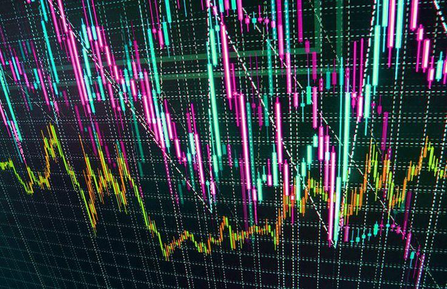

The rapid evolution of financial markets has led to the introduction and widespread adoption of high-frequency trading (HFT), a sophisticated method of algorithmic trading. HFT utilizes advanced algorithms to execute a vast number of trades at incredibly high speeds, creating a fundamental shift in how financial transactions are conducted. Central to this approach is the capacity to perform trades within fractions of a second, allowing traders to capitalize on minute price discrepancies that are imperceptible to traditional trading methods. This ability to process and engage in numerous transactions simultaneously distinguishes HFT as a formidable presence in today's financial markets.

As we observe the confluence of technology and finance, the significance of HFT continues to expand, reshaping the norms of trading and investment. HFT leverages cutting-edge computing technologies and robust statistical models to facilitate immediate order placement and execution, profoundly influencing market dynamics. This technique has grown particularly influential in various asset classes, such as equities, futures, options, and currencies, underscoring its diverse applicability.

The ongoing developments in technology underpin the growing role of HFT, highlighting the importance of understanding its mechanisms for anyone invested in finance or intrigued by modern trading strategies. Familiarity with HFT principles allows traders and investors to navigate the complexities of the current financial landscape more effectively, ensuring they remain competitive in an increasingly digital world. As advancements persist, the landscape of financial markets will likely continue evolving, driven by the capabilities and reach of high-frequency trading.

## Table of Contents

## What is High-Frequency Trading?

High-frequency trading (HFT) represents a sophisticated approach to automated trading, primarily characterized by the utilization of powerful computing systems to execute an extensive volume of orders within mere fractions of a second. At its core, HFT utilizes advanced algorithms designed to parse vast swathes of market data across multiple exchanges simultaneously, enabling the identification and exploitation of minute price discrepancies for profit generation.

HFT algorithms are constructed with pre-defined criteria that dictate trading actions, allowing them to assess market conditions, decide optimal trade entries and exits, and execute orders at unparalleled speeds. This rapid trade execution capability is a hallmark of HFT, distinguishing it sharply from traditional trading methodologies that often rely on slower manual processes.

The primary objective of high-frequency trading is to capitalize on transient pricing inefficiencies—often fractions of a cent—allowing traders to secure small, incremental profits over a multitude of transactions. By continuously repeating this process, HFT systems can amass significant cumulative gains, highlighting the importance of speed and efficiency in these operations.

High-frequency trading has achieved prominence in various asset classes, extending beyond equities to futures, options, and currency markets. This cross-market applicability reflects the versatility of [HFT](/wiki/high-frequency-trading-strategies) strategies, which are not constrained to a single type of financial instrument. In all these markets, HFT contributes to increased trading [volume](/wiki/volume-trading-strategy) and [liquidity](/wiki/liquidity-risk-premium), albeit sometimes raising concerns about heightened [volatility](/wiki/volatility-trading-strategies) and market dynamics. 

Overall, HFT represents a compelling intersection of technology and financial strategy, leveraging computational prowess to navigate the complexity of modern financial markets efficiently.

## The Role of Technology in HFT

Technology is the backbone of high-frequency trading, providing the speed and analytical power necessary for its success. Advanced computing systems are pivotal to this process, enabling the execution of trades within milliseconds. These systems are equipped with cutting-edge processors and memory handling capabilities, allowing for large volumes of data to be processed almost instantaneously. High-speed internet connections further enhance this capability by ensuring minimal delay between decision-making and trade execution.

The primary technological driver behind HFT is the development of complex algorithms. These algorithms are designed by skilled technical experts who specialize in crafting precise and effective trading strategies. Algorithms must be able to analyze market data in real-time and execute trades based on pre-defined criteria, such as identifying trends or exploiting small price discrepancies. The ability to write and optimize these algorithms is crucial, often involving advanced mathematical models and statistical techniques.

Latency reduction is another critical aspect of HFT technology. Latency refers to the delay between the initiation and completion of a process. In HFT, reducing latency means minimizing the time gap between the decision to place a trade and its execution. Techniques such as colocation, where trading firm servers are placed in close proximity to exchange servers, help achieve this reduction. Additionally, utilizing efficient data transmission protocols and hardware accelerators can further decrease latency.

Continuous technological improvements drive the evolution of HFT. Innovations such as [machine learning](/wiki/machine-learning) and [artificial intelligence](/wiki/ai-artificial-intelligence) are being integrated to enhance algorithmic strategies, enabling systems to learn from past data and adapt to changing market conditions. Furthermore, advancements in hardware, like the transition towards quantum computing, promise to revolutionize the speed and complexity of computations possible in HFT.

In summary, technology remains a core component of high-frequency trading, with its advancements directly influencing the capabilities and efficiency of trading strategies. As technology evolves, so too will the landscape of HFT, continually pushing the boundaries of what is achievable in modern financial markets.

## Impacts of High-Frequency Trading

High-frequency trading exerts a notable influence on global financial markets, affecting liquidity, volatility, and market efficiency. By providing a continuous influx of transactions, HFT significantly enhances liquidity, thereby facilitating smoother operations for other market participants. This increased liquidity often leads to narrower bid-ask spreads and lower transaction costs, which benefits various market players by reducing the cost of trading.

However, the rapid and massive scale of trades inherent in HFT can contribute to increased volatility in financial markets. When numerous trades are executed within fractions of a second, it can sometimes cause abrupt market movements, as witnessed in events like the 2010 Flash Crash. This volatility can introduce challenges for market stability, as rapid price changes can lead to significant losses for those unable to adjust swiftly.

Critics of high-frequency trading express concerns regarding market instability and the potential unfair advantage it provides to technologically advanced traders over traditional investors. The speed and efficiency of HFT systems can make it difficult for conventional traders to compete, leading to an uneven playing field where those with access to cutting-edge technology may exploit discrepancies faster and more effectively.

Given these dynamics, regulatory bodies are actively involved in monitoring and adapting rules to manage the effects of HFT, aiming to safeguard market integrity. Regulations might include measures to enhance transparency, such as the requirement for real-time disclosure of trade information. These efforts are intended to ensure that the benefits of HFT do not come at the expense of fair and stable markets.

## Regulation and Ethical Considerations

High-frequency trading (HFT) has spurred significant regulatory scrutiny as authorities seek to balance market innovation with fair trading practices. The rapid nature of HFT, driven by sophisticated algorithms and powerful technology, raises concerns about market manipulation, unequal advantages, and systemic risks.

Regulators aim to ensure a fair and transparent trading environment. To address potential market manipulation, regulatory bodies impose measures such as speed limits on trade execution and enhanced reporting requirements, which help mitigate the possibility of exploitative practices. These measures are designed to manage the technological disparity between HFT firms and traditional investors, ensuring a level playing field.

Ethical concerns are central to the discourse on HFT regulation. The capability of HFT to execute thousands of trades within milliseconds can lead to exploitation of market inefficiencies that traditional traders cannot match. There is a risk that small investors might face disadvantages as they cannot compete with the speed and resources available to high-frequency traders. Furthermore, the potential of HFT to induce systemic risk is a critical consideration. The sudden market movements caused by [algorithmic trading](/wiki/algorithmic-trading) can destabilize markets, posing risks to financial stability.

Regulatory efforts also focus on enhancing market transparency. Authorities require detailed disclosures of trading activities and algorithmic strategies to monitor market dynamics effectively. This transparency helps prevent market abuses and fosters trust among market participants. Developing infrastructure to track and analyze trading patterns in real-time is another pivotal aspect of regulatory strategies. This infrastructure allows for more effective surveillance of trading activities and supports timely interventions when irregularities are detected.

Balancing the benefits of technological advancements with ethical trading practices is a persistent challenge. Innovation drives efficiency and liquidity but must be carefully managed to prevent unethical behavior and protect investor interests. Policymakers and market participants must collaborate to create regulatory frameworks that promote innovation without compromising the integrity of financial markets.

Overall, the regulation of high-frequency trading is an evolving field, where continuous advancements in technology necessitate adaptive regulatory responses. Maintaining market fairness and preventing exploitation of less technologically equipped participants remain key goals for regulatory authorities worldwide.

## The Future of High-Frequency Trading

As technology continues to advance, the prominence and complexity of high-frequency trading (HFT) are poised to grow significantly. Emerging technologies such as machine learning and artificial intelligence (AI) have the potential to further refine algorithmic trading strategies and enhance their efficiency. These technologies can analyze vast datasets faster and more accurately than traditional methods, enabling more precise predictions and better-informed trading decisions.

Globally, financial markets are increasingly embracing technology, which further integrates HFT into the mainstream financial ecosystem. This integration not only broadens the scope of HFT but also increases its importance in the global economy. As markets become more interconnected and dynamic, the role of technology in trading is expected to expand, making HFT a staple in modern financial strategies.

Nonetheless, challenges remain, particularly in terms of regulatory adaptation and ethical implications. As HFT becomes more sophisticated, regulatory bodies must adapt their frameworks to ensure fair and transparent trading environments. Concerns such as potential market manipulation and the exploitative advantage HFT could hold over traditional investors necessitate robust oversight and regulation. Ethical considerations also play a crucial role, as the rapid pace and scale of trading could lead to unforeseen systemic risks.

The future of high-frequency trading will be shaped by the constant interplay of innovation, regulation, and market dynamics. Technological advancements will continue to push the boundaries of what is possible in trading, while regulation strives to keep pace and maintain market integrity. This dynamic interaction will ultimately determine the trajectory of HFT, balancing opportunities for growth with the need to mitigate risks.

## Conclusion

High-frequency trading (HFT) exemplifies the intersection of leading-edge technology and finance, forming a dynamic component of contemporary markets. HFT's integration of speed and precision offers substantial benefits, enabling traders to capitalize on fleeting opportunities across diverse asset classes. However, with these advantages come challenges that necessitate careful management to ensure market stability and fairness.

Comprehending the dual aspects of HFT—the benefits it provides and the potential drawbacks it poses—is crucial for effectively navigating modern financial landscapes. The rapid execution of trades and ability to utilize complex algorithms constitute a significant technological advancement, yet they also raise concerns about market volatility, insider advantages, and systemic risks.

As financial markets continue to evolve, the discussion around HFT is expected to persist, particularly with regard to regulatory measures aimed at maintaining fair trading environments. Ongoing debates focus on how best to balance the need for market innovation with the imperative for effective oversight. Regulatory bodies are tasked with the challenge of adapting policies in response to the fast-paced changes in HFT technology, ensuring that markets operate efficiently and equitably.

Ultimately, high-frequency trading symbolizes the relentless pursuit of efficiency and opportunity in global financial markets. The continuous integration of new technologies and the relentless drive to enhance trading performance encapsulate the essence of modern finance. As market participants and regulators alike strive to harness the potential of HFT, it remains a testament to the transformative power of technology in shaping the future of trading and investment.

## References & Further Reading

[1]: Aldridge, I. (2013). ["High-Frequency Trading: A Practical Guide to Algorithmic Strategies and Trading Systems"](https://www.wiley.com/en-us/High+Frequency+Trading%3A+A+Practical+Guide+to+Algorithmic+Strategies+and+Trading+Systems%2C+2nd+Edition-p-9781118343500). Wiley.

[2]: Lewis, M. (2014). ["Flash Boys: A Wall Street Revolt"](https://en.wikipedia.org/wiki/Flash_Boys). W. W. Norton & Company.

[3]: Narang, R. (2013). ["Inside the Black Box: A Simple Guide to Quantitative and High-Frequency Trading"](https://onlinelibrary.wiley.com/doi/book/10.1002/9781118662717). Wiley.

[4]: Patterson, S. (2013). ["Dark Pools: The Rise of the Machine Traders and the Rigging of the U.S. Stock Market"](https://www.amazon.com/Dark-Pools-Machine-Traders-Rigging/dp/0307887189). Crown Business.

[5]: Easley, D., López de Prado, M. M., & O'Hara, M. (2012). ["The Volume Clock: Insights into the High-Frequency Paradigm"](https://papers.ssrn.com/sol3/papers.cfm?abstract_id=2034858). The Review of Financial Studies, 25(4), 1457-1493.

[6]: Markets Committee. (2016). ["Electronic Trading in Fixed Income Markets"](https://www.bis.org/publ/mktc07.pdf). Bank for International Settlements.

[7]: Hendershott, T., & Riordan, R. (2013). ["Algorithmic Trading and Information"](https://faculty.haas.berkeley.edu/hender/ATInformation.pdf). The Journal of Finance, 68(1), 45-68.