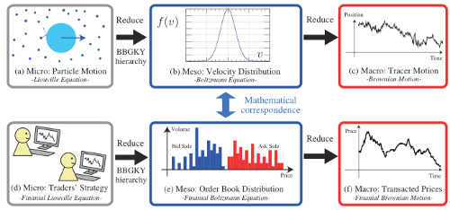

A limit order book is a comprehensive record of buy and sell orders for a specific financial instrument organized by price level. In trading, it serves as the central mechanism facilitating orderly transactions by matching buy and sell orders from various market participants. The book consists of limit orders which specify the maximum or minimum price at which a participant is willing to buy or sell a security. As these orders accumulate, they reflect the supply and demand dynamics for the asset, providing crucial insights into market activity.

In algorithmic trading, limit order books are essential because they offer a structured view of the market, enabling algorithms to make informed trading decisions. These systems rely on precise and timely data that the limit order book provides, allowing for efficient trade execution and strategy formulation. As algorithmic trading continues to grow in prominence due to its ability to execute complex strategies at speed and scale, understanding limit order books becomes increasingly critical.



Algo trading is not just prevalent but essential in today’s markets, allowing financial institutions to process large volumes of transactions quickly and with reduced human intervention. The adoption of algorithmic trading strategies has expanded significantly, with estimates suggesting that a substantial portion of daily trading volume in major financial markets is now carried out by these algorithms. This rising trend underscores the need for comprehensive tools like limit order books to enhance decision-making and market efficiency.

This article aims to elucidate the pivotal role that limit order books play in algorithmic trading. It will detail how these books provide transparency, help manage liquidity, and improve execution efficiency. Additionally, the article will address the benefits and challenges associated with their use and explore technological and regulatory considerations that impact how they are utilized. By understanding these aspects, readers can appreciate the complexities and potential of integrating limit order books with algo trading systems. The article will proceed by first dissecting the fundamental components and operations of limit order books before exploring their place and utility within algorithmic trading environments. It will also outline the benefits that traders can derive from this synergy and the obstacles they might encounter. Concluding with future prospects and ongoing developments, this discussion will serve as a comprehensive resource for market participants seeking to leverage limit order books in algorithmic strategies effectively.

## Table of Contents

## Understanding Limit Order Books

A limit order book is a critical component of modern financial markets, serving as an electronic registry for buy and sell orders for a specific security. This registry is organized according to price levels, with buy orders (bids) and sell orders (asks) arrayed to provide a comprehensive overview of market intentions.

### Limit Orders and Their Function in Trading

A limit order is a type of order to buy or sell a security at a specified price or better. For a buy limit order, this price is the maximum that the buyer is willing to pay. Conversely, for a sell limit order, it represents the minimum price the seller will accept. Limit orders allow traders to determine the price at which they are willing to transact, providing control over the execution of their trades.

### Structure and Components of a Limit Order Book

The limit [order book](/wiki/order-book-trading-strategies) is typically structured as a two-sided ledger, featuring bid prices and corresponding quantities on one side, and ask prices with their quantities on the other. The orders are ranked according to price priority, where higher bid prices and lower ask prices receive precedence. Within each price level, the orders are further organized based on time priority, giving advantage to those entered earlier.

A simplified representation of a limit order book might look like this:

| Bid Price | Bid Quantity | Ask Price | Ask Quantity |
|-----------|--------------|-----------|--------------|
| $100.00   | 50           | $100.50   | 30           |
| $99.50    | 70           | $101.00   | 60           |
| $99.00    | 100          | $101.50   | 90           |

In this example, the highest bid is $100.00, while the lowest ask is $100.50, making $100.00 - $100.50 the bid-ask spread.

### Matching Engines and Execution of Trades

Matching engines are crucial systems within exchanges that use limit order [books](/wiki/algo-trading-books) to facilitate trades. They operate by matching buy orders with sell orders in the order book. When a new order enters the book, the matching engine examines the highest available bid with the lowest ask to determine if a match can be made. Successful matching results in a trade execution at the most recent trade price, also known as the last traded price. If no immediate match occurs, the order is either added to the book (if it's a limit order) or canceled (if it's a market order).

### The Role of Bid-Ask Spreads

The bid-ask spread is the difference between the highest price a buyer is willing to pay (bid) and the lowest price a seller is willing to accept (ask). This spread is a key indicator of market [liquidity](/wiki/liquidity-risk-premium) and efficiency. Narrow spreads often signify high liquidity and intense competition among traders, while wider spreads might indicate lower liquidity or higher [volatility](/wiki/volatility-trading-strategies).

### Advantages and Challenges of Using Limit Order Books

Limit order books provide several advantages to traders. They offer transparency by displaying all active buy and sell orders, which helps in understanding market depth and price dynamics. Furthermore, they allow for better price control, enabling traders to execute orders at favorable prices.

However, there are challenges associated with using limit order books. Notably, they can be susceptible to high-frequency trading strategies that exploit time priority rules, potentially disadvantaging traditional investors. Additionally, under volatile market conditions, the balance in the order book can shift rapidly, leading to greater transaction difficulty and increased risk of order slippage.

In summary, understanding and effectively using limit order books can enhance a trader's ability to perform in the market by enabling more informed decisions, improving price execution, and managing liquidity efficiently. Nonetheless, traders must also contend with the complexities and rapid changes inherent in these systems.

## The Role of Limit Order Books in Algorithmic Trading

Algorithmic trading strategies heavily rely on limit order books (LOBs) to optimize execution and maximize profitability. These electronic ledgers record buy and sell orders for specific financial instruments at various price levels. The availability of such detailed order information allows traders to craft strategies that are responsive to market dynamics. 

Execution algorithms, such as Volume Weighted Average Price (VWAP) and Time Weighted Average Price (TWAP), utilize LOBs to place trades discreetly over time, minimizing market impact. VWAP aims to execute an order at an average price based on [volume](/wiki/volume-trading-strategy) and over a pre-defined period, while TWAP focuses on distributing trades evenly over time. High-frequency trading ([HFT](/wiki/high-frequency-trading-strategies)), another algorithm type, extensively leverages LOBs to exploit minute price discrepancies within milliseconds, requiring precise and timely order book data to gain a competitive edge.

Real-time data from LOBs is crucial for algorithmic traders, as it feeds models and strategies that have to adapt promptly to changes in the market environment. This data allows for constant monitoring of order flow—the rate at which buy and sell orders are submitted to the market—which provides insights into market sentiment and potential price movements. Traders analyze metrics such as order book depth, order flow imbalance, and price pressure to assess liquidity conditions and make informed decisions.

By integrating LOB analysis, algorithmic strategies contribute to enhanced market efficiency. The continuous matching of buy and sell orders ensures that prices reflect current market conditions, aiding in the price discovery process. In essence, the LOB serves as a real-time reflection of supply and demand pressures for a financial instrument, facilitating an environment where prices can adjust swiftly to new information.

Through their ability to react faster and more efficiently than human traders, algorithmic systems utilizing LOBs play a significant role in refining market operations. They increase liquidity by continuously providing buy and sell orders, narrowing bid-ask spreads, and ensuring that prices are a more accurate representation of intrinsic asset values. As markets evolve, the intricacies of LOBs remain central to the mechanics of [algorithmic trading](/wiki/algorithmic-trading), underscoring their importance in modern financial markets.

## Benefits of Using Limit Order Books in Algo Trading

Limit order books (LOBs) are essential tools for algorithmic traders, providing critical transparency and depth insights into financial markets. By displaying all outstanding buy and sell orders for a particular security, LOBs allow traders to assess the current state of the market, evaluate liquidity, and make informed trading decisions.

**Transparency and Market Insights**

A limit order book provides a detailed view of all limit orders at varying price levels above and below the current market price. This visibility enables traders to understand market sentiment and supply-demand dynamics. The transparency afforded by LOBs facilitates more accurate pricing, as traders can spot large order concentrations that may influence price movements. With a clear view of the bid and ask prices, as well as the depth at each price level, traders can gauge the strength of support and resistance levels.

**Enhancing Liquidity Management**

LOBs play a crucial role in managing liquidity by allowing algorithmic traders to analyze the aggregate volume available at different price levels. By examining the order book, traders can identify liquidity pools and employ strategies to minimize market impact. For example, by breaking large orders into smaller parts or by executing trades at times of peak liquidity, traders can reduce the likelihood of moving the market against their position.

**Reduction of Market Impact and Slippage**

Effective utilization of LOBs helps in reducing market impact and slippage, which are critical concerns for institutional traders executing large orders. By studying the LOB, traders can determine optimal entry and [exit](/wiki/exit-strategy) points that align with liquidity pockets and thinner areas in the book. This strategic placement of orders helps mitigate the adverse effects of slippage, where trades execute at less favorable prices due to market movement during the trade execution.

**Backtesting Strategies with Historical Data**

Historical limit order book data provides a treasure trove of information for [backtesting](/wiki/backtesting) trading strategies. By simulating trades using past order book configurations, traders can evaluate the performance of their strategies under different market conditions. Python, with libraries like Pandas and NumPy, offers powerful tools for processing and analyzing historical LOB data. For instance:

```python
import pandas as pd

# Load historical order book data
order_book_data = pd.read_csv('historical_order_book_data.csv')

# Analyze the data to assess strategy performance
def backtest_strategy(data):
    # Example strategy logic
    results = []
    for index, row in data.iterrows():
        if row['bid_volume'] > row['ask_volume']:
            # Buy signal
            results.append('Buy')
        else:
            # Sell signal
            results.append('Sell')
    return results

strategy_results = backtest_strategy(order_book_data)
```

This capability for rigorous backtesting allows for the refinement and validation of algorithmic trading models before deployment in live markets.

**Enabling Proactive Trading Strategies**

Finally, LOBs empower traders to adopt proactive strategies that anticipate market moves. By continuously monitoring changes in the order book, algorithms can detect patterns and predict price trends. For example, a sudden increase in buy orders at a certain price level might suggest an impending upward price movement. Traders can capitalize on such insights by executing trades before these moves materialize in the broader market, thus gaining an edge over competitors.

In conclusion, limit order books are indispensable for algorithmic traders. They provide the transparency and insights necessary to enhance liquidity management, reduce market impact, and refine trading strategies through backtesting. Consequently, LOBs enable the development and execution of proactive trading approaches that drive success in competitive financial markets.

## Challenges and Risks

Relying on limit order books for algorithmic trading presents several challenges and risks that need careful consideration. One of the main issues is latency, which significantly impacts high-frequency trading (HFT). Latency refers to the time delay between the input and the execution of a trading signal. In HFT, even microseconds of delay can lead to substantial disadvantages, as algorithms compete to exploit small price inefficiencies. This requires sophisticated technology infrastructure to minimize latency, involving direct market access and co-location strategies, where trading systems are placed as close as possible to exchange servers.

Another potential risk is adverse selection, which occurs when the counterparty to a trade has more information, leading to unfavorable conditions for the trader using limit orders. In limit order books, this can happen when informed traders place orders in response to new information, capturing liquidity from less informed limit orders, thereby disadvantaging these orders. Traders need to devise strategies that mitigate this risk, for example, by dynamically adjusting prices or canceling orders when adverse conditions are detected.

Stale data is another significant challenge in algo trading. It refers to the use of outdated information for decision-making, which can lead to suboptimal trading actions. This is particularly critical in fast-moving markets where price and order book conditions can change rapidly. Algorithms relying on stale data may execute trades based on inaccurate market conditions, leading to potential losses. Continuous improvement in data processing and real-time analytics is crucial to reduce the risk of using stale information.

Market volatility also affects the dynamics of the order book and the performance of trading algorithms. In periods of high volatility, the order book's liquidity may evaporate, spreads can widen, and algorithms may face difficulty executing trades at desired prices. Volatility can increase the likelihood of slippage, where the execution price deviates from the intended price, and can also disrupt strategy performance. Therefore, algorithms must incorporate adaptive measures and risk management mechanisms to cope with varying market conditions.

In summary, while limit order books provide critical information for algorithmic trading, leveraging them effectively requires overcoming challenges like latency, adverse selection, stale data, and market volatility. Addressing these risks necessitates advanced technology and robust strategy design, ensuring algorithms remain competitive and resilient in dynamic trading environments.

## Technological and Regulatory Considerations

In the context of algorithmic trading, managing limit order books requires robust technological infrastructures that can handle large volumes of data and rapid processing speeds. These infrastructures must be capable of updating order book data in real-time, executing trades efficiently, and maintaining a high level of reliability. Key technological components include powerful computing hardware, sophisticated software platforms, and secure data storage solutions.

Data providers play a crucial role by supplying real-time market data, including order book updates, trade executions, and other relevant financial information. Choosing a reliable data provider is essential for algo traders, as data quality and speed directly impact trading decisions. In high-frequency trading, for instance, even microsecond delays can lead to significant adverse effects on performance. To mitigate latency issues, traders often employ co-location services, which place their trading systems physically close to the exchanges' data centers, ensuring minimal delays in data transmission.

The regulatory environment surrounding limit order books and algorithmic trading has become increasingly stringent in recent years. Regulatory bodies such as the U.S. Securities and Exchange Commission (SEC) and the European Securities and Markets Authority (ESMA) impose rules and guidelines to ensure market integrity and protect investors. These include requirements for transparency, audit trails, and system resilience. Algo traders must adhere to these regulations by implementing comprehensive risk management frameworks and ensuring their trading activities comply with legal standards. Compliance requirements include maintaining detailed records of trading algorithms, trade executions, and any changes made to the automated trading systems.

Recent advancements in technology have significantly enhanced the ability to process real-time limit order book data. Technologies such as [machine learning](/wiki/machine-learning) and [artificial intelligence](/wiki/ai-artificial-intelligence) are increasingly employed to analyze order book data, identify patterns, and predict market movements. Additionally, the development of high-performance computing (HPC) and cloud computing solutions has enabled traders to harness powerful computational resources on-demand, facilitating the rapid processing of large datasets.

Furthermore, the emergence of blockchain technology has opened new avenues for secure and transparent data management in financial markets. While still in its nascent stages, blockchain offers potential benefits such as improved data integrity and enhanced tracking of transaction histories, which could revolutionize how limit order books are managed in the future.

In conclusion, managing limit order books in algorithmic trading necessitates a sophisticated technological setup to ensure efficiency, compliance, and competitiveness. As technology continues to evolve, traders must remain vigilant in adapting to new tools and regulatory changes to maintain a competitive edge while safeguarding market integrity.

## Conclusion

The essential role of limit order books in algorithmic trading is underscored by their ability to facilitate real-time analysis of market conditions, which is crucial for executing effective trading strategies. Limit order books provide transparency and depth, offering insights into market dynamics, such as price levels where significant buying or selling interest exists. This visibility helps algorithmic traders design strategies that leverage market liquidity efficiently and minimize the adverse impact on prices.

Among the benefits of utilizing limit order books in algorithmic trading is the enhanced capability to manage liquidity. They enable traders to strategically place orders that interact optimally with existing market interests, reducing market impact and slippage. Limit order books also offer a historical view, facilitating backtesting of strategies that can anticipate market movements more effectively. Moreover, they support proactive trading strategies by providing signals that can be integrated into complex algorithmic models.

However, challenges persist, including the latency issues that can affect high-frequency trading strategies, particularly when speed is paramount. The risk of adverse selection, where traders' orders are picked off by more informed market participants, remains a concern. Additionally, stale data may mislead algorithms into executing trades based on outdated information, especially in fast-moving markets. High volatility can further distort order book dynamics, impacting the performance of trading algorithms.

Looking ahead, advancements in technology, such as enhanced data processing capabilities and improved latency solutions, continue to shape the evolution of limit order books. There's a growing emphasis on integrating machine learning and artificial intelligence to analyze and predict market trends more accurately. These developments herald a new era for limit order book technology, promising increased efficiency and sophistication for algo trading.

Continued learning and exploration are vital for trading professionals and algorithm developers, given the fast-paced advancements in financial technology. Balancing innovation with effective risk management is crucial, ensuring that new strategies and tools are implemented with a robust awareness of their potential risks and shortcomings. As algorithmic trading evolves, maintaining this balance will be key to leveraging the benefits of limit order books effectively while mitigating associated risks.

## References & Further Reading

[1]: Bouchaud, J.-P., Farmer, J. D., & Lillo, F. (2009). "How Markets Slowly Digest Changes in Supply and Demand." In T. Hens & K. R. Schenk-Hoppe (Eds.), *Handbook of Financial Markets: Dynamics and Evolution*. Elsevier. doi:10.1016/B978-012374258-2.50010-X

[2]: O'Hara, M. (1995). *Market Microstructure Theory*. Blackwell, Cambridge, MA.

[3]: "High-Frequency Trading: A Practical Guide to Algorithmic Strategies and Trading Systems" by Irene Aldridge (Wiley Trading, 2009)

[4]: Gould, M. D., Porter, M. A., Williams, S., McDonald, M., Fenn, D. J., & Howison, S. D. (2013). "Limit Order Books." *Quantitative Finance*, 13(11), 1709-1742. doi:10.1080/14697688.2013.803148

[5]: Hasbrouck, J. (2007). *Empirical Market Microstructure: The Institutions, Economics, and Econometrics of Securities Trading*. Oxford University Press.