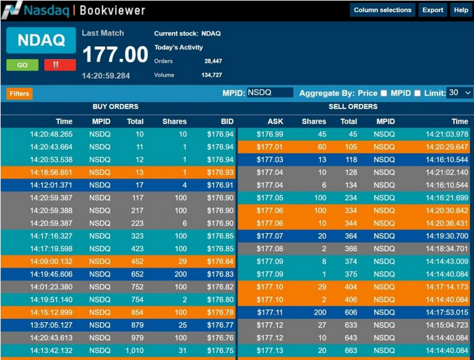

## Table of Contents

## What is a limit order book and why is it important in high-frequency trading?

A limit order book is like a list that keeps track of all the buy and sell orders for a stock or asset that haven't been filled yet. It shows the prices people are willing to pay to buy the stock (bids) and the prices people are willing to sell it for (asks). The book is organized by price, with the highest bids and the lowest asks at the top. This helps traders see the current supply and demand for the stock at different price levels.

In high-frequency trading, the limit order book is very important because it helps traders make quick decisions. High-frequency traders use computers to buy and sell stocks very quickly, often in fractions of a second. They need to know the best prices available right now, and the limit order book gives them that information. By looking at the book, they can see if there are a lot of people wanting to buy or sell at certain prices, and they can use this information to make trades that might make them money. So, the limit order book is a key tool for these traders to act fast and smart in the market.

## How does a limit order book differ from a market order book?

A limit order book and a market order book are two different ways to keep track of orders in the stock market. A limit order book lists all the orders where people have set a specific price at which they want to buy or sell a stock. For example, if you want to buy a stock but only if it's $50 or less, you put that order in the limit order book. It shows all these orders sorted by price, so you can see the highest price someone is willing to pay to buy (bids) and the lowest price someone is willing to sell (asks).

On the other hand, a market [order book](/wiki/order-book-trading-strategies) keeps track of orders where people just want to buy or sell a stock at whatever the current price is. If you put in a market order to buy a stock, it will be filled right away at the best available price at that moment. Unlike the limit order book, the market order book doesn't show specific prices for orders because these orders are meant to be executed immediately at the market price.

Both types of order [books](/wiki/algo-trading-books) are important for traders. The limit order book helps traders who want more control over the price they pay or receive, while the market order book is useful for traders who want to get in or out of a position quickly without worrying about the exact price.

## What are the basic components of a limit order book?

A limit order book has two main parts: the bid side and the ask side. The bid side shows all the orders from people who want to buy the stock. These orders are listed with the highest price someone is willing to pay at the top, and they go down to lower prices. The ask side shows all the orders from people who want to sell the stock. These orders start with the lowest price someone is willing to sell at the top, and they go up to higher prices. Together, these two sides help show the current supply and demand for the stock at different price levels.

Another important part of a limit order book is the order of the orders. When people put in orders to buy or sell, their orders get added to the book based on the price they want and the time they put in the order. If two people want to buy at the same price, the person who put in their order first gets a better spot on the list. This is called the "time priority" rule. It's important because it helps make things fair and orderly in the market.

## How do limit orders and market orders interact within the limit order book?

When someone puts in a limit order to buy or sell a stock, it goes into the limit order book at the price they want. For example, if you want to buy a stock but only if it's $50 or less, your order goes into the book at $50 on the bid side. If someone else wants to sell the stock at $50, their order goes into the book at $50 on the ask side. The book keeps all these orders sorted by price, so you can see the best prices people are willing to buy and sell at.

When someone puts in a market order, it's different. A market order is a request to buy or sell a stock right away at the best available price. If you put in a market order to buy, it will match with the lowest ask price in the limit order book. For example, if the lowest ask price is $51, your market order to buy will be filled at $51. If you put in a market order to sell, it will match with the highest bid price in the limit order book. So, market orders use the prices in the limit order book to get filled quickly, while limit orders sit in the book until the right price comes along.

## What is the role of liquidity in a limit order book?

Liquidity in a limit order book is like having a lot of buyers and sellers ready to trade. It means there are many orders in the book, both to buy and to sell, at different prices. When a stock has high [liquidity](/wiki/liquidity-risk-premium), it's easier to buy or sell it quickly without the price moving a lot. This is good for traders because they can get in and out of trades more easily and with less risk of the price changing suddenly.

On the other hand, if a stock has low liquidity, there are fewer orders in the book. This can make it harder to buy or sell the stock without affecting the price a lot. Traders might have to wait longer to get their orders filled, or they might have to accept a worse price. So, liquidity is important because it affects how smoothly and quickly trades can happen in the market.

## How do high-frequency traders use the limit order book to make trading decisions?

High-frequency traders use the limit order book to make quick trading decisions by looking at the current buy and sell orders. They can see the best prices people are willing to buy or sell at, which helps them decide if they should buy or sell a stock right now. For example, if they see a lot of people wanting to buy at a certain price, they might decide to buy the stock quickly and then sell it to those buyers for a small profit. They use computers to do this very fast, often in less than a second.

These traders also look at the overall pattern of orders in the limit order book to guess where the price might go next. If they see more orders to buy than to sell, they might think the price will go up soon. So, they might buy the stock now and sell it later at a higher price. By watching the limit order book closely, high-frequency traders can make many small trades throughout the day, trying to make a little bit of money on each one.

## What are the common strategies high-frequency traders employ using the limit order book?

High-frequency traders use the limit order book to spot quick trading chances. One common strategy they use is called "[market making](/wiki/market-making)." They put in both buy and sell orders at different prices to help make the market more liquid. They hope to buy low and sell high, even if it's just for a tiny profit. By doing this a lot of times, they can make money from the small differences in price. They use computers to watch the limit order book and change their orders very fast to keep up with the market.

Another strategy is called "order anticipation." High-frequency traders look at the limit order book to guess what other traders might do next. If they see a lot of buy orders coming in at a certain price, they might think the price will go up soon. So, they quickly buy the stock before it goes up and then sell it at the higher price. This strategy needs them to be very fast and good at reading the limit order book to make money before the price changes.

Some high-frequency traders also use a strategy called "[arbitrage](/wiki/arbitrage)." They look for small differences in prices between different markets or stocks. If they see that a stock is cheaper in one place than another, they buy it where it's cheap and sell it where it's more expensive. They use the limit order book to find these price differences quickly and make trades before the prices change. This way, they can make money from the small gaps in prices across different markets.

## How can one interpret the depth of the limit order book and what does it indicate?

The depth of the limit order book shows how many orders are waiting to be filled at different prices. If you look at the book, you can see how many people want to buy or sell at each price level. If there are a lot of orders at many different prices, the book is deep. This means there is a lot of interest in the stock, and it's easier to buy or sell it without moving the price a lot. On the other hand, if there are only a few orders and they are all at similar prices, the book is not very deep. This can make it harder to trade without affecting the price.

The depth of the limit order book can tell you a lot about the stock's liquidity and what might happen to the price. If the book is deep on the buy side, it means a lot of people want to buy the stock, which could push the price up. If it's deep on the sell side, it means a lot of people want to sell, which could push the price down. By looking at the depth, traders can guess if the price might move soon and make their trading decisions based on that.

## What are the potential risks and rewards associated with trading based on limit order book data?

Trading based on limit order book data can offer big rewards, but it also comes with risks. One reward is that you can see the current supply and demand for a stock, which helps you make smart trading decisions. If you see a lot of people wanting to buy at a certain price, you might decide to buy the stock quickly and then sell it to those buyers for a small profit. This can add up to a lot of money if you do it many times a day. Also, by looking at the depth of the book, you can guess where the price might go next and get in and out of trades at the right time.

However, there are also risks involved. One big risk is that the market can change very fast. If you see a lot of buy orders and think the price will go up, but then something unexpected happens and the price goes down instead, you could lose money. Another risk is that other traders, especially high-frequency traders, might be faster than you. They use computers to make trades in fractions of a second, so by the time you act on the information from the limit order book, the market might have already moved. So, while the limit order book can give you valuable information, it's important to be aware of these risks and trade carefully.

## How do regulatory considerations affect the use of limit order books in high-frequency trading?

Regulatory considerations can have a big impact on how high-frequency traders use limit order books. One important rule is about "fairness." Regulators want to make sure that all traders, whether they are using computers or trading by hand, have a fair chance to trade. This means that high-frequency traders can't use the limit order book to get special advantages over others. For example, regulators might put rules in place to stop high-frequency traders from seeing order information before others do, which could help keep the market fair for everyone.

Another big concern for regulators is "market stability." They want to make sure that high-frequency trading doesn't cause big swings in stock prices. Sometimes, when a lot of high-frequency traders are using the limit order book to make quick trades, it can lead to sudden price changes. To prevent this, regulators might set up rules to slow down trading a bit or limit how much high-frequency traders can trade at once. These rules help keep the market stable and protect other traders from big, unexpected price moves.

## What advanced techniques can be used to analyze the limit order book for better trading outcomes?

One advanced technique to analyze the limit order book is called "order flow analysis." This means looking at how orders are coming into the book and how they are being filled. Traders can use this to see if more people are buying or selling and guess where the price might go next. For example, if a lot of big buy orders are coming in, it might mean the price will go up soon. By watching the order flow closely, traders can make better decisions about when to buy or sell.

Another technique is "[volume](/wiki/volume-trading-strategy) profile analysis." This involves looking at how much trading is happening at different price levels in the limit order book. If there is a lot of trading at a certain price, it might be an important level where the price could stop or turn around. Traders can use this information to set their buy and sell orders at the best prices. By understanding where the most trading is happening, they can make trades that are more likely to be successful.

A third technique is "market impact analysis." This means figuring out how much a big trade will affect the price of a stock. If a trader wants to buy a lot of stock, they can use the limit order book to see how it might change the price. If the book is not very deep, a big buy order could push the price up a lot. By understanding the market impact, traders can plan their trades better and avoid moving the price too much against themselves.

## How might future technological advancements impact the functionality and use of limit order books in high-frequency trading?

Future technological advancements could make limit order books even faster and more detailed for high-frequency trading. As computers get better and faster, they can process more information from the limit order book in less time. This means high-frequency traders can see and react to changes in the book even quicker than they do now. Also, new technology might let traders see more details about the orders, like who is placing them or why. This could help them make even better guesses about where the price might go next and make smarter trading decisions.

Another way technology could change limit order books is by making them more secure and fair. Right now, high-frequency traders can sometimes see new orders a tiny bit before others, which gives them an advantage. But new technology might help stop this from happening. For example, better systems could make sure everyone sees new orders at the same time, so the market stays fair for all traders. This could make high-frequency trading safer and more trusted by everyone in the market.

## References & Further Reading

[1]: Bouchaud, J.-P., Farmer, J. D., & Lillo, F. (2009). "How Markets Slowly Digest Changes in Supply and Demand." In T. Hens & K. R. Schenk-Hoppe (Eds.), *Handbook of Financial Markets: Dynamics and Evolution*. Elsevier. doi:10.1016/B978-012374258-2.50010-X

[2]: O'Hara, M. (1995). *Market Microstructure Theory*. Blackwell, Cambridge, MA.

[3]: "High-Frequency Trading: A Practical Guide to Algorithmic Strategies and Trading Systems" by Irene Aldridge (Wiley Trading, 2009)

[4]: Gould, M. D., Porter, M. A., Williams, S., McDonald, M., Fenn, D. J., & Howison, S. D. (2013). "Limit Order Books." *Quantitative Finance*, 13(11), 1709-1742. doi:10.1080/14697688.2013.803148

[5]: Hasbrouck, J. (2007). *Empirical Market Microstructure: The Institutions, Economics, and Econometrics of Securities Trading*. Oxford University Press.