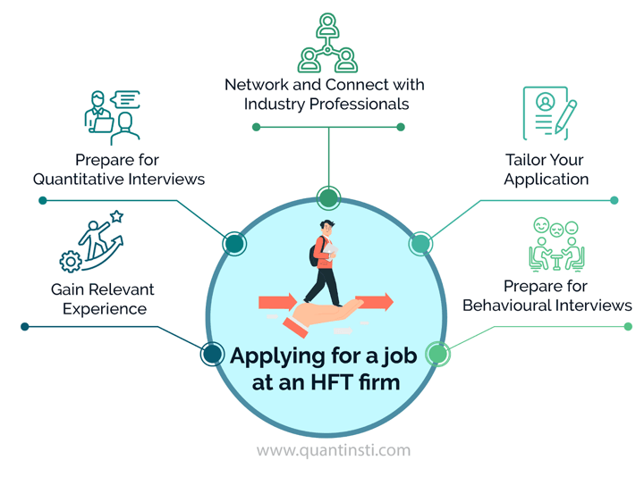

## Table of Contents

## What is high-frequency trading?

High-frequency trading, often called HFT, is a way of buying and selling stocks, currencies, or other financial items very quickly using computers. Traders use special programs that can make decisions and trades in just a few seconds or even less. The goal is to make small profits from lots of trades throughout the day. These trades happen so fast that humans can't keep up, so computers do all the work.

HFT is used by big banks, hedge funds, and other financial companies. They use powerful computers and fast internet connections to get information and make trades before others. This speed advantage can help them make money, but it can also make the market move quickly and unpredictably. Some people worry that HFT might make the market less stable, but others think it helps make trading more efficient.

## What are the basic requirements for a job in high-frequency trading?

To work in high-frequency trading, you need a strong background in math and computer science. You should be good at understanding and working with numbers and data. A degree in a related field like finance, engineering, or physics can help. Many people in HFT also have advanced degrees, like a master's or a PhD, because the job requires a deep understanding of complex ideas.

You also need to be good with computers and programming. Being able to write code is very important because [HFT](/wiki/high-frequency-trading-strategies) relies on software to make quick trades. Knowing languages like C++, Python, or Java can be helpful. Besides technical skills, you should be able to think fast and make decisions under pressure. Working in HFT can be stressful, so being able to stay calm and focused is key.

## What kind of education is typically needed for high-frequency trading jobs?

To get a job in high-frequency trading, you usually need a strong education in math and computer science. A bachelor's degree in fields like finance, engineering, or physics is common. These areas help you understand the complex math and data that are important in HFT. Many people in this field also have advanced degrees, like a master's or a PhD. These higher degrees show that you can handle very difficult ideas and problems, which is important for high-frequency trading.

Besides math and science, you need to be good at programming. High-frequency trading uses special software to make trades quickly, so knowing how to code is very important. Languages like C++, Python, or Java are often used in HFT. Being able to write and understand code helps you build and improve the trading systems that make HFT work.

## What are the key skills required for a high-frequency trader?

To be a good high-frequency trader, you need to be really good at math and computer science. These skills help you understand the numbers and data that are important in high-frequency trading. You also need to know how to program computers because HFT uses special software to make trades very quickly. Languages like C++, Python, or Java are often used, so knowing how to code in these languages is very helpful.

Besides the technical skills, you need to be able to think quickly and make decisions fast. High-frequency trading happens in seconds, so you have to be able to react and make choices without much time to think. It can be stressful, so staying calm and focused is important. Being able to work well with others is also key because high-frequency trading often involves working in teams to build and improve trading systems.

## How does one start a career in high-frequency trading?

To start a career in high-frequency trading, you need to focus on getting a strong education in math and computer science. A bachelor's degree in fields like finance, engineering, or physics can help you understand the complex ideas used in HFT. Many people in this field also have advanced degrees like a master's or a PhD, which show that you can handle difficult problems. It's also important to learn how to program computers because HFT uses special software to make trades very quickly. Languages like C++, Python, or Java are often used, so knowing how to code in these languages is very helpful.

Once you have the right education, you can start looking for internships or entry-level jobs at companies that do high-frequency trading. Big banks, hedge funds, and other financial companies often have HFT teams. These jobs can help you learn more about the field and gain experience. It's also a good idea to network with people who work in HFT. Going to industry events or joining online groups can help you meet people and learn about job opportunities. Starting in HFT can be hard, but with the right skills and some hard work, you can build a career in this exciting field.

## What are the typical roles within a high-frequency trading firm?

In a high-frequency trading firm, there are different roles that help the company run smoothly. One important role is the quantitative researcher. These people use math and data to find ways to make money from trading. They create the models that the computers use to decide when to buy and sell. Another role is the software engineer. These people build and take care of the computer programs that make the trades happen very quickly. They need to be good at coding and making sure the software works well.

Another key role is the trader. Traders watch the market and make sure the computer models are working right. They also help decide how much money to spend on different trades. The operations team is also important. They make sure everything in the company is working as it should. This includes making sure the computers and networks are fast and reliable, which is very important for high-frequency trading. Together, all these roles help the firm make quick and smart trades to make money.

## What is the work environment like in high-frequency trading?

The work environment in high-frequency trading is fast-paced and high-pressure. People who work in HFT are always trying to make trades quickly and accurately. The office is usually full of computers and screens that show lots of data and numbers. Everyone is focused on their work because even a small mistake can cost a lot of money. It's a place where you need to think fast and stay calm, even when things get stressful.

Teamwork is important in high-frequency trading. People with different skills, like math experts, computer programmers, and traders, all work together to make the trading systems better. They often share ideas and solve problems as a team. The environment can be exciting because you're always trying to find new ways to make money from trading. But it can also be intense because the market changes quickly and you need to keep up.

## How do high-frequency trading strategies work?

High-frequency trading strategies work by using computers to buy and sell things like stocks or currencies very quickly. The computers use special programs called algorithms that look at lots of information all the time. These algorithms find small chances to make money by buying something at a low price and selling it at a higher price, even if the difference is just a tiny bit. The key is to do this many times in a day, so all the small profits add up to a big amount.

These strategies depend on being very fast. High-frequency trading firms use powerful computers and super-fast internet connections to get information and make trades before others. They might use things like news stories, market data, or even tiny changes in prices to decide when to trade. This speed advantage can help them make money, but it also means the market can change very quickly. That's why high-frequency traders need to keep their systems working well and always be ready to change their strategies if needed.

## What are the common technologies and tools used in high-frequency trading?

In high-frequency trading, people use special computers and software to buy and sell things like stocks or currencies very quickly. These computers need to be really fast and powerful, so traders use servers that can handle a lot of work without slowing down. They also use fast internet connections to get information and send trade orders faster than other people. This helps them make money by being the first to act on new data or market changes.

The software used in high-frequency trading is called an algorithm. It's like a set of rules that the computer follows to decide when to buy or sell. These algorithms look at lots of information, like news stories, market prices, and other data, to find small chances to make money. Traders also use special tools to watch the market and make sure their algorithms are working right. These tools help them see what's happening and make quick changes if they need to.

## What are the regulatory considerations for high-frequency trading?

High-frequency trading is watched closely by people who make rules for the market. These rules are there to make sure that trading is fair and that no one can cheat. In many countries, there are laws that say high-frequency traders have to follow certain rules. For example, they might need to keep records of all their trades and report them to the people in charge. This helps make sure that everyone can see what's happening in the market and that it stays fair for everyone.

Another important rule is about how fast high-frequency traders can make trades. Some countries have rules that say traders can't use special tricks to make their trades go faster than everyone else's. This is to stop them from getting an unfair advantage. Also, there are rules to make sure that high-frequency trading doesn't cause big problems in the market. If the market starts moving too fast or in a way that could hurt people, the rules might say that trading needs to slow down or stop for a while.

## How do high-frequency trading firms manage risk?

High-frequency trading firms manage risk by using special computer programs that watch the market all the time. These programs can stop trading if they see something that could be risky. For example, if the market starts moving too fast or if prices change a lot, the program might decide to stop making trades until things calm down. This helps the firm avoid losing a lot of money if something unexpected happens.

Another way high-frequency trading firms manage risk is by spreading out their trades. Instead of putting all their money into one thing, they trade many different things at the same time. This way, if one trade goes bad, it won't hurt them too much because they have other trades that might do well. By doing this, they can make sure that they don't lose too much money even if the market gets tough.

## What are the advanced strategies used by expert high-frequency traders?

Expert high-frequency traders use advanced strategies that involve looking at lots of data very quickly. They use special computer programs called algorithms to find small chances to make money. These algorithms can look at things like news stories, market prices, and other information to decide when to buy or sell. The key is to make many small trades in a short time, so even tiny profits can add up to a big amount. These traders also use something called statistical [arbitrage](/wiki/arbitrage), which means they look for small differences in prices between similar things and trade to make money from those differences.

Another strategy that expert high-frequency traders use is called [market making](/wiki/market-making). This means they put up prices to buy and sell things, hoping to make money from the difference between the buying and selling prices. They also use a strategy called latency arbitrage, where they try to be faster than everyone else to make trades. By using very fast computers and internet connections, they can get information and make trades before others, which can give them an advantage. All these strategies help expert high-frequency traders make money in a fast-changing market.

## What are the typical job roles in High-Frequency Trading (HFT)?

High-frequency trading (HFT) firms rely on a variety of specialized job roles that ensure the seamless operation of their fast-paced trading systems. Understanding these roles is crucial for anyone looking to pursue a career in this sector. 

Quantitative Researchers play a central role in HFT firms by developing and testing complex mathematical models that drive trading strategies. These researchers typically have strong backgrounds in [statistics](/wiki/bayesian-statistics), mathematics, or computational sciences. They use advanced statistical techniques and [machine learning](/wiki/machine-learning) algorithms to identify profitable trading opportunities. For instance, a common task might involve creating predictive models to forecast price movements, which can be expressed mathematically as:

$$
P(t) = \alpha + \beta X(t) + \epsilon(t)
$$

where $P(t)$ is the predicted price at time $t$, $\alpha$ and $\beta$ are model coefficients, $X(t)$ is a vector of explanatory variables, and $\epsilon(t)$ is an error term. Proficiency in programming languages such as Python or C++ is essential, as these models are implemented and tested through computational simulations.

Developers in HFT firms are responsible for designing and implementing the software systems that execute trades at high speeds. These professionals must have expertise in low-latency programming and a deep understanding of computer architecture to optimize performance. They often work with technologies like FPGAs (Field-Programmable Gate Arrays) and GPUs (Graphics Processing Units) to accelerate processing speeds. A typical developer might write code to execute trading algorithms, as shown in this simple Python example that places a trade when certain conditions are met:

```python
def execute_trade(price, threshold):
    if price < threshold:
        return "Buy"
    elif price > threshold:
        return "Sell"
    else:
        return "Hold"

current_price = 150
trade_threshold = 145

trade_action = execute_trade(current_price, trade_threshold)
print(trade_action)
```

Traders at HFT firms are tasked with executing trades and managing market risks. They need extensive knowledge of financial markets and the ability to interpret market signals swiftly. While quantitative and programming skills are advantageous, traders must excel in decision-making under pressure and possess a keen insight into market behaviors. 

System Administrators ensure the stability and security of the trading infrastructure. They monitor network performance, manage server loads, and address technical issues that could impede trading operations. Expertise in IT and network management is indispensable, as is the ability to troubleshoot and optimize systems in real-time.

Each role within an HFT firm requires a unique set of skills, but a common requirement is the ability to collaborate effectively across disciplines. The interplay between quantitative research, software development, trading strategy, and system administration underscores the multifaceted nature of high-frequency trading.

## References & Further Reading

[1]: Kearns, M., & Nevmyvaka, Y. (2013). ["Machine Learning for Market Microstructure and High-Frequency Trading."](https://www.cis.upenn.edu/~mkearns/papers/KearnsNevmyvakaHFTRiskBooks.pdf) In High Frequency Trading: New Realities for Traders, Markets and Regulators.

[2]: Aldridge, I. (2013). ["High-Frequency Trading: A Practical Guide to Algorithmic Strategies and Trading Systems."](https://www.wiley.com/en-us/High+Frequency+Trading%3A+A+Practical+Guide+to+Algorithmic+Strategies+and+Trading+Systems%2C+2nd+Edition-p-9781118343500) John Wiley & Sons.

[3]: Cartea, Á., Jaimungal, S., & Penalva, J. (2015). ["Algorithmic and High-Frequency Trading."](https://assets.cambridge.org/97811070/91146/frontmatter/9781107091146_frontmatter.pdf) Cambridge University Press.

[4]: Lopez de Prado, M. (2018). ["Advances in Financial Machine Learning."](https://www.amazon.com/Advances-Financial-Machine-Learning-Marcos/dp/1119482089) Wiley.

[5]: Aldridge, I. (2009). ["The Quant Trader's Handbook."](https://www.amazon.com/Quant-Traders-Handbook-Algorithmic-Strategies/dp/B0C1JK3LX1) Wiley Trading.

[6]: Kissell, R. (2013). ["The Science of Algorithmic Trading and Portfolio Management."](https://www.sciencedirect.com/book/9780124016897/the-science-of-algorithmic-trading-and-portfolio-management) Academic Press.