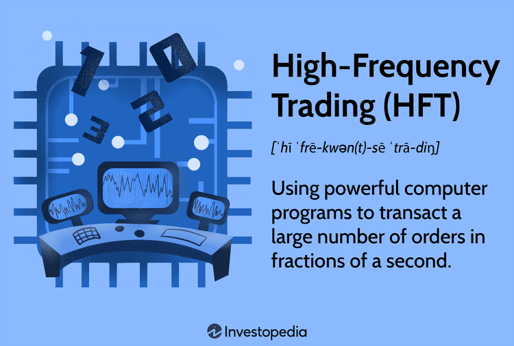

High-Frequency Trading (HFT) has emerged as a prominent component of the contemporary financial trading environment. Utilizing sophisticated algorithms and high-powered computing systems, HFT executes substantial volumes of orders within milliseconds, epitomizing the leading edge of trading technology. As a dominant force in the financial markets, HFT uses precision and speed to facilitate trades, making it a subject of considerable interest and debate within the economic community.

As the trading sector evolves with rapid technological advancements, HFT stands at the center of this transformation. The practice leverages microsecond execution speeds, enabling market participants to make prolific trades faster than traditional human-operated transactions. By analyzing large datasets and applying complex computational models, HFT firms pursue diverse trading strategies designed to capitalize on fleeting pricing inefficiencies.



While HFT enhances market mechanisms through increased liquidity and tighter bid-ask spreads, it also raises significant concerns. Critics question the fairness and ethical implications of HFT, suggesting it may introduce instability into financial markets and disproportionately benefit well-financed entities. Moreover, the phenomenon of "ghost liquidity" and episodic flash crashes reflect the potential downsides associated with HFT practices.

In this article, we will systematically examine both the mechanics and the broader implications of HFT. We will explore how HFT functions by dissecting its strategies and the technologies underpinning it. Furthermore, the discussion will highlight its contributions and controversies, providing a balanced perspective on its role in the modern market landscape. The objective is to furnish a comprehensive understanding of HFT, offering insights into its significance and the ongoing discourse it stimulates in financial domains.

## Table of Contents

## What is High-Frequency Trading (HFT)?

High-Frequency Trading (HFT) is a sophisticated form of [algorithmic trading](/wiki/algorithmic-trading) utilized predominantly by large financial institutions and hedge funds. It is a trading strategy marked by extraordinarily high speeds, high turnover rates, and significant order-to-trade ratios. The primary objective of HFT is to capitalize on the speed advantage to optimize trading decisions and execute a large number of transactions within extremely short time frames, often measured in milliseconds or even microseconds.

One of the defining features of HFT is its leverage of advanced computing technology and complex algorithms. These algorithms are designed to process large volumes of market data, identify trading opportunities, and determine optimal trading strategies based on pre-defined criteria, all in a fraction of a second. By continuously scanning multiple markets across geographies and asset classes, HFT algorithms can exploit minimal price discrepancies that only exist briefly, thereby enabling traders to capture small but consistent profits.

The efficiency of high-frequency trading lies in its ability to rapidly analyze market conditions and execute trades before other market participants, thus securing a competitive edge. This emphasis on speed arises from the basic principle that information and its quick execution are invaluable in the financial markets. An [HFT](/wiki/high-frequency-trading-strategies) system might, for instance, take advantage of temporary imbalances in supply and demand by quickly executing a series of buy and sell orders across different platforms to capitalize on price differences.

Moreover, the technological infrastructure supporting HFT is critical to its function. This includes not only powerful computing facilities but also ultra-low latency networks and proximity hosting services. HFT firms often position their servers as close to exchange servers as possible to minimize latency—a [factor](/wiki/factor-investing) crucial when trades are executed in microseconds. Such setups require substantial investment in both hardware and software development, positioning HFT as a strategy predominantly utilized by well-capitalized entities.

Overall, High-Frequency Trading exemplifies the cutting-edge application of technology in modern financial markets, transforming how trading operations are conducted and setting the stage for continuous evolution in trading strategies.

## How HFT Works

High-Frequency Trading (HFT) leverages advanced technological infrastructures and sophisticated algorithms to gain a competitive edge by executing trades at extraordinarily high speeds. At its core, HFT algorithms are designed to quickly analyze market data, identify trading opportunities, and execute large volumes of orders in milliseconds or even microseconds.

The operational framework of HFT starts with the creation of trading algorithms. These algorithms are the backbone of HFT strategies, capable of scanning numerous markets for [arbitrage](/wiki/arbitrage) opportunities, analyzing various forms of market data—such as price movements, order volumes, and market depth—and executing trades when conditions align with predefined criteria. A typical HFT strategy might involve executing a set of trades based on the detection of minuscule price discrepancies between markets, known as arbitrage opportunities. These discrepancies are often transient, existing for a fleeting moment before market equilibrium is restored.

To efficiently capitalize on such fleeting opportunities, HFT systems utilize co-location services, placing their trading servers as close as possible to the exchange servers. This physical proximity helps minimize latency, which is the delay between making a trading decision and the execution of that decision on the exchange. Minimizing latency is crucial because it ensures that the trading decisions of HFT algorithms are executed at the optimal time, reducing the adverse effects of price fluctuations.

Here is a simple Python example to illustrate how a basic HFT algorithm might function:

```python
import time
import random

# Example function to simulate price updates
def get_market_price():
    return random.uniform(100.0, 101.0)

# Example function to execute a trade
def execute_trade(volume, price):
    print(f"Executed trade for {volume} units at {price:.2f}")

# Simulate a high-frequency trading algorithm
def hft_algorithm():
    start_time = time.time()
    while time.time() - start_time < 1:  # Run for 1 second
        price = get_market_price()
        if price < 100.4:  # Example condition for a trading opportunity
            execute_trade(volume=1, price=price)

hft_algorithm()
```

In this example, the algorithm rapidly retrieves market prices and executes trades when specific conditions are met, highlighting the repetitive and high-speed nature of HFT.

Additionally, HFT systems are engineered to manage a large number of trades simultaneously, employing parallel processing to handle multiple transactions or market analyses concurrently. This capability not only enhances speed but also allows HFT firms to participate in multiple markets or asset classes simultaneously.

Furthermore, HFT exploits large datasets, applying complex statistical models and [machine learning](/wiki/machine-learning) techniques to predict market movements. These models often incorporate factors such as historical price patterns, trading volumes, and even news sentiment to refine predictive accuracy.

In summary, High-Frequency Trading operates on the principles of speed, precision, and [volume](/wiki/volume-trading-strategy). By leveraging advanced technology and comprehensive data analysis, HFT identifies and acts on market opportunities with unparalleled efficiency, aiming to capture profits from rapid market dynamics.

## Advantages of HFT

High-Frequency Trading (HFT) offers several advantages, significantly influencing how modern markets operate. One of the primary benefits is the substantial increase in market [liquidity](/wiki/liquidity-risk-premium). Liquidity refers to the ease with which assets can be bought and sold without causing a significant change in the asset's price. HFT firms, by executing a high volume of orders at rapid speeds, contribute to the increased buying and selling activity in financial markets. This abundant liquidity helps narrow the bid-ask spreads—the difference between the highest price a buyer is willing to pay and the lowest price a seller is willing to accept—thereby reducing transaction costs for all market participants.

Moreover, HFT plays a crucial role in facilitating efficient price discovery. Price discovery is the mechanism through which the current market price of an asset is determined, reflecting all available information. HFT algorithms analyze vast amounts of data across various markets almost instantaneously, updating prices to reflect new information with remarkable precision. This rapid adjustment capability ensures that asset prices are more aligned with their true market value, providing traders and investors with more accurate and transparent pricing information.

The speed and efficiency attributed to HFT also significantly enhance the profitability of trading operations. HFT firms capitalize on fleeting price discrepancies that may exist only for milliseconds, enabling them to execute trades before these opportunities dissipate. By leveraging advanced algorithms and high-speed computing, HFT can identify and act upon these marginal differences efficiently, often conducting thousands of trades per second. Such capabilities enable HFT firms to generate profit margins on a massive scale, even when individual transaction profits might be minimal.

These advantages position HFT as a pivotal component in the contemporary trading arena, offering benefits that enhance overall market functionality while driving the continual evolution of trading practices through technology.

## Disadvantages and Criticisms of HFT

High-Frequency Trading (HFT) has stirred a significant amount of debate due to several perceived disadvantages and criticisms. Critics often argue that HFT creates an uneven playing field, granting well-capitalized firms a substantial advantage due to their ability to invest in advanced technology and infrastructure. These firms can exploit minute discrepancies in price faster than other market participants, leading to concerns about fairness and equality in the financial markets.

One of the concerns related to HFT is the phenomenon known as 'ghost liquidity.' This occurs because the liquidity provided by HFT is often fleeting, existing only momentarily to capture minor price movements. Slower traders, including retail investors, may find themselves unable to capitalize on this transient liquidity. Consequently, these traders might face increased costs or reduced opportunities for executing their trades at favorable prices.

The high-speed nature of HFT can also contribute to market [volatility](/wiki/volatility-trading-strategies). HFT strategies, which often involve numerous trades executed within milliseconds, may amplify price movements by reacting to each other's trades instead of fundamental market information. This reaction speed can lead to increased volatility, particularly in markets characterized by lower liquidity or unexpected events.

Furthermore, HFT has been associated with 'flash crashes,' abrupt market nosedives followed by swift recoveries. These events highlight the potential for HFT to cause sudden and severe market disruptions. An example is the May 6, 2010, U.S. stock market flash crash, during which major indices plummeted and rebounded within minutes, significantly impacting investor confidence. Investigations indicated that the rapid execution of orders by HFT algorithms exacerbated the downturn by removing liquidity when it was most needed.

Overall, while HFT contributes to increased market efficiency and liquidity under normal conditions, it poses risks that need careful management. Balancing these high-speed trading technologies' associated benefits and challenges involves ensuring adequate regulatory oversight and market infrastructure resilience to maintain a fair and stable financial environment.

## HFT in Different Markets

High-Frequency Trading (HFT) has made significant inroads across various financial markets, extending beyond traditional equities to include futures, options, and [cryptocurrency](/wiki/cryptocurrency) trading. Each of these markets presents unique characteristics and challenges that HFT algorithms are designed to exploit for improved trading efficiency and profitability.

In equity markets, HFT is employed to execute a large volume of trades in extremely short periods, taking advantage of minuscule price fluctuations. This activity enhances market liquidity and ensures narrower bid-ask spreads, facilitating smoother and more cost-effective trading processes for market participants.

Moving to the futures market, HFT leverages the rapid execution of trades to capitalize on the temporal price movements that occur due to the continuous flow of market information. Futures contracts often react quickly to new information since they are used to hedge risks or speculate on price directions. HFT strategies in this market focus on futures arbitrage, market-making, and trend-following, taking advantage of price differentials between related markets.

In the options market, the complexity increases due to the derivatives' pricing model, which incorporates variables such as time decay and volatility. HFT helps in the swift pricing and execution of options trades by analyzing the underlying asset's price movements and adjusting positions in real time. Strategies may include delta-neutral approaches or volatility arbitrage, where HFT systems efficiently manage the calculated risks and expected returns.

Emerging rapidly, the cryptocurrency market has also become a fertile ground for HFT. Cryptocurrencies operate 24/7, offering opportunities for HFT firms to trade across a decentralized network of exchanges. Given the volatile nature of cryptocurrencies, HFT capitalizes on rapid price changes by executing cross-exchange arbitrage and market-making strategies to ensure liquidity. Algorithms evaluate order [books](/wiki/algo-trading-books) and transaction history at high speed to identify inconsistencies between exchange rates and to execute profitable trades.

A simple Python example to illustrate a basic HFT strategy in the crypto space could look like this:

```python
import ccxt
import time

exchange = ccxt.binance()
symbol = 'BTC/USDT'

while True:
    order_book = exchange.fetch_order_book(symbol)
    bid = order_book['bids'][0][0] if len(order_book['bids']) > 0 else None
    ask = order_book['asks'][0][0] if len(order_book['asks']) > 0 else None

    if bid and ask:
        spread = ask - bid
        if spread > 0.5:  # Example threshold
            print(f"Spread is {spread}, placing order.")
            # Here you'd place logic for buying or selling
    time.sleep(1)  # Adjust frequency as needed
```

This script fetches the [order book](/wiki/order-book-trading-strategies) for a given cryptocurrency pair and monitors the bid-ask spread to identify trading opportunities. Despite its simplicity, it represents the core concept of how HFT algorithms operate in cryptocurrency markets: swiftly react to small price discrepancies. 

Overall, HFT's integration into various financial markets demonstrates its adaptability and the value it provides in enhancing market dynamics. Whether it's equities, futures, options, or digital currencies, HFT continues to push the boundaries of trading technology, offering both opportunities and challenges in these diverse environments.

## Challenges and Future of HFT

The environment for High-Frequency Trading (HFT) is continuously evolving with technological advancements and increased regulatory scrutiny. This dynamic nature of HFT presents several challenges and opportunities for the future.

One of the primary challenges in HFT is the high cost of infrastructure. Establishing and maintaining the necessary technology for HFT, such as low-latency networks and powerful computational systems, requires significant capital investment. These costs can be prohibitive for smaller firms, creating a competitive disparity where only well-capitalized entities can participate effectively. Firms must continually invest in state-of-the-art infrastructure to maintain speed and efficiency advantages.

Developing competitive algorithms is another intricate aspect of HFT. Algorithms must be capable of processing vast amounts of market data at rapid speeds to identify trading opportunities within milliseconds. This involves utilizing sophisticated machine learning techniques and predictive models. The continuous evolution of market conditions implies that algorithms must be regularly updated and optimized to remain effective. Python has become a popular language for developing these algorithms due to its robust libraries and frameworks for data analysis and machine learning, such as NumPy and scikit-learn.

Navigating regulatory restrictions presents additional complexity for HFT firms. Regulators globally are scrutinizing HFT practices, implementing measures to mitigate systemic risks and ensure market fairness. This includes rules on order-to-trade ratios, mandatory disclosures, and monitoring for manipulative activities. Complying with such regulations requires firms to establish rigorous compliance frameworks and may involve significant resource allocation.

Despite these challenges, HFT continues to hold substantial growth potential, particularly in emerging markets. As financial markets in these regions develop their technological infrastructure and regulatory frameworks, opportunities for HFT expansion increase. The application of HFT in less mature markets can enhance liquidity and efficiency, benefiting from the competitive dynamics and arbitrage opportunities.

Furthermore, advancements in technology, such as quantum computing, could revolutionize HFT by significantly increasing computational power and reducing latency times. These technological leaps hold the potential to redefine the speed and efficacy of HFT, enabling traders to exploit even finer market inefficiencies.

In conclusion, while HFT faces numerous challenges, its future remains promising. Balancing the demands of technology, compliance, and market dynamics will be crucial for firms aiming to capitalize on HFT's advantages. The ongoing dialogue between market participants and regulators will play a pivotal role in shaping the sustainable growth of high-frequency trading across global markets.

## Conclusion

High-Frequency Trading (HFT) has fundamentally reshaped the landscape of modern financial markets by offering substantial benefits such as increased liquidity and enhanced trading efficiency. Liquidity refers to the ease with which assets can be bought or sold in the market without affecting their price. The rapid trade execution characteristic of HFT contributes significantly to this liquidity, allowing for smoother operation of financial marketplaces and narrowing bid-ask spreads, thereby reducing transaction costs for investors.

However, HFT is accompanied by several challenges and risks. Critics highlight that it can create disproportionate advantages for firms with the resources to invest in sophisticated infrastructure and algorithms. This situation can lead to market disparities and has the potential to increase volatility, sometimes manifesting as flash crashes that disrupt market stability. The phenomenon of "ghost liquidity," where the apparent liquidity vanishes rapidly, complicates trading for participants unable to match the speed of HFT systems.

The continued evolution of HFT necessitates a careful balance between technological advancement and regulatory oversight. Effective regulation is crucial to mitigating risks such as market manipulation and ensuring a level playing field. As such, the dialogue surrounding HFT increasingly emphasizes identifying regulatory frameworks that safeguard market integrity while still fostering innovation.

High-Frequency Trading remains an essential component of modern financial markets, acting as a testament to the powerful integration of technology in trading. The ongoing development of HFT capabilities points to its potential for growth, especially in emerging markets where technological infrastructure is being rapidly developed. Ultimately, the future of HFT will hinge on how effectively stakeholders can manage its inherent risks while capitalizing on its benefits to enhance market functionality.

## References & Further Reading

[1]: Aldridge, I. (2013). ["High-Frequency Trading: A Practical Guide to Algorithmic Strategies and Trading Systems."](https://www.amazon.com/High-Frequency-Trading-Practical-Algorithmic-Strategies/dp/1118343506) Wiley.

[2]: Patterson, S. (2013). ["Dark Pools: High-Speed Traders, A.I. Bandits, and the Threat to the Global Financial System."](https://books.google.com/books/about/Dark_Pools.html?id=LIoNSKUEn24C) Crown Business.

[3]: MacKenzie, D. (2018). ["Material Signals: A Historical Sociology of High-Frequency Trading."](https://www.sps.ed.ac.uk/sites/default/files/assets/pdf/material-signals.pdf) Sociology 52(6):1047-1063.

[4]: Cartea, Á., Jaimungal, S., & Penalva, J. (2015). ["Algorithmic and High-Frequency Trading."](https://assets.cambridge.org/97811070/91146/frontmatter/9781107091146_frontmatter.pdf) Cambridge University Press.

[5]: Harris, L. (2013). ["What's to Love and Hate About High-Frequency Trading."](https://blogs.cfainstitute.org/investor/2013/04/24/what-to-do-about-high-frequency-trading/) Financial Analysts Journal, 69(3), 6-9.