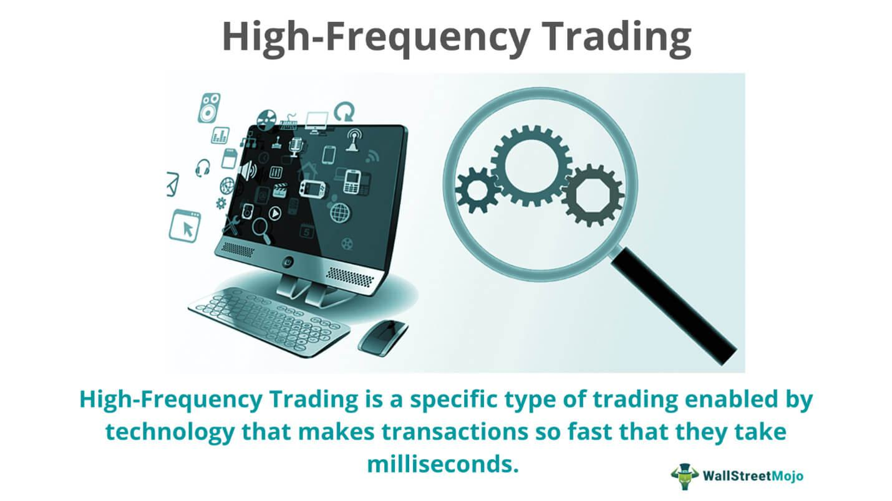

Financial markets play a vital role in global economies by facilitating the exchange of assets such as stocks, bonds, commodities, and derivatives. They serve as platforms where buyers and sellers come together to trade, influencing economic activity through resource allocation and price determination. Within these markets, trading strategies are fundamental determinants of success for investors, as they provide structured approaches to buying and selling assets based on specific goals and market conditions.

Traditional trading strategies often involve human judgment and decision-making. Investors may engage in fundamental analysis, evaluating a company’s financial health and future prospects, or technical analysis, which focuses on patterns in price movements and trading volumes to inform buy or sell decisions. These strategies tend to be time-intensive and rely heavily on traders' expertise and intuition.



In contrast, algorithmic trading represents a significant shift towards automation in the finance industry. This approach uses computer algorithms to execute trades based on predefined criteria, handling tasks more rapidly than humans. By eliminating emotional factors and increasing transaction speed and efficiency, algorithmic trading has transformed how market trades are executed. High-frequency trading (HFT) is a prominent subset of algorithmic trading, characterized by its rapid execution of large numbers of trades in very short timeframes—often fractions of a second. HFT firms leverage advanced algorithms, vast data sets, and powerful computing to gain advantages in execution speed and price arbitration.

Understanding trading strategies, particularly HFT, is crucial for investors and market participants for several reasons. First, the strategies employed can significantly impact market behaviors, such as price volatility and liquidity. HFT is known for improving market liquidity by narrowing bid-ask spreads, which can benefit all market participants through lowered trading costs. Nevertheless, HFT also raises concerns about market stability and fairness, as it might contribute to market disruptions like the 2010 Flash Crash, where rapid trading amplified a short-term downturn.

Ultimately, possessing a fundamental grasp of these trading methodologies empowers investors to navigate financial markets more effectively. Awareness of how algorithmic and high-frequency trading impact markets aids in making informed investment decisions, fostering a deeper understanding of market dynamics, and anticipating market evolution trends. These insights can help market participants adapt strategies to better align with technological advancements and regulatory developments, ensuring they remain competitive and resilient in the evolving landscape.

## Table of Contents

## Understanding Financial Markets and Trading Strategies

Financial markets form the cornerstone of the global economy, enabling the exchange of assets such as stocks, bonds, commodities, and derivatives. These markets are categorized based on the type of asset being traded. Stock markets facilitate the buying and selling of company shares; bond markets involve the trade of debt securities; commodity markets deal with raw materials and primary products; and derivative markets offer instruments like options and futures, whose value is derived from underlying assets.

Trading strategies within these markets can vary significantly, with participants employing various approaches to optimize returns. Day trading involves buying and selling financial instruments within the same trading day, aiming to capitalize on short-term market movements. This approach often requires significant market understanding and quick decision-making. Swing trading, in contrast, involves holding positions for several days or weeks, targeting profits from expected price movements or "swings." Swing traders often rely on technical analysis to identify potential trading opportunities. Scalping focuses on making numerous trades throughout the day to earn small profits from minimal price changes. Scalping demands a robust trading platform, quick execution capabilities, and a keen eye for market trends.

Algorithmic trading has revolutionized the financial markets by automating decision-making processes using pre-programmed instructions. This method leverages mathematical models and algorithms to execute trades at high speed and frequency, minimizing human intervention. Algorithmic trading offers distinct advantages, such as reduced transaction costs, improved speed and accuracy of trade execution, and the ability to backtest strategies using historical data. Its impact on the markets is profound, contributing to increased [liquidity](/wiki/liquidity-risk-premium) and tighter bid-ask spreads. However, the reliance on technology also introduces risks such as system failures and market disturbances during times of [volatility](/wiki/volatility-trading-strategies).

Traditional trading strategies require hands-on decision-making processes, where traders rely heavily on manual analysis and subjective judgement. In contrast, [algorithmic trading](/wiki/algorithmic-trading) employs quantitative models and automated systems to execute trades based on predefined criteria. While traditional trading allows for a more personalized approach and emotional intelligence, algorithmic trading emphasizes precision, efficiency, and the ability to process vast amounts of data rapidly.

In conclusion, understanding the intricacies of financial markets and the diversity of trading strategies is essential for successful participation. While traditional methods offer a personalized touch, algorithmic trading provides enhanced speed and efficiency, shaping the modern landscape of financial markets.

## Decoding High-Frequency Trading (HFT)

High-Frequency Trading ([HFT](/wiki/high-frequency-trading-strategies)) is a specialized subset of algorithmic trading characterized by a high turnover and order-to-trade ratios executed at ultra-fast speeds. The primary aim of HFT is to capitalize on very short-term market inefficiencies. It utilizes sophisticated technological tools and computer algorithms to trade securities in fractions of a second.   

### Definition and Characteristics

High-Frequency Trading encompasses a variety of trading strategies that use algorithms to make decisions based on pre-programmed conditions. These strategies involve extremely short holding periods for assets, frequently entering and exiting positions in milliseconds. Crucial to this practice is latency—the delay between a user's action and a system's response—as minimized latency can significantly enhance the profitability of HFT operations.

### Key Components

1. **Algorithms**: At the heart of HFT are complex algorithms that process vast amounts of market data to make instantaneous trading decisions. These algorithms are designed to identify trends and patterns that can be exploited for profit.

2. **Speed**: Speed is a critical component of HFT. The success of HFT strategies hinges on the ability to execute trades faster than competitors, often in microseconds.

3. **Co-location**: To minimize latency, many HFT firms choose to co-locate their trading systems in the same data centers as exchanges. This physical proximity speeds up data transmission, allowing HFT systems to receive market data and execute orders faster than their rivals further away.

4. **Data Access**: Rapid access to market data with minimal latency is vital for HFT. Firms invest heavily in technology that provides the fastest possible data feeds from exchanges, enabling them to react to market changes with minimal delay.

### Role in Improving Liquidity

HFT plays a substantial role in enhancing market liquidity. By executing numerous trades in a short time, HFT firms provide liquidity to the markets, ensuring that buyers and sellers can find counterparties promptly. This constant flow of buying and selling helps narrow bid-ask spreads, making transactions cheaper and more efficient for all market participants. 

### Pros and Cons

**Pros**:
- **Liquidity Provision**: HFT contributes significantly to the liquidity of financial markets, benefiting all traders by tightening spreads and enhancing market efficiency.
- **Price Discovery**: By rapidly digesting news and market information, HFT participants aid in more accurate price discovery, swiftly incorporating information into market prices.

**Cons**:
- **Market Volatility**: HFT can exacerbate market volatility, particularly in times of stress. The rapid execution of vast amounts of trades can lead to erratic price movements.
- **Market Manipulation**: There are concerns that HFT strategies might be used to manipulate markets through tactics such as spoofing, where large orders are placed with the intention of canceling them before execution to move prices in a favorable direction.
- **Barrier to Entry**: The technological infrastructure required for HFT, including high-speed networks and co-location services, creates a high barrier to entry, favoring established, well-funded institutions and diminishing the competitive landscape.

In summary, while High-Frequency Trading introduces both efficiencies and complexities to financial markets, its impact is profound. Its ability to improve liquidity and contribute to price discovery underscores its importance, even as it presents challenges that regulators and market participants must address.

## Algorithmic Trading: The Backbone of HFT

Algorithmic trading is a pivotal component of high-frequency trading (HFT), enabling rapid and precise trade execution through the use of sophisticated algorithms. These algorithms are designed to analyze vast amounts of market data and execute trades based on predefined criteria without human intervention, thus ensuring speed and efficiency.

The development and optimization of trading algorithms heavily rely on data. High-quality, real-time data is crucial as it provides insights into market conditions, allowing traders to make informed decisions. Algorithms are backtested against historical data to refine their strategies and improve predictive accuracy. This data can range from price and [volume](/wiki/volume-trading-strategy) information to more complex variables like economic indicators or sentiment analysis derived from news articles.

Popular algorithmic trading strategies include [market making](/wiki/market-making), [arbitrage](/wiki/arbitrage), and [statistical arbitrage](/wiki/statistical-arbitrage). Market making involves providing liquidity to financial markets by simultaneously placing buy and sell orders. The aim is to capture the spread between bid and ask prices. Arbitrage strategies exploit price discrepancies between different markets or instruments, buying low in one venue and selling high in another. Statistical arbitrage leverages complex mathematical models to identify trading opportunities based on the statistical relationships between asset prices.

Emerging trends in algorithmic trading are shaped by advancements in [artificial intelligence](/wiki/ai-artificial-intelligence) (AI) and [machine learning](/wiki/machine-learning). These technologies enhance the capability of trading algorithms by enabling them to learn from vast datasets and adapt to changing market conditions autonomously. Machine learning models can identify patterns and correlations in data that may not be apparent through traditional analysis, leading to more effective and profitable trading strategies. Additionally, the integration of AI allows for real-time adjustments and improvements in trading performance.

Overall, algorithmic trading is the foundation upon which HFT operates, offering significant advantages in speed, precision, and the ability to capitalize on market opportunities with minimal latency. As technology continues to advance, the role of algorithms in trading is likely to become even more dominant, underscoring their critical importance in modern financial markets.

## Common High-Frequency Trading Strategies

High-Frequency Trading (HFT) employs a range of strategies to capitalize on minute price differences and market inefficiencies, often executing trades in milliseconds to seconds. These strategies leverage advanced technology and algorithms to profit from the rapid fluctuations in financial markets. Here are some of the most common HFT strategies:

### Market Making
Market making involves providing liquidity to the market by continuously quoting both a buy and a sell price. The goal is to capture the spread, which is the difference between the bid and ask prices. By doing so, market makers facilitate smoother transitions between buyers and sellers and reduce volatility. This strategy requires precise algorithms capable of adjusting prices instantly based on the latest market data. The profitability of a market-making strategy often relies on the volume of trades and the ability to minimize latency.

### Arbitrage Strategies
Arbitrage strategies seek to exploit price discrepancies between correlated markets or financial instruments. Common types include:

- **Cross-Exchange Arbitrage**: This involves buying and selling the same asset on different exchanges to take advantage of price differences.
- **Index Arbitrage**: This strategy involves trading between index futures and the underlying stocks to profit from mispricing.

The mathematical foundation of arbitrage can be expressed as zero risk, zero investment opportunities, where the return is generated solely from price imbalances. Arbitrage requires sophisticated algorithms to detect these differences and execute trades almost instantaneously.

### Directional Trading
Directional trading strategies in HFT aim to predict short-term market movements and capitalize on them. Unlike traditional long-term investments, directional trading uses advanced data analytics to forecast price directions over a very short time frame. This might include using trends identified from technical analysis or data-mining techniques to make buy or sell decisions. Python libraries such as `pandas` and `numpy` can be utilized to backtest these strategies using historical data.

```python
import pandas as pd
import numpy as np

def moving_average_strategy(prices, short_window=40, long_window=100):
    signals = pd.DataFrame(index=prices.index)
    signals['signal'] = 0.0

    # Create short simple moving average column
    signals['short_mavg'] = prices.rolling(window=short_window, min_periods=1, center=False).mean()

    # Create long simple moving average column
    signals['long_mavg'] = prices.rolling(window=long_window, min_periods=1, center=False).mean()

    # Create signals
    signals['signal'][short_window:] = np.where(signals['short_mavg'][short_window:] > signals['long_mavg'][short_window:], 1.0, 0.0)   

    # Generate trading orders
    signals['positions'] = signals['signal'].diff()

    return signals
```

### Momentum Ignition and Latency Arbitrage
Momentum ignition is a controversial HFT strategy where traders attempt to create a short-term price movement to entice others to execute trades in the anticipated direction, allowing the initiator to profit from the movement. Latency arbitrage, on the other hand, involves taking advantage of the small time delays in market data dissemination. HFT firms use faster connections to gain an edge over others in executing trades by microseconds.

While these strategies can improve liquidity and market efficiency, they also raise concerns about fairness and market manipulation. The continuous evolution of high-frequency trading strategies underscores the critical interplay between technology, market regulations, and ethical considerations in financial markets.

## Key Players in High-Frequency Trading

High-frequency trading (HFT) has become a dominant force in financial markets, with several key players leading the charge. Citadel Securities and Virtu Financial are among the most prominent firms engaged in HFT globally. 

Citadel Securities, a market maker founded by Ken Griffin, is renowned for its sophisticated trading algorithms and cutting-edge technology infrastructure. It focuses on providing liquidity in equities, fixed income, and other financial instruments. Citadel's ability to maintain its competitive edge lies in its investment in proprietary technologies and analytics, as well as its talent pool of quantitative analysts and technologists.

Virtu Financial, another significant player, is noted for its extensive use of technology and data-driven approaches to trading. Virtu operates in various asset classes and geographies, priding itself on its ability to execute trades with minimal market impact. The firm's strategic emphasis on risk management and efficient trade execution contributes to its sustained success in the competitive HFT environment.

Apart from giants like Citadel and Virtu, independent HFT firms, subsidiaries of broker-dealers, and hedge funds also play critical roles in the landscape. These entities often focus on niche markets or specific trading strategies to carve out competitive advantages. Independent firms might leverage unique algorithms or market insights, while subsidiaries can benefit from the parent company's resources and market access.

The competitive landscape for HFT is characterized by a constant drive for innovation. Firms maintain their edge through technological advancements in co-location and latency reduction, as well as through the development of robust algorithms that can adapt to market changes. Additionally, the integration of artificial intelligence and machine learning into trading systems is becoming increasingly prevalent, further enhancing decision-making capabilities.

The competition also extends to talent acquisition, where firms seek to attract top-tier mathematicians, computer scientists, and economists to fuel their research and development efforts. This human capital, coupled with rigorous data analysis, supports the continuous refinement and optimization of trading strategies.

In summary, the key players in high-frequency trading—dominated by firms like Citadel Securities and Virtu Financial—are distinguished by their technological prowess and strategic use of data. Together, these elements allow them to maintain dominance in a fiercely competitive field, illustrating the dynamic and rapidly evolving nature of modern financial markets.

## Risks and Challenges in High-Frequency Trading

High-Frequency Trading (HFT) presents several risks and challenges, categorized into technological and operational risks, regulatory issues, and market risks. These factors are critical for both practitioners and regulators to manage effectively to ensure the stability and integrity of financial markets.

### Technological and Operational Risks

High-frequency trading systems rely heavily on technology infrastructure, which introduces risks such as system failures and cybersecurity threats. The need for speed and efficiency demands high-performance computing systems and network infrastructures that are susceptible to outages or latency issues. This dependency can lead to significant losses if systems malfunction during volatile market conditions.

Cybersecurity is a significant concern due to the sensitive nature of algorithmic logic and trade data. A security breach could allow malicious actors to exploit or manipulate trading strategies. Robust cybersecurity measures, including encryption, authentication protocols, and intrusion detection systems, are essential to protect these digital assets.

### Regulatory Challenges and Compliance

The rapid evolution of HFT poses regulatory challenges as authorities strive to keep pace with technological advancements. Regulators must balance the benefits that HFT brings to market liquidity and price discovery with the need to mitigate its potential for market disruption. Compliance with existing regulations such as the Dodd-Frank Act and the Markets in Financial Instruments Directive (MiFID II) adds complexity to HFT activities. These regulations require transparency in trading activities and mandate high standards for risk management and reporting.

### Market Risks

HFT can exacerbate market volatility and increase the potential for market manipulation. The speed at which trades are executed can lead to rapid price changes, potentially destabilizing markets. Traders employing HFT strategies may also engage in practices such as "layering" or "spoofing," where large orders are placed with the intent to cancel before execution, misleading other market participants about supply and demand.

### The 2010 Flash Crash

The 2010 Flash Crash serves as a prominent example of the potential impact of HFT on financial markets. On May 6, 2010, the Dow Jones Industrial Average suffered its largest intraday point decline, dropping about 1,000 points within minutes. Investigations revealed that the crash was precipitated by a combination of automated trading systems and aggressive sell orders that triggered a cascading effect across markets.

While HFT played a role in the Flash Crash, it was not the sole cause. The event highlighted the systemic risks associated with automated trading strategies and underscored the need for effective oversight and safeguards to prevent future occurrences.

Understanding these risks and challenges is critical for stakeholders to navigate the complexities of high-frequency trading and to foster a stable financial ecosystem. By addressing technological vulnerabilities, adhering to regulatory frameworks, and managing market risks, the industry can harness the benefits of HFT while minimizing its adverse effects.

## The Future of High-Frequency Trading and Algorithmic Strategies

The landscape of high-frequency trading (HFT) and algorithmic strategies is continuously evolving, shaped by technological innovations, regulatory changes, and emerging market trends. One of the most promising technological advancements influencing future trading strategies is quantum computing. Quantum computers, with their ability to process complex calculations at unprecedented speeds, can potentially revolutionize trading algorithms by optimizing them far beyond the capabilities of classical computing. For instance, quantum algorithms could drastically enhance a trader's ability to solve complex optimization problems, simulate market scenarios, and process vast datasets for patterns that might be invisible to classical methods. This could lead to more informed and timely trading decisions.

Regulatory frameworks are also crucial in shaping the future of HFT. As markets and technologies evolve, regulatory bodies worldwide are adapting their guidelines to ensure fair trading practices and market integrity. Future regulatory changes may address concerns like market manipulation and systemic risk, necessitating that HFT firms update their strategies to remain compliant. For example, increased transparency requirements could lead to the development of more sophisticated monitoring tools, ensuring that HFT firms maintain their competitive edge while adhering to regulations.

Sustainable investing is becoming increasingly influential as environmental, social, and governance ([ESG](/wiki/esg-investing)) factors gain prominence among investors. Algorithmic trading platforms are integrating these considerations into their models, aligning investment practices with sustainable development goals. The integration of decentralized finance (DeFi) into traditional trading systems presents another future trend. DeFi, characterized by blockchain-based financial services, offers opportunities for new liquidity pools and trading venues that are highly secure and transparent, affecting HFT strategies by providing additional sources and methods for trading.

Balancing technological advancements with ethical trading practices is an ongoing challenge. As trading algorithms become more complex and autonomous, stakeholders in the financial markets must ensure that these systems operate ethically and equitably. Implementing ethical guidelines and incorporating ethical AI principles into trading technologies are essential steps toward this goal.

In summary, the future of HFT and algorithmic strategies is set to be dynamic, with quantum computing, regulatory changes, sustainable investing, and DeFi integration playing pivotal roles. The continuous balancing act between leveraging technological advancements and maintaining ethical standards will shape the trajectory of HFT in the coming years.

## Conclusion

High-Frequency Trading (HFT) has become a cornerstone in modern financial markets, offering both significant benefits and challenges. This trading strategy, characterized by executing a large number of orders at extremely high speeds, provides increased liquidity, reduced bid-ask spreads, and enhanced price discovery. Despite these advantages, HFT also introduces risks such as market instability, potential for systemic failures, and concerns regarding fairness and market manipulation.

The benefits of HFT include the ability to efficiently absorb and process vast amounts of market data, which enhances overall market dynamics. By providing liquidity, HFT participants help stabilize markets and reduce transaction costs for all investors. Moreover, HFT often leads to narrower spreads, benefiting retail and institutional traders alike through more favorable pricing. Another advantage is the speed at which HFT systems operate, facilitating near-instantaneous trade executions that align with rapid market fluctuations.

However, the challenges associated with HFT are noteworthy. The reliance on complex algorithms and technology creates a dependency that can result in significant disruptions if system failures occur. Events such as the 2010 Flash Crash underscore the potential for HFT to exacerbate market volatility, where rapid buying or selling by algorithms can lead to large swings in asset prices. Regulatory concerns also challenge HFT, as maintaining fair and orderly markets while allowing such high-speed trading is a delicate balance.

Looking ahead, the future of trading strategies, including HFT, will likely be shaped by technological advancements, regulatory developments, and evolving market structures. Emerging technologies such as quantum computing hold the potential to transform data processing capabilities, further intensifying the speed and complexity of trading strategies. Simultaneously, regulators worldwide are examining HFT's role, seeking to implement rules that promote stability without hindering the positive aspects of technological progress.

In conclusion, while HFT is a vital component of current financial market structures, balancing the benefits against the risks is crucial. Market participants and regulators must collaboratively navigate the evolving landscape to ensure that trading strategies not only drive efficiency and liquidity but also adhere to ethical standards and contribute to fair and resilient financial markets.

## References & Further Reading

[1]: Aldridge, I. (2013). ["High-Frequency Trading: A Practical Guide to Algorithmic Strategies and Trading Systems"](https://www.amazon.com/High-Frequency-Trading-Practical-Algorithmic-Strategies/dp/1118343506). Wiley.

[2]: Hendershott, T., Jones, C. M., & Menkveld, A. J. (2011). ["Does Algorithmic Trading Improve Liquidity?"](https://onlinelibrary.wiley.com/doi/full/10.1111/j.1540-6261.2010.01624.x) The Review of Financial Studies, 24(8), 2738-2774.

[3]: Lewis, M. (2014). ["Flash Boys: A Wall Street Revolt"](https://en.wikipedia.org/wiki/Flash_Boys). W. W. Norton & Company.

[4]: Patterson, S. (2013). ["Dark Pools: The Rise of the Machine Traders and the Rigging of the U.S. Stock Market"](https://www.amazon.com/Dark-Pools-Machine-Traders-Rigging/dp/0307887189). Crown Business.

[5]: Zhang, S. S. (2019). ["Modern Techniques of Algorithmic Trading"](https://arxiv.org/pdf/1911.10107). World Scientific Publishing Company. 

[6]: Kirilenko, A., Kyle, A. S., Samadi, M., & Tuzun, T. (2017). ["The Flash Crash: High-Frequency Trading in an Electronic Market"](https://papers.ssrn.com/sol3/papers.cfm?abstract_id=1686004). The Journal of Finance, 72(3), 967-998.