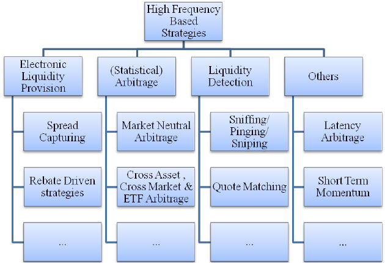

High-Frequency Trading (HFT) represents a significant evolution in the financial markets, leveraging advanced technologies to execute large volumes of trades in mere fractions of a second. Born from the amalgamation of sophisticated algorithms, lightning-fast computer networks, and intricate strategies, HFT has redefined the landscape of trading in modern times.

HFT's prowess is reflected in its ability to identify minute inefficiencies in the market and capitalize on them swiftly. These trading opportunities, which may last only milliseconds, are the result of minor price discrepancies across trading venues or small informational advantages. For instance, HFT strategies might exploit the split-second delays in stock price updates between exchanges.

The significance of HFT in today's trading world cannot be understated. As of the early 2020s, HFT accounted for approximately half of the equity market volume in the U.S. Its impact is pervasive, influencing everything from market liquidity to the pricing of securities. Proponents praise HFT for reducing trading costs, improving market efficiency, and enhancing liquidity. Meanwhile, skeptics raise concerns about potential market instability or the fairness of allowing certain traders an advanced technological edge.

## Table of Contents

## The Evolution of High-Frequency Trading

The financial markets have always been arenas of innovation. In their early days, exchanges were characterized by open-outcry systems, where traders would shout and use hand signals to communicate orders. Floor traders had to be sharp, reacting to market movements in real-time. It was a physical, chaotic, yet organized dance of supply, demand, and human intuition.

Fast forward to the late 20th century, and the transformation began with the digitalization of stock markets. Electronic trading platforms started replacing the cacophony of trading floors. While these electronic systems initially just digitalized existing manual processes, they opened the door for the next revolutionary step: [algorithmic trading](/wiki/algorithmic-trading).

By the early 2000s, algorithmic trading had made its mark. Trading decisions, which were once rooted in human judgment, were now driven by mathematical models and executed by computers. These algorithms could analyze vast datasets and execute orders based on predefined criteria at speeds far beyond human capability. Not only did this increase the speed and precision of trades, but it also minimized the emotional biases inherent to human decision-making.

With the continual advancements in technology, a new subset of algorithmic trading began to emerge: high-frequency trading ([HFT](/wiki/high-frequency-trading-strategies)). HFT utilizes extremely sophisticated algorithms to trade thousands of orders in fractions of a second. By the 2010s, HFT had exploded in popularity, accounting for a substantial proportion of total trading [volume](/wiki/volume-trading-strategy) in many global markets[1]. The key to HFT's success lies in its speed. Propelled by technological breakthroughs in processing power, data transmission, and software efficiency, HFT firms sought every possible advantage to shave microseconds off their execution times.

This relentless drive for speed led to innovations like co-location, where trading firms placed their servers physically close to exchange servers to reduce signal travel time. Meanwhile, advances in telecommunications allowed for faster data transmission, with companies even laying straighter transatlantic cables to trim transmission time[2].

From shouting orders across a bustling trading floor to executing millions of trades in the blink of an eye, the journey of high-frequency trading underscores the financial market's ability to evolve. With each technological leap, trading strategies and the market's very structure adapted, leading to the hyper-efficient, electronically driven landscape we see today.

## Deep Dive: How High-Frequency Trading Works

High-Frequency Trading (HFT) is more than just algorithms making rapid-fire trades. It's a complex ecosystem that leverages cutting-edge technology at every juncture to ensure maximum efficiency and speed. Let's dissect this intricate machinery.

**Infrastructure: Hardware, Software, and Data**

The foundation of HFT is its robust infrastructure. Custom-built servers, tailored for trading, house the algorithms. These servers are equipped with the latest processors to facilitate quick decision-making and trade execution. The software, an equally crucial component, is meticulously optimized for performance. It undergoes rigorous testing, ensuring that algorithms can execute without hitches and adapt to rapidly changing market conditions.

Data is the lifeblood of HFT. Real-time market data feeds, often provided by exchanges or third-party vendors, stream into HFT systems. This data, consisting of price, volume, and order information, is continuously processed and analyzed.

**Speed, Latency, and Co-location**

In the world of HFT, every microsecond counts. Speed is paramount. However, while having the fastest algorithm is essential, ensuring that your trading command reaches the exchange swiftly is equally crucial. This is where latency comes into play. Latency refers to the time it takes for data to travel from the trader's system to the exchange. Reducing this delay is a never-ending quest in HFT.

Co-location is a solution to the latency issue. By positioning their servers within or extremely close to an exchange's data center, HFT firms can dramatically reduce the time it takes for their trade orders to reach the exchange. This proximity ensures that they're among the first to receive market data and can act upon it instantaneously.

**Tick by Tick Data and Its Analysis**

While many traders might look at aggregated data over seconds, minutes, or even days, HFT firms analyze data on a tick-by-tick basis. A "tick" is any change in the price of a security, regardless of volume. By examining every single price change, HFT algorithms can detect patterns, anomalies, or opportunities that might only exist for fractions of a second[3].

This granular data analysis demands immense computational power. Sophisticated algorithms sift through millions of data points every second, deciding when to buy or sell. Machine l[earning](/wiki/earning-announcement) and other advanced techniques help in refining these strategies, allowing them to evolve with the market.

High-Frequency Trading is an intricate ballet of technology, data, and strategy. It's a world where millisecond improvements can mean the difference between profit and loss, and where the relentless pursuit of efficiency constantly reshapes the trading landscape.

## Core High-Frequency Trading Strategies

### Market Making

Market making is a fundamental trading strategy not only in High-Frequency Trading (HFT) but across various financial markets. At its core, [market making](/wiki/market-making) involves simultaneously quoting both buy (bid) and sell (ask) prices for a financial instrument, with the aim of profiting from the bid-ask spread.

Traditionally, market makers facilitated [liquidity](/wiki/liquidity-risk-premium), ensuring that traders could enter or [exit](/wiki/exit-strategy) positions even in less actively traded instruments. They committed capital to buy securities when no one else was buying and to sell when no one else was selling.

In the realm of HFT, market making has taken a sophisticated turn. Advanced algorithms are employed to adjust bid and ask prices in real-time, responding to market dynamics instantaneously. The primary objective remains: capture the spread between buying and selling prices while minimizing inventory risk. The difference here is the speed and scale. HFT market makers operate at an incredibly [high frequency](/wiki/high-frequency-trading), often making thousands of trades per second.

**Real-world examples**:

1. **ETFs and HFT**: Many Exchange Traded Funds (ETFs), especially those tracking less common indices or assets, may not have as many immediate buyers and sellers. HFT market makers step in, providing liquidity and tight bid-ask spreads, ensuring investors can trade these ETFs efficiently. For instance, an HFT firm might quote a buy price of $100.00 and a sell price of $100.01 for an ETF. If they can consistently buy at the lower price and sell at the higher one, those pennies add up rapidly over thousands of trades.
2. **Flash Crashes and Recovery**: During the infamous 2010 Flash Crash, where the Dow Jones plunged over 1000 points in minutes before rebounding, many traditional market makers stepped away. HFT market makers, however, with their algorithms, played a dual role. Some exacerbated the decline with their rapid trading, while others provided essential liquidity during the recovery, helping stabilize the market[4].
3. **NASDAQ and HFT Market Making**: The NASDAQ, being a dealer market, relies heavily on market makers to facilitate trades. HFT firms, leveraging their speed and technology, have become dominant players here. They can quickly adjust their quotes based on incoming market data, ensuring efficient price discovery and consistent liquidity.

In essence, market making in the high-frequency domain is about providing liquidity at unparalleled speed, ensuring markets remain efficient even in turbulent times.

### Statistical Arbitrage

Statistical [arbitrage](/wiki/arbitrage), often shortened to StatArb, is a quantitative strategy that seeks to exploit temporary price anomalies between related securities. The strategy uses mathematical models and computations to identify trading opportunities with a theoretically predefined risk-return profile. Unlike traditional arbitrage strategies, which seek to exploit price discrepancies for the same asset across different markets, StatArb is based on the premise that there exists a stable, long-term relationship between the prices of certain assets, and when a deviation occurs, it provides a tradeable opportunity.

**Types**:

- **Pair Trading**: The most commonly recognized form of statistical arbitrage. This strategy involves identifying pairs of assets whose prices have moved together historically. When a temporary divergence between these assets arises, one asset is bought while the other is sold short, anticipating that the prices will converge again. Stocks of similar sectors or industries often become candidates for pair trading due to their exposure to common market factors.
- **Cointegration**: This approach expands on the concept of pair trading. While pair trading looks at price convergence, cointegration focuses on the spread between two or more asset prices. Assets are said to be cointegrated if their price spread remains stationary over time. Traders capitalize on moments when the spread deviates significantly from its historical mean, expecting it to revert to that mean over time.

**Real-world examples**:

1. **Tech Giants**: A classic example in pair trading might involve tech giants like Apple and Microsoft. Historically, their stock prices may show a tendency to move together. If Apple's stock were to suddenly rise while Microsoft's fell without any significant news to justify the divergence, a StatArb trader might buy Microsoft and short Apple, anticipating that the price gap will close in due time.
2. **Cointegration in Commodities**: Consider the historical relationship between the prices of gold and silver. Over long periods, the ratio of gold price to silver price might remain within a certain range. If, due to some temporary factors, the price ratio deviates significantly from this historical range, a trader could go long on the undervalued commodity and short the overvalued one, betting on the reversion of this ratio to its historical mean.
3. **ETF Mispricing**: Exchange Traded Funds (ETFs) which track certain indices can sometimes become mispriced compared to the net value of their underlying assets. An astute trader could buy (or short) the ETF while simultaneously taking the opposite position in the underlying assets, aiming to profit from the expected price alignment[5].

Statistical arbitrage, while based on rigorous mathematical foundations, is not risk-free. Traders need to account for transaction costs, potential model inaccuracies, and evolving market dynamics. Yet, with a disciplined approach and meticulous [backtesting](/wiki/backtesting), StatArb can offer a compelling avenue for systematic, data-driven profits in the market.

### Event Arbitrage

Event arbitrage is a strategy centered around capitalizing on price movements that are anticipated to occur from specific events, like mergers, earnings announcements, or economic data releases. In the world of high-frequency trading, the quick dissemination and interpretation of these events can lead to significant trading advantages.

HFT firms leverage state-of-the-art technologies to instantaneously process and act upon news and announcements. When an announcement is made, algorithms can parse the news, analyze the potential market impact, and execute trades within milliseconds, often before most human traders can even read the headline.

**How HFT Firms Utilize News and Announcements**:

1. **Real-Time Data Feeds**: These provide immediate access to news as soon as it breaks. High-speed connections to news agencies or direct data feeds ensure that the information is received with minimal delay.
2. **Natural Language Processing (NLP)**: Once the news hits the feed, NLP algorithms dissect and understand the content. For instance, if a company announces better-than-expected earnings, the algorithm can interpret the positive sentiment and trigger buy orders for that stock.
3. **Historical Data Analysis**: By analyzing how specific news events have affected stock prices in the past, algorithms can predict likely price movements in the future. For example, if a central bank raises interest rates, historical data can provide insights into how certain currency pairs might react.
4. **Sentiment Analysis**: Beyond just interpreting the factual content of the news, some sophisticated algorithms can gauge the market sentiment from news articles, social media feeds, and other sources to predict short-term market movements.

**Tools Used for News-Based Trading**:

1. **Direct Market Access (DMA)**: Allows traders to place buy or sell orders directly in the market, bypassing traditional brokers. In the realm of HFT, this results in faster order execution.
2. **Ultra-Low Latency Networks**: Given that milliseconds matter in HFT, having a fast network connection can be the difference between profit and loss. These networks ensure that data is transferred with minimal delay.
3. **Co-location**: Placing the trading system's servers physically close to the exchange's systems to minimize data transmission time. Many exchanges offer co-location services for HFT firms to ensure they receive data and can place trades as quickly as possible.
4. **Advanced Trading Platforms**: These platforms can handle massive data streams and execute large volumes of trades at incredibly high speeds. They often come integrated with tools for backtesting, strategy development, and risk management.
5. **Customized Algorithms**: Designed to interpret news and announcements specifically. These algorithms can be tweaked based on the trader's strategy, risk tolerance, and the specific markets they operate in.

The allure of event arbitrage in high-frequency trading lies in its potential for high returns. However, it's a double-edged sword. Given the speed and automation involved, if an algorithm misinterprets news or reacts inappropriately, it can lead to significant losses in a very short time frame.

### Latency Arbitrage

Latency arbitrage is one of the most controversial and prevalent strategies in the high-frequency trading (HFT) world. This strategy thrives on exploiting minuscule, often microsecond, differences in the speed at which market participants receive and act on market information.

The significance of microseconds in latency arbitrage cannot be overstated. A mere microsecond advantage can lead to substantial profits for HFT firms. For instance, if one trader receives information about a large buy order a fraction of a second before others, they can buy the asset in question and then sell it moments later at a slightly higher price to the trader placing the large order. While the profit from each such transaction might be small, the sheer volume of these trades means that profits can accumulate rapidly.

To achieve and maintain these minuscule advantages, HFT firms employ a combination of advanced hardware, software, and strategic positioning. Here's how they minimize latency:

1. **Co-location**: This involves placing a firm's trading servers physically within or very close to the stock exchange's data center. By reducing the physical distance data needs to travel, transmission times can be cut down dramatically.
2. **Direct Market Access (DMA)**: DMA allows HFT firms to bypass intermediaries and place orders directly on the exchange. This reduces the number of steps an order goes through, thereby decreasing latency.
3. **Fiber Optic Cables and Microwave Towers**: While fiber optic cables are fast, microwave towers, which transmit data through the air, can be faster over short distances. Some HFT firms have invested in building microwave communication networks between exchanges to further shave off microseconds from their trade times.
4. **Hardware Optimization**: Specialized hardware, including custom-designed chips and network cards, can process orders faster than conventional hardware. Some firms even use FPGAs (Field-Programmable Gate Arrays) that can be programmed specifically for trading tasks.
5. **Algorithm Optimization**: Efficient coding and algorithm design can reduce the time it takes to process data and make trading decisions. Every instruction and line of code counts, and algorithms are frequently refined to maximize speed.
6. **Network Optimization**: By managing and prioritizing network traffic efficiently, firms can ensure that their most time-sensitive data gets processed first.
7. **Tick-to-Trade Ratios**: This involves optimizing the ratio of data intake (ticks) to actual trades to ensure that the systems are not overwhelmed by data and can execute trades at peak efficiency.

It's worth noting that while latency arbitrage can be lucrative, it's also fraught with challenges. The arms race for speed is relentless, requiring constant investment. Moreover, it has been a subject of regulatory scrutiny due to concerns about market fairness and stability.

### Momentum Strategies

Momentum strategies, at their core, are based on a simple premise: assets that have performed well in the recent past are likely to continue performing well in the near future, and conversely, assets that have performed poorly will continue their downward trajectory. High-frequency trading (HFT) leverages this principle but on a much shorter time scale, sometimes holding positions for mere seconds or even milliseconds.

To successfully implement [momentum](/wiki/momentum) strategies in the HFT realm, traders employ sophisticated algorithms that are designed to detect the early signs of an emerging trend. These algorithms constantly analyze market data, seeking patterns, volume shifts, and price movements indicative of a potential trend. Once detected, the algorithm will initiate trades to capitalize on this momentum before it dissipates.

Several [factor](/wiki/factor-investing)s are critical for HFT momentum strategies:

1. **Rapid Data Analysis**: HFT algorithms process vast amounts of market data at lightning speeds, looking for indications of emerging trends. This involves analyzing price changes, trading volumes, order book dynamics, and other relevant data points.
2. **Leverage**: Given that the price movements exploited by HFT momentum strategies can be minimal, these strategies often involve significant leverage to amplify returns. However, this also means increased risk.
3. **Quick Execution**: Once a potential trend is identified, HFT systems must execute trades immediately. Any delay can result in missed opportunities or reduced profitability.
4. **Automated Risk Management**: Given the speed and volume of trades, it's essential to have automated risk management systems in place. These systems can instantly halt trading if losses exceed predefined thresholds or if unexpected market behaviors are detected.
5. **Reversion Mechanisms**: Not all detected trends will persist. Algorithms are equipped with mechanisms to detect when a trend is weakening or reversing, prompting the system to exit the position.
6. **Microstructure Analysis**: Understanding the intricacies of market microstructure, including bid-ask spreads, liquidity, and order flow, can provide additional insights into potential momentum-based opportunities.

HFT momentum strategies can be particularly effective during times of market [volatility](/wiki/volatility-trading-strategies), where price movements are more pronounced. However, they also come with challenges. The intense competition among HFT firms means that the first to detect and act on a trend often reaps the most benefit. Latecomers might find diminished returns or even losses if they enter just as the momentum is reversing.

While some critics argue that HFT momentum strategies can exacerbate market volatility, proponents believe that these strategies provide additional liquidity and can help "correct" mispriced assets more rapidly.

### Order Flow Prediction

Order flow prediction revolves around anticipating large trades before they execute and gauging the subsequent market impact. Successfully predicting order flow allows traders to position themselves advantageously, potentially benefiting from the anticipated price movements.

In the realm of high-frequency trading (HFT), the stakes are high, and the margins thin. The ability to predict large orders can be a significant advantage. Here's how it works:

1. **Analyzing Market Depth**: HFT algorithms continuously scrutinize the order book, examining both the bid and ask sides for signs of large impending trades. A sudden increase in volume at a specific price level can hint at a substantial order.
2. **Detecting Iceberg Orders**: Some large traders use "iceberg" orders, where only a fraction of the entire order is visible in the order book. HFT algorithms are designed to spot the tell-tale signs of these hidden orders, allowing them to anticipate the full size and potential market impact.
3. **Historical Data Analysis**: Algorithms analyze historical data to identify patterns associated with significant trades. For instance, specific times of the day, reactions to economic news, or particular market conditions might correlate with large order placements.
4. **Price and Volume Correlation**: Sudden spikes in trading volume, especially if they deviate from historical norms, can indicate major trades. HFT systems cross-reference these volume anomalies with price movements to refine their predictions.
5. **Anticipating Market Reaction**: Once a significant trade is predicted, the next step is estimating its market impact. Large buy orders can drive prices up, while massive sell orders might depress them. Algorithms assess factors like the current market depth, recent volatility, and liquidity to project potential price shifts.
6. **Trading Ahead**: Armed with a prediction, HFT systems can execute trades ahead of the anticipated large order. For instance, predicting a sizeable buy order might prompt the algorithm to buy shares, expecting to sell them at a higher price once the large order impacts the market.
7. **Post-Order Analysis**: After the large trade executes, algorithms evaluate the accuracy of their prediction and the market's actual response. This feedback refines the model, enhancing its future predictive capabilities.

Critics argue that trading based on order flow prediction can be parasitic, with HFTs profiting at the expense of institutional and retail traders. They contend that it could lead to predatory trading practices where HFTs exploit their speed advantage to front-run large orders. On the flip side, proponents claim that HFT adds liquidity to the market and ensures tighter bid-ask spreads.

### Liquidity Detection

In the fast-paced environment of high-frequency trading, detecting liquidity is like finding hidden treasure. Liquidity, in trading terms, refers to the ease with which assets can be bought or sold without causing significant price movements. In markets where liquidity is high, substantial trades can be executed without drastically affecting prices. Conversely, in less liquid markets, even small trades can lead to considerable price shifts.

For HFT traders, spotting liquidity (especially hidden liquidity) provides strategic advantages, enabling more informed decision-making and risk management. Hidden orders and large trades are prime sources of this concealed liquidity. Here's how HFT systems approach liquidity detection:

1. **Iceberg Orders Analysis**: One of the primary tools institutional traders use to hide their trading intentions is the iceberg order, where only a fraction of the total order is visible on the order book. By consistently monitoring and analyzing partial fills and the subsequent replenishing of orders, HFT algorithms can deduce the presence of iceberg orders.
2. **Volume Analysis**: Large trades, even when spread out or executed across different venues, can create spikes in trading volume. HFT systems constantly scrutinize volume data, looking for anomalies or patterns that might indicate hidden liquidity.
3. **Historical Liquidity Patterns**: Just as history can be a guide to the future, past liquidity patterns can provide insights into potential future liquidity. HFT algorithms frequently use backtesting to identify recurring liquidity patterns at particular times, on specific days, or under certain market conditions.
4. **Correlation with News Events**: Scheduled economic announcements or unexpected news events can significantly impact liquidity. HFT strategies often incorporate real-time news feeds, allowing algorithms to anticipate and locate liquidity in response to breaking news.
5. **Dark Pool Trading**: Dark pools are private exchanges where participants can trade without displaying their orders in public order books. HFTs, leveraging their technological prowess, sometimes route their orders to these venues, searching for hidden liquidity and better execution opportunities.
6. **Order Book Dynamics**: By examining the depth of the order book and the balance between buy and sell orders, HFT algorithms can infer potential liquidity pockets. A sudden imbalance, for instance, might suggest an upcoming large order or the presence of hidden liquidity.

Detecting liquidity is a double-edged sword. On one hand, it can provide HFT traders with opportunities to achieve better execution prices and reduce trading costs. On the other hand, if misused, it can be seen as predatory, with HFTs potentially taking advantage of other market participants. This balance, and the methods employed to strike it, is a subject of ongoing debate within the trading community.

### Algorithmic Execution Strategies

Algorithmic execution strategies are the backbone of modern trading, ensuring large orders are managed effectively to reduce adverse market impact. When a substantial trade is executed in one go, it can significantly move the market, leading to slippage and, consequently, a less favorable execution price. To circumvent this, traders use algorithmic execution strategies to break down large orders into smaller, manageable chunks, executed over time or across different venues.

1. **Volume Weighted Average Price (VWAP)**: One of the most popular strategies, VWAP seeks to achieve an average execution price that matches the volume-weighted average price of a security over a specific time period. By doing so, traders aim to ensure they neither underpay nor overpay for a security, based on historical trading patterns[6].
2. **Time Weighted Average Price (TWAP)**: TWAP strategy breaks the order into smaller pieces and executes them evenly over a predetermined time interval. This is particularly useful when trying to minimize market impact over a longer trading horizon.
3. **Percentage of Volume (POV)**: Here, the order is executed in line with the security's trading volume. If a stock's trading volume increases, the algorithm will increase the pace of execution, and vice versa.
4. **Implementation Shortfall**: Also known as the "arrival price" algorithm, this strategy seeks to minimize the difference between the execution price and the price of the asset at the time the order is placed. It balances the risk of market impact against the opportunity cost of not completing the order.
5. **Market-On-Close (MOC)**: This strategy targets execution at the market's closing price by placing an order near the close of trading. It's often used by traders who believe the closing price is a good indicator of a security's value.
6. **Adaptive Shortfall**: This strategy constantly recalibrates itself based on real-time market conditions. If the market is moving in favor of the order, it might speed up the execution, but if conditions are less favorable, it'll slow things down.
7. **Dark Pool Algorithms**: Some large orders are routed through dark pools to find liquidity without revealing the trader's intentions on public exchanges. This method can help reduce market impact, but it comes with its own set of challenges and controversies.
8. **Smart Order Routing (SOR)**: An SOR algorithm scans multiple trading venues in real time to find the best execution opportunities. It allows traders to access fragmented liquidity across various exchanges and dark pools.

Algorithmic execution strategies are not a one-size-fits-all solution. Their efficiency depends on factors like order size, market volatility, and the specific objectives of the trader. However, their primary aim remains consistent: optimizing trade execution by balancing urgency, cost, and market impact to achieve the best possible result.

## The Role of AI and Quantum Computing in HFT

High-frequency trading has always thrived on the cutting edge of technology, and today, Artificial Intelligence (AI) and Quantum Computing are among the pioneering technologies leading the charge.

AI's role in HFT primarily revolves around [machine learning](/wiki/machine-learning) and [deep learning](/wiki/deep-learning), branches that equip algorithms to process vast amounts of data, identify patterns, and make decisions at lightning speeds. These AI algorithms are tailor-made to predict minute market movements, analyze order flow, and adjust strategies in real-time. For example, [convolutional [neural network](/wiki/neural-network)](/wiki/convolutional-neural-network)s, which were originally designed for image processing, are now being utilized to analyze patterns in high-dimensional trading data[7]. Reinforcement learning, another subset of AI, enables algorithms to learn optimal trading strategies by interacting with the market, akin to learning a complex game. Through iterative processes, these algorithms can refine their strategies to maximize profits.

Moreover, AI is making strides in sentiment analysis. By analyzing vast amounts of unstructured data from news articles, financial reports, and social media, AI algorithms can gauge market sentiment and predict short-term price movements. Such capabilities are invaluable in HFT, where even the smallest price prediction edge can translate into significant gains.

On the frontier of computational power, quantum computing promises to revolutionize HFT. Traditional computers use bits as the smallest unit of data, which can be either 0 or 1. Quantum computers, on the other hand, use quantum bits (qubits), which can exist in a superposition of states, allowing them to process a massive amount of information simultaneously[8]. In HFT, where latency is paramount, quantum computers have the potential to calculate optimal trading strategies in fractions of the time taken by classical computers.

Beyond strategy formulation, quantum computing can play a pivotal role in risk analysis and portfolio optimization. Quantum algorithms, like the quantum amplitude estimation, can be used to compute risk measures much faster than classical algorithms, providing HFT firms a considerable advantage in risk-adjusted returns[9].

However, it's essential to understand that quantum computing in HFT is still in its infancy. While there are promising developments, scalable and error-free quantum computers that outperform classical computers are yet to be achieved. But the potential is undeniable, and as the technology matures, it could redefine the boundaries of HFT.

In essence, both AI and quantum computing are pushing the envelope of what's possible in HFT. While AI algorithms are already driving significant change, delivering more accurate predictions and dynamic strategies, quantum computing holds the promise of unmatched computational power, paving the way for an entirely new era of trading.

## Market Impact and Critiques

High-Frequency Trading (HFT) has undeniably left a significant footprint on global financial markets. As with any powerful force, it brings with it a blend of benefits and drawbacks, often sparking intense debates among market participants, regulators, and the public.

On the positive side, proponents argue that HFT enhances market quality by providing several key benefits:

1. **Liquidity Provision**: HFT firms, especially those employing market-making strategies, supply a vast amount of liquidity. This heightened liquidity tends to narrow bid-ask spreads, making trading cheaper for all market participants[10].
2. **Price Efficiency**: By rapidly reacting to new information and adjusting prices accordingly, HFT contributes to more efficient price discovery[11]. This implies that asset prices more accurately reflect their true underlying value.
3. **Reduction in Short-Term Volatility**: With the capacity to process and act on vast volumes of information rapidly, HFT can reduce excessive short-term price swings[12].

However, HFT's rise hasn't been without its controversies and criticisms. Some of the most cited concerns include:

1. **Quote Stuffing**: This is a tactic where traders rapidly send and withdraw large numbers of orders to confuse or slow down other traders. It's akin to jamming the system, and while not necessarily exclusive to HFT, its potential for misuse in this realm has drawn scrutiny[13].
2. **Flash Crashes**: Perhaps the most infamous event associated with HFT is the May 6, 2010 "Flash Crash" when the Dow Jones plummeted over 1,000 points (approximately 9%) only to recover those losses within minutes[14]. While the crash's causes are multifaceted, HFT has been singled out as a major contributor, amplifying price movements dramatically.
3. **Front Running**: There are concerns that HFT allows traders to detect large incoming orders from institutional investors and then race ahead to buy or sell, essentially "front-running" these orders and benefiting from the price movement they cause.

Beyond specific practices, there's an overarching ethical and moral debate around HFT. Critics question whether it's appropriate for traders to profit simply from being faster, without necessarily adding substantive value to the market. Additionally, the vast resources spent on gaining minuscule speed advantages—like setting up co-location facilities close to exchange servers—might be seen as a wasteful "arms race".

Defenders argue that HFT is merely the natural evolution of trading in a technologically advanced world and that the overall benefits to market quality outweigh the drawbacks. They contend that many criticisms stem from misunderstandings or are issues that can be addressed through proper regulation rather than vilifying the entire practice.

Regardless of one's stance, it's clear that HFT remains one of the most polarizing topics in modern finance. Its profound influence on market dynamics ensures that discussions around its role, impact, and ethics will remain at the forefront for years to come.

## Regulatory Landscape

High-Frequency Trading (HFT) operates within a complex regulatory landscape that varies across different jurisdictions. This landscape reflects a balance between fostering innovation and ensuring market integrity, protecting investors, and preventing abuse.

In the **U.S.**, the Securities and Exchange Commission (SEC) and the Commodity Futures Trading Commission (CFTC) oversee HFT activities. Following the 2010 Flash Crash, the regulators took steps to increase oversight and control over automated trading. Some notable regulatory measures include:

1. **Market Access Rule (Rule 15c3-5)**: This mandates risk controls for brokers and traders, ensuring that erroneous trades or malfunctioning algorithms do not destabilize the market.
2. **Consolidated Audit Trail (CAT)**: Implemented to track all orders and trades across U.S. equity and options markets, CAT aids regulators in surveilling the market, detecting manipulative behaviors, and reconstructing market crises.
3. **Circuit Breakers**: They are designed to halt trading temporarily in response to significant price swings in individual securities or the broader market.

Across the Atlantic, **Europe** has its regulatory framework predominantly shaped by the Markets in Financial Instruments Directive II (MiFID II). Introduced in 2018, MiFID II addresses several aspects of HFT:

1. **Firm Registration**: HFT firms are required to be authorized by regulatory bodies, ensuring proper risk controls are in place.
2. **Tick Size Regime**: This prevents firms from making excessively small price improvements, ensuring that price priority has meaning and contributes to market quality.
3. **Order-to-Trade Ratio**: This rule limits the number of canceled orders relative to executed trades, aiming to curb excessive order cancellations.

As markets and technologies evolve, so do regulations. **Potential future regulations** may focus on:

1. **Increased Transparency**: Regulators might seek more insight into the inner workings of algorithms, although this poses challenges concerning intellectual property rights.
2. **Limiting Speed Advantages**: There could be moves to diminish the overwhelming advantage of speed in trading, possibly by implementing minimum order resting times or randomizing order execution delays.
3. **Tackling New Manipulative Behaviors**: As HFT strategies evolve, regulators will continually need to identify and counteract new forms of market manipulation.

Given the global nature of financial markets, **differences in regulations across countries** are crucial for HFT firms operating internationally. For example, Asian markets like Japan and Hong Kong have unique regulatory stipulations tailored to their market structures. Firms must navigate this patchwork of rules, ensuring compliance while optimizing their strategies.

To conclude, the regulatory landscape for HFT is continually evolving, shaped by market events, technological advancements, and shifts in regulatory philosophy. While it's challenging to predict the exact future trajectory, the overarching goal will remain: ensuring that financial markets are fair, transparent, and resilient.

## Who's Who in HFT

High-Frequency Trading (HFT) is dominated by firms that can invest significantly in technology, infrastructure, and talent. Let's shed light on the major players in this space and how retail traders fit into the HFT ecosystem.

Globally, several firms are renowned for their prowess in HFT. **Virtu Financial** is one such powerhouse, known for its advanced trading algorithms and vast global reach[15]. **Citadel Securities**, a part of Citadel LLC, is another behemoth that handles a significant portion of U.S. equities trading volume[16]. **Two Sigma Securities**, **Flow Traders**, and **Hudson River Trading** are also formidable entities in the HFT world, known for their sophisticated trading strategies and tech-forward approaches. These firms, among others, play critical roles in providing liquidity, reducing trading costs, and contributing to efficient market operations.

Shifting focus to **India**, the landscape is a blend of domestic and international firms. Traditional brokerages, such as **Zerodha** and **Sharekhan**, have expanded their technological capabilities to offer algo-trading solutions, though not purely in the HFT category. International entities like **Optiver** and **Tower Research Capital** have also established their presence, leveraging the country's tech talent pool and growing financial markets[17].

The **role of retail traders in HFT** is nuanced. Direct participation in pure HFT is challenging for retail traders due to the enormous capital requirements, sophisticated technology, and lightning-fast trade execution speeds. However, retail traders do engage in algorithmic trading, a broader category under which HFT falls. With the democratization of technology, platforms like **QuantConnect** and **Alpaca** have made it easier for retail traders to develop and deploy algorithmic strategies[18]. Though they might not compete directly with HFT giants, they bring diversity to market participation and benefit from the tighter spreads and increased liquidity that HFT provides.

To understand HFT's ecosystem, recognizing its major players and the interplay between institutional and retail participants is essential. As technology continues to evolve and markets grow, the dynamics between these entities might shift, but their collective contribution to modern trading cannot be understated.

## Infrastructure and Setup

High-Frequency Trading (HFT) is a tech-driven domain, where the smallest of time advantages can result in significant profits or losses. As such, the choice of hardware, software, and infrastructure is paramount to an HFT firm's success.

In the realm of **hardware**, the primary requirement is to achieve minimal latency. Specialized high-speed servers are a given. These servers often employ FPGA (Field Programmable Gate Array) technology, allowing for hardware-level customization of trading algorithms, granting traders a speed advantage. HFT setups also invest in high-speed network equipment like 10 Gigabit Ethernet switches and dedicated fiber-optic lines to ensure optimal connectivity.

**Co-location** is another critical aspect. Many HFT firms place their servers in the same data centers as exchanges, reducing the physical distance data needs to travel. This co-location allows for faster order execution and data receipt.

On the **software** front, HFT systems require a robust and highly efficient trading platform. This software needs to handle vast amounts of data at lightning speeds. Some firms opt for custom-built platforms tailored to their unique trading strategies. Others might choose commercially available platforms that offer high customization levels. The software's primary functions include market data processing, algorithm execution, risk management, and order routing.

**Cost considerations** in HFT are significant. The initial setup, involving hardware, software, and co-location services, can run into millions of dollars. Add to this the ongoing costs of data feeds, system maintenance, and periodic upgrades. It's a capital-intensive endeavor, with the upfront costs acting as a barrier to entry for many potential participants.

However, the **potential returns** are also substantial. While the profit per trade might be minuscule due to the tight bid-ask spreads, the volume of trades executed daily can result in considerable aggregate profits. Efficient HFT setups, combined with the right strategies, can achieve annual returns significantly higher than traditional trading methods.

In summary, HFT infrastructure is about speed, efficiency, and reliability. The right setup, though costly, can be a linchpin for success in the competitive world of high-frequency trading.

## Future of High-Frequency Trading

The landscape of High-Frequency Trading (HFT) is rapidly evolving, influenced by technological innovations, regulatory changes, and market dynamics. As the industry ventures into the future, it is poised to face both challenges and opportunities that could shape its trajectory.

One of the primary challenges HFT faces is the constant race for speed. As firms invest heavily in achieving minimal latency, the diminishing returns from incremental speed improvements become evident. The difference between microseconds and nanoseconds might not always translate into proportional profit increases, making the cost-to-benefit ratio of such advancements questionable.

Regulation also presents a challenge. Concerns over market stability, transparency, and fairness have prompted regulatory bodies worldwide to reconsider the oversight of HFT activities. Stricter rules could impede the flexibility of HFT strategies, potentially leveling the playing field but at the cost of some advantages HFT currently enjoys[19].

Conversely, the rise of alternative trading venues and decentralized finance (DeFi) platforms offers new arenas for HFT to operate. These platforms might bring about different market dynamics, presenting opportunities for innovative trading strategies that exploit the unique characteristics of these venues.

Moreover, the fusion of advanced machine learning models with HFT might unlock new dimensions in trading. While speed will always be paramount, the ability to predict market movements with greater accuracy using AI can be a game-changer, offering a competitive edge even if speed advantages plateau.

Comparing HFT with traditional investment strategies sheds light on their distinct objectives and time horizons. While HFT focuses on exploiting minute price discrepancies within short time frames, traditional strategies are more concerned with the long-term valuation of assets based on fundamentals. HFT seeks quick profits from fleeting opportunities, whereas traditional investment might involve holding assets for months or years, banking on their intrinsic value growth.

In essence, HFT and traditional investment operate on different paradigms. However, as markets evolve, a potential convergence or symbiosis might emerge. For instance, long-term investors can leverage insights from HFT patterns to understand market microstructures, while HFT firms might utilize long-term trends to inform some of their strategies.

In conclusion, the future of HFT is a blend of challenges and potential, shaped by technological advancements, regulatory landscapes, and market evolutions. Its interplay with traditional investment methods underscores the vast diversity and complexity of the financial world.

## Key Takeaways

1. **High-Frequency Trading (HFT)** is a sophisticated trading strategy that utilizes powerful computers to execute a large number of trades at incredibly fast speeds. Its primary aim is to capitalize on minute price discrepancies in the financial markets.
2. The **evolution of HFT** is deeply rooted in the advancements of technology. What began as manual trading evolved into algorithmic trading, and with the introduction of cutting-edge tech, high-frequency trading took center stage.
3. **Speed, latency, and co-location** are critical for HFT. The competitive edge is often determined by who has the fastest data access and execution times, with firms even co-locating their servers near exchange points to gain milliseconds.
4. **Core HFT strategies** range from Market Making, which provides liquidity to the market, to Latency Arbitrage, which seeks to exploit minuscule time gaps in price information across platforms.
5. The incorporation of **AI and Quantum Computing** offers exciting prospects for HFT. While AI algorithms enhance predictive accuracy, quantum computing holds potential in further reducing latency, revolutionizing the race for speed.
6. HFT has both its proponents and detractors. While it has been lauded for increasing market liquidity and narrowing bid-ask spreads, criticisms include its potential role in market disruptions, like the flash crashes, and questionable tactics like quote stuffing.
7. **Regulatory challenges** persist. Different countries have varied approaches to HFT, with some imposing stricter rules due to concerns over market stability and fairness.
8. The **global landscape of HFT** sees a mix of major firms dominating the scene, with notable players in regions like India. However, the role of retail traders in HFT remains minimal due to the significant infrastructure requirements and costs.
9. **Setting up an HFT system** is not for the faint-hearted. It demands high-end hardware, specialized software, and access to real-time data, making the initial setup a costly affair.
10. Looking forward, the **future of HFT** is a blend of both challenges, like diminishing returns from speed and stricter regulations, and opportunities, such as the rise of alternative trading venues and advancements in AI.

In essence, High-Frequency Trading stands as a testament to the fusion of finance and technology. Its intricate strategies, while controversial to some, undeniably play a pivotal role in today's dynamic trading world.

## Conclusion

High-Frequency Trading (HFT) has evolved from the nascent stages of manual trading to become a dominating force in the global financial markets. Rooted in technological advancements, HFT exemplifies the synergy between finance and technology, ensuring ultra-fast trade executions and exploiting minute price discrepancies. As strategies like Market Making and Latency Arbitrage have matured, newer paradigms such as the incorporation of AI and Quantum Computing are on the horizon, promising unprecedented efficiencies.

Yet, the world of HFT is not without its complexities and challenges. Controversies such as flash crashes have prompted rigorous debates on the ethical implications and the overall stability of the financial system in the age of HFT. Regulatory landscapes across the globe are in flux, with authorities attempting to strike a balance between fostering innovation and ensuring market fairness and stability.

The essence of HFT lies not just in its speed but in its ability to redefine market dynamics continually. As we look to the future, while HFT may face challenges, its integral role in shaping the financial markets remains undeniable. For traders, investors, and market enthusiasts, understanding HFT is paramount in navigating the evolving world of finance and staying ahead in the game.

## References & Further Reading

[1]: [Hendershott, T., Jones, C. M., & Menkveld, A. J. (2011). Does algorithmic trading improve liquidity?. The Journal of Finance, 66(1), 1-33.](https://onlinelibrary.wiley.com/doi/abs/10.1111/j.1540-6261.2010.01624.x)

[2]: [Aldridge, I. (2013). High-frequency trading: A practical guide to algorithmic strategies and trading systems. John Wiley & Sons.](https://www.wiley.com/en-us/High+Frequency+Trading%3A+A+Practical+Guide+to+Algorithmic+Strategies+and+Trading+Systems%2C+2nd+Edition-p-9781118343500)

[3]: [Kirilenko, A. A., Kyle, A. S., Samadi, M., & Tuzun, T. (2017). The flash crash: High-frequency trading in an electronic market. The Journal of Finance, 72(3), 967-998.](https://onlinelibrary.wiley.com/doi/abs/10.1111/jofi.12498)

[4]: [Kirilenko, A., & Lo, A. W. (2013). Moore's law versus Murphy's law: Algorithmic trading and its discontents. Journal of Economic Perspectives, 27(2), 51-72.](https://pubs.aeaweb.org/doi/pdfplus/10.1257/jep.27.2.51)

[5]: [Avellaneda, M., & Lee, J. H. (2010). Statistical arbitrage in the U.S. equities market. Quantitative Finance, 10(7), 761-782.](https://www.tandfonline.com/doi/abs/10.1080/14697680903124632)

[6]: [Almgren, R., & Chriss, N. (2005). Optimal execution of portfolio transactions. Journal of Risk, 3, 5-39](https://www.risk.net/journal-risk/2161150/optimal-execution-portfolio-transactions)[.](https://www.risk.net/journal-of-risk-model-validation/1500171/optimal-execution-portfolio-transactions)

[7]: [Dixon, M. F., Klabjan, D., & Bang, J. H. (2019). Classification-based financial markets prediction using deep neural networks. Algorithms, 12(8), 156.](https://arxiv.org/abs/1603.08604)

[8]: [Montanaro, A. (2016). Quantum algorithms: an overview. npj Quantum Information, 2(1), 1-6.](https://www.nature.com/articles/npjqi201523)

[9]: [Woerner, S., & Egger, D. J. (2018). Quantum risk analysis. npj Quantum Information, 5(1), 1-10.](https://www.nature.com/articles/s41534-019-0130-6)

[10]: [Brogaard, J., Hendershott, T., & Riordan, R. (2014). High-frequency trading and price discovery. The Review of Financial Studies, 27(8), 2267-2306.](https://academic.oup.com/rfs/article-abstract/27/8/2267/1582754)

[11]: [Hasbrouck, J., & Saar, G. (2013). Low-latency trading. Journal of Financial Markets, 16(4), 646-679.](https://econpapers.repec.org/article/eeefinmar/v_3a16_3ay_3a2013_3ai_3a4_3ap_3a646-679.htm)

[12]: [Hendershott, T., Jones, C. M., & Menkveld, A. J. (2011). Does algorithmic trading improve liquidity? The Journal of Finance, 66(1), 1-33.](https://faculty.haas.berkeley.edu/hender/Algo.pdf)

[13]: [Gomber, P., Arndt, B., Lutat, M., & Uhle, T. (2013). High-frequency trading.](https://papers.ssrn.com/sol3/papers.cfm?abstract_id=1858626)

[14]: [Kirilenko, A. A., Kyle, A. S., Samadi, M., & Tuzun, T. (2017). The flash crash: High-frequency trading in an electronic market. The Journal of Finance, 72(3), 967-998.](https://papers.ssrn.com/sol3/papers.cfm?abstract_id=1686004)

[15]: [Virtu Financial - About Us.](https://www.virtu.com/about/)

[16]: [Citadel Securities - What We Do.](https://www.citadelsecurities.com/what-we-do/)

[17]: [Optiver - About Us.](https://optiver.com/about-us/locations/)

[18]: [QuantConnect - About Us.](https://www.quantconnect.com/about)

[19]: [Regulating High-Frequency Trading](https://core.ac.uk/download/pdf/231051836.pdf)