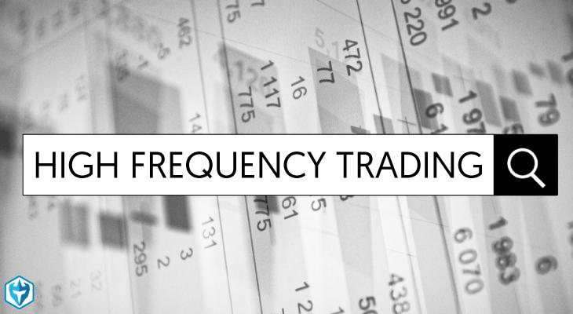

## Table of Contents

## What is high-frequency trading (HFT)?

High-frequency trading, or HFT, is a type of trading that uses powerful computers to buy and sell stocks very quickly. People who do HFT use special software and math formulas to make decisions in just a few seconds or even less. The goal is to make small profits from many trades throughout the day.

HFT is different from regular trading because it happens so fast. Traders using HFT might hold onto a stock for just a few seconds before selling it. This speed allows them to take advantage of small changes in stock prices that happen all the time. While each trade might only make a tiny bit of money, doing a lot of trades can add up to big profits.

## What are the basic components of an HFT system?

An HFT system has a few main parts that work together to trade quickly. The first part is the computer hardware. HFT needs very fast computers with a lot of processing power. These computers are often placed close to the stock exchange's servers to reduce the time it takes for trade information to travel. This is called being "co-located." The second part is the software, which includes algorithms. These are math formulas that the computer uses to decide when to buy or sell stocks. The algorithms look at a lot of data very quickly to find the best times to trade.

Another important part of an HFT system is the data feed. This is a stream of information about stock prices and market conditions that the system uses to make trading decisions. The data needs to be very fast and accurate because even a small delay can make a big difference in HFT. Lastly, there's the connection to the market. HFT systems need a direct and fast link to the stock exchange to send and receive trade orders quickly. All these parts need to work together smoothly for HFT to be successful.

## What is latency and why is it critical in HFT?

Latency is the time it takes for data to travel from one place to another. In high-frequency trading, this could be the time it takes for a stock price to go from the stock exchange to the HFT computer, or for a trade order to go from the HFT computer back to the exchange. In HFT, every millisecond counts, so keeping latency as low as possible is very important.

Latency is critical in HFT because the whole strategy depends on being faster than other traders. If an HFT system can see a change in the stock price and act on it just a bit faster than everyone else, it can make money from that change before others even know it happened. That's why HFT firms spend a lot of money on fast computers, special connections, and even the best spots in data centers to cut down on latency as much as they can.

## What is co-location and how does it benefit HFT?

Co-location is when HFT firms put their computers right next to the stock exchange's servers. This means the distance the data has to travel is very short, which helps make trades happen faster. It's like having a front-row seat at a race, where you can see and react to things before people further back.

Having their computers co-located helps HFT firms because it cuts down on latency. Less latency means they can buy and sell stocks quicker than others. This speed advantage can help them make more money by being the first to act on new information about stock prices.

## What are market-making strategies in HFT?

Market-making in HFT is when traders buy and sell stocks to help keep the market running smoothly. They do this by always being ready to buy or sell a stock at a certain price. This helps other people trade more easily because they know there's always someone ready to take the other side of their trade. HFT market makers use their fast computers to quickly change the prices they offer as the market changes.

The main goal of market-making in HFT is to make small profits from the difference between the buying and selling price, which is called the "bid-ask spread." They do a lot of trades, but each trade only makes a tiny bit of money. By doing many trades throughout the day, these small profits can add up to a big total. HFT market makers need to be very fast and good at predicting how the market will move so they can adjust their prices quickly and keep making money.

## What is statistical arbitrage and how is it used in HFT?

Statistical arbitrage, or "stat arb," is a way of trading that uses math to find patterns in how different stocks move compared to each other. Traders look at a lot of data to find stocks that usually move together but sometimes get out of sync. When they see this, they buy the stock that's fallen behind and sell the one that's ahead, betting that they'll come back together soon. This strategy relies on computers to do a lot of calculations very quickly, which is why it's a good fit for high-frequency trading.

In HFT, statistical arbitrage is used to make a lot of small trades very fast. The idea is to make a little bit of money on each trade, but because the trades happen so quickly and there are so many of them, the profits can add up. HFT systems can spot these patterns and act on them in just milliseconds, which gives them an edge over slower traders. This speed is key to making stat arb work well in high-frequency trading.

## What are the common algorithms used in HFT?

In high-frequency trading, there are a few common algorithms that traders use to make quick decisions. One is the market-making algorithm, which helps traders buy and sell stocks to keep the market running smoothly. They always offer to buy or sell at certain prices, and they make money from the small difference between these prices. Another common algorithm is statistical arbitrage, which looks for patterns in how different stocks move compared to each other. When stocks that usually move together get out of sync, the algorithm buys the one that's fallen behind and sells the one that's ahead, hoping they'll come back together soon.

Another important algorithm used in HFT is the trend-following algorithm. This one looks at how stock prices are moving over time and tries to jump on trends early. If a stock price is going up, the algorithm will buy it, hoping to sell it later at a higher price. If the price is going down, it will sell the stock short, hoping to buy it back later at a lower price. Lastly, there are event-driven algorithms that react to news or other big events that can affect stock prices. These algorithms quickly buy or sell stocks based on new information, trying to make money from the changes in the market that follow the event.

## How do order types like limit orders and market orders function in HFT?

In high-frequency trading, traders use different kinds of orders to buy and sell stocks. A limit order is when a trader tells the computer to buy or sell a stock at a specific price or better. For example, if a stock is trading at $50 and a trader wants to buy it for $49 or less, they'll set a limit order at $49. The order will only go through if the stock price drops to $49 or lower. HFT traders use limit orders a lot because they can set the price they want, which helps them make small profits from tiny changes in the stock price.

Market orders are different. They tell the computer to buy or sell a stock right away at the best price available at that moment. If a stock is trading at $50 and a trader uses a market order to buy it, the trade will happen at $50 or very close to it. HFT traders use market orders when they need to act fast and don't mind paying whatever the current price is. Both types of orders are important in HFT because they help traders make quick decisions and take advantage of the fast-moving market.

## What is the role of direct market access (DMA) in HFT?

Direct Market Access, or DMA, is really important for high-frequency trading. It lets traders connect straight to the stock exchange's computers without going through a middleman. This direct connection helps HFT traders send their buy and sell orders super fast. Since speed is everything in HFT, having DMA means traders can act on new information quicker than others who have to go through slower routes.

Using DMA also helps HFT traders see what's happening in the market in real time. They get very quick updates on stock prices and can make trades based on the latest data. This real-time information is key for HFT because it lets them make tiny profits from small changes in the market. Without DMA, HFT wouldn't be as fast or effective, and traders might miss out on a lot of chances to make money.

## How do HFT firms manage risk?

HFT firms manage risk by using special computer programs that watch their trades all the time. These programs can stop trading if things start to go wrong. For example, if the market suddenly changes a lot, the program might stop making new trades to keep the firm from losing too much money. HFT firms also set limits on how much they can lose in a day. If they hit that limit, they stop trading until things calm down.

Another way HFT firms manage risk is by spreading out their trades. Instead of putting all their money into one stock, they trade many different stocks. This way, if one stock does badly, it won't hurt them too much because they have other stocks that might do well. They also use math to figure out how much risk they're taking and adjust their trading to keep it at a level they're comfortable with. By doing all these things, HFT firms try to make money while keeping their losses small.

## What regulatory challenges do HFT firms face?

HFT firms face a lot of rules from governments and stock exchanges. These rules are meant to make sure the market is fair for everyone. One big challenge is that some people think HFT gives an unfair advantage to the firms that use it. Because of this, there are rules about how fast HFT firms can trade and how much information they have to share with others. For example, some places have rules about how close HFT computers can be to the stock exchange's computers, to stop them from getting information too quickly.

Another challenge is keeping the market stable. HFT can sometimes make the market move a lot very quickly, which can be scary for other people who are trading. To deal with this, there are rules that can stop trading for a little while if the market gets too crazy. HFT firms also have to follow rules about how they handle their customers' money and make sure they're not taking too much risk. All these rules can make it harder for HFT firms to do their job, but they're important for keeping the market safe and fair for everyone.

## What advanced technologies are being developed to enhance HFT strategies?

New technologies are being made to make high-frequency trading even better. One big thing is using artificial intelligence (AI) and machine learning. These are smart computer programs that can learn from data and get better at predicting what the market will do. They can look at a lot of information very quickly and find patterns that people might miss. This can help HFT firms make better decisions about when to buy and sell stocks. Another new technology is better ways to connect to the stock exchange. This includes things like special cables that can send information even faster than before, and new ways to use the internet to make trades happen in less time.

Also, HFT firms are working on better ways to handle data. They are making systems that can take in and understand huge amounts of information in real time. This helps them react to changes in the market even quicker. Some are even using quantum computing, which is a very new and powerful type of computer that can do calculations much faster than normal computers. All these new technologies are helping HFT firms stay ahead and keep making money in the fast world of trading.

## What are Algorithmic Trading Strategies?

Algorithmic trading strategies employ a range of techniques to identify profitable trading opportunities, relying heavily on quantitative analysis and historical data. Among the most prominent strategies are trend-following, arbitrage, and mean reversion, each with distinct methodologies and goals.

### Trend-Following

Trend-following strategies capitalize on the direction of market movements, identifying trends and attempting to ride them for profit. These strategies typically do not predict market directions; instead, they react to existing market trends. The core principle is that prices in motion tend to continue in their current trajectory until an external force causes a reversal. 

**Example Code**: A simple moving average (SMA) crossover strategy in Python can serve as a basic trend-following algorithm:

```python
import pandas as pd

def moving_average_crossover(data, short_window, long_window):
    data['Short_MA'] = data['Close'].rolling(window=short_window, min_periods=1).mean()
    data['Long_MA'] = data['Close'].rolling(window=long_window, min_periods=1).mean()

    data['Signal'] = 0
    data['Signal'][short_window:] = np.where(data['Short_MA'][short_window:] > data['Long_MA'][short_window:], 1, 0)

    data['Position'] = data['Signal'].diff()
    return data

# Example usage: moving_average_crossover(data, 40, 100)
```

This code snippet generates buy signals when a short-term moving average crosses above a long-term moving average, indicating an upward trend.

### Arbitrage

Arbitrage strategies exploit price discrepancies of identical or similar financial instruments. These discrepancies can occur in different markets or even within the same market. Traders using arbitrage strategies aim to profit from these temporary inefficiencies. 

A common form is statistical arbitrage, which involves a series of mathematical models to detect mispricing. High-speed execution and significant computational power are often essential to capitalize on these fleeting opportunities.

### Mean Reversion

Mean reversion strategies assume that prices and returns eventually move back towards the mean or average level. Traders employing this strategy believe that extreme movements are anomalies and that prices will revert to their long-term average. This strategy relies on identifying deviations from the mean and betting on their correction.

The formula for a typical mean reversion algorithm can be expressed as:

$$
R_t = \alpha + \beta R_{t-1} + \epsilon_t
$$

Where $R_t$ denotes the expected return, $\alpha$ is the mean level, $\beta$ is a coefficient indicating the speed of reversion, and $\epsilon_t$ represents the error term.

Each of these strategies leverages different principles of market behavior, making them suitable for various trading goals and conditions. The common thread is their reliance on rigorous analysis and data-driven decision-making to optimize trading outcomes.

## References & Further Reading

[1]: Aldridge, I. (2013). ["High-Frequency Trading: A Practical Guide to Algorithmic Strategies and Trading Systems."](https://www.amazon.com/High-Frequency-Trading-Practical-Algorithmic-Strategies/dp/1118343506) Wiley.

[2]: Cartea, Á., Jaimungal, S., & Penalva, J. (2015). ["Algorithmic and High-Frequency Trading."](https://assets.cambridge.org/97811070/91146/frontmatter/9781107091146_frontmatter.pdf) Cambridge University Press.

[3]: Lopez de Prado, M. (2018). ["Advances in Financial Machine Learning."](https://www.amazon.com/Advances-Financial-Machine-Learning-Marcos/dp/1119482089) Wiley.

[4]: Kissell, R. (2013). ["The Science of Algorithmic Trading and Portfolio Management."](https://www.sciencedirect.com/book/9780124016897/the-science-of-algorithmic-trading-and-portfolio-management) Academic Press.

[5]: Jarrow, R. A., & Protter, P. (2012). ["A Short History of High-Frequency Trading."](https://papers.ssrn.com/sol3/papers.cfm?abstract_id=1781124) Solutions - Journal of Financial Transformation, 36, 69-73.