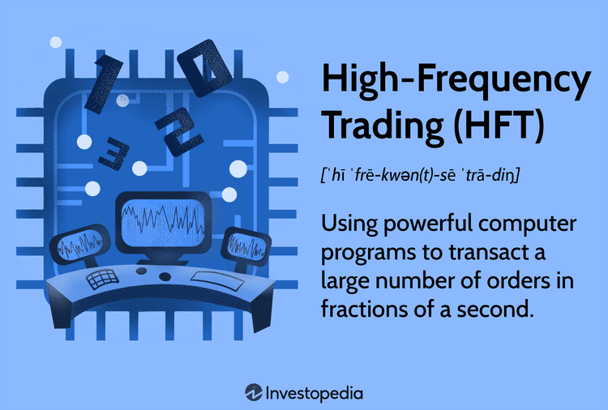

The rapid evolution of technology has significantly transformed financial markets, with high-frequency trading (HFT) and algorithmic trading becoming prominent features in this dynamic environment. These advanced trading techniques utilize complex algorithms and cutting-edge computing power to execute trades at unprecedented speeds, aiming to capitalize on even the smallest market inefficiencies. Understanding these sophisticated methodologies is essential for investors and industry professionals who seek to remain competitive in today's fast-paced financial landscape. 

High-frequency trading, a subset of algorithmic trading, involves executing large numbers of orders at extremely high speeds, sometimes measured in microseconds. This approach leverages technology to identify and exploit fleeting opportunities that are often invisible to the human eye, necessitating a robust understanding of algorithmic design and market structure. Similarly, algorithmic trading utilizes computer programs to follow predefined instructions for trading, aiming to optimize trading efficiency and execution.



This article seeks to decode the terminologies associated with high-frequency and algorithmic trading, examining their structures, strategies, and the benefits they bring to financial markets. Additionally, it acknowledges the challenges they pose, such as increased market volatility and the potential for systemic risk. By exploring these dimensions, readers will gain valuable insights into how these trading techniques influence modern financial markets, enabling them to make informed decisions and stay ahead in a competitive environment.

## Table of Contents

## Understanding Financial Markets Trading Terms

Financial markets involve a complex web of terminologies, many of which are essential to grasping the inner workings of high-frequency trading (HFT) and algorithmic trading. Understanding these key terms can provide valuable insights into how modern trading strategies are structured and executed.

Co-location is a crucial concept in HFT and involves placing trading servers in close proximity to the physical infrastructure of trading venues like stock exchanges. By minimizing the distance data must travel, co-location reduces latency — the time delay between instruction and execution — which is vital for traders seeking to capitalize on rapid price changes. For instance, in competitive trading environments, even microseconds can determine the difference between profit and loss, making co-location a sought-after advantage.

Flash trading is another term often associated with HFT. It is a practice where certain traders receive market information fractions of a second before the rest of the market. These traders gain access to impending orders which allow them to make informed decisions before other participants can react. Although flash trading has been criticized for creating unfair advantages, proponents argue that it can increase liquidity by allowing for greater trade execution.

Liquidity rebates are incentives offered by exchanges to traders who provide [liquidity](/wiki/liquidity-risk-premium) to the market. When traders place limit orders that are later executed by other market participants, they may receive a rebate in exchange for their contribution to market depth and liquidity. Liquidity rebates play a significant role in the strategies of [HFT](/wiki/high-frequency-trading-strategies) firms, as these rebates can offset transaction costs and enhance profitability.

In [algorithmic trading](/wiki/algorithmic-trading), terms like trading algorithms and smart routers are foundational. Trading algorithms are pre-defined, automated sets of rules or instructions used to make trading decisions and execute orders based on various market signals. These algorithms can be programmed to follow specific strategies, such as trend-following or statistical [arbitrage](/wiki/arbitrage), and operate with precision to manage trade execution.

Smart routers are sophisticated systems used in algorithmic trading to optimize the execution of trades across multiple venues. These routers assess real-time data from different market platforms and select the most efficient pathway to execute an order, minimizing costs and improving execution speed. The implementation of smart routers ensures that trades are routed through the venue with the best bid or offer, enhancing overall trade performance.

These terms form the backbone of technological advancements in financial trading, redefining how trades are conceived and executed. Understanding them is beneficial for traders aiming to navigate the complexities of contemporary financial markets.

## What is High-Frequency Trading?

High-frequency trading (HFT) is a sophisticated form of algorithmic trading that leverages high-speed technologies to execute a large number of orders at extremely fast speeds. Defined by its rapid execution and high turnover rates, HFT aims to capitalize on minuscule price differences that arise over very short time frames. This method is predominantly utilized by institutional traders, hedge funds, and proprietary trading firms that possess the technological infrastructure to operate in microsecond and nanosecond time scales.

At its core, HFT relies on powerful algorithms that are programmed to identify and exploit small inefficiencies and price discrepancies in the financial markets. These algorithms are capable of making market decisions and executing buy or sell orders in mere fractions of a second. By doing so, HFT strategies enable traders to capture fleeting opportunities that are not detectable or actionable by human traders.

The implementation of HFT involves co-location services, where trading firms place their servers in close proximity to the data centers of exchanges. This arrangement reduces latency, the time delay before data is processed, giving these firms an edge in speed over their competitors. To illustrate the importance of speed in HFT, consider a scenario where an algorithm detects a price difference of $0.01 between two assets. While this may seem negligible, executing millions of such trades can lead to substantial profits.

Moreover, HFT operations often involve sophisticated models that require significant computational power and data inputs. For example, [statistical arbitrage](/wiki/statistical-arbitrage), one of the strategies used in HFT, involves finding correlations between different financial instruments to predict future price movements. This necessitates the use of historical data and real-time analysis to identify patterns that can be exploited.

While high-frequency trading plays a critical role in the liquidity and efficiency of modern financial markets, it also raises several concerns. Critics argue that HFT can contribute to market [volatility](/wiki/volatility-trading-strategies) and create an unlevel playing field where only those with the resources for such technology can compete effectively. Despite these criticisms, HFT remains a prominent part of the trading landscape, continually evolving with advancements in technology and market dynamics.

In summary, high-frequency trading represents a cutting-edge technique that fundamentally relies on speed and technology to gain competitive advantages in the financial markets. Through the use of advanced algorithms and minimal latency, it allows traders to capitalize on small price fluctuations, significantly influencing the way modern financial markets function.

## What is Algorithmic Trading?

Algorithmic trading, also known as algo-trading, utilizes computer programs to execute trades by following pre-defined instructions. These instructions, or algorithms, determine aspects such as timing, price, or quantity of orders, and can be overpoweringly complex, incorporating models that analyze vast amounts of data almost instantaneously. The demand for speed and efficiency is central to the operation, allowing traders to respond rapidly to market conditions that might otherwise change faster than human reaction times allow.

A core function of algorithmic trading is its ability to manage and execute large orders by breaking them into smaller, more manageable pieces. This capability is crucial for institutional investors, who handle substantial orders that, if executed simultaneously, could significantly affect market prices and liquidity. By dispersing these orders over a set time or when specific conditions are met, algorithmic trading minimizes market impact, thereby reducing the risk of suboptimal execution from abrupt price changes.

Algo-trading often uses various strategies such as statistical arbitrage, where algorithms scan markets for pricing inefficiencies between related securities to exploit temporary imbalances. Another common strategy involves index fund rebalancing, where algorithms ensure that fund compositions remain aligned with their respective indices. Traders also leverage trend-following strategies, which capitalize on historical patterns within market data, relying on technical analysis to predict price movements.

The mathematics underpinning these algorithms may involve advanced statistical models or [machine learning](/wiki/machine-learning) techniques. For instance, models such as mean reversion predict that the price of an asset will tend to move back to its average over time, allowing traders to anticipate shifts and act accordingly. 

Python is frequently employed in developing and [backtesting](/wiki/backtesting) these trading strategies due to its robust libraries like NumPy, pandas, and Scikit-learn, which facilitate complex calculations, data analysis, and model implementation. Below is a simple Python example illustrating how to calculate a moving average, a fundamental component of many trading algorithms:

```python
import pandas as pd

# Sample data, replace with actual financial data
data = {'price': [100, 102, 101, 105, 107, 110]}
df = pd.DataFrame(data)

# Calculate moving average
df['moving_average'] = df['price'].rolling(window=3).mean()

print(df)
```

Algorithmic trading continues to develop as technology advances, with [artificial intelligence](/wiki/ai-artificial-intelligence) and machine learning poised to play increasing roles in strategy enhancement and execution efficiency. As markets grow more complex, the reliance on sophisticated algorithms allows participants to stay competitive, adapting swiftly to the ever-evolving financial landscape.

## Key Differences Between HFT and Algorithmic Trading

High-frequency trading (HFT) and algorithmic trading are both sophisticated methods that utilize algorithms, yet they significantly differ in their objectives and execution styles. High-frequency trading emphasizes execution speed, leveraging advanced technology to place a large [volume](/wiki/volume-trading-strategy) of orders in fractions of a second. This lightning-fast approach allows traders to capitalize on fleeting price discrepancies, often holding positions for an extremely short duration—sometimes mere seconds or minutes. The focus on rapid execution means HFT strategies prioritize low latency connections to exchanges and typically engage in numerous trades throughout a trading session to profit from small price movements. 

On the other hand, algorithmic trading encompasses a wider spectrum of strategies beyond the sole pursuit of speed. It is employed to automate trading processes based on a set of predefined rules or logic that can incorporate a variety of trading strategies such as trend-following, statistical arbitrage, or mean reversion. Unlike HFT, algorithmic trading can cater to longer-term investment horizons, using algorithms to execute trades over extended periods. These strategies involve comprehensive market analysis and the utilization of both current and historical data to inform trading decisions.

While both trading types rely on mathematical models and programming skills, the primary distinction lies in their execution timeframes and the breadth of strategies employed. HFT is predominantly concerned with time-sensitive strategies necessitating technological infrastructure capable of minimizing transaction times. Algorithmic trading, in contrast, often involves evaluating broader market conditions and can accommodate strategies that do not require immediate reaction to market signals, making it suitable for long-term forecasts and investment plans.

In practice, these differences imply varying resource requirements and potential risks. HFT demands substantial investment in technology and computing power to ensure minimal latency, whereas algorithmic trading might require a more profound emphasis on data analysis and strategy development. Understanding these key differences can aid traders and investors in selecting the trading approach that best aligns with their investment goals and technological resources.

## Benefits and Challenges of High-Frequency Trading

High-frequency trading (HFT) has brought significant transformations to modern financial markets, primarily by increasing market liquidity and enhancing price efficiency. Liquidity refers to the ease with which assets can be bought or sold in the market without causing significant price changes. HFT participants, by executing a large number of trades rapidly, supply liquidity to the market and thus contribute to tighter bid-ask spreads. Tighter spreads imply that the difference between the buying price and the selling price of an asset is reduced, which can result in cost savings for investors and improved market efficiency.

Another benefit of HFT is its contribution to price discovery, which is the process through which the market determines the price of an asset. By reacting swiftly to new information and executing trades based on milliseconds-old data, HFT firms help incorporate this information into market prices more rapidly. This rapid assimilation of information ensures that asset prices more accurately reflect their underlying values, theoretically leading to a more efficient market.

Despite these benefits, HFT is not without its challenges and criticisms. One of the primary criticisms is that HFT contributes to increased market volatility. The use of high-speed, automated trading strategies can cause rapid price fluctuations that are not necessarily linked to fundamental changes in asset values. For example, a sudden surge in trading activities by HFT systems can lead to significant price swings, which, in extreme cases, might result in market events such as flash crashes.

Moreover, HFT has been accused of creating unfair advantages for firms with superior technology and infrastructure. The requirement for substantial investments in cutting-edge technology and proximity to major exchanges means that only well-capitalized firms can engage effectively in HFT. These firms often utilize co-location strategies, where their servers are situated physically closer to exchange servers to reduce latency, or delay in trade execution. This proximity provides them with a speed advantage over other market participants who do not have access to similar infrastructure, potentially skewing market dynamics.

The intersection of technology and trading practices in HFT also poses regulatory challenges. Regulators face the task of ensuring that HFT activities do not compromise market integrity while simultaneously encouraging innovation and efficiency. Balancing these interests is crucial to mitigate risks associated with HFT and to create a fair and transparent marketplace for all participants. 

In summary, while HFT contributes positively to market liquidity and price efficiency, its associated challenges, including increased volatility and potential unfair advantages, necessitate careful consideration and regulation. As the financial markets continue to evolve, addressing these challenges will be imperative to harnessing the full potential of high-frequency trading.

## Algorithmic Trading Strategies

Algorithmic trading strategies employ a range of techniques to identify profitable trading opportunities, relying heavily on quantitative analysis and historical data. Among the most prominent strategies are trend-following, arbitrage, and mean reversion, each with distinct methodologies and goals.

### Trend-Following

Trend-following strategies capitalize on the direction of market movements, identifying trends and attempting to ride them for profit. These strategies typically do not predict market directions; instead, they react to existing market trends. The core principle is that prices in motion tend to continue in their current trajectory until an external force causes a reversal. 

**Example Code**: A simple moving average (SMA) crossover strategy in Python can serve as a basic trend-following algorithm:

```python
import pandas as pd

def moving_average_crossover(data, short_window, long_window):
    data['Short_MA'] = data['Close'].rolling(window=short_window, min_periods=1).mean()
    data['Long_MA'] = data['Close'].rolling(window=long_window, min_periods=1).mean()

    data['Signal'] = 0
    data['Signal'][short_window:] = np.where(data['Short_MA'][short_window:] > data['Long_MA'][short_window:], 1, 0)

    data['Position'] = data['Signal'].diff()
    return data

# Example usage: moving_average_crossover(data, 40, 100)
```

This code snippet generates buy signals when a short-term moving average crosses above a long-term moving average, indicating an upward trend.

### Arbitrage

Arbitrage strategies exploit price discrepancies of identical or similar financial instruments. These discrepancies can occur in different markets or even within the same market. Traders using arbitrage strategies aim to profit from these temporary inefficiencies. 

A common form is statistical arbitrage, which involves a series of mathematical models to detect mispricing. High-speed execution and significant computational power are often essential to capitalize on these fleeting opportunities.

### Mean Reversion

Mean reversion strategies assume that prices and returns eventually move back towards the mean or average level. Traders employing this strategy believe that extreme movements are anomalies and that prices will revert to their long-term average. This strategy relies on identifying deviations from the mean and betting on their correction.

The formula for a typical mean reversion algorithm can be expressed as:

$$
R_t = \alpha + \beta R_{t-1} + \epsilon_t
$$

Where $R_t$ denotes the expected return, $\alpha$ is the mean level, $\beta$ is a coefficient indicating the speed of reversion, and $\epsilon_t$ represents the error term.

Each of these strategies leverages different principles of market behavior, making them suitable for various trading goals and conditions. The common thread is their reliance on rigorous analysis and data-driven decision-making to optimize trading outcomes.

## Future of High-Frequency and Algorithmic Trading

The future of high-frequency trading (HFT) and algorithmic trading is poised for significant transformation as technology continues to advance. These trading methodologies, which rely heavily on speed, precision, and complex algorithms, are expected to further integrate with artificial intelligence (AI) and machine learning (ML). These advancements promise to enhance decision-making processes, optimize trade execution, and refine predictive modeling.

One of the primary focus areas for the future of HFT and algorithmic trading is the reduction of latency. Latency, defined as the delay between input into a system and the desired outcome, is critical in HFT, where time is equated with profitability. Advanced technologies aim to minimize this latency through improved hardware, such as high-speed network connections and low-latency data centers. Co-location, where traders place their computers in close proximity to the exchange servers, will continue to be a crucial strategy for reducing transmission times.

The integration of AI and ML in trading strategies is another anticipated development. These technologies can process vast amounts of data more efficiently than human traders and are capable of identifying patterns and trends that may not be immediately obvious. Machine learning algorithms, in particular, can be used to predict market movements and develop strategies that adapt to new information in real-time. For example:

```python
from sklearn.ensemble import RandomForestClassifier
import numpy as np

# Sample data: Features could be historical price movements, volume, etc.
X_train = np.array([[...], [...]])  # Training features
y_train = np.array([...])           # Training labels

# Initialize a Random Forest classifier
model = RandomForestClassifier(n_estimators=100)

# Fit the model
model.fit(X_train, y_train)

# Predict with new data
X_new = np.array([[...], [...]])  # New unseen data
predictions = model.predict(X_new)
```

Advancements in big data analytics are set to play a significant role in the evolution of algorithmic trading. Enhanced data processing capabilities allow traders to analyze historical and real-time data rapidly, making it possible to conduct backtesting and optimization of strategies with greater accuracy. This capability can be levered to improve models that assess risk and provide deeper insights into market behavior.

However, these technological advancements come with regulatory challenges. As trading algorithms become more sophisticated, regulatory bodies are increasingly focused on ensuring market fairness and transparency. The future will likely see increased cooperation between technology developers and regulators to develop systems that can prevent market manipulation and maintain integrity. Effective regulation will be critical in managing the ethical implications of fully autonomous trading systems.

In conclusion, the future of high-frequency and algorithmic trading is bright, with technological innovations offering the potential to enhance speed, accuracy, and market engagement. As AI and machine learning become more entrenched, the focus will be on not only advancing the capabilities of trading technologies but also addressing the accompanying challenges to create a fair and transparent trading environment.

## Conclusion

High-frequency trading (HFT) and algorithmic trading have significantly transformed the landscape of modern financial markets, creating a paradigm shift in how trades are executed and markets function. At their core, these technologies leverage complex algorithms and high-speed data processing to execute trades with precision and swiftness that were unimaginable in previous decades. This transformation is largely driven by the need for efficiency and competitiveness in highly dynamic market environments.

Understanding the underlying concepts and terms associated with HFT and algorithmic trading is imperative for traders and financial professionals seeking to remain competitive. By comprehending how these systems operate, the strategies they employ, and the technological infrastructure that supports them, market participants can gain valuable insights into price formation, market liquidity, and trading dynamics. For instance, HFT often focuses on capturing minute market inefficiencies within very short time frames, offering insights into the formation of microstructural noise and its implications for market stability. Algorithmic trading, in contrast, involves a broader spectrum of strategies tailored for various market conditions, thus enabling sophisticated risk management and execution efficiency.

Staying informed about developments in high-frequency and algorithmic trading is vital for leveraging these technologies effectively. With ongoing advancements in areas such as artificial intelligence, machine learning, and data analytics, traders who remain at the forefront of these innovations will be better equipped to harness the benefits of reduced latency, enhanced decision-making accuracy, and optimized trading strategies. This pursuit of innovation will continue to define the trajectory of financial markets, demanding a continual learning mindset from those involved.

In conclusion, embracing the advancements brought by high-frequency and algorithmic trading is essential for anyone looking to successfully navigate and thrive in the competitive landscape of modern financial markets. By understanding and utilizing these technologies, traders can make more informed decisions and position themselves advantageously in an ever-evolving market.

## References & Further Reading

[1]: Aldridge, I. (2013). ["High-Frequency Trading: A Practical Guide to Algorithmic Strategies and Trading Systems."](https://www.amazon.com/High-Frequency-Trading-Practical-Algorithmic-Strategies/dp/1118343506) Wiley.

[2]: Cartea, Á., Jaimungal, S., & Penalva, J. (2015). ["Algorithmic and High-Frequency Trading."](https://assets.cambridge.org/97811070/91146/frontmatter/9781107091146_frontmatter.pdf) Cambridge University Press.

[3]: Lopez de Prado, M. (2018). ["Advances in Financial Machine Learning."](https://www.amazon.com/Advances-Financial-Machine-Learning-Marcos/dp/1119482089) Wiley.

[4]: Kissell, R. (2013). ["The Science of Algorithmic Trading and Portfolio Management."](https://www.sciencedirect.com/book/9780124016897/the-science-of-algorithmic-trading-and-portfolio-management) Academic Press.

[5]: Jarrow, R. A., & Protter, P. (2012). ["A Short History of High-Frequency Trading."](https://papers.ssrn.com/sol3/papers.cfm?abstract_id=1781124) Solutions - Journal of Financial Transformation, 36, 69-73.