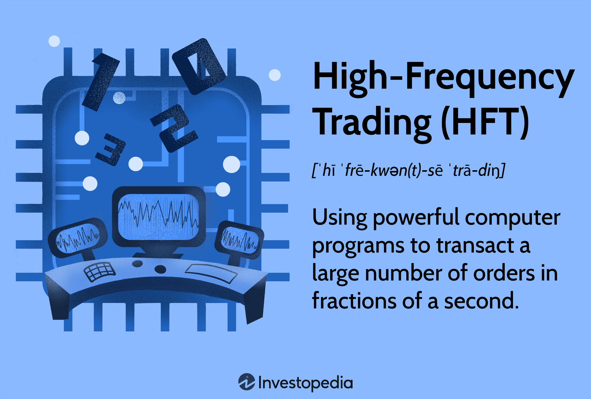

Trading, as an ancient practice, has continually evolved in response to technological advancements, socio-economic shifts, and market dynamics. From the bustling, raucous floors of traditional stock exchanges to the modern, silent server rooms, the progression has been profound. One of the most transformative developments in recent decades has been the onset of algorithmic trading, which employs mathematical models and computational algorithms to make trading decisions. Within this realm, a subset emerged that's even more technology-dependent and speed-focused: High-Frequency Trading or HFT.

HFT is a type of algorithmic trading characterized by high-speed trade execution, where positions are typically held for extremely short durations - from milliseconds to mere seconds. This approach hinges on executing large numbers of orders at fractions of a second, leveraging small price inefficiencies that can only be exploited via the use of high-speed computers and ultra-low-latency networks[1].

The evolution from human-driven floor trading to algorithm-dominated digital platforms wasn't overnight. Key technological milestones, such as the transition to electronic trading in the late 20th century and the proliferation of broadband internet, laid the groundwork for sophisticated algorithmic strategies. As electronic exchanges became mainstream, the physical limitations of floor trading were replaced by the virtual boundaries of computing power and internet speeds. This shift paved the way for the race towards faster executions, giving birth to HFT.

Today, HFT accounts for a substantial proportion of equity trades in major markets worldwide. It stands as a testament to how technology, when merged with financial innovation, can redefine age-old practices, presenting both opportunities and challenges for global financial markets.

## Table of Contents

## What Is High-Frequency Trading (HFT)?

High-Frequency Trading ([HFT](/wiki/high-frequency-trading-strategies)) is a form of [algorithmic trading](/wiki/algorithmic-trading) where financial instruments, like stocks or commodities, are bought and sold at extremely high speeds, often in fractions of a second. Imagine a hummingbird that flits quickly from flower to flower, sipping nectar faster than the blink of an eye; HFT operates in a similar lightning-fast manner in the financial markets, zipping through vast amounts of trade orders to capitalize on minuscule price discrepancies.

The technological foundation of HFT is a symphony of advanced hardware and software components, meticulously tuned for speed. At the core are powerful computer servers equipped with specialized processors that execute algorithmic trading strategies. These servers are typically housed in data centers located in close proximity to the exchanges, a practice known as colocation[2]. Being physically closer, even by mere meters, can provide a time advantage, given the importance of speed in HFT.

Furthermore, HFT relies on ultra-low-latency network connections, ensuring rapid data transmission between the HFT system and the exchange. This is often achieved through fiber-optic cables, microwave links, or even satellite communication systems[3]. Every millisecond counts in HFT, and thus the technology stack is optimized end-to-end, from the design of the trading algorithms to the choice of hardware and network infrastructure.

Apart from speed, data feeds play a crucial role. HFT systems consume vast amounts of real-time market data, analyzing price, [volume](/wiki/volume-trading-strategy), and order information across multiple exchanges. This data not only drives immediate trade decisions but also aids in refining and adjusting strategies based on evolving market conditions.

In essence, the world of HFT is where finance meets the bleeding edge of technology, with traders, quants, and engineers collaborating to create systems that can react faster than any human ever could.

## Historical Perspective

High-Frequency Trading, although a relatively modern phenomenon, has roots that stretch back decades, shaped by technological advancements and market evolutions. Here's a brief timeline highlighting the growth and pivotal moments in HFT:

- **1970s:** The genesis of electronic trading starts with the introduction of the National Association of Securities Dealers Automated Quotations (NASDAQ), which becomes the first electronic stock market[4].
- **1980s:** Algorithmic trading begins its ascent. The early algorithms are primarily used for tasks like splitting large orders to minimize market impact. This decade also witnesses the rise of electronic communication networks (ECNs), further laying the foundation for HFT[5].
- **1990s:** Technological advancements in computing power and networking lead to the emergence of proprietary trading firms. These entities see the potential of leveraging technology to trade rapidly, paving the way for what would become HFT.
- **Early 2000s:** HFT begins its swift rise. With the Securities and Exchange Commission (SEC) approving Regulation National Market System (Reg NMS) in 2005[6], markets become more fragmented, providing HFT strategies with fertile ground to flourish.
- **2007:** The NYSE goes electronic with the acquisition of Arca, one of the largest ECNs. HFT volume significantly increases, accounting for over 50% of the equity share volume in the U.S[7].
- **May 6, 2010:** A day that remains etched in the annals of trading history. The 'Flash Crash' sees the Dow Jones plummet 1000 points in minutes and recover almost as quickly[8]. Although not solely attributed to HFT, it brings intense scrutiny to HFT practices.
- **2010s:** Regulatory bodies worldwide become more involved in overseeing HFT. The SEC, for example, introduces the Market Access Rule, while Europe introduces the Markets in Financial Instruments Directive II (MiFID II) in an attempt to increase transparency and curb HFT excesses[9].
- **Late 2010s-2020s:** HFT continues to evolve with the integration of more advanced machine learning and AI techniques. Furthermore, the landscape sees a shift as HFT begins to find a place in the burgeoning cryptocurrency markets.

In this journey from electronic beginnings to a dominant force in the trading landscape, HFT has showcased the remarkable fusion of technology and finance, continually adapting and reshaping in response to market dynamics and technological innovations.

## Deep Dive: How Does HFT Work?

At its core, High-Frequency Trading is the application of sophisticated algorithms to trade financial instruments in a split second, capitalizing on tiny price discrepancies.

The typical HFT process can be distilled into a series of steps:

1. **Data Acquisition:** Before any trades occur, HFT systems must receive a deluge of market data, including price quotes, trade volumes, and other relevant financial metrics. This data pours in at millisecond or even microsecond intervals.
2. **Data Analysis:** Once acquired, the HFT algorithms rapidly analyze this information. They scan for patterns, correlations, and anomalies which might indicate a profitable trading opportunity. Given the sheer volume of data, this analysis phase emphasizes efficiency and speed.
3. **Signal Generation:** Post analysis, the HFT system generates trading signals, essentially deciding whether to buy, sell, or hold a particular asset based on the algorithm's interpretation of the market data.
4. **Order Execution:** Upon generating a signal, the system sends out orders to the market. The speed of this execution is crucial. Delays, even those measured in microseconds, can render a once-profitable trade obsolete due to the fast-paced nature of HFT.
5. **Trade Completion:** Finally, the trade is completed, and the process starts anew, often multiple times in a single second.

Now, when it comes to the technological prowess behind HFT:

- **Servers:** HFT operations employ high-performance servers that can process vast amounts of data swiftly. These servers are often customized to optimize specific operations critical to HFT, ensuring reduced lag and increased efficiency[10].
- **Co-location:** To minimize the time it takes for data to travel, many HFT firms opt for co-location[11]. This involves housing their servers within the same data centers as exchanges, minimizing the physical distance data must traverse.
- **Networking Hardware:** Advanced networking components, including high-speed switches and routers, are essential. They ensure that data packets flow seamlessly and rapidly between the HFT system and the exchange.
- **Fiber Optics and Microwaves:** Traditional wired networks, though fast, can still introduce delays. To combat this, some HFT firms have turned to microwave technology, which can transmit data slightly faster than fiber optics due to the speed of radio waves through air being greater than light through fiber[12].
- **Advanced Algorithms:** At the heart of HFT are the algorithms. These mathematical models are rigorously tested and refined to predict and capitalize on market movements. Some algorithms might focus on specific strategies, such as market-making or statistical arbitrage, while others might be more general-purpose.

## The Strategies Employed in HFT

High-Frequency Trading (HFT) employs a range of sophisticated strategies to identify and capitalize on minute and transient opportunities in the market.

One of the primary and most prevalent strategies is **Market Making**.

### Market Making

**Market Making** is a practice where a trader or firm provides buy and sell quotes for a financial instrument, effectively 'making a market'. In the context of HFT, market making involves rapidly placing large volumes of buy and sell orders at different prices, aiming to profit from the bid-ask spread. Here's how it works[13][14]:

1. **Bid-Ask Spread Capitalization:** At any given time, there's a highest price a buyer is willing to pay for an asset (the bid) and a lowest price a seller is willing to accept (the ask). The difference between these two prices is the bid-ask spread. Market makers aim to buy at the bid price and sell at the ask price, profiting from this difference.
2. **Order Book Imbalance:** Market makers continuously monitor the order book, which lists all buy and sell orders in the market. If they detect a greater number of buy orders than sell orders, it might indicate upward price movement in the near future, allowing the market maker to adjust their quotes accordingly.
3. **Inventory Management:** A successful market maker must effectively manage their inventory. Holding a large position of an asset exposes the market maker to adverse price movements. Thus, they employ algorithms to ensure they aren't overly exposed to any particular asset, maintaining a mostly neutral position.
4. **High Volume, Low Margin:** The profit from each individual trade in market making is typically minuscule. However, by conducting thousands or even millions of these trades daily, HFT market makers can accumulate significant profits.
5. **Rapid Response to Market Changes:** Given that market conditions can change in milliseconds, HFT market-making strategies rely on lightning-fast data analysis. If a major news event occurs or significant trade is executed, the HFT market maker's algorithms will rapidly adjust their buy and sell quotes to reflect the new information.
6. **Liquidity Provision:** A key benefit of market making is the provision of liquidity. By continuously offering to buy and sell assets, market makers ensure that other traders can execute their trades without significant delays or unfavorable prices.

While [market making](/wiki/market-making) is a dominant strategy, its success hinges on speed, precision, and a profound understanding of market dynamics.

### Statistical Arbitrage

**Statistical Arbitrage** in the realm of High-Frequency Trading (HFT) is an advanced quantitative trading strategy that leverages mathematical models and computational power to identify and exploit temporary mispricings between related financial instruments.

At its core, statistical [arbitrage](/wiki/arbitrage) is predicated on the concept of mean reversion. This means that the prices of financial instruments, which might deviate from their historical average for various reasons, will eventually revert to their mean or average levels over time.

Here's how it generally functions[15][16]:

1. **Pair Trading:** One of the most common forms of statistical arbitrage is pair trading. Traders identify two co-integrated stocks (or other financial instruments) that typically move in tandem. When there's a temporary divergence in their price relationship, traders will long the underperforming asset and short the outperforming one, expecting the price relationship to revert to its historical mean.
2. **Model Creation:** Sophisticated mathematical and statistical models, often involving machine learning and artificial intelligence, are utilized to analyze vast amounts of historical data and determine the co-integration of assets.
3. **Market Neutral Strategy:** A defining characteristic of statistical arbitrage is its market-neutral stance. By simultaneously going long on undervalued assets and short on overvalued ones, the strategy seeks to mitigate broad market risks. This means, theoretically, it can generate profits regardless of market direction.
4. **Speed is Essential:** In HFT-based statistical arbitrage, opportunities might last for mere milliseconds. Thus, the emphasis is on the rapid execution of trades. Algorithms are designed to quickly identify mispricings and make corresponding trades faster than humanly possible.
5. **Multi-Asset & Multi-Geography:** Advanced iterations of this strategy might involve arbitraging mispricings across different asset classes (stocks, commodities, forex) and even across different global markets.
6. **Risk Management:** Despite its quantitative nature, statistical arbitrage isn't risk-free. There's always the possibility that assets might not revert to their mean as expected. To mitigate potential losses, rigorous risk management protocols, including setting stop-loss levels, are integral to the strategy.
7. **Adaptive Algorithms:** Financial markets are in constant flux. Thus, the algorithms underpinning statistical arbitrage must be adaptive. They are regularly updated to reflect changing market dynamics and to optimize performance.

Statistical arbitrage, while lucrative, is not without its challenges. The competition is fierce, and the edge for any given opportunity is continually diminishing, especially in HFT where the race to be the fastest is relentless. Nonetheless, it remains a cornerstone strategy for many quantitative traders and HFT firms, thanks to its potential for consistent, market-neutral returns.

👉 You'll see many examples of this strategy in our [trading strategies database](https://edarchimbaud.com/equities).

### Event Arbitrage

Event Arbitrage is a high-frequency trading strategy that capitalizes on price inefficiencies arising from anticipated events. These events can range from mergers and acquisitions, [earning](/wiki/earning-announcement)s announcements, to regulatory changes or any corporate activity that can significantly influence a stock's price.

In Event Arbitrage, traders use algorithms to rapidly trade around these events. The premise is simple: information from such events, once made public, can cause substantial price movements. However, there's often a lag between the announcement of the event and the market's full assimilation of this information, which creates short-lived trading opportunities.

For example, in the case of a merger or acquisition, an acquiring company typically offers a premium to purchase shares of the target company. Immediately after such an announcement, the target company's stock price generally jumps closer to the offer price, but there's often a slight difference between the current price and the offer price due to the uncertainties around deal completion. Traders leverage this difference by buying the target company's stock, hoping to profit from the eventual convergence to the offer price.

Here are key aspects of Event Arbitrage[17][18]:

1. **Rapid Data Analysis:** Algorithms play a crucial role in analyzing vast amounts of data at high speeds. As soon as an announcement is made, the algorithms evaluate the potential impact on the stock price and execute trades accordingly.
2. **News Feed Algorithms:** These are specialized algorithms designed to read and interpret news feeds in real-time. The slightest hint of an event can trigger a series of trades aiming to capitalize on the forthcoming price movement.
3. **Risk Management:** This strategy isn't without risks. For instance, in the case of a merger, there's always a possibility that the deal may fall through. Effective risk management ensures that the potential downside is contained.
4. **Ultra-Fast Execution:** Given that price inefficiencies are ephemeral, the speed of trade execution is paramount. Advanced trading platforms, direct market access, and co-location services ensure that trades are executed at lightning speeds.
5. **Market Impact:** Event Arbitrage contributes to the market's price discovery process. As traders react to new information, prices adjust to reflect the new data, ensuring that stocks are fairly valued.

While Event Arbitrage is a lucrative strategy, its success hinges on the accuracy of the algorithms, speed of execution, and the ability to rapidly assimilate and act on vast amounts of information. The intense competition in this space also means that the inefficiencies are corrected almost instantaneously, making it imperative for traders to be ahead of the curve.

👉 You'll see many examples of this strategy in our [trading strategies database](https://edarchimbaud.com/equities).

### Latency Arbitrage

Latency Arbitrage capitalizes on price differences arising from slight delays in data transmission, often measured in milliseconds or even microseconds. In the realm of high-frequency trading (HFT), where speed is paramount, these minuscule lags can present significant profit opportunities for traders.

In its simplest form, latency arbitrage exploits disparities in the time it takes for updated market data to reach different participants. This disparity can be due to geographical differences, hardware limitations, or network delays. Traders equipped with faster connections and sophisticated infrastructure can receive this data quicker, allowing them to act on price discrepancies before other market participants can react.

For example, a stock might be trading at $100.10 in Exchange A and $100.20 in Exchange B. A latency arbitrageur, with rapid access to these prices, might buy the stock on Exchange A and simultaneously sell on Exchange B, pocketing the $0.10 difference. This activity requires highly advanced algorithms to spot such disparities and make the corresponding trades in fractions of a second.

Several points to note about Latency Arbitrage[19][20]:

1. **Co-location Services:** Many HFT firms opt for co-location services, where they place their servers physically close, often in the same data centers, to the exchange's servers. This proximity drastically reduces data transmission times, providing them a crucial edge in executing latency arbitrage strategies.
2. **Fiber Optic Cables and Microwaves:** To further reduce latency, firms invest in state-of-the-art transmission mediums like dedicated fiber-optic cables and microwave networks. These channels facilitate faster data relay, enabling traders to receive and act on price data ahead of the competition.
3. **Market Impact:** While latency arbitrage can be profitable for HFT firms, it has its critics. Some argue that it doesn't provide any significant value to the market, and rather it could lead to distorted prices and increased volatility. Moreover, the vast investments required to participate in latency arbitrage have raised concerns about an uneven playing field, favoring well-capitalized firms.
4. **Regulatory Scrutiny:** Due to the controversial nature of latency arbitrage, some regulators are examining ways to level the playing field. Concepts like "speed bumps" have been introduced in certain exchanges, introducing random delays to order execution, diminishing the advantage of ultra-fast traders.

Latency Arbitrage, while a testament to technological advancements in the trading world, stands at the intersection of innovation, competition, and market fairness. As technology continues to evolve and markets adapt, the role and impact of latency arbitrage in the broader market structure will remain a topic of ongoing debate and scrutiny.

### News-Based Trading

News-Based Trading is an algorithmic strategy that capitalizes on price movements induced by news events. With the advent of technology, the ability to parse, interpret, and act upon news articles, press releases, and financial reports in real-time has become an invaluable tool for HFT firms.

At the heart of this strategy lies Natural Language Processing (NLP), a subset of [artificial intelligence](/wiki/ai-artificial-intelligence). NLP algorithms are designed to read and understand the context and sentiment of textual information. When applied to financial news, these algorithms can gauge whether a piece of news is likely to have a positive or negative impact on an asset's price.

Here's a simplistic example: If a company announces better-than-expected quarterly earnings, an NLP algorithm might interpret this as positive news. The trading algorithm can then be triggered to buy shares of the company, anticipating a price rise. Conversely, news of a regulatory probe into a company might be interpreted as negative, prompting the algorithm to sell or short-sell the company's stock.

Several nuances to News-Based Trading include[21]:

1. **Speed Matters:** Like other HFT strategies, speed is of the essence. The faster the algorithm can interpret the news and execute trades, the better the potential profit. Delays can mean diminished returns or even losses.
2. **Variety of Sources:** News-Based Trading algorithms don't just focus on major headlines. They can analyze tweets, blog posts, financial forums, and more. This vast net ensures that they can capture market-moving information from less conventional sources.
3. **Complexity of Interpretation:** While NLP has advanced considerably[22], interpreting the nuances of human language remains challenging. Misinterpretation can lead to incorrect trades. Thus, the sophistication and accuracy of the NLP algorithm are crucial.
4. **Immediate and After-Effects:** While some news can cause immediate price reactions, other news might have a more prolonged effect on the asset's price. Algorithms can be tailored to exploit both short-term spikes and longer-term trends resulting from news events.
5. **Global Implications:** In today's interconnected world, news in one part of the globe can affect markets elsewhere. For instance, a policy change in a major economy like the U.S. or China can have ripple effects across global markets. Algorithms need to be attuned to global news to capitalize on such opportunities.

While News-Based Trading offers lucrative opportunities, it's not without risks. Erroneous news or the misinterpretation of genuine news can lead to substantial losses. Moreover, in an environment where numerous algorithms act on the same piece of news, the competition can erode potential gains.

News-Based Trading underscores the blend of finance and technology, illustrating how machines can, to some extent, understand and act upon the vast torrents of news that shape the financial markets daily.

👉 You'll see many examples of this strategy in our [trading strategies database](https://edarchimbaud.com/equities).

### Order Properties Strategies

Order properties strategies in high-frequency trading (HFT) revolve around the specific attributes of orders, such as their size, type, and timing, to capitalize on short-term price movements. These strategies consider the nuances of order placement and modification to gain an edge in the market.

1. **Order Anticipation:** This approach involves detecting large orders from institutional traders before they're fully executed. An HFT system might identify patterns that suggest a big buy or sell order is about to hit the market. By anticipating these orders, HFTs can position themselves favorably to profit from the ensuing price movement.
    1. **Volume Weighted Average Price (VWAP):** VWAP is a trading benchmark used by traders that gives the average price a security has traded throughout the day, based on both volume and price. HFT algorithms can strive to achieve better than VWAP execution by breaking up large orders and optimizing the execution timing.
    2. **Time Weighted Average Price (TWAP):** Like VWAP, TWAP is a trading algorithm based on the price of a stock over time, but without the volume component. HFTs use this to slice up a big order and execute it piecemeal over a specific timeframe to minimize market impact.
    3. **Percentage of Volume (POV):** In this strategy, the trader specifies a percentage of the total volume of a stock to be executed over a specified time frame. HFT algorithms adjust the order size dynamically based on real-time volume data to ensure the desired percentage is maintained.
    4. **Iceberg/Hidden Orders:** These are large orders that are divided into smaller lots and only a portion of the order is revealed to the market at a time. HFT algorithms can detect the presence of these hidden orders by analyzing market data and then trade accordingly.
    5. **Stop-Loss Hunting:** HFTs can detect concentrations of stop-loss orders, especially in less liquid markets. By causing a minor price fluctuation to trigger these stop-loss orders, HFTs can profit from the subsequent price movements.
2. **Order Book Layering:** A controversial strategy where multiple orders are placed just outside the current bid or ask price to create the appearance of substantial supply or demand. Once other traders respond to this perceived market depth, the HFT then quickly cancels its orders and takes advantage of the price movement.
3. **Momentum Ignition:** This is an aggressive strategy where an HFT initiates a series of orders in an attempt to ignite a rapid price movement, either up or down. Once the momentum is ignited, the HFT will quickly close out its position for a profit.

It's imperative to understand that while order properties strategies can be highly profitable, they also come with significant risks. Some of these strategies, like [order book](/wiki/order-book-trading-strategies) layering, have garnered criticism and regulatory scrutiny due to their potential for market manipulation[23]. As such, participants utilizing such methods need to be well-versed in current regulations to ensure compliance.

## The Real Impact of HFT on Markets

High-frequency trading (HFT) has brought about significant transformations in market dynamics over the years, introducing both noteworthy benefits and notable concerns.

High-frequency trading's sheer speed and volume play a pivotal role in changing market landscapes. With HFT firms now constituting a major portion of daily trading volume[24], their influence on markets is undeniable.

One of the most infamous episodes highlighting HFT's impact was the **May 6, 2010 Flash Crash**. On this day, U.S. financial markets witnessed a rapid and unanticipated plummet of nearly 1000 points in the Dow Jones Industrial Average within minutes, only to recover just as quickly[25]. Investigations pinpointed a large mutual fund's complex algorithm initiating a selling program, coupled with HFTs, as contributors to the drastic price movements. This event spotlighted the potential dangers of unchecked algorithmic trading, leading to discussions about market safeguards and regulations.

On the brighter side, HFT has brought about tangible **benefits to the market**. One significant advantage is enhanced **[liquidity](/wiki/liquidity-risk-premium)**. HFT firms continuously place large volumes of buy and sell orders, ensuring that traders can quickly execute trades at desired prices. Additionally, this added liquidity often results in **tighter spreads**—the difference between buying and selling prices—making trading more cost-effective for everyone, from institutional investors to retail traders[26].

However, with benefits come certain **drawbacks**. Concerns over **market manipulation** have arisen, with tactics like quote stuffing, where numerous orders are placed and then immediately cancelled to confuse other traders, coming into the limelight.

In essence, while HFT has brought about certain efficiencies and advantages to modern markets, its influence also introduces vulnerabilities. It's this double-edged sword of potential and peril that underscores the significance of understanding, regulating, and refining HFT's role in the financial ecosystem.

## Notable HFT Players

In the realm of high-frequency trading, several firms stand out due to their prominence, innovative technologies, and specialized strategies. Let's deep dive into a few of these influential players:

**Virtu Financial**

One of the most recognized names in HFT, Virtu operates across numerous asset classes and markets globally. Their sophisticated trading models are built on a foundation of robust technology and a commitment to risk management. Virtu's unique edge lies in its adaptive strategies, which quickly adjust to changing market conditions, thereby maximizing opportunities[27].

**Citadel Securities**

A titan in the world of electronic trading, Citadel Securities handles a significant percentage of U.S. equities trading volume. With its robust technology infrastructure, Citadel Securities stands out for its multi-strategy approach, enabling it to participate across different market segments. Their diversified portfolio includes market making, institutional sales, and proprietary trading[28].

**Jump Trading**

Jump Trading merges technology with quantifiable research, enabling it to make data-driven trading decisions across various markets. The firm is known for its innovative approach, investing heavily in research and development to continually refine its algorithms and explore new strategies[29].

**Tower Research Capital**

Founded by former GTS specialist Mark Gorton, Tower Research Capital is a multi-strategy proprietary trading firm. They have carved a niche in the HFT space through their extensive investment in technology and relentless focus on research, which allows them to uncover unique market opportunities[30].

**Two Sigma**

While not solely an HFT firm, Two Sigma has made a significant impact in the algorithmic trading world. They combine advanced technology, world-class talent, and data science to unearth investment value. Their commitment to innovation is reflected in their ventures into areas like AI and [machine learning](/wiki/machine-learning), continually pushing the boundaries of financial sciences[31].

**KCG Holdings**

Before its acquisition by Virtu, KCG was a major player in HFT. KCG’s prominence was marked by its broad reach, spanning market making, global execution services, and institutional equities sales. Their strategic advantage was rooted in a combination of technology, deep market expertise, and a wide-ranging network[32].

Each of these HFT powerhouses has contributed to shaping the algorithmic trading landscape, bringing their own blend of technology and strategy to the fore.

## HFT in Cryptocurrency Markets

High-frequency trading, a phenomenon born in the traditional financial markets, has inevitably found its way into the bustling realm of cryptocurrencies. The emergence of HFT in this domain showcases the maturing nature of [cryptocurrency](/wiki/cryptocurrency) markets, as traders utilize advanced strategies to capitalize on even the smallest market inefficiencies.

The basic principles behind HFT remain consistent, whether in equity markets or crypto: using sophisticated algorithms to execute a large number of orders at extremely high speeds. However, cryptocurrency markets have unique characteristics that present both opportunities and challenges for high-frequency traders.

- **Liquidity and Fragmentation**: Cryptocurrency markets are notoriously fragmented, with hundreds of exchanges offering trading in various coin pairs. This fragmentation can lead to discrepancies in prices across platforms, providing arbitrage opportunities. HFT algorithms can capitalize on these by buying a cryptocurrency on one exchange and selling it on another where the price is higher[33].
- **Volatility**: The volatility inherent to cryptocurrency markets can be both a boon and a bane for HFT. On one hand, the frequent and sizable price swings can provide numerous trading opportunities. On the other, it increases the risk, especially for strategies that might rely on more stable pricing structures observed in traditional markets.
- **Lack of Regulation**: Unlike traditional financial markets, where HFT has been under the microscope of regulators, many cryptocurrency markets operate in a less stringent regulatory environment. This lack of oversight can provide more leeway for HFT strategies but also introduces risks. For instance, some exchanges have been accused of promoting or allowing practices like wash trading, which would be illegal in more regulated markets[34].
- **Technology and Infrastructure**: Just as in traditional markets, HFT in crypto requires robust technological infrastructure. Low latency connections, co-location with exchange servers, and sophisticated trading algorithms are all crucial components. Some cryptocurrency exchanges now even offer co-location services, recognizing the growing influence of HFT participants[35].
- **Market Manipulation Concerns**: With increased HFT activity comes the concern of market manipulation. Crypto markets, still in their formative years, can be more susceptible to strategies that might move prices inorganically. Practices like "spoofing," where traders place orders they have no intention of executing to create a false impression of market demand or supply, have been observed in the crypto realm[36].

In summary, HFT brings advanced trading strategies and increased liquidity to the cryptocurrency markets. As the crypto market continues to evolve, the role and impact of HFT are likely to be subjects of rigorous debate and analysis.

## Future of HFT: Where Are We Headed?

High-Frequency Trading (HFT), since its inception, has evolved at a rapid pace, closely intertwined with the continuous advancements in technology. As we stand on the brink of another technological revolution, HFT too is poised for transformation, driven by cutting-edge innovations and changing market dynamics.

### Evolution in the Coming Years

HFT, which once was the domain of a select few with specialized knowledge and resources, has now become more mainstream. In the coming years, as the tools and infrastructure supporting HFT become more widely accessible, we can expect an influx of new entrants. This proliferation, however, might lead to diminishing returns, as more traders compete for the same arbitrage opportunities. On the flip side, the broader adoption might lead to more liquidity and tighter spreads, benefitting the market at large[37].

### Integration of New Technologies

*Artificial Intelligence (AI)* is already making its mark on HFT. Algorithms are becoming smarter, capable of learning from past trades and adapting to changing market conditions in real-time. AI can analyze vast amounts of data at unparalleled speeds, uncovering patterns and insights that would be impossible for human traders to discern.

*Quantum Computing*, another groundbreaking technology, is on the horizon. These supercomputers, once they become more accessible, can process information at magnitudes faster than current computers, offering potentially enormous advantages for HFT. Quantum algorithms might revolutionize how trades are executed, taking advantage of their ability to compute multiple outcomes simultaneously[38].

### Changes in Market Dynamics

As HFT strategies become more advanced, and the competition intensifies, the very dynamics of the markets might shift. We've already seen instances of "mini flash crashes," where assets' prices fluctuate wildly within seconds, only to revert to their original levels. Such events might become more frequent, prompting exchanges and regulators to adapt and put measures in place to mitigate risks.

Furthermore, as HFT becomes increasingly prominent in emerging markets and asset classes like cryptocurrencies, these markets might witness a shift towards more institutionalized trading practices, echoing the evolution seen in traditional markets.

Lastly, the intersection of HFT with decentralized finance (DeFi) platforms could redefine how assets are traded. Automated market makers (AMMs) on blockchain networks, for instance, offer an entirely new playground for HFT strategies, albeit with its unique set of challenges and opportunities[39].

In essence, the future of HFT is intricately linked with technological advancements and the evolving landscape of the financial markets. As traders, regulators, and technology providers navigate this rapidly shifting terrain, one thing is certain: the world of HFT will continue to be at the forefront of financial innovation.

## Getting Started with HFT

High-Frequency Trading (HFT) may seem daunting, but with the right resources and understanding, it's accessible to those willing to invest the time and effort. If you're contemplating diving into the world of HFT, here's a guide to help you set the stage.

**Education is Key**:
Before anything else, equip yourself with knowledge. There are numerous [course](/wiki/best-algorithmic-trading-courses)s, [books](/wiki/algo-trading-books), and online tutorials available that cover the basics of algorithmic and high-frequency trading[40]. Understanding the underlying principles is essential before venturing into actual trading.

**Select the Right Tools**:
You'll need powerful computers with multi-core processors, ultra-low latency data feeds, and high-speed internet connections. Speed is the name of the game in HFT, and every millisecond counts. Hardware infrastructure directly affects your strategy's performance, so don't skimp on quality[41].

**Platform and Software**:
There are several HFT platforms available, both open-source and proprietary, that cater to different levels of expertise. Examples include MetaTrader, NinjaTrader, and QuantConnect. Your chosen platform should support [backtesting](/wiki/backtesting), allowing you to test your strategies against historical data.

**Algorithm Development**:
HFT is, at its core, about the algorithms. Most HFT platforms support popular programming languages like Python, C++, or Java. If you're not adept at coding, consider partnering with someone who is or investing in off-the-shelf algorithms to get started. However, custom-built algorithms tailored to your specific needs often yield the best results.

**Backtesting**:
Once you've developed an algorithm, it's vital to backtest it extensively. This involves running the algorithm against historical data to see how it would have performed. While past performance is not indicative of future results, backtesting helps identify glaring issues in your strategy[42].

**Start Small and Monitor**:
When you're ready to deploy your algorithm live, start with a small capital. Continuously monitor its performance and be prepared to intervene manually if something goes awry. It's not uncommon for algorithms to behave unpredictably in real-world conditions.

**Stay Updated**:
The financial markets are ever-evolving, and so is the technology behind HFT. Regularly review and update your strategies. Additionally, stay informed about regulatory changes, as these can directly impact HFT operations[43].

**Consider the Costs**:
HFT can be capital-intensive. Beyond the initial setup costs, you'll also encounter fees like transaction costs, data feed subscriptions, and potential colocation expenses if you decide to house your servers near an exchange to reduce latency.

**Risk Management**:
Last but certainly not least, always have risk management strategies in place. Set stop-loss limits and have safeguards against catastrophic failures. Remember, in HFT, losses can accumulate rapidly.

[https://www.youtube.com/watch?v=5daXfre6sxE](https://www.youtube.com/watch?v=5daXfre6sxE)

Embarking on an HFT journey requires a mix of technical knowledge, financial acumen, and a readiness to adapt. With the right approach and continuous learning, it's a realm of the financial markets that can offer significant rewards.

## FAQs

Here's a collection of frequently asked questions to demystify the intricacies of HFT:

**1. What exactly is High-Frequency Trading (HFT)?**

HFT is a type of algorithmic trading where financial instruments are bought and sold at extremely high speeds, often within microseconds. Sophisticated algorithms and technological platforms are used to execute a vast number of orders at lightning-fast rates.

**2. How does HFT differ from regular algorithmic trading?**

While both utilize computer algorithms to execute trades, HFT is characterized by its exceptionally high speeds, short order holding periods, and high order-to-trade ratios.

**3. What motivates traders to use HFT?**

HFT can capitalize on very small price discrepancies that exist for brief moments, making it profitable in environments where milliseconds can determine profit margins.

**4. Is HFT beneficial for the market?**

HFT can provide several benefits, such as increased liquidity, tighter bid-ask spreads, and improved market efficiency. However, it also comes with concerns like potential market manipulation and flash crashes.

**5. What happened during the May 6, 2010, Flash Crash?**

On May 6, 2010, the U.S. stock market experienced a sudden and severe drop, only to recover shortly after. HFT played a role in these events, revealing both its potential risks and the need for regulatory oversight.

**6. Are there ethical concerns associated with HFT?**

Yes, concerns include potential market manipulation techniques like quote stuffing, spoofing, and layering. These tactics can give HFT traders an unfair advantage and distort market integrity.

**7. How are HFT strategies developed?**

Strategies are often based on complex mathematical models, analyzing vast amounts of market data to detect and act upon profitable trading opportunities in real-time.

**8. Are all HFT trades successful?**

No, like any trading strategy, HFT is not foolproof. Despite its speed, it's subject to potential losses, especially when market conditions change rapidly.

**9. How is HFT regulated?**

Regulatory bodies worldwide, like the U.S. Securities and Exchange Commission (SEC), oversee HFT activities, introducing rules to enhance market stability and prevent manipulative practices.

**10. Can individual investors engage in HFT?**

While technically possible, HFT requires substantial investment in technology and infrastructure. It's typically dominated by institutional players who can afford the associated costs and expertise.

For further clarity, readers are encouraged to explore the resources listed in the previous section.

## Conclusion

High-Frequency Trading (HFT) has undeniably transformed the landscape of the financial markets. As we've traversed its evolution, from humble algorithmic strategies to the lightning-fast, data-driven juggernaut that it is today, its significance is apparent. HFT plays a pivotal role in providing liquidity, ensuring tighter spreads, and enhancing market efficiency[44]. However, with its influence comes its share of controversies—flash crashes and potential market manipulations are reminders of the system's fallibility.

Incorporating advanced technologies, from Artificial Intelligence to potential adaptations of Quantum Computing, HFT stands at the crossroads of finance and technology. These technological strides promise not only faster trades but also more sophisticated and adaptable strategies[45]. Yet, it's crucial to approach this realm with a keen awareness of its complexities and risks. The synergy of stringent regulation, ethical considerations, and innovative advancements will dictate HFT's trajectory in the coming years.

For budding traders, venturing into HFT offers both challenge and opportunity. The continuous evolution of the financial ecosystem means that HFT will remain a dynamic and integral component of the markets. The task lies in harnessing its potential responsibly while navigating the intricate maze of rapid trades and algorithmic decisions.

To encapsulate, HFT is not just a method but a testament to the ever-evolving dance between technology and finance. Its past has been groundbreaking, its present is influential, and its future, undeniably promising.

## References & Further Reading

[1]: [Algorithmic and High-Frequency Trading](https://www.cambridge.org/core/books/algorithmic-and-highfrequency-trading/6D5C7D44D9A33B06EDEC638037DED9C1) - Álvaro Cartea, Sebastian Jaimungal, José Penalva, Cambridge University Press, 2015.

[2]: [Colocation: The Root of All High-Frequency Trading Evil?](https://www.waterstechnology.com/node/2028537)

[3]: [The Infrastructure of High-Frequency Trading](https://link.springer.com/chapter/10.1057/9781137365952_10) - Peter Gomber, Björn Arndt, Marco Lutat, Tim Uhle.

[4]: [NASDAQ History](https://www.nasdaq.com/about/history)

[5]: [The History of Algorithmic Trading](https://www.tradair.com/the-history-of-algorithmic-trading/)

[6]: [Regulation NMS](https://www.sec.gov/rules/final/34-51808.pdf)

[7]: [High-Frequency Trading: Evolution and the Future](https://www.capgemini.com/resource-file-access/resource/pdf/high-frequency-trading-evolution-and-the-future.pdf)

[8]: [Findings Regarding the Market Events of May 6, 2010](https://www.sec.gov/news/studies/2010/marketevents-report.pdf)

[9]: [MiFID II and High Frequency Trading](https://ec.europa.eu/info/law/law-topic/data-protection/reform/rules-business-and-organisations/obligations/what-constitutes-data-breach_en)

[10]: [The Role of High-Frequency Trading Servers](https://www.delltechnologies.com/resources/en-us/asset/white-papers/solutions/wp_hft_technology.pdf)

[11]: [Co-location in the Modern Market](https://www.investopedia.com/terms/c/colocation.asp)

[12]: [The Race to Zero: How High-Frequency Trading Benefits All Investors](https://www.forbes.com/sites/timworstall/2014/04/06/the-race-to-zero-how-high-frequency-trading-benefits-all-investors/?sh=527cc7e32b67)

[13]: [Market Making and High-Frequency Trading: Overview & Strategies](https://www.investopedia.com/articles/active-trading/052014/overview-highfrequency-trading.asp)

[14]: [The Role of High-Frequency Traders in Modern Financial Markets](https://www.frbsf.org/our-district/about/sf-fed-blog/role-of-high-frequency-traders-in-modern-financial-markets/)

[15]: [Statistical Arbitrage in High-Frequency Trading Based on Limit Order Book Dynamics](https://www.math.nyu.edu/faculty/avellane/LOBpaper.pdf)

[16]: [Statistical Arbitrage: Algorithmic Trading Insights and Techniques](https://www.amazon.com/Statistical-Arbitrage-Algorithmic-Trading-Insights/dp/0470138440) by Andrew Pole.

[17]: [Algorithmic Trading and DMA: An introduction to direct access trading strategies](https://www.amazon.com/Algorithmic-Trading-DMA-introduction-strategies/dp/0956399207)

[18]: [Quantitative Trading: How to Build Your Own Algorithmic Trading Business](https://www.amazon.com/Quantitative-Trading-Build-Algorithmic-Business/dp/0470284889)

[19]: [Flash Boys: A Wall Street Revolt](https://www.amazon.com/Flash-Boys-Wall-Street-Revolt/dp/0393351599) by Michael Lewis

[20]: [The Financial Times Guide to Investing: The Definitive Companion to Investment and the Financial Markets](https://www.amazon.com/Financial-Times-Guide-Investing-Companion/dp/1292005076) by Glen Arnold

[21]: [Twitter Mood Predicts the Stock Market](https://www.journalofcomputerscience.com/article/S1877050916301562/fulltext) by Johan Bollen, Huina Mao, Xiao-Jun Zeng

[22]: [Advances in Financial Machine Learning](https://www.amazon.com/Advances-Financial-Machine-Learning-Marcos/dp/1119482089) by Marcos López de Prado.

[23]: [U.S. Securities and Exchange Commission - Market Manipulation](https://www.sec.gov/reportspubs/investor-publications/investorpubsmarketmaniphtm.html)

[24]: [SEC - Concept Release on Equity Market Structure](https://www.sec.gov/rules/concept/2010/34-61358.pdf)

[25]: [CFTC-SEC Staff Report on the 2010 Flash Crash](https://www.cftc.gov/sites/default/files/idc/groups/public/@newsroom/documents/file/dfreport_10-01-2010.pdf)

[26]: [Brogaard, J., Hendershott, T., & Riordan, R. (2014). High-frequency trading and price discovery.](https://www.sciencedirect.com/science/article/pii/S0304405X13002675) Review of Financial Studies, 27(8), 2267-2306.

[27]: [Virtu Financial - Our Approach](https://www.virtu.com/our-approach/)

[28]: [Citadel Securities - About](https://www.citadelsecurities.com/about/)

[29]: [Bloomberg - Jump Trading Overview](https://www.bloomberg.com/profile/company/1526213D:US)

[30]: [Tower Research Capital - About](https://www.tower-research.com/about)

[31]: [Two Sigma - Our Story](https://www.twosigma.com/our-story/)

[32]: [Virtu and KCG: A New Global Leader](https://www.virtu.com/uploads/2019/07/KCG-Announcement-Presentation-FINAL.pdf)

[33]: [Crypto Arbitrage Trading: How It Works](https://www.sfox.com/blog/crypto-arbitrage-trading-how-it-works/)

[34]: [Report Claims Wash Trading Rampant in Crypto](https://cointelegraph.com/news/report-claims-95-of-volume-on-unregulated-exchanges-is-suspect)

[35]: [Exchanges Offering Co-location Services](https://www.coindesk.com/bitcoin-exchanges-gear-up-for-high-frequency-trading)

[36]: [Spoofing and Other Manipulative Trading](https://bitcoinmagazine.com/business/cftc-files-complaint-against-bitcoin-swindlers-imposing-572k-penalty)

[37]: [The Future of High-Frequency Trading](https://www.forbes.com/sites/forbestechcouncil/2020/08/24/the-future-of-high-frequency-trading/)

[38]: [Quantum Computing and Financial Trading](https://www.jpmorgan.com/global/research/quantum-computing)

[39]: [HFT in the Age of DeFi](https://decrypt.co/33858/defi-flash-loans-how-hackers-made-24-million-in-15-minutes)

[40]: [Algorithmic Trading Course](https://www.coursera.org/specializations/algorithmic-trading)

[41]: [High-Frequency Trading: A Practical Guide to Algorithmic Strategies and Trading Systems](https://www.amazon.com/High-Frequency-Trading-Practical-Algorithmic-Strategies/dp/1118343506)

[42]: [Backtesting Strategies](https://www.investopedia.com/terms/b/backtesting.asp)

[43]: [Regulatory Changes in HFT](https://www.sec.gov/spotlight/high-frequency-trading.shtml)

[44]: [The Role of High-Frequency Trading in Modern Markets](https://www.brookings.edu/research/the-role-of-high-frequency-trading-in-modern-markets/)

[45]: [Emerging Technology in Finance: AI and Quantum Computing](https://www.finextra.com/blogposting/15513/emerging-technology-in-finance-ai-and-quantum-computing)