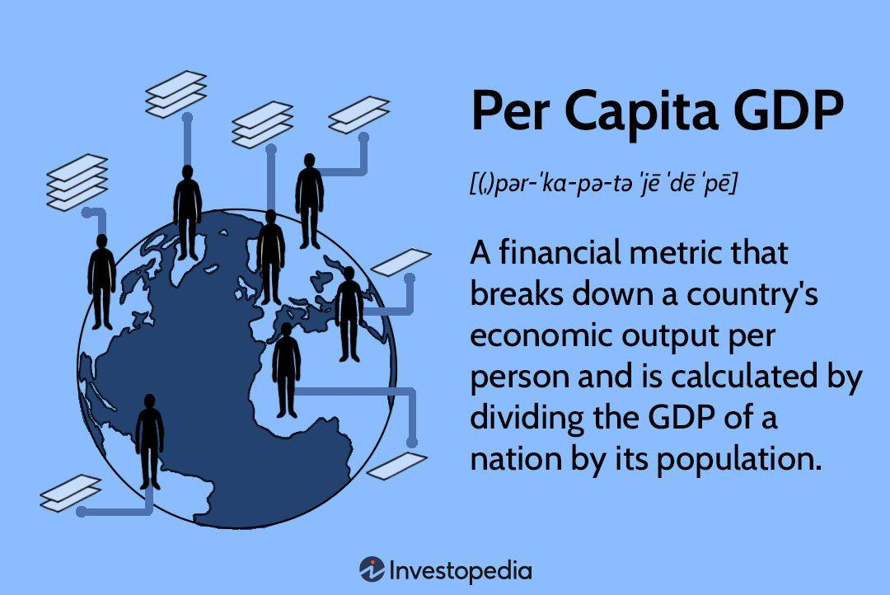

## Table of Contents

## What is GDP and how is it calculated?

GDP, or Gross Domestic Product, is the total value of all goods and services produced within a country's borders in a specific time period, usually a year. It's like adding up everything that people and businesses in a country make and sell. GDP helps us understand how well a country's economy is doing. If the GDP is growing, it usually means the economy is doing well, and if it's shrinking, it might mean the economy is struggling.

To calculate GDP, economists use one of three main methods. The first method is the production approach, where they add up the value of all goods and services produced in the country. The second method is the income approach, where they add up all the income earned by everyone in the country, including wages, profits, and taxes minus subsidies. The third method is the expenditure approach, where they add up all the spending on goods and services by households, businesses, the government, and foreigners. All three methods should give the same total GDP, but they look at it from different angles.

## How does a high GDP relate to economic prosperity?

A high GDP means that a country is making and selling a lot of stuff. When a country has a high GDP, it often means that people and businesses are doing well. They have more money to spend on things they need and want, like food, clothes, and vacations. This can make people happier and healthier because they can afford better things. Also, when businesses are doing well, they might hire more people, which means more jobs and less unemployment.

However, a high GDP doesn't always mean everything is perfect. Sometimes, the wealth from a high GDP is not shared fairly among everyone in the country. Some people might still be poor even if the country's GDP is high. Also, focusing only on GDP can ignore important things like the environment or how happy people are. So, while a high GDP is a good sign for economic prosperity, it's not the only thing that matters for a country's well-being.

## What are the key factors that contribute to a high GDP?

A high GDP comes from many things working well together. One big thing is having lots of people who can work and make things. If more people have jobs, they make more stuff, and that makes the GDP go up. Another important thing is having good technology and machines that help people work better and faster. When businesses use new inventions and smart ways of doing things, they can make more things without needing more people, and that helps the GDP grow.

Another factor is how much people and the government spend. When people feel good about the future, they spend more money on things like cars, houses, and going out to eat. This spending helps businesses grow and make more stuff, which pushes the GDP up. The government can also help by spending money on things like roads, schools, and hospitals. This spending not only creates jobs but also makes it easier for businesses to work and for people to live better lives, which all adds to a higher GDP.

Lastly, trading with other countries can boost GDP. When a country sells more stuff to other countries than it buys, it can make more money and grow its economy. Also, bringing in new ideas and technologies from other places can help businesses at home do better. All these things together help make a country's GDP high and show that its economy is doing well.

## Can a high GDP guarantee economic prosperity for all citizens?

A high GDP doesn't always mean that every person in a country will be rich or happy. Even if a country makes a lot of stuff and has a high GDP, the money might not be shared fairly. Some people might still be poor and struggle to buy things they need, like food and a safe place to live. This can happen if the rich get richer and the poor stay poor, or if the government doesn't help everyone equally.

For example, if a country focuses too much on making things and not enough on helping people, some might not have good schools or hospitals. Also, a high GDP might come from working too hard or hurting the environment, which can make life harder for people in the long run. So, while a high GDP is a good sign that a country's economy is doing well, it doesn't promise that everyone will feel prosperous or happy.

## How do different economic systems impact GDP and prosperity?

Different economic systems, like capitalism, socialism, and mixed economies, can affect a country's GDP and how well-off its people are. In a capitalist system, businesses and people can make their own choices about what to make and sell. This can lead to a lot of new ideas and growth, which can make the GDP go up. But it can also mean that some people get very rich while others stay poor, so not everyone feels the prosperity. In a socialist system, the government has a bigger role in deciding what to make and how to share the wealth. This can mean that more people have what they need, but it might not grow the GDP as fast because there might be less competition and fewer new ideas.

Mixed economies try to use the best parts of both capitalism and socialism. They let businesses and people make some choices, but the government also helps make sure that everyone gets a fair share of the wealth. This can lead to a strong GDP because there's room for new ideas and growth, and also more people feeling prosperous because the government helps them. But finding the right balance can be hard, and different countries might do it in different ways. In the end, the economic system a country uses can shape how big its GDP gets and how well its people live, but it's not the only thing that matters.

## What are the limitations of using GDP as a measure of economic prosperity?

GDP is a good way to see how much stuff a country makes and sells, but it doesn't tell the whole story about how well people are doing. For example, GDP doesn't show if the money is shared fairly among everyone. Some people might be rich while others are poor, even if the GDP is high. Also, GDP doesn't count the work people do at home, like taking care of kids or cooking, which is important but doesn't make money. So, a high GDP might not mean everyone feels prosperous.

Another problem with using GDP to measure prosperity is that it doesn't care about the environment. If a country cuts down a lot of trees or pollutes the air and water to make more stuff, the GDP might go up, but the quality of life for people can go down. GDP also doesn't measure how happy or healthy people are. A country might have a high GDP, but if people are stressed or sick, they won't feel prosperous. So, while GDP is useful, it's not enough to understand the full picture of a country's well-being.

## How do international trade and globalization affect a country's GDP?

International trade and globalization can really help a country's GDP grow. When a country sells more stuff to other countries than it buys, it makes more money. This extra money can be used to make more things at home, which makes the GDP go up. Also, when businesses in a country can sell their stuff all over the world, they can grow bigger and hire more people. This means more jobs and more money for people to spend, which also helps the GDP grow. Plus, when countries trade with each other, they can learn new ways to make things better and faster, which can make their economy even stronger.

But international trade and globalization can also make things harder for some people. If a country buys a lot of cheap stuff from other places, it might hurt businesses at home. Some factories might close, and people might lose their jobs. This can make the GDP go down if people have less money to spend. Also, if a country depends too much on selling stuff to other countries, it can be risky. If something bad happens in the world, like a big fight or a sickness that stops trade, the country's economy can get hurt. So, while international trade and globalization can help a country's GDP grow, they can also bring challenges that need to be managed carefully.

## What role do government policies play in achieving and maintaining high GDP?

Government policies can really help a country's GDP grow and stay high. One way they do this is by making rules that help businesses do well. For example, the government can give tax breaks to companies that make new things or hire more people. This can make businesses want to grow and make more stuff, which makes the GDP go up. The government can also spend money on things like roads, schools, and hospitals. This spending creates jobs and makes it easier for businesses to work and for people to live better lives, which helps the GDP grow.

But government policies can also make it harder for the GDP to stay high if they're not done right. If the government makes too many rules or taxes businesses too much, it can slow them down. This might make businesses not want to grow or hire more people, which can hurt the GDP. Also, if the government spends too much money and doesn't have enough to pay for it, it can make the country's money worth less. This can make prices go up and make it harder for people to buy things, which can also hurt the GDP. So, the government needs to be careful and make smart choices to help the GDP stay high and keep the economy strong.

## How does income inequality affect the relationship between GDP and economic prosperity?

Income inequality can make the link between a country's GDP and how well-off its people are a bit tricky. When a country has a high GDP, it means it's making and selling a lot of stuff. But if the money from that is mostly going to rich people, the rest of the people might not feel the good effects of that high GDP. They might still struggle to buy what they need, like food and a safe place to live. So, even with a high GDP, a lot of people might not feel prosperous if the money isn't shared fairly.

This gap between rich and poor can also slow down the economy. When most of the money goes to rich people, they might not spend it all because they already have a lot. But if the money was shared more evenly, more people would have money to spend on things they need and want. This spending helps businesses grow and make more stuff, which can make the GDP go up even more. So, while a high GDP is good, it's important to make sure the money is spread around so that everyone can feel the prosperity and help the economy keep growing.

## What are some case studies of countries with high GDP and their levels of economic prosperity?

The United States has a very high GDP, which means it makes and sells a lot of stuff. But not everyone in the country feels rich or happy. Some people have a lot of money, but others struggle to pay for things they need, like food and a place to live. This is because the money from the high GDP is not shared equally among everyone. Even though the country's economy is doing well overall, income inequality means that many people don't feel prosperous. The government tries to help by spending money on things like schools and hospitals, but it's still a challenge to make sure everyone benefits from the high GDP.

Norway is another country with a high GDP, but it does a better job at sharing the wealth. The government there makes sure that everyone gets a fair share of the money, so most people can afford what they need and want. They have good schools, hospitals, and a strong safety net for people who need help. This means that even though Norway's GDP is high, it also has a high level of economic prosperity for its people. The country uses its money from oil and other resources wisely to make sure everyone feels the benefits of a strong economy.

## How can sustainable development influence long-term GDP growth and economic prosperity?

Sustainable development can help a country's GDP grow in the long run by making sure that the economy stays strong without hurting the environment. When a country uses its resources wisely and doesn't pollute too much, it can keep making and selling stuff for a long time. For example, if a country uses clean energy like wind or solar power, it can save money on energy and make its businesses more competitive. This can lead to more jobs and more money for people to spend, which helps the GDP grow. Also, by protecting the environment, the country makes sure that future generations can also enjoy a strong economy.

But sustainable development is not just about the environment; it's also about making sure that everyone in the country feels prosperous. When a country focuses on sustainable development, it often tries to share the wealth more fairly. This means making sure that everyone has a good job, a safe place to live, and access to things like schools and hospitals. When more people feel prosperous, they can spend more money, which helps the economy grow. So, sustainable development can help a country have a high GDP and make sure that the prosperity lasts for a long time, benefiting everyone in the country.

## What advanced economic theories explain the dynamics between high GDP and economic prosperity?

One advanced economic theory that helps explain the link between high GDP and economic prosperity is the Human Development Index (HDI). This theory says that a country's success isn't just about how much stuff it makes, but also about how well its people are doing. The HDI looks at things like how long people live, how much education they get, and how much money they have. Even if a country has a high GDP, it might not score well on the HDI if a lot of people are poor or don't have good schools and hospitals. So, this theory helps us see that for a country to be truly prosperous, it needs to make sure everyone benefits from the high GDP, not just the rich.

Another theory is the concept of inclusive growth. This theory focuses on making sure that everyone in a country feels the benefits of economic growth. It says that if a country's GDP is growing, but the money is only going to rich people, the country won't be truly prosperous. Inclusive growth means making sure that everyone has a chance to get a good job, earn a fair wage, and have access to things like healthcare and education. When a country focuses on inclusive growth, it can help make sure that the high GDP leads to real prosperity for all its people, not just a few.

Lastly, the theory of sustainable economic growth looks at how a country can keep its economy strong without hurting the environment. This theory says that if a country uses up all its resources or pollutes too much to get a high GDP, it won't be able to keep growing in the long run. Sustainable economic growth means using resources wisely and making sure that the economy stays strong for future generations. When a country follows this theory, it can help make sure that its high GDP leads to lasting prosperity for everyone.

## What is the Role of GDP in Economic Prosperity?

Gross Domestic Product (GDP) is a pivotal metric in evaluating a nation's economic performance, defined as the total monetary value of all finished goods and services produced within a country during a specified timeframe. GDP is often utilized as an indicator of economic health, with an increasing GDP signifying business expansion, increased consumer spending, and overall economic growth. This growth typically reflects a higher aggregate demand and suggests that businesses are performing well, employment levels are improving, and production activities are on the rise.

The quantification of GDP can be expressed through the following formula:

$$
\text{GDP} = C + I + G + (X - M)
$$

where:
- $C$ represents consumer spending
- $I$ indicates investment by businesses
- $G$ denotes government expenditure
- $X$ stands for exports of goods and services
- $M$ represents imports of goods and services

Despite its widespread use, GDP has limitations as a measure of economic prosperity. One critique is that it does not consider income distribution within a country. Economic growth, as measured by GDP, can occur alongside increasing income inequality, leaving a sizable portion of the population without the benefits of this growth.

Furthermore, GDP excludes environmental consequences. Economic activities contributing to GDP can simultaneously deplete natural resources and degrade environmental quality, issues not reflected in GDP figures. This oversight can be detrimental in long-term economic planning and sustainability efforts.

Moreover, GDP does not capture overall societal well-being or quality of life. Factors such as health, education, and leisure time significantly affect individuals' well-being but remain unaccounted for in GDP calculations. These shortcomings have led to the development of alternative metrics designed to present a more comprehensive view of economic prosperity.

The Genuine Progress Indicator (GPI) is one such metric, seeking to address GDP's limitations by incorporating aspects of economic, environmental, and social well-being. GPI adjusts GDP by considering income distribution, environmental costs, and social factors, offering a more nuanced perspective on whether economic activities genuinely contribute to societal progress.

In conclusion, while GDP serves as a fundamental tool in gauging economic performance, its limitations necessitate supplementary metrics like GPI to provide a more detailed picture of economic prosperity and well-being. By considering alternative indicators, policymakers and economists can better assess and address the multifaceted nature of economic growth and its impacts on society.

## References & Further Reading

Bergstra, J., Bardenet, R., Bengio, Y., & Kégl, B. (2011). "Algorithms for Hyper-Parameter Optimization." This paper discusses methodologies for optimizing hyper-parameters in machine learning models, a fundamental process that can significantly enhance the performance of predictive algorithms, including those used in algorithmic trading. Understanding these optimization algorithms is crucial for developing robust trading systems.

Lopez de Prado, M. (2018). "Advances in Financial Machine Learning." This book provides innovative approaches and techniques in the application of machine learning for finance. It covers topics such as feature importance, [backtesting](/wiki/backtesting), and overfitting, all of which are critical for traders leveraging economic indicators through algorithmic strategies. It serves as a comprehensive guide for applying machine learning to financial data analysis.

Investopedia. "Economic Indicators." Retrieved from [Investopedia](https://www.investopedia.com). This resource offers a detailed explanation of various economic indicators, defining their relevance and impact on the economy and financial markets. It serves as a primer for understanding how these indicators influence trading strategies and economic assessment.

U.S. Bureau of Economic Analysis. "Gross Domestic Product (GDP)." Retrieved from [BEA](https://www.bea.gov). The U.S. Bureau of Economic Analysis provides authoritative data on national, international, regional, and industry-specific economic performance. Their GDP reports are critical for gauging economic health, and this resource is essential for any financial analysis involving national accounting.

Chan, E. (2009). "Quantitative Trading: How to Build Your Own Algorithmic Trading Business." This book demystifies the process of setting up an algorithmic trading operation. It covers key concepts in trading strategies, trading system design, and risk management. It is particularly useful for those looking to incorporate economic data and indicators into automated trading systems, providing practical guidance for building a trading business from the ground up.

