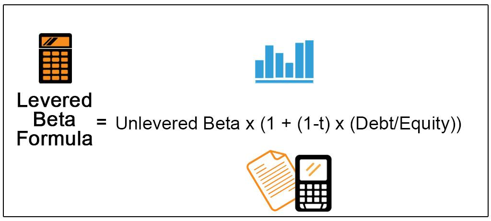

In algorithmic trading, constructing the right portfolio is key to maximizing returns. Two popular approaches to portfolio construction are high-leverage and high-beta portfolios. High-leverage portfolios involve utilizing borrowed capital to increase the potential return on investment. By amplifying both profits and risks, this approach enables traders to exploit market inefficiencies and arbitrage opportunities that may arise over short-term periods. In contrast, high-beta portfolios consist of stocks that exhibit higher volatility relative to the overall market. These portfolios aim to achieve higher potential returns by capitalizing on stocks that are likely to move more dramatically with market trends and momentum.

This article explores the fundamental differences between these two strategies in the context of algorithmic trading. It examines how each strategy can influence returns and risk, addressing essential considerations for traders choosing between them. By understanding the nuances of high-leverage and high-beta portfolios, traders can align their strategies with specific trading objectives, whether they're seeking aggressive growth, risk mitigation, or a balanced approach. This comparative analysis aids in identifying which type of portfolio might best suit different trading contexts and helps traders determine whether to prioritize leveraging opportunities or volatility expansion in pursuit of their financial goals.



## Table of Contents

## Understanding High-Leverage Portfolios

High-leverage portfolios are a cornerstone of many algorithmic trading strategies, particularly for those aiming to maximize returns in volatile markets. By employing borrowed capital, these portfolios have the capacity to substantially increase the potential return on investment. However, the use of leverage inherently elevates the level of risk exposure, necessitating a careful and well-calibrated approach to risk management.

When constructing high-leverage portfolios, traders typically utilize financial instruments such as derivatives, margin accounts, and leveraged funds. These tools allow traders to control a larger position than what their capital would normally permit. For example, using a leverage ratio of 2:1 means that for every dollar of capital, the trader can control two dollars' worth of assets. While this can amplify profits significantly, it can also lead to proportionately greater losses if the market moves unfavorably.

In the context of [algorithmic trading](/wiki/algorithmic-trading), high-leverage portfolios are often employed to capitalize on short-term market opportunities. These opportunities might arise from price inefficiencies, [arbitrage](/wiki/arbitrage) possibilities, or sudden market movements that can be predicted through sophisticated algorithms. Algorithmic traders rely on advanced computational models to identify these opportunities and execute trades at lightning speed, often exploiting minute market fluctuations for profit.

The combination of high leverage and algorithmic trading demands robust risk management strategies to mitigate potential losses. Key risk management techniques include setting stop-loss orders to automatically liquidate positions when they reach a certain negative threshold, thereby capping losses. Diversification is another critical strategy, as holding a variety of assets can reduce the impact of a downturn in any single position. Additionally, correct position sizing ensures that no single investment carries a disproportionate amount of risk relative to the overall portfolio.

Implementing these risk management strategies is crucial in managing the risks associated with high-leverage portfolios. Algorithmic systems can enhance this process by providing precise, real-time assessments of market conditions, leading to dynamic adjustments in strategy. Such systems can automatically adjust leverage ratios, [exit](/wiki/exit-strategy) positions, or redistribute capital in response to changes in market [volatility](/wiki/volatility-trading-strategies) or risk exposure.

In conclusion, high-leverage portfolios offer significant potential for profit but come with an elevated risk profile. Algorithmic traders must implement advanced risk management techniques to harness the benefits of leverage while minimizing the dangers inherent to this approach.

## Exploring High-Beta Portfolios

Beta is a financial metric that quantifies a stock's volatility relative to the overall market. It is an essential tool for assessing the relative sensitivity of an asset's returns to market movements and is defined mathematically as the covariance between the returns of the asset and the returns of the market, divided by the variance of the market returns. The formula for beta ($\beta$) is given by:

$$
\beta = \frac{\text{Cov}(R_i, R_m)}{\text{Var}(R_m)}
$$

where $R_i$ represents the returns of the individual asset, and $R_m$ signifies the returns of the market.

High-beta portfolios comprise stocks with beta values greater than one, indicating that these stocks are expected to experience greater volatility than the overall market. This heightened volatility translates into potential for higher returns during bullish market phases, although it also amplifies the risk during market downturns.

Algorithmic traders frequently incorporate high-beta stocks within their trading strategies to exploit market trends and [momentum](/wiki/momentum). These traders utilize sophisticated algorithms that can process vast amounts of market data to identify opportunities for buying and selling high-beta stocks at optimal times. The algorithms may use historical data patterns, price movements, and trading volumes to forecast future price trajectories and serve to execute trades based on pre-defined criteria at high speeds, often outperforming human capabilities.

The risk-return trade-off associated with high-beta investments is a critical consideration for traders. While the potential for higher returns exists, it is accompanied by increased exposure to market risk. In periods of market volatility, high-beta stocks can exhibit significant price swings, which can impact the portfolio’s overall performance. Consequently, traders must weigh the potential rewards against the attendant risks, often employing risk mitigation strategies to manage the volatility.

Risk management techniques such as diversification, stop-loss orders, and dynamic rebalancing are essential when dealing with high-beta portfolios. Diversification involves spreading investments across various assets to reduce unsystematic risk. Stop-loss orders limit potential losses by automatically selling an asset when its price falls below a specific threshold. Dynamic rebalancing adjusts the portfolio back to its target allocation, often necessary when high-beta stocks cause significant shifts in the portfolio's risk profile.

Ultimately, the success of a high-beta portfolio strategy in algorithmic trading is contingent on the trader's ability to effectively balance the increased potential for outsized returns with the necessity of managing amplified risks. By deploying sophisticated algorithms and disciplined risk management practices, traders can harness the power of high-beta stocks to align with their trading objectives.

## Algorithmic Trading Considerations

Algorithmic trading systems, essential for high-leverage and high-beta strategies, demand meticulous calibration to function effectively. These strategies rely on advanced computational techniques to quickly analyze market data and execute trades, ensuring traders seize fleeting opportunities. Key considerations include [backtesting](/wiki/backtesting), algorithm precision, and emotional detachment.

Backtesting serves as a pivotal element in crafting a robust algorithmic trading strategy. This process involves running the trading algorithm against historical market data to evaluate its performance. Through backtesting, traders can identify potential weaknesses and optimize their strategies before deployment in live markets. For example, when constructing a high-leverage algorithmic strategy, backtesting can help determine the optimal leverage ratio that maximizes returns while managing risk within acceptable limits. 

Algorithm precision and speed play crucial roles in efficient trade execution. Precision ensures that the trading algorithm makes accurate decisions based on the programmed parameters, essential for high-frequency trading where small errors can lead to significant financial losses. Speed is equally critical, as the ability to execute trades milliseconds faster than competitors can provide a considerable edge in competitive markets. To illustrate, algorithmic traders can leverage co-location services, placing their servers in close proximity to major exchanges to reduce latency, thereby facilitating quicker trade executions.

Another significant advantage of algorithmic trading systems is their capacity to eliminate human emotion from the trading process. Human traders might struggle with emotions such as fear and greed, leading to suboptimal decision-making, particularly in volatile markets. Algorithms, however, operate solely based on predefined rules and data, free from emotional interference. This objectivity can enhance trading performance, especially in high-beta strategies where market fluctuations might otherwise provoke emotional responses leading to premature or delayed trades.

By integrating these considerations into their algorithmic trading systems, traders can better navigate the complexities of high-leverage and high-beta strategies, increasing their chances of achieving desired financial outcomes.

## Risk Management in High-Leverage vs High-Beta Portfolios

Risk management is a crucial component in both high-leverage and high-beta portfolios, primarily due to the significant volatility associated with these strategies. Effective risk management techniques can help mitigate potential losses and enhance overall portfolio performance.

One widely used technique is the implementation of stop-loss orders. Stop-loss orders automatically sell a security when it reaches a certain price, limiting the potential loss on an investment. This tool is particularly useful in high-leverage portfolios, where price fluctuations can be abrupt and substantial due to the magnified effect of leverage. For example, an investor who leverages their position by a [factor](/wiki/factor-investing) of ten would face a tenfold increase in losses if the price moves unfavorably. Therefore, setting an appropriate stop-loss order ensures that losses remain within acceptable limits.

Diversification is another essential strategy in managing risk for both high-leverage and high-beta portfolios. By spreading investments across various assets or asset classes, investors can reduce the impact of a poor-performing stock or sector on the overall portfolio. Diversification helps balance the high volatility of high-beta stocks, which tend to have larger price swings compared to the broader market.

Position sizing is also critical. This technique involves determining the appropriate amount of capital to invest in each security, balancing potential returns with the investor's risk tolerance. In high-leverage portfolios, careful position sizing is necessary to avoid margin calls, which occur when the equity in a trading account falls below a broker's required level. Maintaining appropriate position sizes can help prevent forced liquidations due to insufficient collateral.

Algorithmic trading systems play a significant role in enforcing disciplined risk management practices. Algorithms can be programmed to automatically implement stop-loss orders, manage diversification, and adjust position sizes, reducing the reliance on human intervention. These systems can react instantly to market changes, executing pre-defined strategies with precision and speed. Moreover, algorithms can continuously monitor market conditions and adjust trading parameters as needed, helping to maintain risk exposure within set boundaries.

Python, a popular programming language in algorithmic trading, can be used to implement these risk management techniques. For instance, a stop-loss order can be coded as follows:

```python
def set_stop_loss(current_price, stop_loss_percentage):
    stop_loss_price = current_price * (1 - stop_loss_percentage / 100)
    return stop_loss_price

# Example usage
current_stock_price = 100
stop_loss_percentage = 5
stop_loss_price = set_stop_loss(current_stock_price, stop_loss_percentage)
print(f"Stop loss price: {stop_loss_price}")
```

Overall, the integration of algorithmic systems in high-leverage and high-beta portfolio strategies allows for a systematic approach to managing risk, facilitating consistent and disciplined trading practices.

## Case Studies and Real-world Examples

### Case Studies and Real-world Examples

Algorithmic trading, with its capacity for rapid data processing and execution, offers significant opportunities and challenges, particularly when implementing high-leverage and high-beta portfolio strategies. Observing real-world cases can provide valuable insights into what constitutes successful and unsuccessful strategies in these contexts.

#### Successful High-Leverage Portfolio Strategy: Renaissance Technologies

Renaissance Technologies, a quantitative [hedge fund](/wiki/hedge-fund-trading-strategies) known for its Medallion Fund, exemplifies a successful high-leverage trading strategy. Leveraging extensive computational models and algorithms, the Medallion Fund is renowned for its consistent high returns, reportedly achieving annualized returns of 66% before fees during its peak years \[1\]. A key factor in its success is its sophisticated risk management framework, which rigorously controls leverage ratios dynamically in response to market conditions. This approach minimizes downside risks while exploiting market inefficiencies.

Renaissance’s success illustrates the importance of powerful data analytics, sophisticated risk controls, and dynamic leverage adjustments. Their algorithms continuously adapt to new market data, indicating that continuous learning and strategy refinement are essential for high-leverage portfolios.

#### Unsuccessful High-Leverage Portfolio Strategy: Long-Term Capital Management (LTCM)

In contrast, Long-Term Capital Management serves as a cautionary tale. This hedge fund employed high-leverage strategies, utilizing complex mathematical models designed by Nobel Prize-winning economists. LTCM achieved substantial early success; however, its excessive leverage—reaching ratios of up to 30:1—exposed it to massive losses during the 1997 Asian financial crisis and the 1998 Russian financial crisis \[2\]. The firm’s collapse underlined the critical importance of accounting for tail-risk events and maintaining adaptable risk control mechanisms. 

LTCM’s failure highlights the peril of overconfidence in predictive models and underestimating market unpredictability. It underscores the necessity for conservative leverage practices and the prudent anticipation of outlier events.

#### Successful High-Beta Portfolio Strategy: AQR Capital Management

AQR Capital Management effectively implements high-beta strategies, often dealing in stocks with above-average volatility. AQR uses momentum and trend-following algorithms that target high-beta assets during favorable market trends \[3\]. By employing diversified high-beta portfolios, AQR manages to smooth out volatility, simultaneously capturing significant upside potential.

The success of AQR's strategy lies in its emphasis on diversified beta exposure, which balances potential returns against inherent volatility. Their use of robust algorithms to identify momentum further enhances the precision of entry and exit points in high-beta portfolios.

#### Unsuccessful High-Beta Portfolio Strategy: Dot-Com Bubble

The late 1990s dot-com bubble presents a case of high-beta strategy failure. Many investors and funds bet heavily on volatile tech stocks without adequate hedging, driven largely by speculative momentum. When the bubble burst in 2000, portfolios heavily weighted with these high-beta stocks experienced significant depreciation, leading to widespread financial losses \[4\].

This case underscores the dangers of speculative fervor and overreliance on high-beta assets without complementary risk management strategies. It illustrates the need for balanced beta exposure and the importance of maintaining disciplined entry and exit strategies in the face of market exuberance.

### Key Takeaways

Understanding these examples reveals several critical insights:

1. **Risk Management**: Whether in high-leverage or high-beta portfolios, robust risk management is non-negotiable. This includes active leverage control and risk diversification.

2. **Continuous Adaptation**: Success in algorithmic trading demands continuous learning and adaptation. Strategies must evolve based on market conditions and new information.

3. **Moderation in Leverage/Beta Exposure**: Excessive leverage or beta exposure without adequate safeguards can lead to significant losses, emphasizing moderation and strategic diversification.

4. **Use of Technology and Analytics**: The effectiveness of algorithmic trading systems heavily relies on advanced data analytics and model sophistication, underscoring the value of technological investments in trading strategies.

By applying these lessons from past portfolio strategies, traders can enhance the robustness and success of their own algorithmic trading endeavors.

\[1\]: Zuckerman, G. (2019). *The Man Who Solved the Market: How Jim Simons Launched the Quant Revolution.* 

\[2\]: Lowenstein, R. (2001). *When Genius Failed: The Rise and Fall of Long-Term Capital Management.*

\[3\]: Financial Times. (2020). AQR Capital Management portfolio strategies.

\[4\]: Shiller, R. J. (2005). *Irrational Exuberance.*

## Conclusion

High-leverage and high-beta portfolios represent distinct approaches within algorithmic trading, each with unique risk and return profiles. High-leverage portfolios utilize borrowed capital to enhance potential returns. This strategy amplifies profits but also substantially increases risk. Such portfolios can be advantageous for traders who possess a strong market insight and seek to maximize short-term gains. However, they require rigorous risk management to prevent margin calls or significant losses.

Conversely, high-beta portfolios comprise stocks that exhibit greater volatility relative to the overall market. These portfolios are designed to capitalize on broader market movements and momentum, offering potentially high returns. The risk, however, lies in their heightened susceptibility to market swings, making them suitable for traders with a higher risk appetite who aim to profit from volatile market environments.

Choosing the appropriate strategy depends heavily on a trader's goals and risk tolerance. Traders seeking rapid gains and possessing sophisticated risk management capabilities may opt for high-leverage strategies. Meanwhile, those aiming to leverage market movements may prefer high-beta portfolios. Understanding personal risk tolerance and investment goals is crucial in making this decision.

Regardless of the chosen strategy, continuous evaluation and adaptation are vital in algorithmic trading. Market conditions are dynamic, and strategies that perform well in one environment may falter in another. Regular backtesting and performance review allow traders to adjust their algorithms to align with current market conditions. Moreover, advancements in technology and changes in market structure necessitate ongoing adaptation to maintain competitive performance. This iterative process is key to sustaining long-term success in algorithmic trading.

## Frequently Asked Questions (FAQs)

**What is the main advantage of using high-leverage in algorithmic trading?**

High-leverage in algorithmic trading primarily enables traders to enhance their returns on investment without requiring a proportional increase in the capital invested. By using borrowed funds, traders can significantly amplify gains on favorable trades. This strategy allows for maximizing the efficiency of capital utilization and takes advantage of small price movements in the market, which is particularly beneficial in short-term trading scenarios. However, it's important to note that this potential for higher returns comes with increased risk.

**How do high-beta stocks influence an algorithmic trading strategy?**

High-beta stocks, characterized by their volatility in comparison to the overall market, significantly impact algorithmic trading strategies. These stocks typically experience larger price swings, which can offer greater opportunities for profit when market conditions are favorable. Algorithmic strategies that incorporate high-beta stocks often aim to exploit market trends and price momentum. The incorporation of such stocks requires precise modeling and execution logic to traverse the amplified volatility and capitalize on the dynamic price movements effectively.

**What are the potential risks involved with high-leverage and high-beta portfolios?**

The primary risk associated with high-leverage portfolios is the amplification of losses. Just as leverage can magnify gains, it can equally magnify losses, leading to a scenario where losses exceed the initial investment. This can necessitate the need for sophisticated risk management strategies, including the implementation of stop-loss orders and strict position sizing.

High-beta portfolios, on the other hand, inherently possess higher volatility. This volatility leads to considerable fluctuations in the portfolio value, posing a risk to investors during unfavorable market conditions. The higher the beta, the greater the potential for risk, as stocks may underperform dramatically in bearish market conditions. Consequently, both strategies require diligent monitoring and rigorous risk management to safeguard against the market's unpredictable nature.

## References & Further Reading

[1]: Zuckerman, G. (2019). *The Man Who Solved the Market: How Jim Simons Launched the Quant Revolution.* 

[2]: Lowenstein, R. (2001). *When Genius Failed: The Rise and Fall of Long-Term Capital Management.*

[3]: Financial Times. (2020). ["AQR Capital Management portfolio strategies."](https://www.ft.com/content/813b3d76-6ef1-427d-a2e0-76540f58a510)

[4]: Shiller, R. J. (2005). *Irrational Exuberance.*

[5]: Chan, E. P. (2008). ["Quantitative Trading: How to Build Your Own Algorithmic Trading Business."](https://github.com/ftvision/quant_trading_echan_book)

[6]: Lopez de Prado, M. (2018). ["Advances in Financial Machine Learning."](https://www.amazon.com/Advances-Financial-Machine-Learning-Marcos/dp/1119482089)

[7]: Bergstra, J., Bardenet, R., Bengio, Y., & Kégl, B. (2011). ["Algorithms for Hyper-Parameter Optimization."](https://dl.acm.org/doi/10.5555/2986459.2986743) Advances in Neural Information Processing Systems 24.