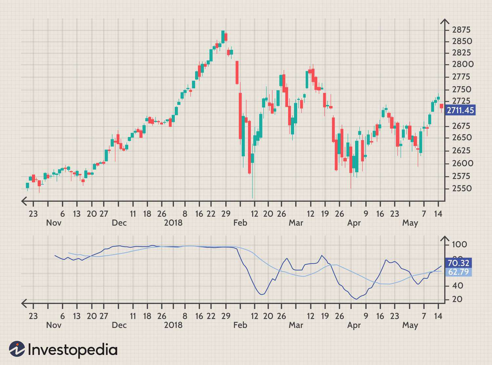

The world of financial markets is vast and complex, with numerous tools and techniques available for traders and investors to analyze market trends and make informed decisions. Financial analysis plays a crucial role in this domain, enabling participants to evaluate the potential of different securities and gauge market conditions. Among various analytical tools, the high-low index stands out as an essential market indicator. This technical indicator provides insights into stock market trends by comparing the number of stocks reaching their 52-week highs against those hitting 52-week lows. Such data can reveal underlying market sentiment and trend strength, aiding traders in confirming whether a market is bullish or bearish.

In today's fast-paced financial environment, algorithmic trading has become increasingly significant. This approach leverages computer algorithms to automate trading decisions based on predefined criteria and market indicators, reducing human intervention and emotional biases in trading activities. The incorporation of the high-low index into algorithmic trading strategies offers a structured, data-driven method for traders and investors to refine their decision-making processes and optimize their trading strategies.



This comprehensive guide will provide insights into the application of technical and financial analysis in the dynamic world of trading. By exploring the high-low index and its integration with algorithmic trading, we aim to enhance understanding of these critical tools and their contribution towards achieving trading success. As financial markets continue to evolve, staying informed and adaptable remains key for market participants to successfully navigate opportunities and challenges.

## Table of Contents

## Understanding Financial Analysis in Trading

Financial analysis is an essential element of investing and trading, providing a structured methodology for evaluating securities and understanding market conditions based on historical data. This process enables traders and investors to make informed decisions by uncovering potential market trends and forecasting future price movements. Analysts employ a variety of approaches in financial analysis, with fundamental, technical, and quantitative methods being the most prominent.

Fundamental analysis focuses on assessing a company's intrinsic value by evaluating financial statements, economic indicators, and industry conditions. Key metrics such as earnings, revenue, and profit margins are analyzed to ascertain a company's financial health and potential for growth. By understanding these factors, investors can identify undervalued or overvalued securities, thereby making informed buy or sell decisions.

Technical analysis, on the other hand, centers on price movements and trading volume, employing chart patterns and technical indicators to predict future market behavior. This approach assumes that all relevant information is already reflected in stock prices, thus emphasizing price trends and patterns rather than intrinsic value. Common tools used in technical analysis include moving averages, relative strength index (RSI), and Bollinger Bands, which help signal potential buy and sell opportunities.

Quantitative analysis integrates mathematical models and statistical techniques to evaluate financial data. This method often involves the use of algorithms and high-level programming to identify trading patterns and optimize investment strategies. For instance, regression analysis can be applied to predict stock price movements based on historical data. The growing availability of financial data and advancements in computing power have propelled the adoption of quantitative approaches, making them increasingly integral to financial analysis.

Successful financial analysis brings together these diverse approaches through various tools and metrics. Chart patterns, such as head and shoulders or double bottoms, aid in visualizing market trends, while technical indicators provide insights into price movements and market [momentum](/wiki/momentum). Financial ratios, like price-to-earnings (P/E) and debt-to-equity ratios, offer vital insights into a company's financial position, enabling investors to compare relative value across industries.

The significance of financial analysis in trading lies in its ability to enhance decision-making and risk management. By systematically evaluating financial data and market trends, traders and investors can gain a competitive edge in the marketplace. As markets evolve, the continued application of robust financial analysis remains a crucial ingredient for achieving long-term trading success.

## What is the High-Low Index?

The high-low index is an essential technical indicator in stock market analysis, designed to compare the number of stocks reaching their 52-week highs with those hitting their 52-week lows. This indicator serves as a measure of market breadth and sentiment, helping traders and investors to confirm market trends and assess prevailing market conditions.

### Calculation of the High-Low Index

To compute the high-low index, one must first determine the daily ratio of stocks achieving new 52-week highs to those hitting new 52-week lows. This ratio can be expressed as:

$$
\text{High-Low Ratio} = \frac{\text{Number of New 52-week Highs}}{\text{Number of New 52-week Lows}}
$$

The high-low index is then calculated as a moving average of these daily ratios over a specified period, typically using a 10-day moving average. This smoothing process aids in filtering out daily market noise, providing a clearer signal of underlying market trends.

### Interpretation of the High-Low Index

The high-low index, by comparing stocks at their respective 52-week highs and lows, provides insight into the market's bullish or bearish sentiment. An index value above 50 suggests that more stocks are hitting new highs compared to new lows, indicating a bullish market trend. Conversely, an index value below 50 signals a predominance of stocks reaching new lows, pointing to bearish market conditions.

### Application in Market Analysis

The high-low index is a pivotal tool for market analysis due to its ability to reflect the collective movement of stocks across a market. By monitoring changes in the index, traders can better identify periods of market strength or weakness, allowing them to adjust their strategies accordingly. For instance, during a bull market, the high-low index will generally remain above 50, with consistent new highs outpacing new lows.

This indicator is often used in conjunction with other technical tools, such as moving averages and the relative strength index (RSI), to enhance trading strategies. These additional indicators can help confirm the trends suggested by the high-low index, offering a more robust basis for decision-making.

By understanding and applying the high-low index, investors and traders can gain valuable insights into market sentiment, enabling them to identify potential buying opportunities in a bullish market or adopt defensive strategies during bearish phases.

## Trading with the High-Low Index

Incorporating the high-low index into trading strategies enhances decision-making by providing traders with distinct buy and sell signals. The high-low index, as a technical indicator, compares the number of stocks reaching their 52-week highs against those hitting 52-week lows, offering insights into market sentiment and trend confirmation. Traders commonly employ this index alongside other technical tools such as moving averages and the Relative Strength Index (RSI) to refine their trading strategies, thereby enhancing accuracy and optimizing results.

A practical application of the high-low index in trading involves observing its movement above or below critical thresholds, typically set at 50. A high-low index reading above 50 suggests a bullish market sentiment, indicating a greater number of stocks are making new highs compared to new lows. Conversely, readings below 50 signal bearish conditions, where more stocks are hitting new lows. By integrating these insights with other indicators, traders can formulate robust strategies. For instance, a high-low index above 50 in conjunction with a moving average crossover can serve as a confirmation for initiating long positions, while a reading below 50 paired with RSI divergence might indicate an optimal point for short selling.

To illustrate an effective strategy using the high-low index with Python, consider the following example where we calculate a simple moving average (SMA) of the high-low index:

```python
import pandas as pd

# Assumed data frame 'df' with columns 'High_52_Week' and 'Low_52_Week'
df['High-Low Index'] = (df['High_52_Week'] - df['Low_52_Week']) / (df['High_52_Week'] + df['Low_52_Week']) * 100
df['High-Low SMA'] = df['High-Low Index'].rolling(window=50).mean()  # Calculate 50-day SMA

# Example trading signal based on High-Low index
buy_signal = df[(df['High-Low Index'] > 50) & (df['High-Low SMA'] > 50)]
sell_signal = df[(df['High-Low Index'] < 50) & (df['High-Low SMA'] < 50)]
```

The use of the high-low index in this manner not only assists traders in identifying clear entry and [exit](/wiki/exit-strategy) points but also helps in managing overall market risk. By signaling shifts in market sentiment, the high-low index acts as a preemptive warning system for potential market reversals, reducing the likelihood of adverse investment outcomes. This tactical integration aids traders in making informed decisions, balancing the quest for returns with risk management considerations.

## Algorithmic Trading and Market Indicators

Algorithmic trading utilizes computer algorithms to execute trading decisions swiftly and efficiently based on predefined criteria and market indicators. This automation reduces the emotional bias that can affect human traders by fostering a rule-based trading environment. Market indicators, such as the high-low index, are integral to these systems, providing essential signals that guide algorithmic decisions.

The high-low index, a technical indicator that tracks the ratio of stocks reaching their 52-week highs against those at their 52-week lows, can be seamlessly integrated into [algorithmic trading](/wiki/algorithmic-trading). By using this indicator, algorithms can gauge market sentiment and trend strength, thereby enhancing decision-making. For example, a consistently high index value might prompt the algorithm to adopt a bullish strategy, whereas a low index could indicate a bearish outlook.

The utilization of market indicators within algorithmic systems extends beyond simple buy or sell signals. Advanced algorithms can incorporate multiple technical analysis tools, such as moving averages or the Relative Strength Index (RSI), alongside the high-low index to create complex trading strategies. An example of such integration in Python might involve using the pandas library to analyze historical price data and compute the high-low index:

```python
import pandas as pd

# Example data
data = {'High': [120, 130, 140], 'Low': [80, 85, 90]}
df = pd.DataFrame(data)

# Calculate the 52-week high and low index
df['High_Low_Index'] = (df['High'] - df['Low']) / df['Low'] * 100

# Define a simple algorithmic strategy
def trading_strategy(index):
    if index > 50:
        return 'Buy'
    elif index < 20:
        return 'Sell'
    else:
        return 'Hold'

df['Signal'] = df['High_Low_Index'].apply(trading_strategy)
print(df)
```

Algorithmic trading systems benefit significantly from these indicators, as they provide the quantitative metrics needed to make informed decisions swiftly. Furthermore, the rules established within these systems can be backtested against historical data, allowing for the optimization and validation of trading strategies before they are applied in live markets.

Incorporating technical analysis tools into algorithmic trading not only increases the system's effectiveness but also its versatility in adapting to different market conditions. By leveraging these tools, traders and investors can develop robust strategies that capitalize on market opportunities while effectively managing risks.

The adoption of algorithmic trading strategies augmented by technical and market indicators like the high-low index represents a critical evolution in trading. These strategies provide a structured approach, thereby enhancing precision and efficiency in today's fast-paced financial markets.

## Key Benefits and Challenges of Algorithmic Trading

Algorithmic trading, also known as automated trading or black-box trading, has revolutionized the financial markets by leveraging computer algorithms to execute trades at high speed and with precision. This approach uses predefined rules and strategies based on market indicators and financial data, responding to market conditions faster than any human trader could.

One of the primary advantages of algorithmic trading is its speed. Algorithms can process and act on market data in milliseconds, making it possible to capitalize on short-lived opportunities that are imperceptible to the human eye. Additionally, algorithmic trading eliminates human error and emotional biases, which can lead to inconsistent decision-making. It achieves this precision by adhering strictly to the programmed trading strategy, ensuring consistent execution.

Another significant benefit is the ability to analyze and process vast amounts of data from multiple markets simultaneously. This capacity allows traders to implement complex strategies, such as [arbitrage](/wiki/arbitrage), market-making, or [statistical arbitrage](/wiki/statistical-arbitrage), which depend on the swift assimilation and synthesis of large datasets. These strategies are not feasible for manual trading due to the data [volume](/wiki/volume-trading-strategy) and speed requirements.

However, the use of algorithmic trading is not without challenges. One major challenge is the complexity involved in developing and maintaining effective trading algorithms. These systems require sophisticated knowledge of both programming and financial markets to design algorithms that can adapt to changing market conditions. Moreover, trading algorithms must be continuously monitored and updated to ensure their effectiveness in ever-evolving market scenarios.

Another challenge is the risk of technical failures, which can have significant financial implications. Algorithms may behave unexpectedly due to coding errors, unexpected market conditions, or connectivity issues. Therefore, robust risk management strategies and contingency plans are essential to mitigate potential losses.

Algorithmic trading also raises concerns related to market [liquidity](/wiki/liquidity-risk-premium) and [volatility](/wiki/volatility-trading-strategies). The rapid execution of a large volume of trades can lead to significant price fluctuations, impacting overall market stability. Regulators and market participants must collaborate to ensure that algorithmic trading contributes positively to market efficiency without exacerbating volatility.

To successfully navigate algorithmic trading, traders need to focus on developing robust algorithms that incorporate thorough testing and validation. This includes [backtesting](/wiki/backtesting) strategies using historical data to assess their performance and potential adaptability to future market conditions. Employing a diversified set of algorithms can also reduce risk, as reliance on a single trading strategy can be hazardous.

In conclusion, algorithmic trading offers unparalleled speed, precision, and data processing capabilities, providing significant advantages in stock market analysis. However, the complexity and inherent risks require careful design, implementation, and monitoring of trading systems. By effectively addressing these challenges, traders can harness the full potential of algorithmic trading to enhance their strategies and achieve success in the financial markets.

## Conclusion

The integration of financial analysis, high-low index indicators, and algorithmic trading provides an indispensable framework for modern trading. By harnessing these tools, traders can significantly enhance their market analysis, leading to improved decision-making and more strategic investments. The high-low index, as a technical indicator, offers critical insights into market sentiment by comparing stocks at their annual highs and lows, enabling the identification of bullish and bearish conditions.

Algorithmic trading further refines this process by automating trade execution based on these insights, thus minimizing emotional biases and maximizing efficiency. This synergy between the high-low index and algorithmic strategies ensures a data-driven approach to trading, where decisions are grounded in rigorous analysis and systematic execution.

However, success in the ever-evolving financial markets requires continuous learning and adaptability. Traders need to stay informed about emerging techniques and market conditions to maintain a competitive edge. This article has underscored the benefits of integrating the high-low index with algorithmic trading strategies, demonstrating how this comprehensive approach can optimize trading outcomes. As traders navigate the complexities of the financial markets, maintaining an informed and flexible mindset remains crucial for sustained success.

## References & Further Reading

[1]: Aronson, D. R. (2006). ["Evidence-Based Technical Analysis: Applying the Scientific Method and Statistical Inference to Trading Signals"](https://www.amazon.com/Evidence-Based-Technical-Analysis-Scientific-Statistical/dp/0470008741). John Wiley & Sons.

[2]: Chan, E. P. (2009). ["Quantitative Trading: How to Build Your Own Algorithmic Trading Business"](https://github.com/ftvision/quant_trading_echan_book). John Wiley & Sons.

[3]: Lopez de Prado, M. (2018). ["Advances in Financial Machine Learning"](https://www.amazon.com/Advances-Financial-Machine-Learning-Marcos/dp/1119482089). Wiley.

[4]: Jansen, S. (2020). ["Machine Learning for Algorithmic Trading"](https://github.com/stefan-jansen/machine-learning-for-trading). Packt Publishing.

[5]: Bergstra, J., Bardenet, R., Bengio, Y., & Kégl, B. (2011). ["Algorithms for Hyper-Parameter Optimization."](https://dl.acm.org/doi/10.5555/2986459.2986743) Advances in Neural Information Processing Systems 24.