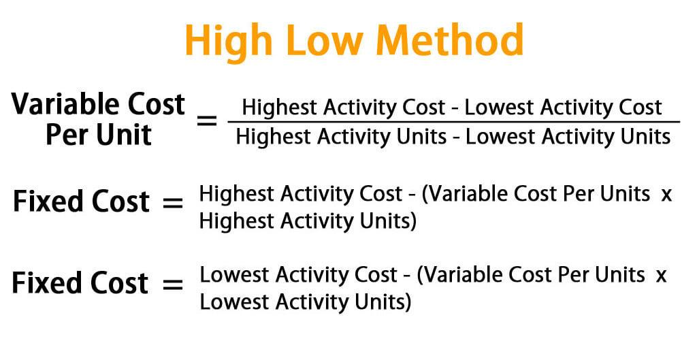

## Table of Contents

## What is the High-Low Method in accounting?

The High-Low Method is a simple way to figure out how costs change with the amount of work done. It's used in accounting to separate costs into two parts: fixed costs and variable costs. Fixed costs stay the same no matter how much work is done, while variable costs change depending on how much work is done. To use the High-Low Method, you look at the highest and lowest levels of activity over a period of time, and the total costs at those levels. By comparing these, you can figure out the variable cost per unit of activity and the total fixed costs.

Here's how it works: First, you find the highest and lowest levels of activity and their corresponding total costs. Then, you calculate the difference in activity levels and the difference in total costs. The variable cost per unit is found by dividing the difference in total costs by the difference in activity levels. Once you know the variable cost per unit, you can find the fixed costs by subtracting the total variable costs at either the high or low level of activity from the total costs at that level. This method is quick and easy but can be less accurate if the highest and lowest points are not typical of normal operations.

## How does the High-Low Method help in cost analysis?

The High-Low Method helps in cost analysis by breaking down total costs into fixed and variable components. This is useful because it lets businesses see how costs change when they do more or less work. By knowing the fixed costs, which stay the same no matter how much work is done, and the variable costs, which change with the amount of work, businesses can predict future costs better. For example, if a company knows its fixed costs are $1,000 per month and the variable cost per unit is $5, it can easily calculate the total cost for any level of activity.

This method is especially handy for making quick decisions. If a manager needs to figure out how costs will change with a new project or a change in production levels, the High-Low Method gives a fast estimate. It's not always the most accurate way, especially if the highest and lowest activity levels used are unusual. But for a simple and quick analysis, it's a good tool. It helps managers understand the cost structure of their business and make informed decisions about pricing, budgeting, and planning.

## What are the steps to apply the High-Low Method?

To apply the High-Low Method, first, you need to find the highest and lowest levels of activity from your data. These could be the highest and lowest numbers of units produced or hours worked over a period of time. Along with these activity levels, you also need the total costs at these points. Once you have these numbers, calculate the difference between the highest and lowest activity levels, and then do the same for the total costs at these levels.

Next, figure out the variable cost per unit by dividing the difference in total costs by the difference in activity levels. This tells you how much the cost changes for each unit of activity. After you know the variable cost per unit, you can find the fixed costs. To do this, take the total costs at either the high or low activity level, and subtract the total variable costs at that level. The total variable costs are found by multiplying the variable cost per unit by the activity level. Once you have the fixed costs, you can use this information to predict costs at any level of activity.

## Can you explain the formula used in the High-Low Method?

The High-Low Method uses a simple formula to figure out how costs change with the amount of work done. First, you find the difference in total costs between the highest and lowest levels of activity. Then, you find the difference in the activity levels themselves. To get the variable cost per unit, you divide the difference in total costs by the difference in activity levels. This tells you how much the cost changes for each unit of work.

Once you know the variable cost per unit, you can find the fixed costs. You do this by taking the total costs at either the high or low activity level and subtracting the total variable costs at that level. The total variable costs are found by multiplying the variable cost per unit by the activity level. So, if you know the variable cost per unit and the fixed costs, you can predict the total costs for any level of activity.

## What are the advantages of using the High-Low Method?

The High-Low Method is easy to use because it only needs the highest and lowest points of activity and their costs. This makes it quick to figure out the fixed and variable costs without needing a lot of data or fancy math. It's good for businesses that want a fast way to see how costs change with the amount of work done. This can help managers make quick decisions about things like pricing, budgeting, and planning.

Even though the High-Low Method is simple, it can be less accurate if the highest and lowest points are not typical of normal operations. But for a quick estimate, it's a useful tool. It helps businesses understand their cost structure better and can be a starting point for more detailed cost analysis if needed.

## What are the limitations or disadvantages of the High-Low Method?

The High-Low Method has some problems that can make it less useful. One big issue is that it only looks at the highest and lowest points of activity. If these points are not normal or typical for the business, the method might give wrong results. For example, if the highest activity level happened during a special event that won't happen again, using it to predict future costs could be misleading. This means the method might not be very accurate if the data used is not a good representation of regular operations.

Another problem is that the High-Low Method does not consider all the data available. It only uses two points, so it ignores other information that could help make better predictions. This can lead to mistakes because it does not take into account how costs might change in a more complex way. For businesses that need very accurate cost predictions, using a method that looks at all the data, like regression analysis, might be better. Even though the High-Low Method is quick and easy, these limitations mean it might not always be the best choice for detailed cost analysis.

## How does the High-Low Method differ from other cost estimation techniques like regression analysis?

The High-Low Method and regression analysis are both used to figure out how costs change with the amount of work done, but they do it in different ways. The High-Low Method is simple and quick. It only looks at the highest and lowest points of activity and their costs to split costs into fixed and variable parts. This makes it easy to use and good for quick decisions, but it can be less accurate if the highest and lowest points are not typical of normal operations. 

On the other hand, regression analysis uses all the data available, not just two points. It looks at every piece of information to find the best line that shows how costs change with activity. This makes regression analysis more accurate because it takes into account all the data, not just the extremes. However, it's more complicated and might need special software or math skills, which can make it harder and slower to use than the High-Low Method.

## Can you provide a simple example of using the High-Low Method to calculate fixed and variable costs?

Let's say a small bakery keeps track of how many cakes they bake each month and how much it costs them. In January, they baked 100 cakes and their total costs were $500. In April, they baked 200 cakes and their total costs were $800. To use the High-Low Method, we first find the difference in the number of cakes baked, which is 200 cakes (April) minus 100 cakes (January), so that's 100 cakes. Then, we find the difference in total costs, which is $800 (April) minus $500 (January), so that's $300.

Next, we figure out the variable cost per cake by dividing the difference in total costs by the difference in the number of cakes baked. That's $300 divided by 100 cakes, which gives us $3 per cake. Now, to find the fixed costs, we can use either January's or April's data. Let's use January: the total costs were $500, and the variable costs for 100 cakes at $3 per cake are $300. So, the fixed costs are $500 minus $300, which equals $200. Now the bakery knows that their fixed costs are $200 a month, and their variable costs are $3 per cake.

## How accurate is the High-Low Method in predicting costs?

The High-Low Method is okay for a quick guess about how costs will change, but it's not the best for exact predictions. It only looks at the highest and lowest points of how much work is done. If these points are not what usually happens in the business, the guesses can be off. For example, if the highest point was during a special event, using it to predict normal times might not work well. So, while it's easy and fast, it might not give the right numbers if the data used is not typical.

For businesses that need very accurate cost predictions, the High-Low Method might not be enough. It doesn't use all the data available, just two points, so it misses out on other information that could help make better guesses. Methods like regression analysis, which look at all the data, can be more accurate. But they are also more complicated and take more time. So, the High-Low Method is good for a quick look at costs, but for detailed and exact predictions, other methods might be better.

## In what scenarios is the High-Low Method most effectively used?

The High-Low Method is most effectively used when a business needs a quick and simple way to understand how costs change with the amount of work done. It's great for small businesses or startups that don't have a lot of time or resources to do detailed cost analysis. For example, if a bakery wants to quickly figure out how much it costs to bake more cakes, the High-Low Method can give them a fast answer using just the highest and lowest points of their production.

This method is also useful when managers need to make quick decisions about pricing, budgeting, or planning. If a manager needs to know how costs will change if they increase production or start a new project, the High-Low Method can provide a fast estimate. It's not perfect, especially if the highest and lowest points are not typical, but it's a good starting point for understanding the cost structure of the business.

## How can the High-Low Method be integrated into budgeting and forecasting processes?

The High-Low Method can help businesses make budgets and forecasts by giving them a simple way to see how costs change with the amount of work they do. When making a budget, a business can use the High-Low Method to figure out the fixed and variable costs. For example, if a bakery knows it has fixed costs of $200 a month and variable costs of $3 per cake, it can use this information to plan how much money it needs for different levels of production. This helps the business set realistic budgets and make sure they have enough money to cover their costs.

For forecasting, the High-Low Method can be used to predict future costs based on expected levels of activity. If the bakery expects to bake 150 cakes next month, it can use the variable cost per cake and the fixed costs to estimate the total costs. This helps the business plan ahead and make decisions about pricing, staffing, and other resources. Even though the High-Low Method is simple and not always the most accurate, it's a useful tool for quick budgeting and forecasting, especially for small businesses or when time is limited.

## What advanced considerations should be taken into account when using the High-Low Method in complex business environments?

When using the High-Low Method in complex business environments, it's important to think about how well the highest and lowest activity levels represent normal operations. In big companies with many different kinds of work, the high and low points might not show what usually happens. For example, if a factory has different machines that work at different speeds, the high point might come from one machine working really hard while the others are not. This can make the cost predictions less accurate. So, it's a good idea to check if the data used for the High-Low Method really matches what the business normally does.

Also, in complex businesses, costs can change in ways that the High-Low Method might not catch. There could be many different things affecting costs, like changes in the price of materials, different kinds of work, or even the time of year. The High-Low Method only looks at two points, so it might miss these details. To make better predictions, businesses might need to use other methods, like regression analysis, which looks at all the data. But if the High-Low Method is used, it's helpful to combine it with other information to get a fuller picture of how costs work in the business.

## What is the High-Low Method and how can it be understood?

The High-Low Method is a straightforward and practical approach used in cost accounting to differentiate between variable and fixed costs from mixed costs. This method is particularly useful in situations where there is limited data available, offering a preliminary estimation based on historical activity levels. It functions by taking the highest and lowest activity levels from a dataset and evaluating the associated costs to derive variable cost per unit and total fixed costs.

### Procedure

**Step 1: Identify Activity Levels**

The first step involves selecting the periods with the highest and lowest activity levels. These activity levels can correspond to units produced, hours worked, or any relevant measure of activity for the business.

**Step 2: Determine Associated Costs**

Once the highest and lowest activity levels are identified, the next step is to observe the total costs associated with these activity levels. These costs are a combination of both variable and fixed components.

**Step 3: Calculate Variable Cost per Unit**

To estimate the variable cost per unit, the following formula is applied:

$$
\text{Variable Cost per Unit} = \frac{\text{High Cost} - \text{Low Cost}}{\text{High Activity Level} - \text{Low Activity Level}}
$$

This calculation simplifies the estimation by assuming that the change in total costs between the highest and lowest activity levels is solely due to variable costs.

**Step 4: Estimate Total Fixed Costs**

The total fixed costs can be computed by subtracting the total variable cost (calculated using the variable cost per unit and either the high or low activity level) from the total cost at either the high or low activity point:

$$
\text{Fixed Cost} = \text{Total Cost at High Activity} - (\text{Variable Cost per Unit} \times \text{High Activity Level})
$$

or

$$
\text{Fixed Cost} = \text{Total Cost at Low Activity} - (\text{Variable Cost per Unit} \times \text{Low Activity Level})
$$

### Advantages

The primary appeal of the High-Low Method lies in its simplicity. It provides a rapid assessment of cost structures, which is particularly beneficial when quick decisions are necessary, or detailed data is unavailable. This method offers a basic understanding of cost behavior, enabling businesses to make initial cost estimates without extensive computational resources.

### Limitations

Despite its utility, the High-Low Method is not without limitations. It relies heavily on only two activity levels, which may not accurately capture the entire cost structure, particularly if there are significant anomalies or trends in the data. Consequently, while it can provide a starting point for cost estimation, further analysis is often required for more precise results, using more comprehensive methods such as regression analysis when data and resources allow.

In summary, the High-Low Method offers a quick and accessible approach to cost estimation, particularly useful in preliminary analyses where data is sparse or time is of the essence.

## How is the High-Low Method Applied in Algo Trading?

Algorithmic trading, commonly defined as the use of computer algorithms to automate trading decisions, necessitates precise cost estimation to optimize execution strategies. One of the challenges in algo trading is the accurate prediction and management of transaction costs, which are often composed of fixed and variable components. Here, the High-Low Method can serve as a valuable tool by providing a streamlined approach to disaggregating these costs based on different trading volumes. 

In the context of algo trading, the High-Low Method identifies the highest and lowest trading volumes within a given period and uses them to estimate variable transaction costs. Mathematically, the variable cost per unit is calculated as:

$$

\text{Variable Cost per Unit} = \frac{\text{Cost at High Activity Level} - \text{Cost at Low Activity Level}}{\text{High Activity Level} - \text{Low Activity Level}} 
$$

With this, total fixed costs are derived by subtracting the total variable costs at either the highest or lowest activity level from the total costs incurred at that level.

By applying these calculations, algorithmic systems can dynamically segregate fixed costs — such as technology infrastructure or exchange fees — from variable transaction costs that vary with [volume](/wiki/volume-trading-strategy), such as brokerage fees or taxes. Once these elements are distinctly identified, algorithms can adjust trading parameters to minimize overall costs. For example, adjusting trade sizes or timing could reduce the impact of variable costs, while fixed costs may be amortized more effectively over larger trade volumes.

The High-Low Method also aids in scenario analysis within [algorithmic trading](/wiki/algorithmic-trading) frameworks. By quickly providing an estimate, it allows traders and systems to simulate different trading volumes and assess the potential cost impact. This predictive capability enhances overall trading performance by informing better decision-making processes regarding optimal trade sizes and frequencies, balancing the trade-off between cost and speed.

Through iterative application and calibration based on historical trading data, the High-Low Method becomes an integral part of advanced algorithmic trading strategies, ensuring that cost efficiencies are maximized. Despite its simplicity, it allows traders to maintain a competitive edge in high-paced financial markets by ensuring cost-effective operations. However, it is essential for trading algorithms to incorporate further statistical analysis and adapt to changing market conditions to maintain accuracy, given the inherent limitations of the High-Low Method in capturing complex cost structures.

## What are the differences between the High-Low Method and Regression Analysis?

Regression analysis and the High-Low Method are two distinct approaches used for cost estimation, each with its own advantages and limitations. 

Regression analysis is a statistical method that utilizes multiple data points to provide a comprehensive view of cost behavior. By considering various factors, it identifies relationships between variables, allowing for more accurate predictions and understanding of the cost structures. A key strength of regression analysis is its ability to account for outliers, which are data points that deviate significantly from the rest of the dataset. These outliers can skew results if not accounted for properly. By incorporating these anomalies, regression analysis enhances the robustness and reliability of cost estimations over a broad range of activities.

The mathematical foundation of regression analysis involves fitting a line (or curve, in the case of nonlinear regression) to the data points such that the sum of the squared differences (residuals) between the observed and predicted values is minimized. This can be expressed mathematically as minimizing the objective function:

$$
\min \sum_{i=1}^{n}(y_i - (mx_i + c))^2
$$

where $y_i$ represents observed costs, $x_i$ represents the variables influencing these costs, $m$ is the slope of the line, $c$ is the intercept, and $n$ is the number of observations.

Here is an example of how simple linear regression can be implemented in Python using the `scikit-learn` library:

```python
from sklearn.linear_model import LinearRegression
import numpy as np

# Sample data
x = np.array([[1], [2], [3], [4], [5]])  # Independent variable
y = np.array([5, 7, 9, 11, 13])  # Dependent variable (costs)

# Create and fit the model
model = LinearRegression()
model.fit(x, y)

# Coefficients
slope = model.coef_
intercept = model.intercept_

print("Slope:", slope)
print("Intercept:", intercept)
```

Despite the accuracy and sophistication of regression analysis, it is more data-intensive and complex compared to the High-Low Method. Extensive amounts of reliable data are required to produce meaningful results. The complexity of regression analysis arises from the need to manage and preprocess larger datasets, handle multicollinearity (multiple variables highly correlated), and interpret the statistical outputs effectively.

In contrast, the High-Low Method is straightforward, relying on only the highest and lowest activity levels to separate fixed and variable costs. This simplicity makes it appealing for scenarios where quick estimates are needed, and extensive data is unavailable. However, because it uses only two data points, it may not accurately reflect the average cost behavior, particularly if the chosen high and low points are not typical representations of the dataset.

The decision of whether to employ the High-Low Method or regression analysis generally depends on data availability and the specific needs of the analysis. If a detailed and accurate model is required and sufficient data is at hand, regression analysis is typically favored. However, for quicker assessments or when working with limited data, the High-Low Method may be more appropriate.

## What is the practical application in a trading environment according to the case study?

A trading firm, TechTrade Corp, confronts a complex cost structure comprising mixed costs from its technological infrastructure and transaction fees. The High-Low Method presents an efficient approach to simplifying these mixed costs into variable and fixed components. This method allows TechTrade Corp to identify the cost drivers associated with different levels of trading activity.

To apply the High-Low Method, TechTrade Corp analyzes its activity levels over a select period. Suppose the firm identifies that at the highest trading volume (1,000 trades), the total cost incurred is $50,000, whereas at the lowest volume (200 trades), the total cost is $18,000. The difference in trade volume (800 trades) corresponds to a total cost increase of $32,000. 

Using the High-Low formula, the variable cost per trade can be calculated as follows:

$$
\text{Variable Cost per Trade} = \frac{\text{Cost at High Activity} - \text{Cost at Low Activity}}{\text{High Activity Level} - \text{Low Activity Level}}
$$

$$
\text{Variable Cost per Trade} = \frac{50,000 - 18,000}{1,000 - 200} = \frac{32,000}{800} = 40
$$

Thus, the variable cost per trade is $40.

To determine the total fixed costs, the firm substitutes the variable cost into the cost equation of high or low activity levels. Using the highest activity level:

$$
\text{Total Cost} = \text{Fixed Cost} + (\text{Variable Cost per Trade} \times \text{Number of Trades})
$$

$$
50,000 = \text{Fixed Cost} + (40 \times 1,000)
$$

$$
\text{Fixed Cost} = 50,000 - 40,000 = 10,000
$$

Therefore, the total fixed cost is $10,000.

With these cost estimates, TechTrade Corp can model various trading scenarios. By understanding how transaction costs fluctuate with trading volume, the firm can explore optimization of its algorithm parameters to reduce costs. For instance, if the firm's algorithm detects a scenario where increasing trades leads to diminishing returns relative to transaction costs, adjustments can be made to avoid unnecessary expenses.

This calculation illustrates the utility of the High-Low Method in refining financial strategies, enabling firms like TechTrade Corp to enhance cost management within their trading operations. By integrating these accounting insights, the firm ensures operational efficiency while preventing resource wastage.

## References & Further Reading

[1]: Noreen, E. W. (1988). [The High-Low Method and Analysis of Scattered Data as Two Ways to Approximate a Line](https://www.studocu.com/ph/document/university-of-san-carlos/taxation/mas-02-cost-behavior-with-regression-analysis/58787928). Journal of Marketing Research, 25(4), 456-461.

[2]: ["Quantitative Trading: How to Build Your Own Algorithmic Trading Business"](https://www.amazon.com/Quantitative-Trading-Build-Algorithmic-Business/dp/1119800064) by Ernest P. Chan

[3]: Horngren, C. T., Datar, S. M., & Rajan, M. V. (2012). "Cost Accounting: A Managerial Emphasis." Pearson. 

[4]: ["Advances in Financial Machine Learning"](https://www.amazon.com/Advances-Financial-Machine-Learning-Marcos/dp/1119482089) by Marcos Lopez de Prado

[5]: ["Machine Learning for Algorithmic Trading"](https://github.com/stefan-jansen/machine-learning-for-trading) by Stefan Jansen