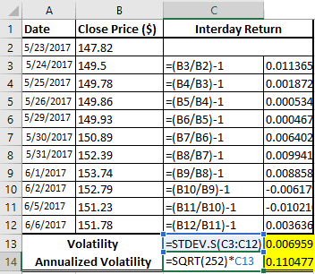

Volatility estimation is essential in algorithmic trading because it provides traders with insights into the fluctuations in asset prices. This understanding is critical in developing strategies that are responsive to market changes. The selection of an appropriate volatility estimator can significantly influence trading performance, often determining the line between profitable trades and losses. Algorithmic traders depend on accurate volatility assessments to refine their models, set trading thresholds, and manage risks effectively.

High-low volatility estimators are a subset of methodologies that leverage the price range within a trading period to estimate volatility with enhanced precision compared to traditional methods. These estimators are valuable because they encompass more data points by considering the extremes of price movements within a given timeframe. As a result, they offer a more detailed view of market dynamics when contrasted with methods relying solely on closing prices.



This article investigates into the significance of high-low volatility estimators in algorithmic trading, examining the key methodologies employed. Through an exploration of these estimators, traders can gain a better understanding of how to effectively integrate them into their trading systems, ultimately improving their strategy calibration and execution.

## Table of Contents

## Understanding Volatility in Trading

Volatility in trading refers to the degree of variation in the prices of financial instruments over a given time period. It is a crucial metric used to assess the risk and potential for price movement, essentially measuring how much and how quickly prices may change. A common method for quantifying [volatility](/wiki/volatility-trading-strategies) is through the standard deviation of asset returns, which provides an estimate of the variance from the average price.

Traders leverage volatility to evaluate risk levels in their portfolios and to inform their trading decisions. High volatility typically indicates a higher risk due to possible significant price swings, whereas low volatility suggests more stable and predictable price movements. By analyzing volatility, traders can refine their strategies to optimize the performance of their portfolios. This includes setting appropriate stop-loss orders and determining the ideal times to enter or [exit](/wiki/exit-strategy) positions.

A fundamental understanding of volatility also necessitates distinguishing between historic volatility and implied volatility. Historic volatility, sometimes referred to as realized volatility, is derived from past market prices and is calculated using historical price data. This form of volatility provides insight into the magnitude of past price variations and can be a valuable tool when forecasting future volatility patterns.

Implied volatility, on the other hand, is derived from the prices of options in the market and reflects the market's expectations of future volatility. It is essentially the market's forecast of a likely movement in a security's price and is a key component in options pricing models such as the Black-Scholes model. Unlike historic volatility, which is based on factual data from past price movements, implied volatility is more forward-looking and suggests how volatile the market is expected to be in the future.

Mathematically, the historic volatility (σ) of a stock can be calculated using the formula for standard deviation:

$$
\sigma = \sqrt{\frac{1}{N-1} \sum_{i=1}^{N} (R_i - R_{\text{avg}})^2}
$$

where $R_i$ is the return for period i, $R_{\text{avg}}$ is the average return over the N periods, and N is the number of periods.

Understanding these two types of volatility and their implications is crucial for traders to construct robust trading strategies that address both current market conditions and future uncertainties.

## Types of Volatility Estimators

Volatility estimators are essential tools used in financial markets to measure the degree of variation in asset prices. They can be broadly classified based on the data they utilize, offering traders various approaches to assess market volatility with enhanced precision. Traditional volatility estimation methods, such as the close-to-close approach, rely solely on daily closing prices. However, these methods may not fully capture the intra-day price movements.

High-low volatility estimators are one category that capitalizes on the range between the highest and lowest prices within a trading day. This approach can more accurately reflect the true volatility of an asset by incorporating additional price data points. For instance, the Parkinson Estimator is a widely recognized high-low volatility estimator that uses the range of high and low prices to compute volatility with greater efficiency than methods relying only on closing prices.

Another category is open-close volatility estimators. These methods consider both opening and closing prices to account for market activities at the start and end of trading sessions. By incorporating these data points, estimators provide a more comprehensive view of daily price variations.

Additionally, there are estimators that leverage multiple data points within each trading day, such as the Garman-Klass Estimator. This method integrates high, low, opening, and closing prices, offering a detailed volatility estimate that captures market dynamics more accurately.

The primary goal of these diverse estimators is to enhance the accuracy of volatility measures over those based merely on close-to-close prices. By doing so, they provide traders with improved insights into market behavior, aiding in more informed decision-making processes for trading strategies.

## High-Low Volatility Estimators

High-low volatility estimators are instrumental in providing a more precise evaluation of market volatility by examining the price range within a specific trading period. Unlike traditional volatility measures that rely solely on closing prices, high-low estimators incorporate the entire price range—specifically the highest and lowest prices observed during a trading session. This approach helps capture the full spectrum of market fluctuations, resulting in a more comprehensive volatility assessment.

Among the most prominent high-low volatility estimators are the Parkinson Estimator, the Garman-Klass Estimator, and the Corwin-Shultz Estimator. These methodologies leverage the enriched data set available in high and low prices, leading to enhanced efficiency and accuracy over standard close-to-close methods. By using more elements from the available price data, high-low estimators can reduce the error margins associated with volatility calculations and better reflect intra-day price dynamics.

The Parkinson Estimator, for instance, was introduced by Michael H. Parkinson in 1980 and derives its volatility measure from the logarithm of the ratio between the highest and lowest prices, expressed mathematically as:

$$
\sigma_{P}^2 = \frac{1}{4n \ln(2)} \sum_{i=1}^{n} [\ln(\frac{H_i}{L_i})]^2
$$

where $\sigma_{P}^2$ is the estimated volatility, $H_i$ and $L_i$ are the highest and lowest prices for the $i$-th period, and $n$ is the number of periods.

The Parkinson Estimator is particularly advantageous in capturing the extent of daily price movements, which close-to-close estimators may overlook, thereby providing an improved gauge of market risk.

The Garman-Klass Estimator builds upon this foundation by integrating both opening and closing prices, further refining the volatility estimate. This is especially useful for accounting for the market activity spikes typically seen at the start and end of trading sessions. The Garman-Klass formula extends the information used without overly complicating the estimation process.

Another significant high-low estimator is the Corwin-Shultz Estimator, which derives its name from Thomas A. Corwin and Paul Schultz. This methodology considers the bid-ask spread—a crucial element in markets with substantial high-frequency trading—and uses high and low prices to measure the effective range of trading. This estimator is designed to handle markets characterized by frequent and rapid price changes, thus making it particularly relevant for modern [algorithmic trading](/wiki/algorithmic-trading) strategies.

By utilizing these estimators, traders and analysts gain nuanced insights into market behavior, enabling them to tailor their strategies effectively. High-low volatility estimators thus represent a critical component in the toolkit of quantitative analysts and algorithmic traders, seeking to enhance their decision-making processes.

## Parkinson Estimator

The Parkinson Estimator, introduced by Michael H. Parkinson in 1980, is a widely used method for estimating historical volatility. Recognized for its efficiency, it leverages the daily range of an asset's price—specifically, the difference between the highest and lowest prices within a given trading period. This approach significantly contrasts with traditional close-to-close volatility estimators, which solely consider the closing prices and thus may overlook intra-day price movements.

The central idea behind the Parkinson Estimator is that the range of prices, captured by the high and low, contains more information about the volatility of a security than merely its closing price. This attribute makes the Parkinson Estimator particularly useful for assets that exhibit significant price swings throughout the day.

The mathematical formula for the Parkinson Estimator is given by:

$$
\sigma_P = \frac{1}{\sqrt{4 \ln(2)}} \times \frac{1}{n} \sum_{i=1}^{n} \left( \ln\left(\frac{H_i}{L_i}\right) \right)^2
$$

where:
- $\sigma_P$ is the estimated volatility,
- $H_i$ and $L_i$ are the high and low prices for day $i$,
- $n$ is the number of trading days included in the calculation,
- $\ln$ denotes the natural logarithm.

This formula's strength lies in its efficiency. Since it utilizes intra-day data, it often results in a more accurate and stable estimate of volatility, especially in markets with high intra-day price variation. Moreover, it mitigates the issues arising from the so-called 'close-to-close' volatility estimators, which can have wider error margins if significant price changes occur during market hours rather than at market close.

The Parkinson Estimator assumes that price movements follow a Brownian motion without any drift, and that there are no jumps in price. Therefore, while useful, it may have limitations in markets where these assumptions do not hold true. Consequently, traders and analysts often combine it with other volatility measures to gain a comprehensive understanding of market behavior and risk.

## Garman-Klass Estimator

The Garman-Klass Estimator is recognized for enhancing the accuracy of volatility measurements by utilizing not only the high and low prices, as seen in the Parkinson Estimator, but also incorporating the opening and closing prices of a trading period. This comprehensive approach allows traders to capture the full extent of market dynamics, especially during periods of heightened activity, such as when the market opens or closes. These periods often exhibit significant price movement that traditional close-to-close estimators might overlook.

The formula for the Garman-Klass Estimator is expressed as:

$$
GK = \frac{1}{N} \sum_{t=1}^{N} \left[ \frac{1}{2} (H_t - L_t)^2 - (2 \log 2 - 1) (C_t - O_t)^2 \right]
$$

where:
- $H_t$ and $L_t$ represent the high and low prices,
- $C_t$ and $O_t$ denote the close and open prices,
- $N$ is the number of periods.

By integrating the opening and closing prices, the Garman-Klass Estimator successfully mitigates the bias introduced by extreme opening and closing price fluctuations, which are commonplace in volatile markets. This makes it particularly valuable for assessing daily volatility in markets characterized by high-frequency trading and frequent price jumps. Notably, it assumes zero drift and a continuous stochastic process, making it less suited for markets where these assumptions do not hold true. However, when applicable, the Garman-Klass method provides a more nuanced understanding of market volatility, crucial for formulating responsive algorithmic trading strategies that rely on precise volatility calculations.

## Corwin-Shultz Estimator

The Corwin-Shultz Estimator is a sophisticated tool that leverages bid-ask spreads and high-low price data to provide a nuanced estimate of market volatility. Its primary strength lies in its ability to account for the fine granularity of information in high-frequency trading environments where price movements are rapid and frequent.

To understand the methodology, consider that traditional volatility estimation methods primarily use closing prices, often missing out on intraday price dynamics. The Corwin-Shultz Estimator, however, integrates the high and low prices over specified periods to calculate the bid-ask spread component of volatility. This is particularly beneficial because the bid-ask spread is a direct measure of market [liquidity](/wiki/liquidity-risk-premium) and trading costs, both critical factors in high-frequency trading scenarios.

The estimator utilizes a formula that involves the high and low prices over two successive trading days. Let's denote the daily high and low prices as $H_t$ and $L_t$ for day $t$. The bid-ask spread component of the estimator, denoted as $S_t$, is derived from these prices. The Corwin-Shultz model calculates volatility using:

$$
S_t = \ln\left(\frac{H_t}{L_t}\right) + \ln\left(\frac{H_{t-1}}{L_{t-1}}\right)
$$

This model is refined with adjustments to handle overnight price changes and market microstructure noise, making it highly effective for modern trading applications. By adjusting for the bid-ask spread, traders obtain a more accurate reflection of true price variation, enhancing their ability to manage risk and optimize strategies amidst the rapid price dynamics inherent in algorithmic trading markets. Overall, the Corwin-Shultz Estimator forms a cornerstone in the toolkit of quantitative analysts, facilitating improved precision in capturing and utilizing volatility information.

## Applications in Algorithmic Trading

In algorithmic trading, accurate volatility estimation serves as a cornerstone for effective strategy development and execution. Volatility estimators enable traders to fine-tune their algorithms by providing crucial insights into market fluctuations. By accurately gauging volatility, traders can set precise thresholds for initiating buy or sell orders, thus optimizing decision-making processes.

Accurate volatility measurement helps in risk management by quantifying the expected range of asset price movements. By understanding these dynamics, traders can better assess potential risks and adjust their strategies accordingly. This ensures that traders are not caught off-guard by unexpected market shifts, thereby preserving capital and enhancing the robustness of their trading systems.

Position sizing, another critical component, is directly influenced by volatility estimates. Traders can modulate the size of their positions based on calculated risks, ensuring that the capital allocation aligns with their risk tolerance and market conditions. For instance, in highly volatile markets, smaller positions might be taken to mitigate risk, while in stable markets, larger positions might be justified.

Market entry and exit timing is significantly refined through precise volatility measures. Estimators provide a clearer picture of when a market is likely to experience significant price changes, guiding traders on optimal entry and exit points. This not only enhances profitability by capturing favorable price movements but also minimizes potential losses from poorly timed trades.

Python code can be utilized for implementing volatility estimators within trading algorithms. For example, using libraries such as NumPy and pandas, traders can seamlessly integrate high-low volatility estimators into their systems to continuously update their trading strategies based on the latest market data. Here is a basic Python snippet to illustrate how one might begin coding a simple moving average of a high-low range:

```python
import pandas as pd

# Sample DataFrame with high and low prices
data = pd.DataFrame({
    'High': [10, 12, 13, 15, 14],
    'Low': [8, 9, 11, 13, 12]
})

# Calculate the range and moving average
data['Range'] = data['High'] - data['Low']
data['Volatility_MA'] = data['Range'].rolling(window=3).mean()

print(data)
```

In essence, high-low volatility estimators not only optimize algorithmic trading strategies but also enhance the overall trading framework by improving accuracy in risk assessment, position management, and trade execution timing. This empowers traders to navigate financial markets more effectively, leveraging volatility insights for superior trading outcomes.

## Conclusion

High-low volatility estimators provide essential tools for quantitative traders by enhancing the understanding of market behavior and improving the precision of trading strategies. These estimators, such as the Parkinson, Garman-Klass, and Corwin-Shultz, utilize intra-period price ranges to offer a more comprehensive assessment of volatility compared to traditional close-to-close estimators. By capturing the full extent of price fluctuations within a trading period, high-low estimators enable traders to make more informed decisions about risk management, position sizing, and the timing of market entry and exit.

The choice of estimator is critical, as each possesses unique characteristics and sensitivity to market conditions. For instance, the Parkinson Estimator, which relies solely on high and low prices, can minimize error margins associated with daily price fluctuations. In contrast, the Garman-Klass Estimator takes advantage of opening and closing prices, capturing volatility spikes at these critical moments. The Corwin-Shultz Estimator, on the other hand, incorporates bid-ask spreads, making it particularly suitable for environments with high-frequency trading.

Implementing the right volatility estimator into trading models can significantly affect trading outcomes. For example, a trader using these estimators to define thresholds for algorithmic buy and sell signals can achieve optimal trade execution by accurately assessing market conditions. Moreover, these refined volatility measures facilitate better calibration of trading algorithms, resulting in enhanced performance and reduced risk exposure. Thus, high-low volatility estimators not only empower traders with deeper insights but also bolster the robustness and adaptability of algorithmic trading strategies.

## References

- Sinclair, Euan. *Volatility Trading*. This reference explores the strategies and methods associated with trading volatility, focusing on practical approaches and market dynamics.

- Lopez de Prado, Marcos. *Advances in Financial Machine Learning*. This work provides insights into machine learning techniques applicable to finance, emphasizing advanced analytics and quantitative strategies.

- Parkinson, Michael H. "The Extreme Value Method for Estimating the Variance of the Rate of Return". This paper introduces the Parkinson Estimator, a method utilizing high and low prices to calculate volatility, enhancing accuracy over traditional estimation techniques.

- Garman, M. B., and Klass, M. J. "On the Estimation of Security Price Volatilities from Historical Data". This publication presents the Garman-Klass Estimator, expanding on volatility estimation by incorporating opening and closing prices, thus addressing intra-day market variations.

## References & Further Reading

[1]: [Sinclair, Euan. *Volatility Trading*](https://www.amazon.com/Volatility-Trading-Website-Euan-Sinclair/dp/1118347137)

[2]: [Lopez de Prado, Marcos. *Advances in Financial Machine Learning*](https://www.amazon.com/Advances-Financial-Machine-Learning-Marcos/dp/1119482089)

[3]: Parkinson, Michael H. "The Extreme Value Method for Estimating the Variance of the Rate of Return." *Journal of Business*, 1980.

[4]: Garman, M. B., and Klass, M. J. "On the Estimation of Security Price Volatilities from Historical Data." *Journal of Business*, 1980.