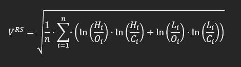

## Table of Contents

## What is volatility in the context of financial markets?

Volatility in financial markets refers to how much and how quickly the price of a financial asset, like a stock or a currency, changes over time. If a stock's price moves up and down a lot in a short period, we say it has high volatility. On the other hand, if the price stays pretty stable without big swings, it has low volatility. Think of it like the weather: a volatile market is like a stormy day with lots of changes, while a stable market is like a calm, sunny day.

Volatility is important because it affects how risky an investment is. When prices are volatile, it can be riskier to invest because the value of your investment might drop suddenly. But, it can also mean more chances to make money if you buy and sell at the right times. Investors and traders use different tools and measures, like the VIX index, to understand and predict volatility, helping them make better decisions about when to buy or sell assets.

## What is a high-low volatility estimator and why is it used?

A high-low volatility estimator is a way to measure how much a stock's price moves up and down over a certain time. It looks at the highest and lowest prices of a stock during a day or another period, and uses these to figure out how volatile the stock is. Instead of just using the closing prices, which is what some other methods do, the high-low estimator gives a fuller picture because it considers the whole range of price movement in that time.

People use the high-low volatility estimator because it can give a more accurate idea of how risky a stock might be. Since it takes into account the biggest swings in price, it can show if a stock is more volatile than it seems when you only look at the closing prices. This helps investors and traders make better decisions about buying or selling stocks, especially when they want to understand and manage the risks involved in their investments.

## How does the high-low volatility estimator differ from other volatility measures?

The high-low volatility estimator is different from other volatility measures because it uses the highest and lowest prices of a stock during a certain time, not just the closing prices. Other common measures, like the standard deviation of returns or the close-to-close volatility, only look at the closing prices of a stock from one day to the next. By considering the whole range of price movement in a day, the high-low estimator can show more about how much a stock's price can swing around, which might not be clear if you only look at the closing prices.

This difference makes the high-low volatility estimator useful for getting a better picture of a stock's riskiness. When a stock's price jumps up and down a lot during the day but ends up closing near where it started, the high-low estimator will show higher volatility than measures that only look at closing prices. This can help investors see if a stock is more volatile than it seems at first glance, which is important for making smart choices about buying or selling stocks and managing the risks in their investments.

## What are the basic steps to calculate the high-low volatility estimator?

To calculate the high-low volatility estimator, you start by looking at the highest and lowest prices of a stock during a day or another period. You take the difference between the highest and lowest prices, which gives you the range of price movement for that day. Then, you square this range to make sure all values are positive and to give more weight to bigger price swings.

Next, you need to find the average of these squared ranges over a number of days, usually 21 days for a monthly estimate. To do this, you add up all the squared ranges for those days and then divide by the number of days. Finally, you take the square root of this average to get back to the same units as the price, which gives you the high-low volatility estimator. This number tells you how much the stock's price tends to move up and down over that time period.

## Can you explain the formula used in the high-low volatility estimator?

The formula for the high-low volatility estimator involves a few steps. First, you find the difference between the highest and lowest prices of a stock for each day. This difference is called the range. You then square this range for each day. Squaring makes sure all numbers are positive and gives more weight to bigger price swings. After you have squared the ranges for a number of days, usually 21 days for a monthly estimate, you add all these squared ranges together.

Next, you take the total of the squared ranges and divide it by the number of days you used, which gives you the average squared range. This average helps you understand the typical amount of price movement over that period. Finally, you take the square root of this average to get the high-low volatility estimator. This final number, in the same units as the stock price, tells you how much the stock's price tends to move up and down over that time period.

## What data inputs are required to use the high-low volatility estimator?

To use the high-low volatility estimator, you need the highest and lowest prices of a stock for each day over a certain period of time. Usually, people use 21 days to get a monthly estimate, but you can choose a different number of days depending on what you need. The high price is the most a stock was worth on that day, and the low price is the least it was worth.

Once you have these high and low prices for each day, you can start calculating. You find the difference between the high and low prices for each day, which gives you the range of the price movement. You'll need to do this for all the days in your chosen period. That's all the data you need to use the high-low volatility estimator and figure out how much a stock's price tends to move up and down.

## How accurate is the high-low volatility estimator compared to other methods?

The high-low volatility estimator is often seen as more accurate than methods that only use closing prices, like the close-to-close volatility estimator. This is because it looks at the whole range of price movement during a day, not just where the price ends up. When a stock's price jumps around a lot during the day but closes near where it started, the high-low estimator will show this big movement, while the close-to-close method might miss it. This makes the high-low estimator better at showing the real ups and downs of a stock's price, which is important for understanding how risky it might be.

However, no method is perfect, and the high-low volatility estimator has its own limits. It can be affected by one-time big price swings, which might not happen often but can make the estimator show higher volatility than usual. Also, if markets close early or have unusual trading hours, the high and low prices might not give a full picture of the day's movements. Still, many people find the high-low estimator useful because it gives a more complete view of a stock's volatility compared to methods that only look at closing prices.

## What are the common applications of the high-low volatility estimator in trading and risk management?

The high-low volatility estimator is used a lot in trading and risk management because it helps people understand how much a stock's price might move up and down. Traders use it to figure out how risky a stock is before they buy or sell it. If a stock has high volatility, it means its price can change a lot in a short time, which can be risky but also offer chances to make money if you buy and sell at the right times. On the other hand, if a stock has low volatility, it means its price doesn't change much, which might be safer but could mean smaller chances to make big profits.

In risk management, the high-low volatility estimator helps investors and financial managers keep an eye on how much their investments might go up or down. This is important for making sure they don't lose too much money. By using the high-low estimator, they can see if a stock is more volatile than it seems and adjust their plans to lower the risk. For example, they might decide to sell a stock if it becomes too volatile or use other strategies to protect their money. Overall, this estimator helps people make smarter choices about managing their investments and dealing with risk.

## How can the high-low volatility estimator be adjusted for different time frames?

To adjust the high-low volatility estimator for different time frames, you change the number of days you use in your calculation. If you want to see how a stock's price moves over a week, you would use the high and low prices from the last 5 days. If you want a monthly estimate, you might use the last 21 days, which is about a month of trading days. By choosing a different number of days, you can see how the stock's price changes over shorter or longer times, which can help you understand its volatility in a way that fits your needs.

Using different time frames can show you different things about a stock's volatility. A shorter time frame, like a week, might show you quick changes in the stock's price that you wouldn't see if you looked at a month. On the other hand, a longer time frame, like a year, can give you a bigger picture of how the stock's price has been moving over time. By adjusting the time frame, you can get a better sense of whether the stock's price swings are happening over short periods or if they are part of a longer trend.

## What are the limitations and potential biases of the high-low volatility estimator?

The high-low volatility estimator has some limitations that people should know about. One big problem is that it can be affected by big, one-time price swings. If a stock's price jumps a lot on just one day, it can make the estimator show higher volatility than usual, even if the stock's price doesn't move much on other days. This can give a wrong idea about how risky the stock really is. Another issue is that it might not work well if the market closes early or has unusual trading hours. When this happens, the high and low prices might not show the full range of the day's movements, which can make the estimator less accurate.

There are also potential biases to consider. The high-low estimator can be biased toward showing more volatility because it looks at the biggest price swings each day. If a stock's price moves a lot during the day but ends up closing near where it started, the estimator will still show high volatility, even if the overall change from one day to the next is small. This can make it seem like the stock is riskier than it really is. It's important for people using this estimator to understand these limitations and biases so they can make better decisions about their investments.

## How does the high-low volatility estimator perform during different market conditions, such as high volatility or low liquidity?

The high-low volatility estimator works well in different market conditions, but it can be tricky during times of high volatility. When the market is really jumpy and prices swing a lot, the estimator can show even higher volatility because it looks at the biggest price moves each day. This can be good because it shows how much risk there is, but it can also make things seem more risky than they are if there's just one big price jump. So, during high volatility, the estimator might make stocks look more dangerous than usual, which can affect how people decide to buy or sell.

In times of low liquidity, when there aren't many people trading, the high-low volatility estimator can also have problems. With fewer trades, the high and low prices might not show the full range of what could happen if more people were trading. This can make the estimator less accurate because it might miss out on price movements that would happen with more trading. So, in low liquidity conditions, the estimator might not give a clear picture of how much a stock's price could move, which is important for understanding risk.

## What advanced techniques can be used to enhance the performance of the high-low volatility estimator?

To make the high-low volatility estimator work better, one thing people can do is use something called a "Parkinson number." This is a special way to figure out volatility that uses the high and low prices but also tries to fix some of the problems the regular high-low estimator has. The Parkinson number gives less weight to big, one-time price jumps, so it can show a more steady picture of how much a stock's price moves around. This can help make sure that one crazy day doesn't make the whole month look too risky.

Another advanced technique is to use a "Garman-Klass estimator." This method looks at the high, low, opening, and closing prices of a stock each day. By using all these prices, it can give a fuller picture of how the stock's price moves during the day. The Garman-Klass estimator can be better at showing the real ups and downs of a stock's price, especially when the market is very busy or when there aren't many people trading. This can help people get a more accurate idea of how risky a stock might be, which is important for making smart choices about buying or selling.

## What is Understanding Volatility in Trading?

Volatility in trading refers to the degree of variation in the prices of financial instruments over a given time period. It is a crucial metric used to assess the risk and potential for price movement, essentially measuring how much and how quickly prices may change. A common method for quantifying [volatility](/wiki/volatility-trading-strategies) is through the standard deviation of asset returns, which provides an estimate of the variance from the average price.

Traders leverage volatility to evaluate risk levels in their portfolios and to inform their trading decisions. High volatility typically indicates a higher risk due to possible significant price swings, whereas low volatility suggests more stable and predictable price movements. By analyzing volatility, traders can refine their strategies to optimize the performance of their portfolios. This includes setting appropriate stop-loss orders and determining the ideal times to enter or [exit](/wiki/exit-strategy) positions.

A fundamental understanding of volatility also necessitates distinguishing between historic volatility and implied volatility. Historic volatility, sometimes referred to as realized volatility, is derived from past market prices and is calculated using historical price data. This form of volatility provides insight into the magnitude of past price variations and can be a valuable tool when forecasting future volatility patterns.

Implied volatility, on the other hand, is derived from the prices of options in the market and reflects the market's expectations of future volatility. It is essentially the market's forecast of a likely movement in a security's price and is a key component in options pricing models such as the Black-Scholes model. Unlike historic volatility, which is based on factual data from past price movements, implied volatility is more forward-looking and suggests how volatile the market is expected to be in the future.

Mathematically, the historic volatility (σ) of a stock can be calculated using the formula for standard deviation:

$$
\sigma = \sqrt{\frac{1}{N-1} \sum_{i=1}^{N} (R_i - R_{\text{avg}})^2}
$$

where $R_i$ is the return for period i, $R_{\text{avg}}$ is the average return over the N periods, and N is the number of periods.

Understanding these two types of volatility and their implications is crucial for traders to construct robust trading strategies that address both current market conditions and future uncertainties.

## What are High-Low Volatility Estimators?

High-low volatility estimators are instrumental in providing a more precise evaluation of market volatility by examining the price range within a specific trading period. Unlike traditional volatility measures that rely solely on closing prices, high-low estimators incorporate the entire price range—specifically the highest and lowest prices observed during a trading session. This approach helps capture the full spectrum of market fluctuations, resulting in a more comprehensive volatility assessment.

Among the most prominent high-low volatility estimators are the Parkinson Estimator, the Garman-Klass Estimator, and the Corwin-Shultz Estimator. These methodologies leverage the enriched data set available in high and low prices, leading to enhanced efficiency and accuracy over standard close-to-close methods. By using more elements from the available price data, high-low estimators can reduce the error margins associated with volatility calculations and better reflect intra-day price dynamics.

The Parkinson Estimator, for instance, was introduced by Michael H. Parkinson in 1980 and derives its volatility measure from the logarithm of the ratio between the highest and lowest prices, expressed mathematically as:

$$
\sigma_{P}^2 = \frac{1}{4n \ln(2)} \sum_{i=1}^{n} [\ln(\frac{H_i}{L_i})]^2
$$

where $\sigma_{P}^2$ is the estimated volatility, $H_i$ and $L_i$ are the highest and lowest prices for the $i$-th period, and $n$ is the number of periods.

The Parkinson Estimator is particularly advantageous in capturing the extent of daily price movements, which close-to-close estimators may overlook, thereby providing an improved gauge of market risk.

The Garman-Klass Estimator builds upon this foundation by integrating both opening and closing prices, further refining the volatility estimate. This is especially useful for accounting for the market activity spikes typically seen at the start and end of trading sessions. The Garman-Klass formula extends the information used without overly complicating the estimation process.

Another significant high-low estimator is the Corwin-Shultz Estimator, which derives its name from Thomas A. Corwin and Paul Schultz. This methodology considers the bid-ask spread—a crucial element in markets with substantial high-frequency trading—and uses high and low prices to measure the effective range of trading. This estimator is designed to handle markets characterized by frequent and rapid price changes, thus making it particularly relevant for modern [algorithmic trading](/wiki/algorithmic-trading) strategies.

By utilizing these estimators, traders and analysts gain nuanced insights into market behavior, enabling them to tailor their strategies effectively. High-low volatility estimators thus represent a critical component in the toolkit of quantitative analysts and algorithmic traders, seeking to enhance their decision-making processes.

## What is a Parkinson Estimator?

The Parkinson Estimator, introduced by Michael H. Parkinson in 1980, is a widely used method for estimating historical volatility. Recognized for its efficiency, it leverages the daily range of an asset's price—specifically, the difference between the highest and lowest prices within a given trading period. This approach significantly contrasts with traditional close-to-close volatility estimators, which solely consider the closing prices and thus may overlook intra-day price movements.

The central idea behind the Parkinson Estimator is that the range of prices, captured by the high and low, contains more information about the volatility of a security than merely its closing price. This attribute makes the Parkinson Estimator particularly useful for assets that exhibit significant price swings throughout the day.

The mathematical formula for the Parkinson Estimator is given by:

$$
\sigma_P = \frac{1}{\sqrt{4 \ln(2)}} \times \frac{1}{n} \sum_{i=1}^{n} \left( \ln\left(\frac{H_i}{L_i}\right) \right)^2
$$

where:
- $\sigma_P$ is the estimated volatility,
- $H_i$ and $L_i$ are the high and low prices for day $i$,
- $n$ is the number of trading days included in the calculation,
- $\ln$ denotes the natural logarithm.

This formula's strength lies in its efficiency. Since it utilizes intra-day data, it often results in a more accurate and stable estimate of volatility, especially in markets with high intra-day price variation. Moreover, it mitigates the issues arising from the so-called 'close-to-close' volatility estimators, which can have wider error margins if significant price changes occur during market hours rather than at market close.

The Parkinson Estimator assumes that price movements follow a Brownian motion without any drift, and that there are no jumps in price. Therefore, while useful, it may have limitations in markets where these assumptions do not hold true. Consequently, traders and analysts often combine it with other volatility measures to gain a comprehensive understanding of market behavior and risk.

## What is the Garman-Klass Estimator?

The Garman-Klass Estimator is recognized for enhancing the accuracy of volatility measurements by utilizing not only the high and low prices, as seen in the Parkinson Estimator, but also incorporating the opening and closing prices of a trading period. This comprehensive approach allows traders to capture the full extent of market dynamics, especially during periods of heightened activity, such as when the market opens or closes. These periods often exhibit significant price movement that traditional close-to-close estimators might overlook.

The formula for the Garman-Klass Estimator is expressed as:

$$
GK = \frac{1}{N} \sum_{t=1}^{N} \left[ \frac{1}{2} (H_t - L_t)^2 - (2 \log 2 - 1) (C_t - O_t)^2 \right]
$$

where:
- $H_t$ and $L_t$ represent the high and low prices,
- $C_t$ and $O_t$ denote the close and open prices,
- $N$ is the number of periods.

By integrating the opening and closing prices, the Garman-Klass Estimator successfully mitigates the bias introduced by extreme opening and closing price fluctuations, which are commonplace in volatile markets. This makes it particularly valuable for assessing daily volatility in markets characterized by high-frequency trading and frequent price jumps. Notably, it assumes zero drift and a continuous stochastic process, making it less suited for markets where these assumptions do not hold true. However, when applicable, the Garman-Klass method provides a more nuanced understanding of market volatility, crucial for formulating responsive algorithmic trading strategies that rely on precise volatility calculations.

## What is the Corwin-Shultz Estimator?

The Corwin-Shultz Estimator is a sophisticated tool that leverages bid-ask spreads and high-low price data to provide a nuanced estimate of market volatility. Its primary strength lies in its ability to account for the fine granularity of information in high-frequency trading environments where price movements are rapid and frequent.

To understand the methodology, consider that traditional volatility estimation methods primarily use closing prices, often missing out on intraday price dynamics. The Corwin-Shultz Estimator, however, integrates the high and low prices over specified periods to calculate the bid-ask spread component of volatility. This is particularly beneficial because the bid-ask spread is a direct measure of market [liquidity](/wiki/liquidity-risk-premium) and trading costs, both critical factors in high-frequency trading scenarios.

The estimator utilizes a formula that involves the high and low prices over two successive trading days. Let's denote the daily high and low prices as $H_t$ and $L_t$ for day $t$. The bid-ask spread component of the estimator, denoted as $S_t$, is derived from these prices. The Corwin-Shultz model calculates volatility using:

$$
S_t = \ln\left(\frac{H_t}{L_t}\right) + \ln\left(\frac{H_{t-1}}{L_{t-1}}\right)
$$

This model is refined with adjustments to handle overnight price changes and market microstructure noise, making it highly effective for modern trading applications. By adjusting for the bid-ask spread, traders obtain a more accurate reflection of true price variation, enhancing their ability to manage risk and optimize strategies amidst the rapid price dynamics inherent in algorithmic trading markets. Overall, the Corwin-Shultz Estimator forms a cornerstone in the toolkit of quantitative analysts, facilitating improved precision in capturing and utilizing volatility information.

## References & Further Reading

[1]: [Sinclair, Euan. *Volatility Trading*](https://www.amazon.com/Volatility-Trading-Website-Euan-Sinclair/dp/1118347137)

[2]: [Lopez de Prado, Marcos. *Advances in Financial Machine Learning*](https://www.amazon.com/Advances-Financial-Machine-Learning-Marcos/dp/1119482089)

[3]: Parkinson, Michael H. "The Extreme Value Method for Estimating the Variance of the Rate of Return." *Journal of Business*, 1980.

[4]: Garman, M. B., and Klass, M. J. "On the Estimation of Security Price Volatilities from Historical Data." *Journal of Business*, 1980.