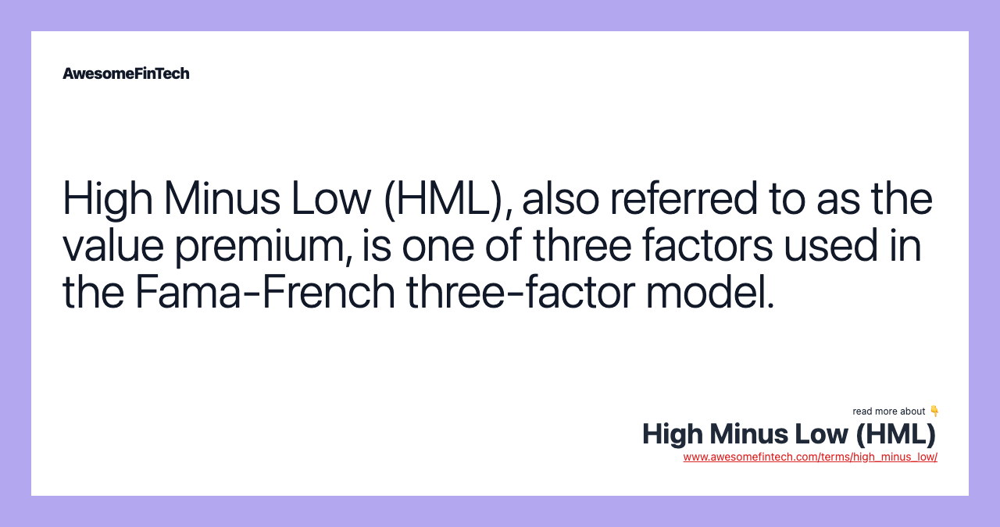

## Table of Contents

## What is High Minus Low (HML) in finance?

High Minus Low (HML) is a term used in finance to describe a way of looking at how stocks perform based on their book-to-market ratios. The book-to-market ratio is a way to see if a stock might be a good buy by comparing the company's book value (what it's worth on paper) to its market value (what people are willing to pay for it). HML is part of the Fama-French three-factor model, which helps explain why some stocks do better than others.

In the HML model, stocks are split into two groups: those with high book-to-market ratios and those with low book-to-market ratios. The idea is that stocks with high book-to-market ratios (value stocks) might do better than stocks with low book-to-market ratios (growth stocks). By looking at the difference in returns between these two groups, investors can get a better idea of how value and growth stocks are performing in the market. This can help them make smarter choices about where to put their money.

## How is HML used in the Fama-French three-factor model?

The Fama-French three-factor model is a way to understand why some stocks do better than others. It looks at three things: the overall market, the size of companies, and the difference between value and growth stocks. HML, or High Minus Low, is the part of the model that focuses on the difference between value stocks and growth stocks. Value stocks are companies that have a high book-to-market ratio, meaning their book value is high compared to what people are willing to pay for them. Growth stocks are the opposite, with a low book-to-market ratio.

In the Fama-French model, HML helps explain how much of a stock's performance can be explained by whether it's a value or a growth stock. To use HML, you first sort all stocks into groups based on their book-to-market ratios. Then, you find the average return of the stocks with the highest book-to-market ratios and subtract the average return of the stocks with the lowest book-to-market ratios. This difference is the HML factor. By including HML in the model, investors can see if value stocks are doing better or worse than [growth stocks](/wiki/growth-stocks), which can help them make better investment choices.

## What does HML measure in a portfolio?

HML, or High Minus Low, measures how well value stocks are doing compared to growth stocks in a portfolio. Value stocks are companies that have a high book-to-market ratio, which means their book value is high compared to what people are willing to pay for them. Growth stocks have a low book-to-market ratio, meaning people are willing to pay a lot more for them than their book value suggests. By looking at HML, investors can see if their value stocks are beating or lagging behind their growth stocks.

In the Fama-French three-factor model, HML is one of the three factors used to explain why some stocks do better than others. The model also looks at the overall market and the size of companies, but HML specifically focuses on the difference between value and growth stocks. By including HML in their analysis, investors can get a clearer picture of how their portfolio is performing and make smarter decisions about where to invest their money.

## Can you explain the difference between high book-to-market and low book-to-market stocks?

High book-to-market stocks are companies where the book value, which is the value of the company's assets minus its debts, is high compared to its market value, which is what people are willing to pay for the company's stock. These stocks are often called value stocks because they might be seen as a good deal. Investors think these companies might be undervalued, meaning the stock price is lower than it should be based on the company's assets. So, they might buy these stocks hoping the price will go up as more people realize the company's true worth.

On the other hand, low book-to-market stocks are companies where the market value is high compared to the book value. These are called growth stocks because people are willing to pay a lot for them, expecting the company to grow a lot in the future. Investors might think these companies have great potential and are willing to pay more for their stocks, even if the book value doesn't seem to justify the high price. They're betting that the company will keep growing and the stock price will keep going up.

## How does HML relate to value and growth investing?

HML, or High Minus Low, is a way to see if value stocks are doing better than growth stocks. Value stocks are companies that have a high book-to-market ratio, which means their book value is high compared to what people are willing to pay for them. Growth stocks have a low book-to-market ratio, meaning people are willing to pay a lot more for them than their book value suggests. HML helps investors understand if their value stocks are beating or lagging behind their growth stocks.

In value investing, people look for stocks that they think are priced lower than they should be. They hope to buy these stocks at a good price and then sell them later for a profit when the market realizes the true value of the company. Growth investing, on the other hand, is about finding companies that are expected to grow a lot in the future. Investors are willing to pay more for these stocks because they believe the company will keep growing and the stock price will go up. By looking at HML, investors can see if their strategy of focusing on value or growth is working well.

## What are the steps to calculate HML?

To calculate HML, you start by sorting all the stocks you're looking at into groups based on their book-to-market ratios. The book-to-market ratio is found by dividing a company's book value, which is what it's worth on paper, by its market value, which is what people are willing to pay for it. You split the stocks into three groups: the top third with the highest book-to-market ratios, the middle third, and the bottom third with the lowest book-to-market ratios.

Next, you find the average return of the stocks in the top group (high book-to-market) and the average return of the stocks in the bottom group (low book-to-market). You ignore the middle group. To get HML, you subtract the average return of the bottom group from the average return of the top group. This difference shows you how much better value stocks (high book-to-market) are doing compared to growth stocks (low book-to-market).

## How can HML be used to enhance portfolio performance?

HML can help make your portfolio better by showing you if value stocks are doing better than growth stocks. Value stocks are companies that have a high book-to-market ratio, meaning they might be a good deal. Growth stocks have a low book-to-market ratio, meaning people are willing to pay more for them because they expect the company to grow a lot. By looking at HML, you can see if your value stocks are beating your growth stocks. If HML is high, it means value stocks are doing well, and you might want to put more money into them. If HML is low, growth stocks are doing better, so you might want to focus on those instead.

Using HML can also help you adjust your investment strategy. If you see that value stocks are doing better for a long time, you might decide to invest more in value stocks to take advantage of this trend. On the other hand, if growth stocks keep doing better, you could shift your money into growth stocks. By keeping an eye on HML, you can make smarter choices about where to put your money and hopefully get better returns from your portfolio.

## What are the criticisms and limitations of using HML in investment strategies?

Some people think HML might not always work well because it doesn't look at everything that can affect how stocks do. For example, HML only focuses on the book-to-market ratio and doesn't consider other important things like how the economy is doing, what's happening in different industries, or even the company's own news. Also, just because a stock has a high book-to-market ratio doesn't mean it will always do better. Sometimes, growth stocks can do really well even if their book-to-market ratio is low. So, relying too much on HML might make you miss out on other good investment chances.

Another problem with HML is that it might not work the same way all the time. The stock market changes a lot, and what worked in the past might not work in the future. For example, value stocks might do really well for a while, but then growth stocks could take over. If you only use HML to decide where to invest, you might not be ready for these changes. It's important to use HML along with other tools and not just depend on it alone to make your investment choices.

## Can you provide historical data showing the performance of HML?

Over the years, HML has shown different results. From the 1960s to the 1990s, value stocks, which are the ones with high book-to-market ratios, did a lot better than growth stocks. This made HML a popular way to see if value stocks were beating growth stocks. For example, in the 1970s and 1980s, HML was positive most of the time, meaning value stocks were doing well compared to growth stocks. This helped investors who focused on value stocks make good money.

But things changed in the late 1990s and early 2000s. During this time, growth stocks, which have low book-to-market ratios, started doing much better. This made HML go negative, showing that growth stocks were beating value stocks. The tech boom was a big reason for this, as many tech companies were growth stocks. After the 2008 financial crisis, HML started to recover a bit, but it has been up and down since then. This shows that HML can change a lot depending on what's happening in the market and the economy.

## How does HML perform during different economic cycles?

HML, or High Minus Low, can change a lot depending on what's happening in the economy. During times when the economy is growing slowly or even shrinking, like in a recession, value stocks often do better than growth stocks. This is because people are looking for safe places to put their money, and value stocks, which have high book-to-market ratios, seem like a good deal. So, during these times, HML usually goes up because value stocks are doing better than growth stocks.

On the other hand, when the economy is doing really well and growing fast, growth stocks can take the lead. People are more willing to take risks and invest in companies they think will keep growing. These are often growth stocks, which have low book-to-market ratios. So, during these good economic times, HML might go down because growth stocks are doing better than value stocks. This shows that HML can be a helpful way to see how different parts of the market are doing, but it changes with the ups and downs of the economy.

## What are some advanced strategies for incorporating HML into quantitative models?

One way to use HML in more advanced ways is by combining it with other factors in your quantitative models. For example, you can use HML along with the size of companies and the overall market to make better guesses about how stocks will do. This is called the Fama-French three-factor model. By looking at all these things together, you can see if your value stocks are doing better or worse than growth stocks, and also take into account if smaller or bigger companies are doing better. This can help you make smarter choices about where to put your money.

Another advanced way to use HML is by using it in a dynamic way. This means you keep changing how much you focus on HML based on what's happening in the market and the economy. For example, if you see that value stocks are doing really well for a while, you might decide to put more of your money into them. But if you notice that growth stocks are starting to do better, you could shift your money into those instead. By watching HML closely and adjusting your investments, you can try to get the best returns from your portfolio.

## How does HML interact with other factors in multi-factor models?

HML, or High Minus Low, is often used along with other factors in multi-factor models to help investors understand how different stocks perform. One common model is the Fama-French three-factor model, which looks at the overall market, the size of companies, and HML. In this model, HML helps show if value stocks, which have high book-to-market ratios, are doing better or worse than growth stocks, which have low book-to-market ratios. By including HML with other factors, investors can see how value and growth stocks are doing compared to the market and company size, which can help them make better investment choices.

In more advanced models, HML can interact with other factors in different ways. For example, some models might look at how HML changes with the economy. When the economy is growing slowly, value stocks might do better, making HML go up. But when the economy is growing fast, growth stocks might take the lead, making HML go down. By watching how HML interacts with other factors like the economy, investors can adjust their strategies to try to get the best returns from their portfolios.

## What is the role of HML in the Fama-French Model?

The Fama-French Three-Factor Model is a significant advancement in asset pricing theory, expanding upon the classic Capital Asset Pricing Model (CAPM) by integrating additional factors that influence stock returns, particularly High Minus Low (HML). CAPM primarily focuses on the market risk premium to explain returns, represented by the equation:

$$
R_i = R_f + \beta_i (R_m - R_f)
$$

where $R_i$ is the expected return on investment, $R_f$ is the risk-free rate, $\beta_i$ is the sensitivity of the asset's returns to the market, and $R_m$ is the expected market return. However, CAPM's limitations, particularly its focus solely on market risk, prompted the development of more comprehensive models.

The Fama-French Three-Factor Model addresses these shortfalls by incorporating two additional factors: size and value. Specifically, the model introduces HML, which captures the value premium by computing the difference in returns between value stocks—those with high book-to-market ratios—and growth stocks, characterized by low book-to-market ratios. The model also includes the Small Minus Big (SMB) [factor](/wiki/factor-investing), which accounts for the size premium, denoting the difference in returns between small-cap and large-cap stocks. The equation for the Fama-French model is:

$$
R_i = R_f + \beta_i (R_m - R_f) + s_i \times \text{SMB} + h_i \times \text{HML}
$$

where $s_i$ and $h_i$ are sensitivities of the asset's returns to the size and value factors, respectively.

The Fama-French model was further expanded to a five-factor model, integrating profitability and investment factors. This extension aims to address remaining discrepancies in asset returns that the three-factor model did not fully explain. By including these additional factors, the expanded model offers a broader understanding of asset pricing, providing insights into how varying aspects such as profitability and corporate investment behavior influence expected returns. The comprehensive nature of the five-factor model is reflected as follows:

$$
R_i = R_f + \beta_i (R_m - R_f) + s_i \times \text{SMB} + h_i \times \text{HML} + r_i \times \text{RMW} + c_i \times \text{CMA}
$$

where $r_i$ and $c_i$ are sensitivities of the asset's returns to profitability (Robust Minus Weak, RMW) and investment (Conservative Minus Aggressive, CMA) factors, respectively.

Collectively, these enhancements highlight the importance of multi-factor models in capturing the complexities of market behavior and providing a more refined tool for asset valuation compared to CAPM. Incorporating HML in the Fama-French models provides a nuanced understanding of how fundamental characteristics, like value and size, contribute to asset return variations, thus allowing for more effective portfolio management and asset pricing strategies.

## What is the Calculation and Methodology of HML?

To compute the High Minus Low (HML) factor, financial analysts require precise data, including stock prices, market capitalization, and book values. The core idea behind the HML calculation is to quantify the value premium—the additional returns that investors expect from value stocks compared to growth stocks.

The process begins by categorizing stocks into two main groups based on their book-to-market (B/M) ratios: value stocks and growth stocks. Value stocks are characterized by high book-to-market ratios, signifying that the stock is undervalued relative to its book value. Conversely, growth stocks have low B/M ratios, indicating that they are priced higher than their book value, often due to anticipated growth prospects.

The next step involves forming portfolios from these categories. Typically, stocks are split into deciles or quintiles based on their B/M ratios at the beginning of a period—often annually or quarterly. The average returns of the high B/M (value) portfolio are then calculated. Similarly, the average returns of the low B/M (growth) portfolio are determined for the same period.

The HML factor is derived by subtracting the return of the growth stock portfolio from that of the value stock portfolio, expressed as:

$$
\text{HML} = R_{\text{High B/M}} - R_{\text{Low B/M}}
$$

where $R_{\text{High B/M}}$ represents the average return of the portfolio consisting of value stocks, and $R_{\text{Low B/M}}$ denotes the average return of the portfolio containing growth stocks.

By calculating HML, analysts can quantify the value premium and integrate it into investment strategies to potentially enhance them. This quantifiable measure is instrumental for creating portfolios that are designed to outperform by capitalizing on systematic risk associated with value vs. growth dynamics.

In practice, implementation of this methodology necessitates efficient data handling and processing. Analysts often use software tools and programming languages like Python to automate this computation. Below is an example of Python code to calculate HML using pandas, a popular data analysis library:

```python
import pandas as pd

# Sample data with stock tickers and their book-to-market ratios
data = {
    'Ticker': ['A', 'B', 'C', 'D', 'E'],
    'Book_to_Market_Ratio': [0.45, 1.2, 0.7, 1.5, 0.3],
    'Average_Return': [0.05, 0.1, 0.07, 0.11, 0.03]
}

# Create a DataFrame
df = pd.DataFrame(data)

# Sort and categorize stocks into value and growth based on B/M ratio
threshold = df['Book_to_Market_Ratio'].median()
value_stocks = df[df['Book_to_Market_Ratio'] > threshold]
growth_stocks = df[df['Book_to_Market_Ratio'] <= threshold]

# Calculate average returns
value_return = value_stocks['Average_Return'].mean()
growth_return = growth_stocks['Average_Return'].mean()

# Compute HML
hml = value_return - growth_return
print(f"HML: {hml:.2%}")
```

In summary, the calculation and methodology of HML involve segmenting stocks based on book-to-market ratios, computing portfolio returns for value and growth categories, and determining the difference. This quantitative approach allows analysts to identify and capitalize on value premiums evident in financial markets.

## References & Further Reading

[1]: Fama, E. F., & French, K. R. (1993). ["Common risk factors in the returns on stocks and bonds."](https://www.sciencedirect.com/science/article/pii/0304405X93900235)90023-5) Journal of Financial Economics, 33(1), 3-56.

[2]: ["Risk Factors in the Returns on Stocks and Bonds"](https://www.bauer.uh.edu/rsusmel/phd/Fama-French_JFE93.pdf) by Eugene F. Fama and Kenneth R. French, The Journal of Economic Perspectives.

[3]: Asness, C. S., Frazzini, A., & Pedersen, L. H. (2013). ["Quality minus junk."](http://www.econ.yale.edu/~shiller/behfin/2013_04-10/asness-frazzini-pedersen.pdf) Available at SSRN 2312432.

[4]: Carhart, M. M. (1997). ["On persistence in mutual fund performance."](https://onlinelibrary.wiley.com/doi/full/10.1111/j.1540-6261.1997.tb03808.x) The Journal of Finance, 52(1), 57-82.

[5]: Montier, J. (2009). ["Value Investing: Tools and Techniques for Intelligent Investment."](https://www.wiley.com/en-us/Value+Investing%3A+Tools+and+Techniques+for+Intelligent+Investment-p-9780470683590) Wiley.

[6]: Sharpe, W. F. (1964). ["Capital asset prices: A theory of market equilibrium under conditions of risk."](https://onlinelibrary.wiley.com/doi/full/10.1111/j.1540-6261.1964.tb02865.x) The Journal of Finance, 19(3), 425-442.

[7]: Grinold, R. C., & Kahn, R. N. (2000). ["Active Portfolio Management: A Quantitative Approach for Producing Superior Returns and Controlling Risk."](https://www.amazon.com/Active-Portfolio-Management-Quantitative-Controlling/dp/0070248826) McGraw-Hill.