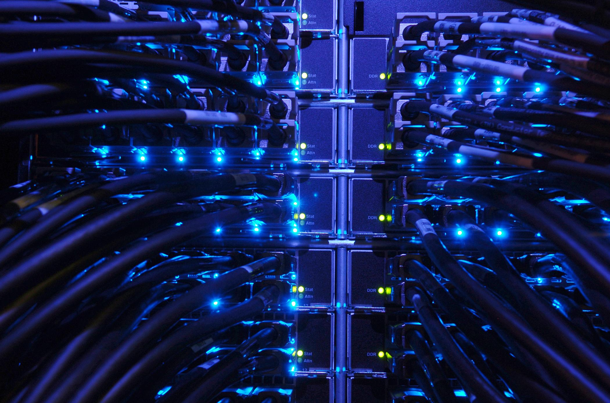

## Table of Contents

## What is high-performance computing (HPC)?

High-performance computing (HPC) is a way to process a lot of data and do complex calculations really fast. It uses supercomputers or clusters of computers working together to solve big problems that normal computers can't handle quickly. Think of it like a team of computers working together to finish a huge task much faster than one computer could alone.

People use HPC for things like weather forecasting, designing new medicines, and even exploring space. For example, scientists can use HPC to predict how a storm will move across the country or to simulate how a new drug will work in the human body. This helps them make better decisions and find solutions faster than they could without these powerful computers.

## What are the main components of an HPC system?

An HPC system is made up of several key parts that work together to make it powerful. The first main part is the compute nodes. These are like the brains of the system, and they do all the heavy thinking and calculations. Each node usually has one or more processors, which are like super-fast calculators. These nodes are connected together so they can share the workload and work as a team.

The second important part is the interconnect. This is like the highway system that lets the compute nodes talk to each other quickly. A good interconnect is really important because it makes sure that data can move fast between the nodes, which helps the whole system work smoothly. Without a good interconnect, the nodes might have to wait for data, which would slow everything down.

The third key component is the storage system. This is where all the data lives that the compute nodes need to work with. The storage system needs to be fast and big so that the nodes can get the data they need quickly without any delays. Together, these parts—the compute nodes, the interconnect, and the storage system—make an HPC system powerful and efficient at handling big tasks.

## How does HPC differ from regular computing?

HPC, or high-performance computing, is like a team of computers working together to solve big problems really fast. Regular computing, on the other hand, is what you do with your everyday computer or laptop. When you use a regular computer, it's just one machine doing the work, and it can take a lot longer to finish big tasks. HPC uses special hardware and software to make many computers work together, which makes it much faster and better at handling huge amounts of data and complex calculations.

The main difference between HPC and regular computing is speed and power. An HPC system can do calculations that would take a regular computer days or even weeks to finish in just a few hours or minutes. This is because HPC systems have many processors working together, and they use special ways to move data quickly between them. So, if you need to do something really big and fast, like predicting the weather or designing a new airplane, you would use HPC. But for everyday tasks like writing emails or browsing the web, a regular computer is just fine.

## What are some common applications of HPC?

High-performance computing (HPC) is used in a lot of different fields to solve big problems quickly. One common use is in weather forecasting. Scientists use HPC to predict how storms will move and change, which helps people stay safe and prepare for bad weather. Another big use is in medicine, where HPC helps researchers design new drugs and understand how they work in the human body. This can speed up the process of finding new treatments for diseases.

HPC is also important in engineering and manufacturing. For example, car and airplane makers use HPC to test and improve their designs before they build them. This saves time and money because they can fix problems on the computer instead of making costly mistakes in real life. In finance, banks and trading companies use HPC to analyze huge amounts of data and make quick decisions about buying and selling stocks.

In the world of science, HPC helps with things like studying the universe and exploring space. Scientists use it to simulate how stars and galaxies move and change over time. This helps them learn more about the universe without having to wait for real-life events to happen. HPC is also used in energy research to find better ways to use and store energy, which is important for the future of our planet.

## What programming languages are commonly used in HPC?

In high-performance computing, people often use a few main programming languages to make their programs run fast and work well together. One of the most common languages is Fortran. It's been around for a long time and is really good at doing math quickly, which is important for HPC. Another popular language is C, which is also very fast and gives programmers a lot of control over how their programs use the computer's resources. C++ is similar to C but has extra features that can make it easier to write big programs.

Besides these, Python is becoming more popular in HPC because it's easy to learn and use. Even though Python isn't as fast as Fortran or C by itself, people often use it with special libraries and tools that make it run faster. For example, NumPy and SciPy are libraries that help Python do math quickly, and MPI (Message Passing Interface) is a tool that helps different parts of a program talk to each other on different computers. So, even though Python might start slower, with the right tools, it can be a good choice for HPC too.

## How can one measure the performance of an HPC system?

To measure the performance of an HPC system, one of the most common ways is to use a benchmark. A benchmark is like a test that runs on the system to see how fast it can do certain tasks. One popular benchmark is called LINPACK, which measures how many calculations the system can do in a second. This gives a number called FLOPS, which stands for "floating-point operations per second." The higher the FLOPS, the faster the system is at doing math, which is important for HPC.

Another way to measure performance is to look at how well the system can handle real-world problems. This means running actual programs that people use for things like weather forecasting or drug design and seeing how long they take to finish. This kind of test is called an application benchmark. It's different from a general benchmark like LINPACK because it shows how the system performs with the specific tasks it's meant to do. Both types of benchmarks help people understand if an HPC system is doing its job well and where it might need improvements.

## What are the challenges faced in managing and maintaining HPC systems?

Managing and maintaining HPC systems can be really tough because they are big and complex. One big challenge is keeping the system running smoothly without any downtime. This means fixing problems quickly when they happen, like when a part breaks or the software stops working right. It also means making sure the system can handle all the work people want to do without slowing down. This can be hard because HPC systems have a lot of parts working together, and if one part isn't working well, it can affect the whole system.

Another challenge is keeping the system up to date. Technology changes fast, and to keep an HPC system working at its best, you need to update the hardware and software regularly. This can be tricky because it means planning carefully so that you don't interrupt the work that people are doing. It also means making sure that everyone using the system knows how to use the new updates. Plus, keeping the system secure is important, because HPC systems often handle sensitive data, and you need to protect it from hackers and other threats.

Overall, managing an HPC system takes a lot of work and planning. You need to make sure it's running well, updating it regularly, and keeping it secure. It's like taking care of a big, complicated machine that a lot of people depend on to do their important work.

## What is parallel processing and how is it implemented in HPC?

Parallel processing is like having many people working on different parts of a big puzzle at the same time. Instead of one person trying to put the whole puzzle together, which would take a long time, many people work on smaller pieces, and they all come together to finish the puzzle much faster. In computers, parallel processing means breaking a big job into smaller pieces and letting different parts of the computer, or even different computers, work on these pieces at the same time. This makes the job finish much quicker than if one computer did it all by itself.

In HPC, parallel processing is really important because it helps handle huge amounts of data and complex calculations. HPC systems use a lot of processors, and they can be set up in different ways to do parallel processing. One common way is called distributed memory, where each processor has its own memory and they all work together by passing messages to each other. Another way is shared memory, where all the processors can use the same memory at the same time. Both methods help the HPC system do big jobs faster by letting many processors work together like a team.

## What are some popular HPC frameworks and tools?

In HPC, people use special frameworks and tools to make their work easier and faster. One popular framework is MPI, which stands for Message Passing Interface. It helps different parts of a program talk to each other on different computers. This is really important for parallel processing because it lets the computers work together smoothly. Another tool is OpenMP, which is good for shared memory systems. It helps programs use many processors at the same time to finish tasks faster. Both MPI and OpenMP are widely used because they help make HPC programs run well on big systems.

Another important tool is SLURM, which stands for Simple Linux Utility for Resource Management. It helps manage and schedule jobs on HPC systems. This means it decides which jobs run on which computers and when, so everything works smoothly and no one has to wait too long. People also use tools like CUDA and OpenACC to make programs run faster on special processors called GPUs. These tools help write programs that can take advantage of the speed of GPUs, which is really helpful for things like simulations and data analysis. Together, these frameworks and tools make it easier for people to use HPC systems effectively.

## How does cloud computing integrate with HPC?

Cloud computing and high-performance computing (HPC) can work together to make big tasks easier and faster. Cloud computing is like renting computer power from the internet. Instead of buying and setting up your own big computers, you can use the ones that cloud providers have. This can be really helpful for HPC because it means you don't have to spend a lot of money on hardware upfront. You can just use the cloud when you need it and pay for what you use. This is good for businesses and researchers who might not always need a big HPC system but need it sometimes for big projects.

When you use cloud computing for HPC, you can scale your computing power up or down depending on what you need. For example, if you're doing a big simulation that needs a lot of power, you can use more computers in the cloud. When you're done, you can use less. This flexibility is a big advantage. Also, cloud providers often have special tools and services that make it easier to set up and run HPC jobs. They can help with things like managing data, scheduling tasks, and even using special processors like GPUs. So, cloud computing can make HPC more accessible and easier to use for a lot of people.

## What are the future trends and developments expected in HPC?

In the future, HPC is expected to keep getting faster and more powerful. One big trend is the use of more and more processors working together. This means HPC systems will be able to handle even bigger and more complex tasks. Another trend is the use of special processors like GPUs and even newer types like FPGAs and TPUs. These can do certain kinds of work much faster than regular processors, so they'll help make HPC even better at things like simulations and data analysis. Also, people are working on making HPC systems more energy-efficient, so they can do more work without using as much power.

Another important development is the integration of [artificial intelligence](/wiki/ai-artificial-intelligence) (AI) and [machine learning](/wiki/machine-learning) (ML) with HPC. AI and ML need a lot of computing power to train models and make predictions, and HPC systems are perfect for this. In the future, we'll see more HPC systems designed specifically to work with AI and ML, making them even faster and more useful for these kinds of tasks. Plus, as cloud computing keeps growing, more people will be able to use HPC without having to buy their own big computers. This will make HPC more accessible and easier to use for businesses and researchers around the world.

## How can organizations optimize their HPC resources for cost and efficiency?

Organizations can optimize their HPC resources by making smart choices about how they use their computers. One way to do this is by using workload management tools like SLURM to schedule jobs so that the system is always busy but not overloaded. This means making sure that jobs are spread out evenly across all the computers so that none of them are sitting idle while others are working too hard. Another way is to use the right kind of processors for different tasks. For example, using GPUs for simulations and data analysis can make these jobs finish much faster and save money because GPUs are good at doing these kinds of work.

Another important way to optimize HPC resources is by using cloud computing. Instead of buying and maintaining their own big computers, organizations can rent computing power from the cloud when they need it. This can save a lot of money because they only pay for what they use and don't have to worry about keeping the computers running all the time. Also, cloud providers often have special tools and services that can help make HPC jobs run more smoothly and efficiently. By using these strategies, organizations can make the most out of their HPC resources and get the best value for their money.

## What is Algorithmic Trading Explained?

Algorithmic trading utilizes computer programs to automate the execution of trading strategies. These algorithms are designed to process and analyze massive datasets, identify trading signals, and execute trades at precisely optimal moments, often within milliseconds. The speed and precision offered by [algorithmic trading](/wiki/algorithmic-trading) are crucial in financial markets where rapid decision-making can significantly impact profitability.

Key components of algorithmic trading systems include data analysis modules that use advanced mathematical models to interpret market data and predict price movements. These models often incorporate sophisticated statistical methods and [volatility](/wiki/volatility-trading-strategies) estimators to evaluate market conditions. Among the widely used volatility estimators are Yang-Zhang, Garman-Klass, and Rogers-Satchell, each offering different approaches to volatility calculation.

### Popular Volatility Estimators

1. **Yang-Zhang Estimator**: This estimator is renowned for its accuracy in computing the historical volatility of financial assets. It is designed to address the bias seen in traditional volatility measures by considering the open, high, low, and close prices. The formula is given by:
$$
   \sigma_{YZ} = \sqrt{ \frac{1}{n} \left( \sum_{t=1}^{n} \ln\left(\frac{O_t}{C_{t-1}}\right)^2 + \sum_{t=1}^{n} \ln\left(\frac{C_t}{O_t}\right)^2 + \sum_{t=1}^{n} \ln\left(\frac{H_t}{L_t}\right)^2 \right) }

$$

   where $O_t$, $C_t$, $H_t$, and $L_t$ represent the open, close, high, and low prices, respectively.

2. **Garman-Klass Estimator**: This estimator provides an improved measure of volatility by incorporating the daily price range. It takes into account the high, low, and closing prices, making it more robust than simple close-close estimations. The formula is:
$$
   \sigma_{GK} = \sqrt{ \frac{1}{n} \sum_{t=1}^{n} \left( 0.5 \cdot (\ln(H_t/L_t))^2 - (2 \ln(2) - 1) \cdot (\ln(C_t/O_t))^2 \right) }

$$

3. **Rogers-Satchell Estimator**: This estimator is particularly useful for capturing the true volatility of an asset's returns when returns are non-zero. Unlike other estimators, it does not assume that the drift is zero. The formula is:
$$
   \sigma_{RS} = \sqrt{ \sum_{t=1}^{n} \left( \ln\left(\frac{H_t}{C_t}\right) \cdot \ln\left(\frac{H_t}{O_t}\right) + \ln\left(\frac{L_t}{C_t}\right) \cdot \ln\left(\frac{L_t}{O_t}\right) \right) }

$$

### Implementation in Python

Algorithmic trading systems are often implemented using programming languages such as Python due to its rich ecosystem of libraries for data analysis and statistical modeling. Here's a simple example demonstrating how to implement the Yang-Zhang estimator in Python:

```python
import numpy as np

def yang_zhang_volatility(open_prices, close_prices, high_prices, low_prices):
    n = len(close_prices)
    log_open_close = np.log(open_prices[1:] / close_prices[:-1])
    log_close_open = np.log(close_prices / open_prices)
    log_high_low = np.log(high_prices / low_prices)

    sigma_yz = np.sqrt((log_open_close**2 + log_close_open**2 + log_high_low**2).mean())
    return sigma_yz

# Sample data
open_prices = np.array([100, 101, 102])
close_prices = np.array([101, 102, 103])
high_prices = np.array([102, 103, 104])
low_prices = np.array([99, 100, 101])

volatility = yang_zhang_volatility(open_prices, close_prices, high_prices, low_prices)
print("Yang-Zhang Volatility:", volatility)
```

Overall, algorithmic trading's reliance on sophisticated algorithms and volatility estimators allows for the execution of more refined trading strategies that can achieve better profits while managing risks effectively.

## References & Further Reading

[1]: Bergstra, J., Bardenet, R., Bengio, Y., & Kégl, B. (2011). ["Algorithms for Hyper-Parameter Optimization."](https://papers.nips.cc/paper/4443-algorithms-for-hyper-parameter-optimization) Advances in Neural Information Processing Systems 24.

[2]: ["Advances in Financial Machine Learning"](https://www.amazon.com/Advances-Financial-Machine-Learning-Marcos/dp/1119482089) by Marcos Lopez de Prado

[3]: ["Evidence-Based Technical Analysis: Applying the Scientific Method and Statistical Inference to Trading Signals"](https://www.amazon.com/Evidence-Based-Technical-Analysis-Scientific-Statistical/dp/0470008741) by David Aronson

[4]: ["Machine Learning for Algorithmic Trading"](https://github.com/stefan-jansen/machine-learning-for-trading) by Stefan Jansen

[5]: ["Quantitative Trading: How to Build Your Own Algorithmic Trading Business"](https://books.google.com/books/about/Quantitative_Trading.html?id=j70yEAAAQBAJ) by Ernest P. Chan