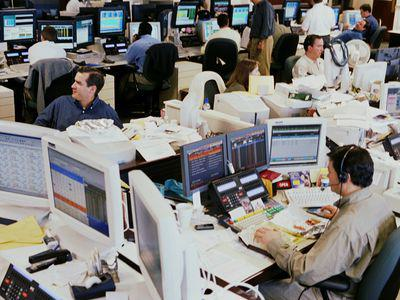

Brokerage firms play a vital role in the financial markets, acting as intermediaries between investors and the markets. However, this industry is plagued by dark practices, where illegal tactics and high-pressure sales techniques compromise the integrity of trading activities. Among the most impactful phenomena emerging in this environment is algorithmic trading, which while offering extensive benefits to efficient market functioning, can also be co-opted into unethical practices. This dual nature of algorithmic trading is pertinent to understanding its role in unethical brokerage conduct.

Brokerage firms often resort to a gamut of illegal tactics to manipulate investor decisions. These strategies include deceit and exaggerated promises, intended to lure clients into unfavorable deals. Manipulation becomes evident in tactics like inflating past performance, which misleads investors regarding the potential of financial products or strategies. Such deceit fuels impulsive decision-making, often influenced by high-pressure sales tactics. By compelling investors to act swiftly, brokers can sidestep critical assessments of suitability and the risk appetites of their clients, leading to decisions that may not align with the clients' best interests.



Awareness and vigilance are crucial for investors to safeguard themselves against such unethical practices. Recognizing these tactics is the first step toward empowerment in the trading landscape. Investors should remain informed about the mechanics of the trading world and the ethical guidelines set forth by regulatory bodies like the Financial Industry Regulatory Authority (FINRA) and the Securities and Exchange Commission (SEC). Understanding these guidelines is essential, as they are designed to protect investors from the potential malpractice of brokers.

Educated and informed investors are better positioned to ask critical questions, recognize red flags, and challenge inappropriate sales tactics. Adopting a proactive approach can significantly mitigate the risks of falling prey to high-pressure sales tactics and potentially illegal trading manipulations, including those involving sophisticated tools like algorithmic trading.

## Table of Contents

## Understanding Broker's High-Pressure Sales Tactics

High-pressure sales tactics are aggressive techniques used by brokers to coerce clients into making hasty investment decisions. These techniques often focus on creating a sense of urgency and exploiting emotions such as fear and greed. Brokers may use persuasive language, appeal to authority, or imply limited-time opportunities to pressure potential investors.

One of the most notorious environments where these tactics thrive is in boiler room operations. Boiler rooms are high-pressure sales environments where salespeople apply relentless pressure to sell securities on the telephone. These setups are characterized by aggressive telemarketing calls, where brokers use manipulation and fear to convince their targets to invest quickly. The individuals operating in these settings often aim to close sales rapidly, providing little time for investors to conduct due diligence or consider their financial objectives.

Manipulation in high-pressure sales scenarios often involves misrepresenting or exaggerating the benefits of a particular investment while downplaying the associated risks. Fear is a powerful tool in this context, as brokers may suggest potential losses or missed opportunities to spur action. By creating artificial urgency or suggesting insider knowledge, brokers can make unsuspecting investors feel compelled to invest immediately.

These practices can potentially breach regulatory standards set by bodies like the Financial Industry Regulatory Authority (FINRA) and the Securities and Exchange Commission (SEC). FINRA Rule 2111, for instance, mandates that brokers have a reasonable basis to believe that a recommended transaction or investment strategy is suitable for the client based on the client's financial situation and needs. High-pressure sales tactics often bypass the suitability requirement, as decisions are made under duress without adequate information regarding the client's preferences or risk tolerance.

Furthermore, the SEC enforces rules to protect investors from misleading sales practices. Under these regulations, any form of deceit or misleading information used to sell securities is prohibited. Brokers employing high-pressure tactics may operate in violation of these rules if they resort to false representations or omit critical information necessary for investors to make informed decisions.

In sum, high-pressure sales tactics pose significant risks to investors. They encourage decisions based on manipulation and fear, potentially leading to financial loss and regulatory consequences for brokers violating FINRA and SEC guidelines. Investors must remain vigilant and informed to safeguard their interests against such aggressive practices.

## Common Illegal Tactics Employed by Brokers

Brokerage firms have occasionally been implicated in using illegal tactics to manipulate clients and maximize profits. One prevalent strategy involves inflating past performance to entice clients. This tactic misleads investors by portraying a false image of a broker's success, often through selective presentation of data or exaggeration of historical returns. Such deceptive practices violate ethical standards and can severely distort investor decision-making.

Ignoring client sustainability and suitability is another tactic contrary to the Financial Industry Regulatory Authority (FINRA) Rule 2111. This rule mandates that brokers ensure that investment recommendations are appropriate for the client's specific financial situation, including their risk appetite, financial needs, and investment objectives. By overlooking these requirements, brokers prioritize immediate financial gains over the long-term welfare of their clients, potentially exposing them to undue financial risks.

Manipulative talk is often employed to exploit investors' emotional triggers. Brokers might use persuasive language to instill a sense of urgency, implying limited-time opportunities to elicit a quick decision. For instance, phrases such as "you can double your money in no time" or "this opportunity won’t last long" are designed to create fear of missing out (FOMO) and compel impulsive investing. This exploitation of psychological triggers can be particularly effective against inexperienced investors, who may lack the expertise to critically assess such claims.

Outrageous promises and false guarantees further characterize illegal tactics used by brokers. These can include pledges of guaranteed returns or risk-free investments—claims that are inherently flawed and often fraudulent. Financial markets are subject to [volatility](/wiki/volatility-trading-strategies) and inherent risk, making any assurances of guaranteed returns dubious and misleading. Investors may be lured by perceived low-risk, high-reward scenarios, only to find themselves entrapped in volatile investments or outright frauds.

By understanding these tactics, investors can develop a more skeptical and discerning approach when engaged by brokers, better safeguarding themselves from potential exploitation. This awareness, alongside adherence to regulatory guidelines such as FINRA Rule 2111, is crucial in cultivating a secure and transparent investing environment.

## Algorithmic Trading: A Tool for Manipulation?

Algorithmic trading, often referred to as algo-trading, involves the use of complex algorithms and computer programs to execute trades at high speeds and volumes. It is an essential part of the modern trading landscape, enabling traders to capitalize on minute market inefficiencies and execute trades with minimal human intervention. This technology-driven approach has transformed financial markets, contributing significantly to increased [liquidity](/wiki/liquidity-risk-premium) and market efficiency [[source](https://www.investopedia.com/terms/a/algorithmictrading.asp)].

However, [algorithmic trading](/wiki/algorithmic-trading) also opens the door to manipulative practices by unscrupulous brokers. By leveraging sophisticated algorithms, brokers can orchestrate clandestine strategies that distort market conditions to their advantage. Such manipulation may involve practices like spoofing and layering, where fake orders are placed to mislead other market participants about supply and demand dynamics. Once the market reacts to these deceptive signals, the manipulator cancels the bogus orders to exploit the resulting price movements [[source](https://www.sec.gov/oiea/investor-alerts-bulletins/ia_spoofing) ].

Key red flags indicative of manipulation through algorithmic trading include sudden and unexplained price movements, unusually high trading volumes without corresponding market news, and a pattern of orders that appear and vanish sporadically. These actions often indicate an underlying attempt to manipulate market perceptions and prices artificially.

The task of regulating algorithmic trading presents significant challenges for authorities like the Securities and Exchange Commission (SEC) and the Financial Industry Regulatory Authority (FINRA). The rapid pace and sheer [volume](/wiki/volume-trading-strategy) of trades executed via algorithms complicate monitoring efforts. Regulatory bodies employ advanced analytical tools and surveillance systems to detect anomalous patterns and potential abuses. Despite these efforts, keeping pace with the evolving algorithms remains a daunting task [[source](https://www.nasdaq.com/articles/secs-algorithmic-trading-aims-bring-more-transparency-2017-04-24)].

In conclusion, while algorithmic trading offers significant benefits in terms of efficiency and liquidity, it also necessitates vigilance to guard against its misuse as a manipulative tool. Regulators continue to adapt their approaches to oversee and mitigate the risks associated with this modern trading phenomenon, striving to ensure fair and transparent market practices.

## Real-Life Examples and Case Studies

### Real-Life Examples and Case Studies

In the world of investment brokerage, high-pressure sales tactics and deceitful practices have often led to legal scrutiny and regulatory actions. Examining real-life examples provides valuable insights into how these malpractices unfold and the implications they have on investors and the financial industry.

#### Notable Cases of Broker Misconduct

One significant case involves Stratton Oakmont, the infamous brokerage firm depicted in the film "The Wolf of Wall Street." The firm operated a classic boiler room setup, where brokers used aggressive selling techniques to manipulate stock prices and defraud investors. Stratton Oakmont's practices led to substantial financial penalties and culminated in the firm’s expulsion from the NASD (now FINRA) in 1996[^1^].

Another pertinent example is the case of the brokerage firm, Ameriprise Financial Services. In 2010, Ameriprise faced charges by the SEC for failing to supervise its brokers who were engaging in unauthorized trading and excessive sales of certain investment products. The firm settled by paying a substantial fine and enhanced its compliance programs to prevent future misconduct[^2^].

#### Analysis of Court Cases and SEC Charges

In the case of Stratton Oakmont, the high-pressure sales tactics were complemented by deceitful maneuvers such as artificially inflating stock prices, known as "pump and dump" schemes. The SEC's intervention highlighted the firm's blatant disregard for ethical trading practices, leading to significant investor losses. The firm’s downfall emphasized the critical need for robust regulatory oversight to protect investors from manipulative brokerage activities[^3^].

Similarly, Ameriprise's legal challenges underscored the importance of adhering to FINRA's suitability rule (FINRA Rule 2111), which mandates that brokers must have a reasonable basis to believe that a recommended investment is suitable for the client. The case demonstrated that neglecting these regulations could lead to severe financial and reputational repercussions[^4^].

#### Lessons Learned and Investor Outcomes

These examples illustrate several crucial lessons for investors:

1. **Vigilance Against High-Pressure Tactics**: Investors must remain cautious of brokers who employ aggressive sales pitches or attempt to rush investment decisions. Recognizing these red flags can prevent involvement in dubious transactions.

2. **Due Diligence**: Performing thorough research and understanding the investments being offered can safeguard against potential fraud. Investors should verify any claims made by brokers, especially those that seem too promising.

3. **Legal and Regulatory Awareness**: Familiarizing oneself with relevant regulations and knowing the recourse options available through entities like the SEC and FINRA can empower investors to take action against suspicious activities.

4. **Seeking Professional Advice**: Consulting with independent financial advisors or legal counsel can provide an unbiased perspective, helping investors make informed decisions devoid of undue influence.

By studying these real-life case studies, investors can better appreciate the tactics employed by unscrupulous brokers and become more adept at navigating the complexities of the trading world.

[^1^]: U.S. Securities and Exchange Commission, "SEC Charges Stratton Oakmont and Principal Officers with Fraud," 1999.  
[^2^]: U.S. Securities and Exchange Commission, "SEC Charges Ameriprise Financial Services for Failing to Supervise Brokers," 2010.  
[^3^]: Financial Industry Regulatory Authority.  
[^4^]: U.S. Securities and Exchange Commission, "FINRA Rule 2111," 2012.  

## How Investors Can Protect Themselves

Investors face a complex landscape where high-pressure sales tactics are commonly employed by some brokerage firms. Recognizing and avoiding these tactics is crucial to safeguarding one's financial well-being. Below are practical strategies investors can adopt to protect themselves from potential exploitation.

### Identifying and Avoiding High-Pressure Sales Tactics

Investors should remain vigilant for signs of high-pressure sales tactics, which often involve fast-talking salespeople urging immediate investment decisions. Common red flags include limited-time offers, excessive optimism about returns, and dismissing the need for further research. If an investment opportunity is genuinely worthwhile, it should withstand scrutiny and deliberation.

### Conducting Thorough Research and Due Diligence

Prior to investing, thorough research and due diligence are imperative. Investors should seek to understand the company, its financial health, and market position. Analyzing the company's financial statements, such as income statements and balance sheets, can provide valuable insights into its performance and sustainability. Additionally, reviewing third-party analysis and consulting industry reports can further illuminate the company's prospects.

Here's a simple Python script example for fetching basic financial data for public companies using a financial API:

```python
import requests

def get_financial_data(company_symbol):
    api_url = f"https://api.example.com/financials/{company_symbol}"
    response = requests.get(api_url)
    if response.status_code == 200:
        return response.json()
    else:
        print("Error fetching data")
        return None

# Example usage
company_symbol = "AAPL"
financial_data = get_financial_data(company_symbol)
if financial_data:
    print(financial_data)
```

### Seeking Professional Legal Counsel

When confronting suspicious investment offers, seeking professional legal counsel can provide a layer of protection. Legal experts familiar with securities law can help identify potentially fraudulent schemes and help investors understand their rights and options. This is particularly important when dealing with investments that appear complex or are difficult to comprehend.

### Staying Informed about FINRA and SEC Regulations

Investors should stay informed about the latest regulations and guidelines issued by securities regulatory bodies like the Financial Industry Regulatory Authority (FINRA) and the Securities and Exchange Commission (SEC). These organizations set forth rules to protect investors, promote market integrity, and ensure fair practices. Regularly visiting their websites or subscribing to newsletters can provide updates on new regulations, enforcement actions, and investor alerts.

Moreover, investors can verify the legitimacy of brokers and investment advisors through FINRA's BrokerCheck tool or the SEC's Investment Adviser Public Disclosure database. These resources provide details on the professional background, registration status, and any disciplinary actions taken against brokerage firms and financial advisors.

By adopting these strategies, investors can better protect themselves from high-pressure sales tactics and other unethical practices, thereby making more informed and secure investment decisions.

## Conclusion

The trading world often presents a façade of limitless opportunities, but beneath this veneer lies the perilous reality of high-pressure sales tactics and the misuse of algorithmic trading by brokerage firms. These practices pose significant risks to investors, often leading them to make hasty and ill-informed decisions. High-pressure tactics, characterized by aggressive sales approaches and emotional manipulation, can lead to an investment path that may not align with the investor's financial goals or risk tolerance. Similarly, the misuse of algorithmic trading—where automated systems are exploited to manipulate market outcomes—further complicates the landscape, potentially resulting in unfair trading advantages and market distortions.

Vigilance and education are paramount in safeguarding against these dangers. Investors must develop a critical eye towards sales pitches and promises that seem too good to be true. Recognizing the signs of manipulative strategies and understanding the potential for algorithmic trading abuse can significantly reduce susceptibility to unethical brokerage practices. Continuous education about financial regulations, such as those enforced by the Financial Industry Regulatory Authority (FINRA) and the Securities and Exchange Commission (SEC), equips investors with the knowledge needed to navigate complex trading environments responsibly.

Taking a proactive approach to investment involves more than just scrutinizing brokerage tactics. It requires a commitment to ongoing education about market dynamics, regulatory changes, and emerging technologies in the financial sector. By fostering an environment of informed decision-making and skepticism towards high-pressure sales techniques, investors can protect their portfolios from undue risk and align their investment strategies with their long-term financial objectives.

## References & Further Reading

[1]: U.S. Securities and Exchange Commission. ["SEC Charges Stratton Oakmont and Principal Officers with Fraud."](https://www.sec.gov/) 1999.

[2]: U.S. Securities and Exchange Commission. ["SEC Charges Ameriprise Financial Services for Failing to Supervise Brokers."](https://www.sec.gov/newsroom/press-releases/2024-98) 2010.

[3]: Financial Industry Regulatory Authority (FINRA). ["FINRA Rule 2111: Suitability."](https://www.finra.org/rules-guidance/rulebooks/finra-rules/2111) 2012.

[4]: Hull, J. C. (2017). ["Options, Futures, and Other Derivatives."](https://www.pearson.com/en-us/subject-catalog/p/options-futures-and-other-derivatives/P200000005938/9780136939917) Pearson Education.

[5]: Securities and Exchange Commission. ["Spoofing and Layering: Spoofing and Layering Identified as Manipulative Trading Practices."](https://www.sec.gov/newsroom/press-releases/2024-179)