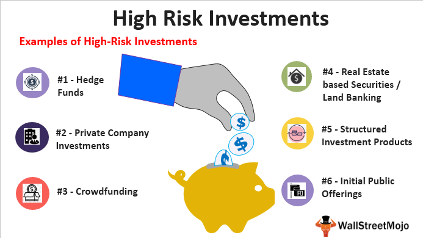

In times of economic crises, traditional investment strategies often encounter significant hurdles, exacerbated by heightened market volatility and uncertainty. As economies worldwide grapple with these turbulent periods, some investors shift their focus towards high-risk, high-reward investment strategies, which offer the potential for substantial gains despite the inherent risks. Among these, algorithmic trading, particularly high-frequency trading (HFT), has gained prominence as a method to capitalize on the rapid fluctuations that characterize economic downturns.

Algorithmic trading employs sophisticated computational algorithms to execute trades at incredibly high speeds, often exceeding human capabilities. This method allows traders to exploit fleeting market inefficiencies across multiple asset classes and markets. High-frequency trading further refines this approach by executing a large number of trades within fractions of a second, targeting minimal price discrepancies that can aggregate into significant profits over a large volume of trades. The appeal of algorithmic trading during economic crises lies in its ability to swiftly adapt to sudden market changes, potentially mitigating risks associated with slower, more traditional investment methods.

This article examines various investment strategies pertinent to economic crises, with a particular focus on the high-risk, high-reward potential of algorithmic trading. By exploring its capabilities and addressing associated risks, investors can better understand how to strategically harness algorithmic trading's potential during periods of economic instability.

## Table of Contents

## Understanding Economic Crises

Economic crises are significant disruptions in economic activity, characterized by prolonged recessions, sharply rising unemployment rates, and steep declines in asset prices. These downturns typically result from a complex intertwining of various factors such as financial imbalances, policy mistakes, or external shocks. During such crises, the established economic order is often upended, causing widespread financial and social distress.

One of the most observable outcomes of an economic crisis is a recession, which is a period of negative economic growth spread across the economy, lasting more than a few months. A recession is typically visible in GDP, real income, employment, industrial production, and wholesale-retail sales. The 2008 global financial crisis, for instance, led to severe worldwide economic contractions and showcased how interlinked the global financial systems are.

High unemployment rates are another hallmark of economic crises. When businesses face declining demand, they are forced to cut costs, often resulting in workforce reductions. This creates a vicious cycle where increased unemployment leads to reduced consumer spending, further stalling economic recovery. Such was visible during the Great Depression and the 2008 financial crisis when unemployment rates soared globally.

Asset prices invariably suffer during economic downturns. Stock markets, where asset values are often highly speculative, experience significant [volatility](/wiki/volatility-trading-strategies) leading to rapid devaluation. Real estate markets also typically see a drop in prices due to decreased demand and rising foreclosures. The bursting of the U.S. housing bubble in 2008 exemplified how overvaluation in asset prices can precipitate a wider financial catastrophe.

During crises, fear and panic can profoundly influence investor behavior and market stability. Behavioral finance, a field that combines psychological insights with economic theory, provides evidence that investors often react irrationally during times of economic stress. For instance, fear-driven sell-offs or panic buying may occur, leading to increased market volatility and the potential for financial bubbles or crashes. These behaviors create inefficiencies in the market, sometimes resulting in assets being undervalued or overvalued based on sentiment rather than fundamental value.

Behavioral patterns observed during crises can result in missed investment opportunities. When fear dominates, investors may sell off valuable assets at low prices or avoid purchasing assets at bargain rates due to uncertainty about future returns. Such irrationality can hinder economic recovery, as efficient capital allocation is crucial for fostering growth and stabilization.

Understanding these aspects of economic crises can aid investors and policymakers in developing strategies to weather financial storms effectively. Recognizing the psychological components at play can lead to better decision-making processes that mitigate the adverse effects of such turbulent times.

## High-Risk, High-Reward Investment Approaches

Investing during economic crises is characterized by significant risks, primarily stemming from the uncertainty in recovery timelines and the potential for further economic contractions, known as double-dip recessions. The unpredictability of these events poses considerable challenges to investors, as the trajectory of the market can be volatile and rapid shifts between fear and optimism are common. Despite these challenges, crises present unique opportunities for investors who are willing to embrace the high-risk, high-reward paradigm.

One of the key opportunities during such times is the potential for acquiring assets at prices below their intrinsic value. As panic ensues, many investors may sell off assets, leading to sharp price declines. This can result in securities trading at valuations that do not accurately reflect their underlying fundamentals, creating a favorable environment for value-based investments. The concept of intrinsic value is core to this strategy, defined as the perceived true value of an asset based on underlying tangible and intangible factors. When market prices fall significantly below intrinsic value during crises, informed investors can capitalize on these discrepancies by purchasing undervalued assets with the expectation of substantial future gains.

To assess these investment opportunities quantitatively, consider the price-to-earnings (P/E) ratio, a common metric used to evaluate if a stock is over or undervalued. In crises, P/E ratios often decline as earnings expectations are revised downward and stock prices fall. If historical data suggests that a company has a resilient business model that can withstand economic downturns, a low P/E ratio might indicate a buying opportunity.

Mathematically, the intrinsic value of an asset (V) can be estimated as:

$$
V = \sum_{t=1}^{n} \frac{CF_t}{(1 + r)^t}
$$

where $CF_t$ is the cash flow in year $t$, $r$ is the discount rate reflecting the risk-free rate and a risk premium, and $n$ is the expected holding period. Investors may adjust their models to account for increased uncertainties in cash flow projections and appropriate risk premiums to compensate for the additional risk taken during crises.

In practice, adopting a contrarian investment strategy, which involves going against prevailing market trends, can be effective. This involves carefully identifying industries or sectors that may appear distressed but possess long-term growth potential or demonstrate a capacity for recovery post-crisis. High-risk, high-reward investment approaches necessitate a disciplined analysis of macroeconomic indicators, market sentiment, and individual asset fundamentals to discern potential opportunities from genuine threats.

Ultimately, while crises test the resilience of conventional investment strategies, they also offer a recalibration of market dynamics, rewarding those who can correctly assess the depth and trajectory of recovery while managing associated risks prudently.

## The Role of Algorithmic Trading in Crisis Times

Algorithmic trading, particularly high-frequency trading ([HFT](/wiki/high-frequency-trading-strategies)), has become a compelling strategy during economic crises due to its ability to process and execute trades at speeds surpassing human capability. By leveraging advanced computational algorithms, HFT can swiftly analyze market conditions and execute trades within microseconds, capitalizing on fleeting price inefficiencies.

A core characteristic of [algorithmic trading](/wiki/algorithmic-trading) is its reliance on quantitative models to identify potential trading opportunities. These algorithms can detect minute price discrepancies across different markets, known as [arbitrage](/wiki/arbitrage) opportunities, often too subtle for human traders to exploit. For instance, if a stock is priced differently on two exchanges, an algorithm can simultaneously buy the stock at the lower price and sell it at the higher price, pocketing the difference as profit.

The efficiency of HFT arises from its ability to manage a massive [volume](/wiki/volume-trading-strategy) of trades, with each trade typically yielding a marginal profit. However, when executed in bulk, these small gains accumulate significantly. The formula for profit accumulation in such a strategy can be described as:

$$
P = n \times (p_a - p_b - c_t)
$$

where:
- $P$ is the total profit,
- $n$ is the number of trades,
- $p_a$ is the selling price,
- $p_b$ is the buying price,
- $c_t$ represents transaction costs per trade.

Algorithmic trading systems are typically hosted on powerful servers situated near exchange data centers to minimize latency—time delay between the action and the corresponding reaction in trading. Such proximity allows these systems to react almost instantaneously to market movements, a critical advantage during volatile market conditions characteristic of economic crises.

One important aspect of algorithmic trading during crises is its ability to predict and react to market trends. By analyzing large datasets and historical trends, these algorithms can forecast potential shifts and capitalize on them before they are apparent to traditional investors. This predictive capability can provide a hedge against market downturns, a valuable asset during economic uncertainty.

Furthermore, algorithmic trading can offer [liquidity](/wiki/liquidity-risk-premium) to markets in crisis times, which is crucial for stabilizing asset prices. By generating a continuous stream of buy and sell orders, HFT strategies help reduce bid-ask spreads, enhancing market efficiency.

In summary, algorithmic trading, through its capacity for rapid execution, exploitation of minute price disparities, and liquidity provision, presents a high-risk, high-reward paradigm that can be advantageous during economic crises. Nonetheless, its effectiveness hinges on sophisticated algorithms and robust technological infrastructure, underscoring the need for thorough risk management practices to mitigate potential losses.

## Risks Associated with Algorithmic High-Frequency Trading

Algorithmic high-frequency trading (HFT), while offering substantial profit potential, carries considerable risks that can have widespread implications on financial markets. One of the primary concerns with algorithmic HFT is its ability to amplify systemic risk and increase market volatility. This stems from the high speed and large volume of trades executed by sophisticated algorithms, which can cause rapid fluctuations in asset prices.

A significant drawback is the potential for errant algorithms to lead to substantial financial losses, as highlighted by the Flash Crash of May 6, 2010. During this event, the U.S. stock market experienced an unprecedented plunge, where major stock indices plummeted by about 9% within minutes, only to recover a large portion of the losses shortly thereafter. Investigations suggest that the crash was triggered by a massive, automated sell order executed by an algorithm, which overwhelmed the market’s usual liquidity and triggered a cascade of other automated trades.

Algorithmic failures can arise from various factors, including coding errors, unanticipated market conditions, or interactions between different algorithms. These failures could lead to unintended trading patterns or erroneous stock pricing. For example, if an algorithm misinterprets a trend or reacts inappropriately to market signals, it can contribute to a feedback loop that further destabilizes the market. The high interconnectivity and interdependence of financial systems mean that issues originating from one algorithm could rapidly propagate, affecting other market participants.

Moreover, HFT strategies often depend on exploiting small price discrepancies over numerous trades. If an error occurs in the algorithm estimating these discrepancies, it could lead to significant cumulative losses across thousands of trades. Additionally, algorithms often lack the ability to interpret complex, qualitative data as effectively as humans, which can be a crucial disadvantage in volatile market environments where investor sentiment plays a critical role.

In conclusion, while algorithmic high-frequency trading offers the allure of high rewards through its capacity for rapid execution and scalability, the associated risks are non-negligible. The potential to exacerbate systemic risk and market volatility necessitates rigorous risk management practices. Continuous monitoring, error-checking mechanisms, and stringent regulatory oversight are imperative to mitigate these risks and ensure market stability.

## Strategizing with Algorithmic Trading in Crises

In times of economic crises, a disciplined approach to investing is crucial, particularly when leveraging algorithmic trading to manage market volatility. During such turbulent periods, maintaining a robust framework for algorithmic high-frequency trading (HFT) can offer a competitive advantage. However, it is essential to implement sophisticated risk controls and maintain continuous monitoring to mitigate potential risks associated with HFT.

The key to successfully strategizing with algorithmic trading lies in developing algorithms capable of adapting to rapidly changing market conditions. This adaptability requires algorithms to be capable of processing large volumes of data swiftly and accurately. By doing so, investors can identify and exploit fleeting market inefficiencies, capturing profit opportunities even in volatile environments.

To enhance risk management, investors can implement a series of precautionary measures in their algorithmic trading frameworks:

1. **Dynamic Stop-Loss Mechanisms:** Incorporating dynamic stop-loss mechanisms into trading algorithms can help to limit losses during sudden downturns. These mechanisms automatically adjust based on market volatility, offering protection against unexpected shifts in asset prices.

2. **Diversification of Strategies:** Employing a diverse set of trading strategies can spread risk exposure across different market conditions. For instance, combining trend-following algorithms with mean-reversion strategies can balance potential losses if a single strategy fails to perform.

3. **Real-time Monitoring and Adjustments:** Continuous real-time monitoring of algorithmic activity is crucial. By employing automated systems to supervise trades, investors can impose immediate corrective actions if an algorithm behaves erratically or if market conditions deviate from historical norms.

4. **Robust Backtesting and Stress Testing:** Before deploying an algorithm in live markets, rigorous backtesting under historical data and stress testing under simulated crisis scenarios are essential. These tests help ensure the algorithm is resilient to different types of market shocks.

5. **Machine Learning Integration:** Integrating machine learning techniques can enhance the adaptability and efficiency of trading algorithms. Machine learning models can continuously update and refine algorithmic parameters, improving decision-making processes as they learn from new data patterns.

The implementation of these strategies requires a dedicated effort in maintaining and analyzing significant data streams, which can be computationally intensive. In Python, libraries such as NumPy for numerical operations, pandas for data manipulation, and TensorFlow or PyTorch for [machine learning](/wiki/machine-learning), serve as powerful tools to assist this process.

By combining these techniques, investors can not only preserve capital during economic instability but also capitalize on emerging opportunities. It is important to recognize that, while these measures can reduce risks, they do not eliminate them entirely. Therefore, investors should balance the use of algorithmic trading with other prudent financial practices to ensure sustainable long-term returns during crises.

## Conclusion: Balancing Risk and Reward

Choosing the right investment strategy during an economic crisis involves a delicate equilibrium between risk and reward. Algorithmic trading, especially high-frequency trading (HFT), offers an avenue for potentially high returns by capitalizing on market inefficiencies and executing trades at speeds unattainable by human traders. Despite its appeal, this approach carries inherent risks that must be addressed to leverage its full potential effectively.

The promise of high profits through algorithmic trading stems from its capability to process large volumes of data and perform intricate calculations at lightning speed. However, these algorithms are not infallible. Unpredictable market events and system faults can lead to unexpected losses. An example is the "Flash Crash" of 2010, where errant algorithmic trades resulted in a significant market sell-off and underscored the risks of relying solely on algorithmic trading without proper safeguards.

To mitigate such risks, investors engaging in algorithmic trading should enforce strict risk management protocols and real-time system monitoring. Implementing stop-loss orders, stress testing, and creating robust contingency plans can substantially diminish potential losses. Furthermore, regularly updating and refining trading algorithms to adapt to evolving market conditions can enhance performance and reduce the likelihood of errors.

In addition to risk mitigation, staying informed and diversifying one's investment portfolio remains a prudent strategy in economic crises. Diversification helps spread risk across various asset classes, thus cushioning against market volatility. By investing in a mixture of asset types—such as stocks, bonds, and commodities—investors can achieve a more stable return profile, offsetting the potential high risks associated with algorithmic trading during uncertain times.

In summary, while algorithmic trading can generate high returns, it's vital to approach it with a well-thought-out strategy that recognizes its risks and incorporates measures to manage them effectively. Balancing these factors, along with maintaining an informed and diversified investment strategy, can provide the best chance of navigating the complexities of economic downturns successfully.

## References & Further Reading

[1]: Bergstra, J., Bardenet, R., Bengio, Y., & Kégl, B. (2011). ["Algorithms for Hyper-Parameter Optimization."](https://papers.nips.cc/paper/4443-algorithms-for-hyper-parameter-optimization) Advances in Neural Information Processing Systems 24.

[2]: ["Advances in Financial Machine Learning"](https://www.amazon.com/Advances-Financial-Machine-Learning-Marcos/dp/1119482089) by Marcos Lopez de Prado

[3]: ["Evidence-Based Technical Analysis: Applying the Scientific Method and Statistical Inference to Trading Signals"](https://www.amazon.com/Evidence-Based-Technical-Analysis-Scientific-Statistical/dp/0470008741) by David Aronson

[4]: ["Machine Learning for Algorithmic Trading"](https://github.com/stefan-jansen/machine-learning-for-trading) by Stefan Jansen

[5]: ["Quantitative Trading: How to Build Your Own Algorithmic Trading Business"](https://www.amazon.com/Quantitative-Trading-Build-Algorithmic-Business/dp/1119800064) by Ernest P. Chan