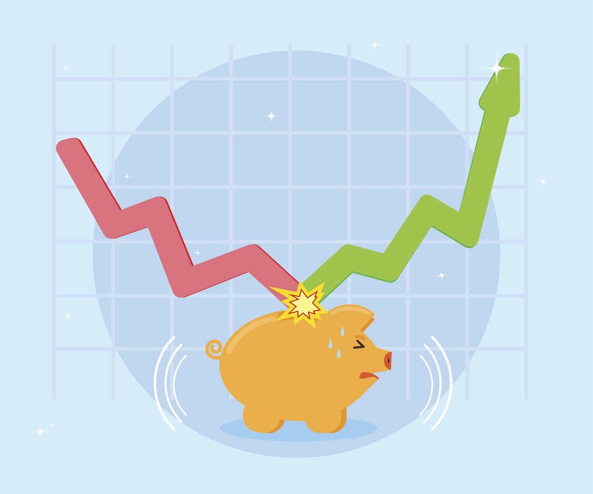

## Table of Contents

## What is considered a high-risk investment?

A high-risk investment is something you put your money into that has a big chance of losing value. This means you could lose a lot of your money. These investments often promise big rewards, but they are not safe. Examples include buying stocks of small, new companies, investing in cryptocurrencies, or putting money into businesses that are just starting out.

People might choose high-risk investments because they want to make a lot of money quickly. But, these investments can be very unpredictable. The value can go up and down a lot in a short time. It's important to know that while you might make a lot of money, you might also lose it all. That's why it's good to only invest money you can afford to lose and to understand the risks before you start.

## How do economic crises affect investment strategies?

Economic crises can shake up how people invest their money. When the economy is in trouble, like during a recession, people often get scared. They might start selling their investments quickly to try and not lose more money. This can make the value of stocks and other investments go down even more. Because of this, some people decide to move their money into safer places, like savings accounts or government bonds, which are less likely to lose value but also grow more slowly.

On the other hand, some investors see economic crises as a chance to buy investments at lower prices. They believe that once the economy gets better, the value of what they bought will go up. This is a riskier move because no one knows for sure when the economy will recover. But if they're right, they could make a lot of money. So, during an economic crisis, people might change their investment strategies, either to play it safe or to take a chance on big rewards.

## What are the potential benefits of high-risk investments during an economic crisis?

High-risk investments during an economic crisis can offer big rewards if you're willing to take the chance. When the economy is down, the prices of stocks and other investments often drop a lot. If you buy these investments when they're cheap and the economy starts to get better, their value can go up a lot. This means you could make a lot more money than if you had invested in safer options. It's like buying something on sale and then selling it for a much higher price later.

However, this strategy is not for everyone. It's very risky because no one knows exactly when the economy will recover. If you invest in high-risk options and the economy stays bad for a long time, you could lose a lot of money. But if you can handle the risk and have money you can afford to lose, high-risk investments during an economic crisis might lead to big gains. It's all about understanding the risks and being ready for the ups and downs.

## What are the potential drawbacks of high-risk investments during an economic crisis?

High-risk investments during an economic crisis can be very dangerous. When the economy is not doing well, the value of these investments can drop a lot. If you put your money into them and the economy stays bad for a long time, you could lose a lot of your money. It's like betting on a horse that might not even finish the race. The uncertainty of when the economy will get better makes it even riskier because you might have to wait a long time before you see any gains, if you see any at all.

Another problem is that high-risk investments can make you feel stressed and worried. When you see the value of your investments going down, it can be hard to stay calm. You might feel tempted to sell your investments quickly to stop losing more money, but this could mean selling them for less than you paid. It's important to be ready for this kind of emotional rollercoaster and to only invest money you can afford to lose. If you're not prepared for the ups and downs, high-risk investments during an economic crisis might not be the best choice for you.

## Can you explain the concept of risk-reward ratio in the context of economic crises?

The risk-reward ratio is like a scale that helps you see if the chance of making money from an investment is worth the chance of losing money. During an economic crisis, this ratio becomes even more important because the economy is shaky, and investments can go up and down a lot. If you're thinking about making a high-risk investment during a crisis, you want to know if the possible big reward is worth the big risk you're taking. A good risk-reward ratio means the reward might be much bigger than the risk, so it could be worth it.

For example, if you see a stock that's really cheap because of the crisis, you might think about buying it. The risk is that the stock could keep losing value if the economy stays bad. But the reward could be huge if the economy gets better and the stock's price goes up a lot. During an economic crisis, the risk-reward ratio can be hard to figure out because the future is so uncertain. But if you believe in the investment and can handle the risk, it might be a good chance to make a lot of money. Just remember, the higher the potential reward, the higher the risk you're taking.

## What are some common high-risk investment options available during economic downturns?

During economic downturns, some people look at high-risk investments to try and make big money. One common option is buying stocks of small companies or new businesses. These stocks can be very cheap during a crisis, and if the company does well when the economy gets better, their value can go up a lot. But, these companies might not survive the downturn, so there's a big chance you could lose your money.

Another high-risk choice is investing in cryptocurrencies like Bitcoin. These digital currencies can go up and down a lot in price, especially during tough economic times. If you buy them when they're low and they go up later, you could make a lot of money. But, they're very unpredictable, and you could lose everything if their value keeps dropping.

Lastly, some people might put their money into start-ups or new business ventures. These can be exciting because they have the potential to grow a lot if they succeed. But, starting a business is hard, especially during an economic crisis, and many start-ups fail. So, while the rewards can be big, the risks are also very high.

## How can one assess their risk tolerance before engaging in high-risk investments?

To figure out how much risk you can handle before jumping into high-risk investments, start by looking at your money situation. Think about how much money you have and how much you can lose without getting into trouble. If losing some money would make it hard for you to pay your bills or take care of your family, you might not be able to handle a lot of risk. Also, think about your goals. Are you saving for something important soon, like buying a house, or are you looking to grow your money over many years? If you need your money soon, high-risk investments might not be a good idea because they can go down a lot before they go up.

Next, check your feelings about money and risk. Some people can stay calm when their investments go up and down a lot, while others get stressed out. You can test this by thinking about how you felt during past economic downturns or by imagining what you would do if you lost a lot of money. If the thought of losing money makes you feel sick or worried, you might not have a high risk tolerance. It's good to talk to a financial advisor too. They can help you understand your risk tolerance better and make a plan that fits your comfort level and money goals.

## What role does diversification play in managing high-risk investments during economic crises?

Diversification is like not putting all your eggs in one basket. When you spread your money across different types of investments, you're less likely to lose everything if one of them goes bad. During an economic crisis, this can be really helpful because high-risk investments can go up and down a lot. If you have money in different things, like stocks, bonds, and maybe even some safer investments, a drop in one won't hurt you as much because the others might stay steady or even go up.

For example, if you only invest in one high-risk stock and the company does badly during the crisis, you could lose a lot. But if you also have money in other stocks, some bonds, and maybe a little in a savings account, the loss from that one stock won't be as bad. Diversification helps you manage the risk because it balances out the ups and downs. It doesn't make high-risk investments safe, but it can make them a bit less scary to deal with during tough economic times.

## How should one monitor and adjust high-risk investments during volatile economic periods?

During volatile economic times, it's important to keep a close eye on your high-risk investments. Check their value regularly, maybe once a week or even daily if things are really up and down. Look at the news and any updates about the companies or markets you're invested in. This helps you understand why your investments are changing and if there are any new risks you need to think about. It's also good to set some alerts or use apps that can notify you when your investments hit certain prices, so you don't miss important changes.

When you see big changes in your investments, you might need to adjust your strategy. If one of your high-risk investments is doing much worse than you expected, think about whether you should sell it to cut your losses. On the other hand, if another investment is doing well, you might want to hold onto it or even buy more if you believe it will keep going up. But remember, don't make quick decisions based on fear or excitement. Take some time to think about your goals and how much risk you can handle. It's okay to talk to a financial advisor if you're not sure what to do. They can help you make smart choices during these tough times.

## What are some advanced strategies for leveraging high-risk investments during economic downturns?

One advanced strategy for leveraging high-risk investments during economic downturns is called dollar-cost averaging. This means you invest a fixed amount of money into your high-risk investments at regular times, no matter what the market is doing. By doing this, you buy more shares when prices are low and fewer when prices are high. Over time, this can help you pay a lower average price for your investments. It's a way to spread out the risk and take advantage of the lower prices during an economic downturn without trying to guess when the market will hit its lowest point.

Another strategy is to use options trading. Options let you bet on whether a stock will go up or down without buying the stock itself. During an economic downturn, you can use options to make money if you think a stock will go down in value. This is called selling "puts" or buying "puts." It's a risky move because if you're wrong, you could lose money quickly. But if you're right, you can make a lot of money. Options trading needs a lot of knowledge and experience, so it's not for everyone. But for those who know what they're doing, it can be a powerful tool during tough economic times.

Lastly, some investors use a strategy called contrarian investing. This means going against what most people are doing. When everyone is selling their stocks because they're scared about the economy, a contrarian investor might buy those stocks. They believe that the market will get better and that the stocks they buy at low prices will go up a lot when things improve. This strategy can be very rewarding if you're right, but it's also very risky because you're betting against the crowd. It takes a lot of confidence and understanding of the market to make this work, but it can be a smart move during an economic downturn.

## Can you discuss case studies or historical examples of high-risk investments during economic crises?

During the Great Recession of 2008, many investors saw the stock market crash and got scared. But some brave investors, like Warren Buffett, saw it as a chance to buy stocks at low prices. Buffett bought shares in companies like Goldman Sachs and General Electric when their prices were down. These were high-risk moves because no one knew when the economy would get better. But Buffett believed in these companies and thought their prices would go up once the crisis passed. His strategy paid off, and he made a lot of money as the economy recovered.

Another example is during the dot-com bubble burst in the early 2000s. Many internet companies went bankrupt, and their stock prices dropped a lot. Some investors, like those who bought shares in Amazon, took a big risk. Amazon's stock fell from over $100 to around $6 during the crisis. But people who believed in the company and held onto their shares or bought more when the price was low made a lot of money later. Amazon grew into a huge company, and its stock price went way up. This shows how high-risk investments can lead to big rewards if you're patient and believe in the long-term success of a company.

In the 2020 economic downturn caused by the COVID-19 pandemic, cryptocurrencies like Bitcoin became a high-risk investment that some people turned to. Bitcoin's price was very up and down during this time. Some investors bought Bitcoin when its price was low, hoping it would go up as the economy got better. They were right, and Bitcoin's price soared to new highs in 2021. But it was a risky move because cryptocurrencies can be very unpredictable. This example shows how high-risk investments during a crisis can lead to big gains, but they can also lead to big losses if things don't go as planned.

## What are the expert recommendations for balancing high-risk and low-risk investments during economic crises?

Experts suggest that during an economic crisis, you should balance your money between high-risk and low-risk investments. They say you should only put money into high-risk investments that you can afford to lose. This means if you lose that money, it won't hurt your life too much. A good way to balance this is by keeping most of your money in safer places like savings accounts or government bonds. These won't make you rich quickly, but they are less likely to lose value during tough times. By doing this, you protect yourself from big losses while still having some money in high-risk investments that could grow a lot if things get better.

Another tip from experts is to spread your money across different types of investments. This is called diversification. If you have money in different things, like stocks, bonds, and maybe even some real estate, a drop in one won't hurt you as much because the others might stay steady or go up. During an economic crisis, this can help you manage the risk of high-risk investments. It's also important to check your investments regularly and be ready to change your plan if things don't go as you hoped. Talking to a financial advisor can help you make smart choices and keep your money safe during tough economic times.

## What are High-Risk, High-Reward Investment Approaches?

Investing during economic crises is characterized by significant risks, primarily stemming from the uncertainty in recovery timelines and the potential for further economic contractions, known as double-dip recessions. The unpredictability of these events poses considerable challenges to investors, as the trajectory of the market can be volatile and rapid shifts between fear and optimism are common. Despite these challenges, crises present unique opportunities for investors who are willing to embrace the high-risk, high-reward paradigm.

One of the key opportunities during such times is the potential for acquiring assets at prices below their intrinsic value. As panic ensues, many investors may sell off assets, leading to sharp price declines. This can result in securities trading at valuations that do not accurately reflect their underlying fundamentals, creating a favorable environment for value-based investments. The concept of intrinsic value is core to this strategy, defined as the perceived true value of an asset based on underlying tangible and intangible factors. When market prices fall significantly below intrinsic value during crises, informed investors can capitalize on these discrepancies by purchasing undervalued assets with the expectation of substantial future gains.

To assess these investment opportunities quantitatively, consider the price-to-earnings (P/E) ratio, a common metric used to evaluate if a stock is over or undervalued. In crises, P/E ratios often decline as earnings expectations are revised downward and stock prices fall. If historical data suggests that a company has a resilient business model that can withstand economic downturns, a low P/E ratio might indicate a buying opportunity.

Mathematically, the intrinsic value of an asset (V) can be estimated as:

$$
V = \sum_{t=1}^{n} \frac{CF_t}{(1 + r)^t}
$$

where $CF_t$ is the cash flow in year $t$, $r$ is the discount rate reflecting the risk-free rate and a risk premium, and $n$ is the expected holding period. Investors may adjust their models to account for increased uncertainties in cash flow projections and appropriate risk premiums to compensate for the additional risk taken during crises.

In practice, adopting a contrarian investment strategy, which involves going against prevailing market trends, can be effective. This involves carefully identifying industries or sectors that may appear distressed but possess long-term growth potential or demonstrate a capacity for recovery post-crisis. High-risk, high-reward investment approaches necessitate a disciplined analysis of macroeconomic indicators, market sentiment, and individual asset fundamentals to discern potential opportunities from genuine threats.

Ultimately, while crises test the resilience of conventional investment strategies, they also offer a recalibration of market dynamics, rewarding those who can correctly assess the depth and trajectory of recovery while managing associated risks prudently.

## What is the Role of Algorithmic Trading in Crisis Times?

Algorithmic trading, particularly high-frequency trading ([HFT](/wiki/high-frequency-trading-strategies)), has become a compelling strategy during economic crises due to its ability to process and execute trades at speeds surpassing human capability. By leveraging advanced computational algorithms, HFT can swiftly analyze market conditions and execute trades within microseconds, capitalizing on fleeting price inefficiencies.

A core characteristic of [algorithmic trading](/wiki/algorithmic-trading) is its reliance on quantitative models to identify potential trading opportunities. These algorithms can detect minute price discrepancies across different markets, known as [arbitrage](/wiki/arbitrage) opportunities, often too subtle for human traders to exploit. For instance, if a stock is priced differently on two exchanges, an algorithm can simultaneously buy the stock at the lower price and sell it at the higher price, pocketing the difference as profit.

The efficiency of HFT arises from its ability to manage a massive [volume](/wiki/volume-trading-strategy) of trades, with each trade typically yielding a marginal profit. However, when executed in bulk, these small gains accumulate significantly. The formula for profit accumulation in such a strategy can be described as:

$$
P = n \times (p_a - p_b - c_t)
$$

where:
- $P$ is the total profit,
- $n$ is the number of trades,
- $p_a$ is the selling price,
- $p_b$ is the buying price,
- $c_t$ represents transaction costs per trade.

Algorithmic trading systems are typically hosted on powerful servers situated near exchange data centers to minimize latency—time delay between the action and the corresponding reaction in trading. Such proximity allows these systems to react almost instantaneously to market movements, a critical advantage during volatile market conditions characteristic of economic crises.

One important aspect of algorithmic trading during crises is its ability to predict and react to market trends. By analyzing large datasets and historical trends, these algorithms can forecast potential shifts and capitalize on them before they are apparent to traditional investors. This predictive capability can provide a hedge against market downturns, a valuable asset during economic uncertainty.

Furthermore, algorithmic trading can offer [liquidity](/wiki/liquidity-risk-premium) to markets in crisis times, which is crucial for stabilizing asset prices. By generating a continuous stream of buy and sell orders, HFT strategies help reduce bid-ask spreads, enhancing market efficiency.

In summary, algorithmic trading, through its capacity for rapid execution, exploitation of minute price disparities, and liquidity provision, presents a high-risk, high-reward paradigm that can be advantageous during economic crises. Nonetheless, its effectiveness hinges on sophisticated algorithms and robust technological infrastructure, underscoring the need for thorough risk management practices to mitigate potential losses.

## References & Further Reading

[1]: Bergstra, J., Bardenet, R., Bengio, Y., & Kégl, B. (2011). ["Algorithms for Hyper-Parameter Optimization."](https://papers.nips.cc/paper/4443-algorithms-for-hyper-parameter-optimization) Advances in Neural Information Processing Systems 24.

[2]: ["Advances in Financial Machine Learning"](https://www.amazon.com/Advances-Financial-Machine-Learning-Marcos/dp/1119482089) by Marcos Lopez de Prado

[3]: ["Evidence-Based Technical Analysis: Applying the Scientific Method and Statistical Inference to Trading Signals"](https://www.amazon.com/Evidence-Based-Technical-Analysis-Scientific-Statistical/dp/0470008741) by David Aronson

[4]: ["Machine Learning for Algorithmic Trading"](https://github.com/stefan-jansen/machine-learning-for-trading) by Stefan Jansen

[5]: ["Quantitative Trading: How to Build Your Own Algorithmic Trading Business"](https://www.amazon.com/Quantitative-Trading-Build-Algorithmic-Business/dp/1119800064) by Ernest P. Chan